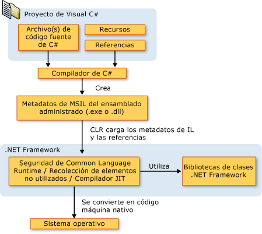

# Introducci&#243;n al lenguaje C# y .NET Framework
C\# es un lenguaje orientado a objetos elegante y con seguridad de tipos que permite a los desarrolladores compilar diversas aplicaciones sólidas y seguras que se ejecutan en [!INCLUDE[dnprdnshort](../../csharp/getting-started/includes/dnprdnshort-md.md)].  Puede utilizar C\# para crear aplicaciones cliente de Windows, servicios Web XML, componentes distribuidos, aplicaciones cliente\-servidor, aplicaciones de base de datos, y mucho, mucho más.  Visual C\# proporciona un editor de código avanzado, cómodos diseñadores de interfaz de usuario, depurador integrado y numerosas herramientas más para facilitar el desarrollo de aplicaciones basadas el lenguaje C\# y [!INCLUDE[dnprdnshort](../../csharp/getting-started/includes/dnprdnshort-md.md)].  
  
> [!NOTE]
>  La documentación de [!INCLUDE[csprcs](../../csharp/includes/csprcs-md.md)] supone que se conocen los conceptos básicos de programación.  Si es un principiante en la materia, puede explorar [!INCLUDE[csprcsxpr](../../csharp/getting-started/includes/csprcsxpr-md.md)], disponible en Web.  También puede aprovechar los libros y recursos web sobre C\# para obtener conocimientos prácticos de programación.  
  
## Lenguaje C\#  
 La sintaxis de C\# es muy expresiva, pero también es sencilla y fácil de aprender.  La sintaxis de C\# basada en signos de llave podrá ser reconocida inmediatamente por cualquier persona familiarizada con C, C\+\+ o Java.  Los desarrolladores que conocen cualquiera de estos lenguajes pueden empezar a trabajar de forma productiva en C\# en un plazo muy breve.  La sintaxis de C\# simplifica muchas de las complejidades de C\+\+ y proporciona características eficaces tales como tipos de valor que admiten valores NULL, enumeraciones, delegados, expresiones lambda y acceso directo a memoria, que no se encuentran en Java.  C\# admite métodos y tipos genéricos, que proporcionan mayor rendimiento y seguridad de tipos, e iteradores, que permiten a los implementadores de clases de colección definir comportamientos de iteración personalizados que el código cliente puede utilizar fácilmente.  Las expresiones [!INCLUDE[vbteclinqext](../../csharp/getting-started/includes/vbteclinqext-md.md)] convierten la consulta fuertemente tipada en una construcción de lenguaje de primera clase.  
  
 Como lenguaje orientado a objetos, C\# admite los conceptos de encapsulación, herencia y polimorfismo.  Todas las variables y métodos, incluido el método `Main` que es el punto de entrada de la aplicación, se encapsulan dentro de definiciones de clase.  Una clase puede heredar directamente de una clase primaria, pero puede implementar cualquier número de interfaces.  Los métodos que reemplazan a los métodos virtuales en una clase primaria requieren la palabra clave `override` como medio para evitar redefiniciones accidentales.  En C\#, una struct es como una clase sencilla; es un tipo asignado en la pila que puede implementar interfaces pero que no admite la herencia.  
  
 Además de estos principios básicos orientados a objetos, C\# facilita el desarrollo de componentes de software a través de varias construcciones de lenguaje innovadoras, entre las que se incluyen las siguientes:  
  
-   Firmas de métodos encapsulados denominadas *delegados*, que habilitan notificaciones de eventos con seguridad de tipos.  
  
-   Propiedades, que actúan como descriptores de acceso para variables miembro privadas.  
  
-   Atributos, que proporcionan metadatos declarativos sobre tipos en tiempo de ejecución.  
  
-   Comentarios en línea de documentación XML.  
  
-   [!INCLUDE[vbteclinqext](../../csharp/getting-started/includes/vbteclinqext-md.md)] que proporciona funciones de consulta integradas en una gran variedad de orígenes de datos.  
  
 Si necesita interactuar con otro software de Windows, como objetos COM o archivos DLL nativos de Win32, podrá hacerlo en C\# mediante un proceso denominado "interoperabilidad". La interoperabilidad habilita los programas de C\# para que puedan realizar prácticamente las mismas tareas que una aplicación C\+\+ nativa.  C\# admite incluso el uso de punteros y el concepto de código "no seguro" en los casos en que el acceso directo a la memoria es totalmente crítico.  
  
 El proceso de compilación de C\# es simple en comparación con el de C y C\+\+, y es más flexible que en Java.  No hay archivos de encabezado independientes, ni se requiere que los métodos y los tipos se declaren en un orden determinado.  Un archivo de código fuente de C\# puede definir cualquier número de clases, structs, interfaces y eventos.  
  
 A continuación se enumeran otros recursos de C\#:  
  
-   Para disponer de una introducción general al lenguaje, vea el capítulo 1 de [Especificación del lenguaje C\#](../../csharp/language-reference/language-specification.md).  
  
-   Para obtener información detallada sobre aspectos concretos del lenguaje C\#, vea [Referencia de C\#](../../csharp/language-reference/index.md).  
  
-   Para obtener más información sobre [!INCLUDE[vbteclinq](../../csharp/includes/vbteclinq-md.md)], vea [LINQ \(Language\-Integrated Query\)](../Topic/LINQ%20\(Language-Integrated%20Query\).md).  
  
-   Para buscar los artículos y recursos más recientes del equipo de Visual C\#, vea [Visual C\#](http://go.microsoft.com/fwlink/?LinkId=47811).  
  
## Arquitectura de la plataforma .NET Framework  
 Los programas de C\# se ejecutan en [!INCLUDE[dnprdnshort](../../csharp/getting-started/includes/dnprdnshort-md.md)], un componente que forma parte de Windows y que incluye un sistema de ejecución virtual denominado Common Language Runtime \(CLR\) y un conjunto unificado de bibliotecas de clases.  CLR es la implementación comercial de Microsoft de CLI \(Common Language Infrastructure\), un estándar internacional que constituye la base para crear entornos de ejecución y desarrollo en los que los lenguajes y las bibliotecas trabajan juntos sin ningún problema.  
  
 El código fuente escrito en C\# se compila en un lenguaje intermedio \(IL\) conforme con la especificación CLI.  El código de lenguaje intermedio y recursos tales como mapas de bits y cadenas se almacenan en disco en un archivo ejecutable denominado ensamblado, cuya extensión es .exe o .dll generalmente.  Un ensamblado contiene un manifiesto que proporciona información sobre los tipos, la versión, la referencia cultural y los requisitos de seguridad del ensamblado.  
  
 Cuando se ejecuta un programa de C\#, el ensamblado se carga en CLR, con lo que se pueden realizar diversas acciones en función de la información del manifiesto.  A continuación, si se cumplen los requisitos de seguridad, CLR realiza una compilación Just In Time \(JIT\) para convertir el código de lenguaje intermedio en instrucciones máquina nativas.  CLR también proporciona otros servicios relacionados con la recolección de elementos no utilizados automática, el control de excepciones y la administración de recursos.  El código ejecutado por CLR se denomina algunas veces "código administrado", en contraposición al "código no administrado" que se compila en lenguaje máquina nativo destinado a un sistema específico.  En el diagrama siguiente se muestran las relaciones en tiempo de compilación y tiempo de ejecución de los archivos de código fuente de C\#, las bibliotecas de clases de .NET Framework, los ensamblados y CLR.  
  
   
  
 La interoperabilidad del lenguaje es una característica clave de [!INCLUDE[dnprdnshort](../../csharp/getting-started/includes/dnprdnshort-md.md)].  Como el código de lenguaje intermedio generado por el compilador de C\# cumple la especificación de tipos común \(CTS\), este código generado en C\# puede interactuar con el código generado en las versiones .NET de Visual Basic, Visual C\+\+ o cualquiera de los más de 20 lenguajes conformes a CTS.  Un único ensamblado puede contener varios módulos escritos en diferentes lenguajes .NET, y los tipos admiten referencias entre sí como si estuvieran escritos en el mismo lenguaje.  
  
 Además de los servicios en tiempo de ejecución, [!INCLUDE[dnprdnshort](../../csharp/getting-started/includes/dnprdnshort-md.md)] también incluye una amplia biblioteca de más de 4.000 clases organizadas en espacios de nombres que proporcionan una gran variedad de funciones útiles para la entrada y salida de archivos, la manipulación de cadenas, el análisis XML, los controles de los formularios Windows Forms y muchas tareas más.  La aplicación de C\# típica utiliza continuamente la biblioteca de clases de [!INCLUDE[dnprdnshort](../../csharp/getting-started/includes/dnprdnshort-md.md)] para el tratamiento de las tareas comunes de "infraestructura".  
  
 Para obtener más información sobre .NET Framework, vea [Overview of the Microsoft .NET Framework](http://msdn.microsoft.com/es-es/d05daf50-00fe-45c7-8383-06fe41697355).  
  
## Capítulos destacados del libro  
 [C\# Language Fundamentals](http://go.microsoft.com/fwlink/?LinkId=195416) en [Learning C\# 3.0: Master the fundamentals of C\# 3.0](http://go.microsoft.com/fwlink/?LinkId=195412)  
  
 [C\# and .NET Programming](http://go.microsoft.com/fwlink/?LinkId=195413) en [Learning C\# 3.0: Master the fundamentals of C\# 3.0](http://go.microsoft.com/fwlink/?LinkId=195412)  
  
 [Introducción de C\#](http://go.microsoft.com/fwlink/?LinkId=221226) en [Comenzar a usar Visual C\# 2010](http://go.microsoft.com/fwlink/?LinkId=221214)  
  
 [Visual Studio 2008 and C\# Express 2008](http://go.microsoft.com/fwlink/?LinkId=195414) en [Learning C\# 3.0: Master the fundamentals of C\# 3.0](http://go.microsoft.com/fwlink/?LinkId=195412)  
  
## Vea también  
 [C\#](../../csharp/csharp.md)   
 [Introducción a Visual C\# y Visual Basic](/visual-studio/ide/getting-started-with-visual-csharp-and-visual-basic)