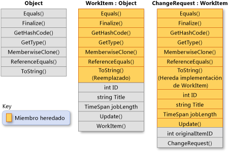

# Herencia (Gu&#237;a de programaci&#243;n de C#)
La herencia, junto con la encapsulación y el polimorfismo, es una de las tres características principales \(o *pilares*\) de la programación orientada a objetos.  La herencia permite crear nuevas clases que reutilizan, extienden y modifican el comportamiento que se define en otras clases.  La clase cuyos miembros se heredan se denomina *clase base* y la clase que hereda esos miembros se denomina *clase derivada*.  Una clase derivada solo puede tener una clase base directa.  Sin embargo, la herencia es transitiva.  Si ClassC se deriva de ClassB y ClassB se deriva de ClassA, ClassC hereda los miembros declarados en ClassB y ClassA.  
  
> [!NOTE]
>  Los structs no admiten la herencia pero pueden implementar interfaces.  Para obtener más información, vea [Interfaces](../../../csharp/programming-guide/interfaces/index.md).  
  
 Conceptualmente, una clase derivada es una especialización de la clase base.  Por ejemplo, si tiene una clase base `Animal`, puede tener una clase derivada denominada `Mammal` y otra clase derivada denominada `Reptile`.  `Mammal` es `Animal`y `Reptile` es `Animal`, pero cada clase derivada representa especializaciones diferentes de la clase base.  
  
 Al definir una clase para derivar de otra clase, la clase derivada obtiene implícitamente todos los miembros de la clase base, salvo sus constructores y destructores.  La clase derivada puede, por tanto, reutilizar el código de la clase base sin tener que volver a implementarlo.  En la clase derivada, puede agregar más miembros.  De esta manera, la clase derivada extiende la funcionalidad de la clase base.  
  
 En la ilustración siguiente se muestra una clase `WorkItem` que representa un elemento de trabajo en algún proceso de negocio.  Como todas las clases, deriva de <xref:System.Object?displayProperty=fullName> y hereda de todos sus métodos.  `WorkItem` agrega cinco miembros propios.  Incluyen un constructor, porque los constructores no se heredan.  La clase `ChangeRequest` hereda de `WorkItem` y representa un tipo determinado de elemento de trabajo.  `ChangeRequest` agrega dos o más miembros a los miembros que hereda de `WorkItem` y <xref:System.Object>.  Debe agregar su propio constructor, y también agrega `originalItemID`.  La propiedad `originalItemID` permite que la instancia de `ChangeRequest` se asocie al `WorkItem` original al que se aplica la solicitud de cambio.  
  
   
Herencia de clases  
  
 En el ejemplo siguiente se muestra cómo se expresan en C\# las relaciones de clase presentadas en la ilustración anterior.  En el ejemplo también se muestra cómo `WorkItem` invalida el método virtual <xref:System.Object.ToString%2A?displayProperty=fullName> y cómo la clase `ChangeRequest` hereda la implementación de `WorkItem` del método.  
  
 [!code-cs[csProgGuideInheritance#49](../../../csharp/programming-guide/classes-and-structs/codesnippet/CSharp/inheritance_1.cs)]  
  
## Métodos abstractos y virtuales  
 Cuando una clase base declara un método como [virtual](../../../csharp/language-reference/keywords/virtual.md), una clase derivada puede [invalidar](../../../csharp/language-reference/keywords/override.md) el método con su propia implementación.  Si una clase base declara un miembro como [abstracto](../../../csharp/language-reference/keywords/abstract.md), ese método se debe invalidar en cualquier clase no abstracta que herede directamente de dicha clase.  Si una clase derivada es abstracta en sí misma, hereda los miembros abstractos sin implementarlos.  Los miembros abstractos y virtuales son la base para el polimorfismo, la segunda característica principal de la programación orientada a objetos.  Para obtener más información, vea [Polimorfismo](../../../csharp/programming-guide/classes-and-structs/polymorphism.md).  
  
## Clases base abstractas  
 Puede declarar una clase como [abstracta](../../../csharp/language-reference/keywords/abstract.md) si desea evitar la creación directa de instancias por medio de la palabra clave [new](../../../csharp/language-reference/keywords/new.md).  Si hace esto, la clase solo se puede utilizar si una nueva clase se deriva de ella.  Una clase abstracta puede contener una o más firmas de método que se declaran a sí mismas como abstractas.  Estas firmas especifican los parámetros y el valor devuelto pero no tienen ninguna implementación \(cuerpo del método\).  Una clase abstracta no tiene que contener miembros abstractos; sin embargo, si una clase contiene un miembro abstracto, la propia clase se debe declarar como abstracta.  Las clases derivadas que no son abstractas por sí mismas deben proporcionar la implementación de cualquier método abstracto de una clase base abstracta.  Para obtener más información, vea [Clases y miembros de clase abstractos y sellados](../../../csharp/programming-guide/classes-and-structs/abstract-and-sealed-classes-and-class-members.md).  
  
## Interfaces  
 Una *interfaz* es un tipo de referencia similar en cierto modo a una clase base abstracta compuesta únicamente por miembros abstractos.  Cuando una clase implementa una interfaz, debe proporcionar una implementación para todos los miembros de la interfaz.  Una clase puede implementar varias interfaces aunque solo puede derivar de una única clase base directa.  
  
 Las interfaces se utilizan para definir funciones específicas para las clases que no tienen necesariamente una relación de identidad.  Por ejemplo, la interfaz <xref:System.IEquatable%601?displayProperty=fullName> puede ser implementada por cualquier clase o struct que deba permitir al código de cliente determinar si dos objetos del tipo son equivalentes \(sin embargo, el tipo define la equivalencia\).  <xref:System.IEquatable%601> no implica el mismo tipo de relación "es un\(a\)" que existe entre una clase base y una clase derivada \(por ejemplo, un `Mammal` es un `Animal`\).  Para obtener más información, vea [Interfaces](../../../csharp/programming-guide/interfaces/index.md).  
  
## Acceso de la clase derivada a los miembros de la clase base  
 Una clase derivada tiene acceso a los miembros públicos, protegidos, internos e internos protegidos de una clase base.  Aunque una clase derivada hereda los miembros privados de una clase base, no puede tener acceso a estos miembros.  Sin embargo, todos los miembros privados siguen presentes en la clase derivada y pueden hacer el mismo trabajo que harían en la propia clase base.  Por ejemplo, supongamos que un método protegido de la clase base tiene acceso a un campo privado.  Este campo debe estar presente en la clase derivada para que el método heredado de la clase base funcione correctamente.  
  
## Evitar la derivación adicional  
 Una clase puede evitar que otras clases hereden de ella, o de cualquiera de sus miembros, declarándose a sí misma o al miembro como [sealed](../../../csharp/language-reference/keywords/sealed.md).  Para obtener más información, vea [Clases y miembros de clase abstractos y sellados](../../../csharp/programming-guide/classes-and-structs/abstract-and-sealed-classes-and-class-members.md).  
  
## Ocultar miembros de la clase base en la clase derivada  
 Una clase derivada puede ocultar miembros de la clase base si los declara con el mismo nombre y firma.  Se puede utilizar el modificador [new](../../../csharp/language-reference/keywords/new.md) para indicar explícitamente que no se pretende que el miembro sea una invalidación del miembro base.  No es necesario utilizar [new](../../../csharp/language-reference/keywords/new.md), pero se generará una advertencia del compilador si no se usa [new](../../../csharp/language-reference/keywords/new.md).  Para obtener más información, vea [Control de versiones con las palabras clave Override y New](../../../csharp/programming-guide/classes-and-structs/versioning-with-the-override-and-new-keywords.md) y [Saber cuándo utilizar las palabras clave Override y New](../../../csharp/programming-guide/classes-and-structs/knowing-when-to-use-override-and-new-keywords.md).  
  
## Vea también  
 [Guía de programación de C\#](../../../csharp/programming-guide/index.md)   
 [Clases y structs](../../../csharp/programming-guide/classes-and-structs/index.md)   
 [clase](../../../csharp/language-reference/keywords/class.md)   
 [struct](../../../csharp/language-reference/keywords/struct.md)