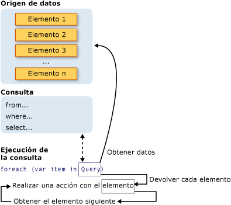

# <a name="introduction-to-linq-queries-c"></a><span data-ttu-id="4314e-102">Introducción a las consultas LINQ (C#)</span><span class="sxs-lookup"><span data-stu-id="4314e-102">Introduction to LINQ Queries (C#)</span></span>
<span data-ttu-id="4314e-103">Una *consulta* es una expresión que recupera datos de un origen de datos.</span><span class="sxs-lookup"><span data-stu-id="4314e-103">A *query* is an expression that retrieves data from a data source.</span></span> <span data-ttu-id="4314e-104">Las consultas se suelen expresar en un lenguaje de consultas especializado.</span><span class="sxs-lookup"><span data-stu-id="4314e-104">Queries are usually expressed in a specialized query language.</span></span> <span data-ttu-id="4314e-105">Con el tiempo se han desarrollado diferentes lenguajes para los distintos tipos de orígenes de datos, como SQL para las bases de datos relacionales y XQuery para XML.</span><span class="sxs-lookup"><span data-stu-id="4314e-105">Different languages have been developed over time for the various types of data sources, for example SQL for relational databases and XQuery for XML.</span></span> <span data-ttu-id="4314e-106">Por lo tanto, los programadores han tenido que aprender un lenguaje de consultas nuevo para cada tipo de origen de datos o formato de datos que deben admitir.</span><span class="sxs-lookup"><span data-stu-id="4314e-106">Therefore, developers have had to learn a new query language for each type of data source or data format that they must support.</span></span> [!INCLUDE[vbteclinq](~/includes/vbteclinq-md.md)]<span data-ttu-id="4314e-107"> simplifica esta situación al ofrecer un modelo coherente para trabajar con los datos de varios formatos y orígenes.</span><span class="sxs-lookup"><span data-stu-id="4314e-107"> simplifies this situation by offering a consistent model for working with data across various kinds of data sources and formats.</span></span> <span data-ttu-id="4314e-108">En una consulta [!INCLUDE[vbteclinq](~/includes/vbteclinq-md.md)] siempre se trabaja con objetos.</span><span class="sxs-lookup"><span data-stu-id="4314e-108">In a [!INCLUDE[vbteclinq](~/includes/vbteclinq-md.md)] query, you are always working with objects.</span></span> <span data-ttu-id="4314e-109">Se usan los mismos modelos de codificación básicos para consultar y transformar los datos en documentos XML, bases de datos SQL, conjuntos de datos [!INCLUDE[vstecado](~/includes/vstecado-md.md)], colecciones de .NET y cualquier otro formato para el que está disponible un proveedor de [!INCLUDE[vbteclinq](~/includes/vbteclinq-md.md)].</span><span class="sxs-lookup"><span data-stu-id="4314e-109">You use the same basic coding patterns to query and transform data in XML documents, SQL databases, [!INCLUDE[vstecado](~/includes/vstecado-md.md)] Datasets, .NET collections, and any other format for which a [!INCLUDE[vbteclinq](~/includes/vbteclinq-md.md)] provider is available.</span></span>  
  
## <a name="three-parts-of-a-query-operation"></a><span data-ttu-id="4314e-110">Las tres partes de una operación de consulta</span><span class="sxs-lookup"><span data-stu-id="4314e-110">Three Parts of a Query Operation</span></span>  
 <span data-ttu-id="4314e-111">Todas las operaciones de consulta [!INCLUDE[vbteclinq](~/includes/vbteclinq-md.md)] constan de tres acciones distintas:</span><span class="sxs-lookup"><span data-stu-id="4314e-111">All [!INCLUDE[vbteclinq](~/includes/vbteclinq-md.md)] query operations consist of three distinct actions:</span></span>  
  
1.  <span data-ttu-id="4314e-112">Obtener el origen de datos.</span><span class="sxs-lookup"><span data-stu-id="4314e-112">Obtain the data source.</span></span>  
  
2.  <span data-ttu-id="4314e-113">Crear la consulta.</span><span class="sxs-lookup"><span data-stu-id="4314e-113">Create the query.</span></span>  
  
3.  <span data-ttu-id="4314e-114">Ejecutar la consulta.</span><span class="sxs-lookup"><span data-stu-id="4314e-114">Execute the query.</span></span>  
  
 <span data-ttu-id="4314e-115">En el siguiente ejemplo se muestra cómo se expresan las tres partes de una operación de consulta en código fuente.</span><span class="sxs-lookup"><span data-stu-id="4314e-115">The following example shows how the three parts of a query operation are expressed in source code.</span></span> <span data-ttu-id="4314e-116">En el ejemplo se usa una matriz de enteros como origen de datos para su comodidad, aunque se aplican los mismos conceptos a otros orígenes de datos.</span><span class="sxs-lookup"><span data-stu-id="4314e-116">The example uses an integer array as a data source for convenience; however, the same concepts apply to other data sources also.</span></span> <span data-ttu-id="4314e-117">En el resto de este tema se hará referencia a este ejemplo.</span><span class="sxs-lookup"><span data-stu-id="4314e-117">This example is referred to throughout the rest of this topic.</span></span>  
  
 [!code-csharp[CsLINQGettingStarted#1](../../../../csharp/programming-guide/concepts/linq/codesnippet/CSharp/introduction-to-linq-queries_1.cs)]  
  
 <span data-ttu-id="4314e-118">En la siguiente ilustración se muestra toda la operación de consulta.</span><span class="sxs-lookup"><span data-stu-id="4314e-118">The following illustration shows the complete query operation.</span></span> <span data-ttu-id="4314e-119">En [!INCLUDE[vbteclinq](~/includes/vbteclinq-md.md)], la ejecución de la consulta es distinta de la propia consulta; en otras palabras, no ha recuperado los datos creando una variable de consulta.</span><span class="sxs-lookup"><span data-stu-id="4314e-119">In [!INCLUDE[vbteclinq](~/includes/vbteclinq-md.md)] the execution of the query is distinct from the query itself; in other words you have not retrieved any data just by creating a query variable.</span></span>  
  
 <span data-ttu-id="4314e-120"></span><span class="sxs-lookup"><span data-stu-id="4314e-120"></span></span>  
  
## <a name="the-data-source"></a><span data-ttu-id="4314e-121">El origen de datos</span><span class="sxs-lookup"><span data-stu-id="4314e-121">The Data Source</span></span>  
 <span data-ttu-id="4314e-122">En el ejemplo anterior, como el origen de datos es una matriz, admite implícitamente la interfaz genérica <xref:System.Collections.Generic.IEnumerable%601>.</span><span class="sxs-lookup"><span data-stu-id="4314e-122">In the previous example, because the data source is an array, it implicitly supports the generic <xref:System.Collections.Generic.IEnumerable%601> interface.</span></span> <span data-ttu-id="4314e-123">Este hecho implica que se puede consultar con [!INCLUDE[vbteclinq](~/includes/vbteclinq-md.md)].</span><span class="sxs-lookup"><span data-stu-id="4314e-123">This fact means it can be queried with [!INCLUDE[vbteclinq](~/includes/vbteclinq-md.md)].</span></span> <span data-ttu-id="4314e-124">Se ejecuta una consulta en una instrucción `foreach`, y `foreach` requiere <xref:System.Collections.IEnumerable> o bien <xref:System.Collections.Generic.IEnumerable%601>.</span><span class="sxs-lookup"><span data-stu-id="4314e-124">A query is executed in a `foreach` statement, and `foreach` requires <xref:System.Collections.IEnumerable> or <xref:System.Collections.Generic.IEnumerable%601>.</span></span> <span data-ttu-id="4314e-125">Los tipos compatibles con <xref:System.Collections.Generic.IEnumerable%601> o una interfaz derivada, como la interfaz genérica <xref:System.Linq.IQueryable%601>, se denominan *tipos consultables*.</span><span class="sxs-lookup"><span data-stu-id="4314e-125">Types that support <xref:System.Collections.Generic.IEnumerable%601> or a derived interface such as the generic <xref:System.Linq.IQueryable%601> are called *queryable types*.</span></span>  
  
 <span data-ttu-id="4314e-126">Un tipo consultable no requiere ninguna modificación ni ningún tratamiento especial para actuar como origen de datos de [!INCLUDE[vbteclinq](~/includes/vbteclinq-md.md)].</span><span class="sxs-lookup"><span data-stu-id="4314e-126">A queryable type requires no modification or special treatment to serve as a [!INCLUDE[vbteclinq](~/includes/vbteclinq-md.md)] data source.</span></span> <span data-ttu-id="4314e-127">Si el origen de datos no está en la memoria como tipo consultable, el proveedor de [!INCLUDE[vbteclinq](~/includes/vbteclinq-md.md)] debe representarlo como tal.</span><span class="sxs-lookup"><span data-stu-id="4314e-127">If the source data is not already in memory as a queryable type, the [!INCLUDE[vbteclinq](~/includes/vbteclinq-md.md)] provider must represent it as such.</span></span> <span data-ttu-id="4314e-128">Por ejemplo, [!INCLUDE[sqltecxlinq](~/includes/sqltecxlinq-md.md)] carga un documento XML en un tipo <xref:System.Xml.Linq.XElement> consultable:</span><span class="sxs-lookup"><span data-stu-id="4314e-128">For example, [!INCLUDE[sqltecxlinq](~/includes/sqltecxlinq-md.md)] loads an XML document into a queryable <xref:System.Xml.Linq.XElement> type:</span></span>  
  
 [!code-csharp[CsLINQGettingStarted#2](../../../../csharp/programming-guide/concepts/linq/codesnippet/CSharp/introduction-to-linq-queries_2.cs)]  
  
 <span data-ttu-id="4314e-129">Con [!INCLUDE[vbtecdlinq](~/includes/vbtecdlinq-md.md)], primero se crea una asignación relacional de objetos en tiempo de diseño ya sea manualmente o mediante las [herramientas de LINQ to SQL](/visualstudio/data-tools/linq-to-sql-tools-in-visual-studio2) de Visual Studio.</span><span class="sxs-lookup"><span data-stu-id="4314e-129">With [!INCLUDE[vbtecdlinq](~/includes/vbtecdlinq-md.md)], you first create an object-relational mapping at design time either manually or by using the [LINQ to SQL Tools in Visual Studio](/visualstudio/data-tools/linq-to-sql-tools-in-visual-studio2) in Visual Studio.</span></span> <span data-ttu-id="4314e-130">Después, se escriben las consultas en los objetos y, en tiempo de ejecución, [!INCLUDE[vbtecdlinq](~/includes/vbtecdlinq-md.md)] controla la comunicación con la base de datos.</span><span class="sxs-lookup"><span data-stu-id="4314e-130">You write your queries against the objects, and at run-time [!INCLUDE[vbtecdlinq](~/includes/vbtecdlinq-md.md)] handles the communication with the database.</span></span> <span data-ttu-id="4314e-131">En el ejemplo siguiente, `Customers` representa una tabla específica en una base de datos, y el tipo del resultado de la consulta, <xref:System.Linq.IQueryable%601>, se deriva de <xref:System.Collections.Generic.IEnumerable%601>.</span><span class="sxs-lookup"><span data-stu-id="4314e-131">In the following example, `Customers` represents a specific table in the database, and the type of the query result, <xref:System.Linq.IQueryable%601>, derives from <xref:System.Collections.Generic.IEnumerable%601>.</span></span>  
  
```csharp  
Northwnd db = new Northwnd(@"c:\northwnd.mdf");  
  
// Query for customers in London.  
IQueryable<Customer> custQuery =  
    from cust in db.Customers  
    where cust.City == "London"  
    select cust;  
```  
  
 <span data-ttu-id="4314e-132">Para obtener más información sobre cómo crear tipos específicos de orígenes de datos, vea la documentación de los distintos proveedores de [!INCLUDE[vbteclinq](~/includes/vbteclinq-md.md)].</span><span class="sxs-lookup"><span data-stu-id="4314e-132">For more information about how to create specific types of data sources, see the documentation for the various [!INCLUDE[vbteclinq](~/includes/vbteclinq-md.md)] providers.</span></span> <span data-ttu-id="4314e-133">Aun así, la regla básica es muy sencilla: un origen de datos de [!INCLUDE[vbteclinq](~/includes/vbteclinq-md.md)] es cualquier objeto que admita la interfaz genérica <xref:System.Collections.Generic.IEnumerable%601> o una interfaz que la haya heredado.</span><span class="sxs-lookup"><span data-stu-id="4314e-133">However, the basic rule is very simple: a [!INCLUDE[vbteclinq](~/includes/vbteclinq-md.md)] data source is any object that supports the generic <xref:System.Collections.Generic.IEnumerable%601> interface, or an interface that inherits from it.</span></span>  
  
> [!NOTE]
>  <span data-ttu-id="4314e-134">Los tipos como <xref:System.Collections.ArrayList>, compatibles con la interfaz no genérica <xref:System.Collections.IEnumerable>, también se pueden usar como origen de datos de [!INCLUDE[vbteclinq](~/includes/vbteclinq-md.md)].</span><span class="sxs-lookup"><span data-stu-id="4314e-134">Types such as <xref:System.Collections.ArrayList> that support the non-generic <xref:System.Collections.IEnumerable> interface can also be used as a [!INCLUDE[vbteclinq](~/includes/vbteclinq-md.md)] data source.</span></span> <span data-ttu-id="4314e-135">Para obtener más información, vea [How to: Query an ArrayList with LINQ (C#)](../../../../csharp/programming-guide/concepts/linq/how-to-query-an-arraylist-with-linq.md) (Consultar un objeto ArrayList con LINQ (C#)).</span><span class="sxs-lookup"><span data-stu-id="4314e-135">For more information, see [How to: Query an ArrayList with LINQ (C#)](../../../../csharp/programming-guide/concepts/linq/how-to-query-an-arraylist-with-linq.md).</span></span>  
  
##  <a name="query"></a> <span data-ttu-id="4314e-136">La consulta</span><span class="sxs-lookup"><span data-stu-id="4314e-136">The Query</span></span>  
 <span data-ttu-id="4314e-137">La consulta especifica la información que se debe recuperar de los orígenes de datos.</span><span class="sxs-lookup"><span data-stu-id="4314e-137">The query specifies what information to retrieve from the data source or sources.</span></span> <span data-ttu-id="4314e-138">Opcionalmente, una consulta también especifica cómo se debe ordenar, agrupar y conformar esa información antes de que se devuelva.</span><span class="sxs-lookup"><span data-stu-id="4314e-138">Optionally, a query also specifies how that information should be sorted, grouped, and shaped before it is returned.</span></span> <span data-ttu-id="4314e-139">Las consultas se almacenan en una variable de consulta y se inicializan con una expresión de consulta.</span><span class="sxs-lookup"><span data-stu-id="4314e-139">A query is stored in a query variable and initialized with a query expression.</span></span> <span data-ttu-id="4314e-140">Para facilitar la escritura de consultas, C# ha incorporado una nueva sintaxis de consulta.</span><span class="sxs-lookup"><span data-stu-id="4314e-140">To make it easier to write queries, C# has introduced new query syntax.</span></span>  
  
 <span data-ttu-id="4314e-141">La consulta del ejemplo anterior devuelve todos los números pares de la matriz de enteros.</span><span class="sxs-lookup"><span data-stu-id="4314e-141">The query in the previous example returns all the even numbers from the integer array.</span></span> <span data-ttu-id="4314e-142">La expresión de consulta contiene tres cláusulas: `from`, `where` y `select`</span><span class="sxs-lookup"><span data-stu-id="4314e-142">The query expression contains three clauses: `from`, `where` and `select`.</span></span> <span data-ttu-id="4314e-143">(si está familiarizado con SQL, habrá observado que el orden de las cláusulas se invierte respecto al orden de SQL). La cláusula `from` especifica el origen de datos, la cláusula `where` aplica el filtro y la cláusula `select` especifica el tipo de los elementos devueltos.</span><span class="sxs-lookup"><span data-stu-id="4314e-143">(If you are familiar with SQL, you will have noticed that the ordering of the clauses is reversed from the order in SQL.) The `from` clause specifies the data source, the `where` clause applies the filter, and the `select` clause specifies the type of the returned elements.</span></span> <span data-ttu-id="4314e-144">Estas y otras cláusulas de consulta se tratan con detalle en la sección [Expresiones de consulta LINQ](../../../../csharp/programming-guide/linq-query-expressions/index.md).</span><span class="sxs-lookup"><span data-stu-id="4314e-144">These and the other query clauses are discussed in detail in the [LINQ Query Expressions](../../../../csharp/programming-guide/linq-query-expressions/index.md) section.</span></span> <span data-ttu-id="4314e-145">Por ahora, lo importante es que en [!INCLUDE[vbteclinq](~/includes/vbteclinq-md.md)] la variable de consulta no efectúa ninguna acción y no devuelve ningún dato.</span><span class="sxs-lookup"><span data-stu-id="4314e-145">For now, the important point is that in [!INCLUDE[vbteclinq](~/includes/vbteclinq-md.md)], the query variable itself takes no action and returns no data.</span></span> <span data-ttu-id="4314e-146">Lo único que hace es almacenar la información necesaria para generar los resultados cuando se ejecuta la consulta en algún momento posterior.</span><span class="sxs-lookup"><span data-stu-id="4314e-146">It just stores the information that is required to produce the results when the query is executed at some later point.</span></span> <span data-ttu-id="4314e-147">Para obtener más información sobre cómo se construyen las consultas en segundo plano, vea [Información general sobre operadores de consulta estándar (C#)](../../../../csharp/programming-guide/concepts/linq/standard-query-operators-overview.md).</span><span class="sxs-lookup"><span data-stu-id="4314e-147">For more information about how queries are constructed behind the scenes, see [Standard Query Operators Overview (C#)](../../../../csharp/programming-guide/concepts/linq/standard-query-operators-overview.md).</span></span>  
  
> [!NOTE]
>  <span data-ttu-id="4314e-148">Las consultas también se pueden expresar empleando una sintaxis de método.</span><span class="sxs-lookup"><span data-stu-id="4314e-148">Queries can also be expressed by using method syntax.</span></span> <span data-ttu-id="4314e-149">Para obtener más información, vea [Query Syntax and Method Syntax in LINQ](../../../../csharp/programming-guide/concepts/linq/query-syntax-and-method-syntax-in-linq.md) (Sintaxis de consulta y sintaxis de método en LINQ).</span><span class="sxs-lookup"><span data-stu-id="4314e-149">For more information, see [Query Syntax and Method Syntax in LINQ](../../../../csharp/programming-guide/concepts/linq/query-syntax-and-method-syntax-in-linq.md).</span></span>  
  
## <a name="query-execution"></a><span data-ttu-id="4314e-150">Ejecución de la consulta</span><span class="sxs-lookup"><span data-stu-id="4314e-150">Query Execution</span></span>  
  
### <a name="deferred-execution"></a><span data-ttu-id="4314e-151">Ejecución aplazada</span><span class="sxs-lookup"><span data-stu-id="4314e-151">Deferred Execution</span></span>  
 <span data-ttu-id="4314e-152">Como se ha indicado anteriormente, la variable de consulta solo almacena los comandos de consulta.</span><span class="sxs-lookup"><span data-stu-id="4314e-152">As stated previously, the query variable itself only stores the query commands.</span></span> <span data-ttu-id="4314e-153">La ejecución real de la consulta se aplaza hasta que se procese una iteración en la variable de consulta en una instrucción `foreach`.</span><span class="sxs-lookup"><span data-stu-id="4314e-153">The actual execution of the query is deferred until you iterate over the query variable in a `foreach` statement.</span></span> <span data-ttu-id="4314e-154">Este concepto se conoce como *ejecución aplazada* y se muestra en el ejemplo siguiente:</span><span class="sxs-lookup"><span data-stu-id="4314e-154">This concept is referred to as *deferred execution* and is demonstrated in the following example:</span></span>  
  
 [!code-csharp[csLinqGettingStarted#4](../../../../csharp/programming-guide/concepts/linq/codesnippet/CSharp/introduction-to-linq-queries_3.cs)]  
  
 <span data-ttu-id="4314e-155">La instrucción `foreach` es también donde se recuperan los resultados de la consulta.</span><span class="sxs-lookup"><span data-stu-id="4314e-155">The `foreach` statement is also where the query results are retrieved.</span></span> <span data-ttu-id="4314e-156">Por ejemplo, en la consulta anterior, la variable de iteración `num` contiene cada valor (de uno en uno) en la secuencia devuelta.</span><span class="sxs-lookup"><span data-stu-id="4314e-156">For example, in the previous query, the iteration variable `num` holds each value (one at a time) in the returned sequence.</span></span>  
  
 <span data-ttu-id="4314e-157">Dado que la propia variable de consulta nunca contiene los resultados de la consulta, puede ejecutarla tantas veces como desee.</span><span class="sxs-lookup"><span data-stu-id="4314e-157">Because the query variable itself never holds the query results, you can execute it as often as you like.</span></span> <span data-ttu-id="4314e-158">Por ejemplo, se puede tener una base de datos que esté siendo actualizada de forma continua por otra aplicación.</span><span class="sxs-lookup"><span data-stu-id="4314e-158">For example, you may have a database that is being updated continually by a separate application.</span></span> <span data-ttu-id="4314e-159">En su aplicación, se puede crear una consulta que recupere los datos más recientes y se puede ejecutar repetidamente de acuerdo con un intervalo para recuperar resultados diferentes cada vez.</span><span class="sxs-lookup"><span data-stu-id="4314e-159">In your application, you could create one query that retrieves the latest data, and you could execute it repeatedly at some interval to retrieve different results every time.</span></span>  
  
### <a name="forcing-immediate-execution"></a><span data-ttu-id="4314e-160">Forzar la ejecución inmediata</span><span class="sxs-lookup"><span data-stu-id="4314e-160">Forcing Immediate Execution</span></span>  
 <span data-ttu-id="4314e-161">Las consultas que llevan a cabo funciones de agregación en un intervalo de elementos de origen primero deben recorrer en iteración dichos elementos.</span><span class="sxs-lookup"><span data-stu-id="4314e-161">Queries that perform aggregation functions over a range of source elements must first iterate over those elements.</span></span> <span data-ttu-id="4314e-162">Ejemplos de estas consultas son `Count`, `Max`, `Average` y `First`.</span><span class="sxs-lookup"><span data-stu-id="4314e-162">Examples of such queries are `Count`, `Max`, `Average`, and `First`.</span></span> <span data-ttu-id="4314e-163">Se ejecutan sin una instrucción `foreach` explícita, ya que la propia consulta debe usar `foreach` para poder devolver un resultado.</span><span class="sxs-lookup"><span data-stu-id="4314e-163">These execute without an explicit `foreach` statement because the query itself must use `foreach` in order to return a result.</span></span> <span data-ttu-id="4314e-164">Tenga en cuenta también que estos tipos de consultas devuelven un único valor, y no una colección `IEnumerable`.</span><span class="sxs-lookup"><span data-stu-id="4314e-164">Note also that these types of queries return a single value, not an `IEnumerable` collection.</span></span> <span data-ttu-id="4314e-165">La consulta siguiente devuelve un recuento de los números pares de la matriz de origen:</span><span class="sxs-lookup"><span data-stu-id="4314e-165">The following query returns a count of the even numbers in the source array:</span></span>  
  
 [!code-csharp[csLinqGettingStarted#5](../../../../csharp/programming-guide/concepts/linq/codesnippet/CSharp/introduction-to-linq-queries_4.cs)]  
  
 <span data-ttu-id="4314e-166">Para forzar la ejecución inmediata de cualquier consulta y almacenar en caché los resultados correspondientes, puede llamar a los métodos <xref:System.Linq.Enumerable.ToList%2A> o <xref:System.Linq.Enumerable.ToArray%2A>.</span><span class="sxs-lookup"><span data-stu-id="4314e-166">To force immediate execution of any query and cache its results, you can call the <xref:System.Linq.Enumerable.ToList%2A> or <xref:System.Linq.Enumerable.ToArray%2A> methods.</span></span>  
  
 [!code-csharp[csLinqGettingStarted#6](../../../../csharp/programming-guide/concepts/linq/codesnippet/CSharp/introduction-to-linq-queries_5.cs)]  
  
 <span data-ttu-id="4314e-167">También puede forzar la ejecución colocando el bucle `foreach` justo después de la expresión de consulta,</span><span class="sxs-lookup"><span data-stu-id="4314e-167">You can also force execution by putting the `foreach` loop immediately after the query expression.</span></span> <span data-ttu-id="4314e-168">aunque, si se llama a `ToList` o a `ToArray`, también se almacenan en caché todos los datos de un objeto de colección.</span><span class="sxs-lookup"><span data-stu-id="4314e-168">However, by calling `ToList` or `ToArray` you also cache all the data in a single collection object.</span></span>  
  
## <a name="see-also"></a><span data-ttu-id="4314e-169">Vea también</span><span class="sxs-lookup"><span data-stu-id="4314e-169">See Also</span></span>  
 [<span data-ttu-id="4314e-170">Introducción a LINQ en C#</span><span class="sxs-lookup"><span data-stu-id="4314e-170">Getting Started with LINQ in C#</span></span>](../../../../csharp/programming-guide/concepts/linq/getting-started-with-linq.md)  
 [<span data-ttu-id="4314e-171">Tutorial: Escribir consultas en C#</span><span class="sxs-lookup"><span data-stu-id="4314e-171">Walkthrough: Writing Queries in C#</span></span>](../../../../csharp/programming-guide/concepts/linq/walkthrough-writing-queries-linq.md)  
 [<span data-ttu-id="4314e-172">Tutorial: Escribir consultas en C#</span><span class="sxs-lookup"><span data-stu-id="4314e-172">Walkthrough: Writing Queries in C#</span></span>](../../../../csharp/programming-guide/concepts/linq/walkthrough-writing-queries-linq.md)  
 [<span data-ttu-id="4314e-173">Expresiones de consulta LINQ</span><span class="sxs-lookup"><span data-stu-id="4314e-173">LINQ Query Expressions</span></span>](../../../../csharp/programming-guide/linq-query-expressions/index.md)  
 [<span data-ttu-id="4314e-174">foreach, in</span><span class="sxs-lookup"><span data-stu-id="4314e-174">foreach, in</span></span>](../../../../csharp/language-reference/keywords/foreach-in.md)  
 [<span data-ttu-id="4314e-175">Palabras clave para consultas (LINQ)</span><span class="sxs-lookup"><span data-stu-id="4314e-175">Query Keywords (LINQ)</span></span>](../../../../csharp/language-reference/keywords/query-keywords.md)
