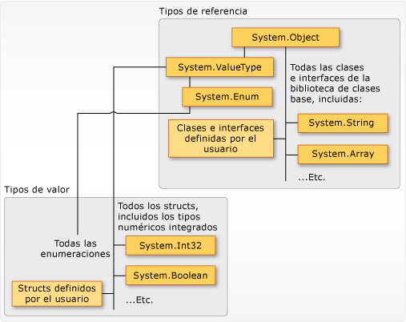

# <a name="types-c-programming-guide"></a><span data-ttu-id="aa995-102">Tipos (Guía de programación de C#)</span><span class="sxs-lookup"><span data-stu-id="aa995-102">Types (C# Programming Guide)</span></span>
## <a name="types-variables-and-values"></a><span data-ttu-id="aa995-103">Tipos, variables y valores</span><span class="sxs-lookup"><span data-stu-id="aa995-103">Types, Variables, and Values</span></span>  
 <span data-ttu-id="aa995-104">C# es un lenguaje fuertemente tipado.</span><span class="sxs-lookup"><span data-stu-id="aa995-104">C# is a strongly-typed language.</span></span> <span data-ttu-id="aa995-105">Todas las variables y constantes tienen un tipo, al igual que todas las expresiones que se evalúan como un valor.</span><span class="sxs-lookup"><span data-stu-id="aa995-105">Every variable and constant has a type, as does every expression that evaluates to a value.</span></span> <span data-ttu-id="aa995-106">Cada una de las firmas de método especifica un tipo para cada parámetro de entrada y para el valor devuelto.</span><span class="sxs-lookup"><span data-stu-id="aa995-106">Every method signature specifies a type for each input parameter and for the return value.</span></span> <span data-ttu-id="aa995-107">La biblioteca de clases .NET define un conjunto de tipos numéricos integrados, así como tipos más complejos que representan una amplia variedad de construcciones lógicas, como el sistema de archivos, conexiones de red, colecciones y matrices de objetos, y fechas.</span><span class="sxs-lookup"><span data-stu-id="aa995-107">The .NET class library defines a set of built-in numeric types as well as more complex types that represent a wide variety of logical constructs, such as the file system, network connections, collections and arrays of objects, and dates.</span></span> <span data-ttu-id="aa995-108">Los programas de C# típicos usan tipos de la biblioteca de clases, así como tipos definidos por el usuario que modelan los conceptos que son específicos del dominio del problema del programa.</span><span class="sxs-lookup"><span data-stu-id="aa995-108">A typical C# program uses types from the class library as well as user-defined types that model the concepts that are specific to the program's problem domain.</span></span>  
  
 <span data-ttu-id="aa995-109">Entre la información almacenada en un tipo se puede incluir lo siguiente:</span><span class="sxs-lookup"><span data-stu-id="aa995-109">The information stored in a type can include the following:</span></span>  
  
-   <span data-ttu-id="aa995-110">El espacio de almacenamiento que requiere una variable del tipo.</span><span class="sxs-lookup"><span data-stu-id="aa995-110">The storage space that a variable of the type requires.</span></span>  
  
-   <span data-ttu-id="aa995-111">Los valores máximo y mínimo que puede representar.</span><span class="sxs-lookup"><span data-stu-id="aa995-111">The maximum and minimum values that it can represent.</span></span>  
  
-   <span data-ttu-id="aa995-112">Los miembros (métodos, campos, eventos, etc.) que contiene.</span><span class="sxs-lookup"><span data-stu-id="aa995-112">The members (methods, fields, events, and so on) that it contains.</span></span>  
  
-   <span data-ttu-id="aa995-113">El tipo base del que hereda.</span><span class="sxs-lookup"><span data-stu-id="aa995-113">The base type it inherits from.</span></span>  
  
-   <span data-ttu-id="aa995-114">La ubicación donde se asignará la memoria para variables en tiempo de ejecución.</span><span class="sxs-lookup"><span data-stu-id="aa995-114">The location where the memory for variables will be allocated at run time.</span></span>  
  
-   <span data-ttu-id="aa995-115">Los tipos de operaciones permitidas.</span><span class="sxs-lookup"><span data-stu-id="aa995-115">The kinds of operations that are permitted.</span></span>  
  
 <span data-ttu-id="aa995-116">El compilador usa información de tipo para garantizar que todas las operaciones que se realizan en el código cuentan *con seguridad de tipos*.</span><span class="sxs-lookup"><span data-stu-id="aa995-116">The compiler uses type information to make sure that all operations that are performed in your code are *type safe*.</span></span> <span data-ttu-id="aa995-117">Por ejemplo, si declara una variable de tipo [int](../../../csharp/language-reference/keywords/int.md), el compilador le permite usar la variable en operaciones de suma y resta.</span><span class="sxs-lookup"><span data-stu-id="aa995-117">For example, if you declare a variable of type [int](../../../csharp/language-reference/keywords/int.md), the compiler allows you to use the variable in addition and subtraction operations.</span></span> <span data-ttu-id="aa995-118">Si intenta realizar esas mismas operaciones en una variable de tipo [bool](../../../csharp/language-reference/keywords/bool.md), el compilador genera un error, como se muestra en el siguiente ejemplo:</span><span class="sxs-lookup"><span data-stu-id="aa995-118">If you try to perform those same operations on a variable of type [bool](../../../csharp/language-reference/keywords/bool.md), the compiler generates an error, as shown in the following example:</span></span>  
  
 [!code-csharp[csProgGuideTypes#42](../../../csharp/programming-guide/nullable-types/codesnippet/CSharp/index_1.cs)]  
  
> [!NOTE]
>  <span data-ttu-id="aa995-119">Los desarrolladores de C y C++ deben tener en cuenta que, en C#, [bool](../../../csharp/language-reference/keywords/bool.md) no se puede convertir en [int](../../../csharp/language-reference/keywords/int.md).</span><span class="sxs-lookup"><span data-stu-id="aa995-119">C and C++ developers, notice that in C#, [bool](../../../csharp/language-reference/keywords/bool.md) is not convertible to [int](../../../csharp/language-reference/keywords/int.md).</span></span>  
  
 <span data-ttu-id="aa995-120">El compilador inserta la información de tipo en el archivo ejecutable como metadatos.</span><span class="sxs-lookup"><span data-stu-id="aa995-120">The compiler embeds the type information into the executable file as metadata.</span></span> <span data-ttu-id="aa995-121">Common Language Runtime (CLR) utiliza esos metadatos en tiempo de ejecución para garantizar aún más la seguridad de tipos cuando asigna y reclama memoria.</span><span class="sxs-lookup"><span data-stu-id="aa995-121">The common language runtime (CLR) uses that metadata at run time to further guarantee type safety when it allocates and reclaims memory.</span></span>  
  
### <a name="specifying-types-in-variable-declarations"></a><span data-ttu-id="aa995-122">Definición de tipos en declaraciones de variable</span><span class="sxs-lookup"><span data-stu-id="aa995-122">Specifying Types in Variable Declarations</span></span>  
 <span data-ttu-id="aa995-123">Cuando declare una variable o constante en un programa, debe especificar su tipo o utilizar la palabra clave [var](../../../csharp/language-reference/keywords/var.md) para que el compilador infiera el tipo.</span><span class="sxs-lookup"><span data-stu-id="aa995-123">When you declare a variable or constant in a program, you must either specify its type or use the [var](../../../csharp/language-reference/keywords/var.md) keyword to let the compiler infer the type.</span></span> <span data-ttu-id="aa995-124">En el ejemplo siguiente se muestran algunas declaraciones de variable que utilizan tanto tipos numéricos integrados como tipos complejos definidos por el usuario:</span><span class="sxs-lookup"><span data-stu-id="aa995-124">The following example shows some variable declarations that use both built-in numeric types and complex user-defined types:</span></span>  
  
 [!code-csharp[csProgGuideTypes#36](../../../csharp/programming-guide/nullable-types/codesnippet/CSharp/index_2.cs)]  
  
 <span data-ttu-id="aa995-125">Los tipos de parámetros de método y valores devueltos se especifican en la firma del método.</span><span class="sxs-lookup"><span data-stu-id="aa995-125">The types of method parameters and return values are specified in the method signature.</span></span> <span data-ttu-id="aa995-126">En la siguiente firma se muestra un método que requiere una variable [int](../../../csharp/language-reference/keywords/int.md) como argumento de entrada y devuelve una cadena:</span><span class="sxs-lookup"><span data-stu-id="aa995-126">The following signature shows a method that requires an [int](../../../csharp/language-reference/keywords/int.md) as an input argument and returns a string:</span></span>  
  
 [!code-csharp[csProgGuideTypes#35](../../../csharp/programming-guide/nullable-types/codesnippet/CSharp/index_3.cs)]  
  
 <span data-ttu-id="aa995-127">Tras declarar una variable, no se puede volver a declarar con un nuevo tipo y no se le puede asignar un valor que no sea compatible con su tipo declarado.</span><span class="sxs-lookup"><span data-stu-id="aa995-127">After a variable is declared, it cannot be re-declared with a new type, and it cannot be assigned a value that is not compatible with its declared type.</span></span> <span data-ttu-id="aa995-128">Por ejemplo, no puede declarar un valor [int](../../../csharp/language-reference/keywords/int.md) y, luego, asignarle un valor booleano de [true](../../../csharp/language-reference/keywords/true-literal.md).</span><span class="sxs-lookup"><span data-stu-id="aa995-128">For example, you cannot declare an [int](../../../csharp/language-reference/keywords/int.md) and then assign it a Boolean value of [true](../../../csharp/language-reference/keywords/true-literal.md).</span></span> <span data-ttu-id="aa995-129">En cambio, los valores se pueden convertir en otros tipos, por ejemplo, cuando se asignan a variables nuevas o se pasan como argumentos de método.</span><span class="sxs-lookup"><span data-stu-id="aa995-129">However, values can be converted to other types, for example when they are assigned to new variables or passed as method arguments.</span></span> <span data-ttu-id="aa995-130">El compilador realiza automáticamente una *conversión de tipo* que no da lugar a una pérdida de datos.</span><span class="sxs-lookup"><span data-stu-id="aa995-130">A *type conversion* that does not cause data loss is performed automatically by the compiler.</span></span> <span data-ttu-id="aa995-131">Una conversión que pueda dar lugar a la pérdida de datos requiere un valor *cast* en el código fuente.</span><span class="sxs-lookup"><span data-stu-id="aa995-131">A conversion that might cause data loss requires a *cast* in the source code.</span></span>  
  
 <span data-ttu-id="aa995-132">Para obtener más información, vea [Conversiones de tipos](../../../csharp/programming-guide/types/casting-and-type-conversions.md).</span><span class="sxs-lookup"><span data-stu-id="aa995-132">For more information, see [Casting and Type Conversions](../../../csharp/programming-guide/types/casting-and-type-conversions.md).</span></span>  
  
## <a name="built-in-types"></a><span data-ttu-id="aa995-133">Tipos integrados</span><span class="sxs-lookup"><span data-stu-id="aa995-133">Built-in Types</span></span>  
 <span data-ttu-id="aa995-134">C# proporciona un conjunto estándar de tipos numéricos integrados para representar números enteros, valores de punto flotante, expresiones booleanas, caracteres de texto, valores decimales y otros tipos de datos.</span><span class="sxs-lookup"><span data-stu-id="aa995-134">C# provides a standard set of built-in numeric types to represent integers, floating point values, Boolean expressions, text characters, decimal values, and other types of data.</span></span> <span data-ttu-id="aa995-135">También hay tipos `string` y `object` integrados.</span><span class="sxs-lookup"><span data-stu-id="aa995-135">There are also built-in `string` and `object` types.</span></span> <span data-ttu-id="aa995-136">Están disponibles para su uso en cualquier programa de C#.</span><span class="sxs-lookup"><span data-stu-id="aa995-136">These are available for you to use in any C# program.</span></span> <span data-ttu-id="aa995-137">Para obtener más información sobre los tipos integrados, vea [Tablas de referencia para tipos](../../../csharp/language-reference/keywords/reference-tables-for-types.md).</span><span class="sxs-lookup"><span data-stu-id="aa995-137">For more information about the built-in types, see [Reference Tables for Types](../../../csharp/language-reference/keywords/reference-tables-for-types.md).</span></span>  
  
## <a name="custom-types"></a><span data-ttu-id="aa995-138">Tipos personalizados</span><span class="sxs-lookup"><span data-stu-id="aa995-138">Custom Types</span></span>  
 <span data-ttu-id="aa995-139">Las construcciones [struct](../../../csharp/language-reference/keywords/struct.md), [class](../../../csharp/language-reference/keywords/class.md), [interface](../../../csharp/language-reference/keywords/interface.md) y [enum](../../../csharp/language-reference/keywords/enum.md) se utilizan para crear sus propios tipos personalizados.</span><span class="sxs-lookup"><span data-stu-id="aa995-139">You use the [struct](../../../csharp/language-reference/keywords/struct.md), [class](../../../csharp/language-reference/keywords/class.md), [interface](../../../csharp/language-reference/keywords/interface.md), and [enum](../../../csharp/language-reference/keywords/enum.md) constructs to create your own custom types.</span></span> <span data-ttu-id="aa995-140">La biblioteca de clases .NET es en sí misma una colección de tipos personalizados proporcionados por Microsoft que puede usar en sus propias aplicaciones.</span><span class="sxs-lookup"><span data-stu-id="aa995-140">The .NET class library itself is a collection of custom types provided by Microsoft that you can use in your own applications.</span></span> <span data-ttu-id="aa995-141">De forma predeterminada, los tipos usados con más frecuencia en la biblioteca de clases están disponibles en cualquier programa de C#.</span><span class="sxs-lookup"><span data-stu-id="aa995-141">By default, the most frequently used types in the class library are available in any C# program.</span></span> <span data-ttu-id="aa995-142">Otros están disponibles solo cuando agrega explícitamente una referencia de proyecto al ensamblado en el que se definen.</span><span class="sxs-lookup"><span data-stu-id="aa995-142">Others become available only when you explicitly add a project reference to the assembly in which they are defined.</span></span> <span data-ttu-id="aa995-143">Una vez que el compilador tenga una referencia al ensamblado, puede declarar variables (y constantes) de los tipos declarados en dicho ensamblado en el código fuente.</span><span class="sxs-lookup"><span data-stu-id="aa995-143">After the compiler has a reference to the assembly, you can declare variables (and constants) of the types declared in that assembly in source code.</span></span> <span data-ttu-id="aa995-144">Para más información, vea [Biblioteca de clases .NET](../../../standard/class-library-overview.md).</span><span class="sxs-lookup"><span data-stu-id="aa995-144">For more information, see [.NET Class Library](../../../standard/class-library-overview.md).</span></span>  
  
## <a name="the-common-type-system"></a><span data-ttu-id="aa995-145">Common Type System</span><span class="sxs-lookup"><span data-stu-id="aa995-145">The Common Type System</span></span>  
 <span data-ttu-id="aa995-146">Es importante entender dos aspectos fundamentales sobre el sistema de tipos en .NET:</span><span class="sxs-lookup"><span data-stu-id="aa995-146">It is important to understand two fundamental points about the type system in .NET:</span></span>  
  
-   <span data-ttu-id="aa995-147">Es compatible con el principio de herencia.</span><span class="sxs-lookup"><span data-stu-id="aa995-147">It supports the principle of inheritance.</span></span> <span data-ttu-id="aa995-148">Los tipos pueden derivarse de otros tipos, denominados *tipos base*.</span><span class="sxs-lookup"><span data-stu-id="aa995-148">Types can derive from other types, called *base types*.</span></span> <span data-ttu-id="aa995-149">El tipo derivado hereda (con algunas restricciones), los métodos, las propiedades y otros miembros del tipo base.</span><span class="sxs-lookup"><span data-stu-id="aa995-149">The derived type inherits (with some restrictions) the methods, properties, and other members of the base type.</span></span> <span data-ttu-id="aa995-150">A su vez, el tipo base puede derivarse de algún otro tipo, en cuyo caso el tipo derivado hereda los miembros de ambos tipos base en su jerarquía de herencia.</span><span class="sxs-lookup"><span data-stu-id="aa995-150">The base type can in turn derive from some other type, in which case the derived type inherits the members of both base types in its inheritance hierarchy.</span></span> <span data-ttu-id="aa995-151">Todos los tipos, incluidos los tipos numéricos integrados como <xref:System.Int32?displayProperty=nameWithType> (palabra clave de C#: [int](../../../csharp/language-reference/keywords/int.md)), derivan en última instancia de un único tipo base, que es <xref:System.Object?displayProperty=nameWithType> (palabra clave de C#: [object](../../../csharp/language-reference/keywords/object.md)).</span><span class="sxs-lookup"><span data-stu-id="aa995-151">All types, including built-in numeric types such as <xref:System.Int32?displayProperty=nameWithType> (C# keyword: [int](../../../csharp/language-reference/keywords/int.md)), derive ultimately from a single base type, which is <xref:System.Object?displayProperty=nameWithType> (C# keyword: [object](../../../csharp/language-reference/keywords/object.md)).</span></span> <span data-ttu-id="aa995-152">Esta jerarquía de tipos unificada se denomina [Common Type System](../../../standard/base-types/common-type-system.md) (CTS).</span><span class="sxs-lookup"><span data-stu-id="aa995-152">This unified type hierarchy is called the [Common Type System](../../../standard/base-types/common-type-system.md) (CTS).</span></span> <span data-ttu-id="aa995-153">Para más información sobre la herencia en C#, vea [Herencia](../../../csharp/programming-guide/classes-and-structs/inheritance.md).</span><span class="sxs-lookup"><span data-stu-id="aa995-153">For more information about inheritance in C#, see [Inheritance](../../../csharp/programming-guide/classes-and-structs/inheritance.md).</span></span>  
  
-   <span data-ttu-id="aa995-154">En CTS, cada tipo se define como un *tipo de valor* o un *tipo de referencia*.</span><span class="sxs-lookup"><span data-stu-id="aa995-154">Each type in the CTS is defined as either a *value type* or a *reference type*.</span></span> <span data-ttu-id="aa995-155">Esto incluye todos los tipos personalizados de la biblioteca de clases .NET y también sus propios tipos definidos por el usuario.</span><span class="sxs-lookup"><span data-stu-id="aa995-155">This includes all custom types in the .NET class library and also your own user-defined types.</span></span> <span data-ttu-id="aa995-156">Los tipos que se definen mediante el uso de la palabra clave [struct](../../../csharp/language-reference/keywords/struct.md) son tipos de valor; todos los tipos numéricos integrados son `structs`.</span><span class="sxs-lookup"><span data-stu-id="aa995-156">Types that you define by using the [struct](../../../csharp/language-reference/keywords/struct.md) keyword are value types; all the built-in numeric types are `structs`.</span></span> <span data-ttu-id="aa995-157">Los tipos que se definen mediante el uso de la palabra clave [class](../../../csharp/language-reference/keywords/class.md) son tipos de referencia.</span><span class="sxs-lookup"><span data-stu-id="aa995-157">Types that you define by using the [class](../../../csharp/language-reference/keywords/class.md) keyword are reference types.</span></span> <span data-ttu-id="aa995-158">Los tipos de referencia y los tipos de valor tienen distintas reglas de tiempo de compilación y distintos comportamientos de tiempo de ejecución.</span><span class="sxs-lookup"><span data-stu-id="aa995-158">Reference types and value types have different compile-time rules, and different run-time behavior.</span></span>  
  
 <span data-ttu-id="aa995-159">En la ilustración siguiente se muestra la relación entre los tipos de valor y los tipos de referencia en CTS.</span><span class="sxs-lookup"><span data-stu-id="aa995-159">The following illustration shows the relationship between value types and reference types in the CTS.</span></span>  
  
 <span data-ttu-id="aa995-160"></span><span class="sxs-lookup"><span data-stu-id="aa995-160"></span></span>  
<span data-ttu-id="aa995-161">Tipos de valores y tipos de referencias en CTS</span><span class="sxs-lookup"><span data-stu-id="aa995-161">Value types and reference types in the CTS</span></span>  
  
> [!NOTE]
>  <span data-ttu-id="aa995-162">Puede ver que los tipos utilizados con mayor frecuencia están organizados en el espacio de nombres <xref:System>.</span><span class="sxs-lookup"><span data-stu-id="aa995-162">You can see that the most commonly used types are all organized in the <xref:System> namespace.</span></span> <span data-ttu-id="aa995-163">Sin embargo, el espacio de nombres que contiene un tipo no tiene ninguna relación con un tipo de valor o un tipo de referencia.</span><span class="sxs-lookup"><span data-stu-id="aa995-163">However, the namespace in which a type is contained has no relation to whether it is a value type or reference type.</span></span>  
  
### <a name="value-types"></a><span data-ttu-id="aa995-164">Tipos de valor</span><span class="sxs-lookup"><span data-stu-id="aa995-164">Value Types</span></span>  
 <span data-ttu-id="aa995-165">Los tipos de valor derivan de <xref:System.ValueType?displayProperty=nameWithType>, el cual deriva de <xref:System.Object?displayProperty=nameWithType>.</span><span class="sxs-lookup"><span data-stu-id="aa995-165">Value types derive from <xref:System.ValueType?displayProperty=nameWithType>, which derives from <xref:System.Object?displayProperty=nameWithType>.</span></span> <span data-ttu-id="aa995-166">Los tipos que derivan de <xref:System.ValueType?displayProperty=nameWithType> tienen un comportamiento especial en CLR.</span><span class="sxs-lookup"><span data-stu-id="aa995-166">Types that derive from <xref:System.ValueType?displayProperty=nameWithType> have special behavior in the CLR.</span></span> <span data-ttu-id="aa995-167">Las variables de tipo de valor contienen directamente sus valores, lo que significa que la memoria se asigna insertada en cualquier contexto en el que se declare la variable.</span><span class="sxs-lookup"><span data-stu-id="aa995-167">Value type variables directly contain their values, which means that the memory is allocated inline in whatever context the variable is declared.</span></span> <span data-ttu-id="aa995-168">No se produce ninguna asignación del montón independiente ni sobrecarga de la recolección de elementos no utilizados para las variables de tipo de valor.</span><span class="sxs-lookup"><span data-stu-id="aa995-168">There is no separate heap allocation or garbage collection overhead for value-type variables.</span></span>  
  
 <span data-ttu-id="aa995-169">Existen dos categorías de tipos de valor: [struct](../../../csharp/language-reference/keywords/struct.md) y [enum](../../../csharp/language-reference/keywords/enum.md).</span><span class="sxs-lookup"><span data-stu-id="aa995-169">There are two categories of value types: [struct](../../../csharp/language-reference/keywords/struct.md) and [enum](../../../csharp/language-reference/keywords/enum.md).</span></span>  
  
 <span data-ttu-id="aa995-170">Los tipos numéricos integrados son structs y tienen propiedades y métodos a los que se puede obtener acceso:</span><span class="sxs-lookup"><span data-stu-id="aa995-170">The built-in numeric types are structs, and they have properties and methods that you can access:</span></span>  
  
```csharp  
// Static method on type Byte.  
byte b = Byte.MaxValue;  
```  
  
 <span data-ttu-id="aa995-171">Pero se declaran y se les asignan valores como si fueran tipos simples no agregados:</span><span class="sxs-lookup"><span data-stu-id="aa995-171">But you declare and assign values to them as if they were simple non-aggregate types:</span></span>  
  
```csharp  
byte num = 0xA;  
int i = 5;  
char c = 'Z';  
```  
  
 <span data-ttu-id="aa995-172">Los tipos de valor están *sellados*, lo que significa que, por ejemplo, no puede derivar un tipo de <xref:System.Int32?displayProperty=nameWithType>, y no puede definir un struct para que herede de cualquier clase o struct definido por el usuario, porque un struct solo puede heredar de <xref:System.ValueType?displayProperty=nameWithType>.</span><span class="sxs-lookup"><span data-stu-id="aa995-172">Value types are *sealed*, which means, for example, that you cannot derive a type from <xref:System.Int32?displayProperty=nameWithType>, and you cannot define a struct to inherit from any user-defined class or struct because a struct can only inherit from <xref:System.ValueType?displayProperty=nameWithType>.</span></span> <span data-ttu-id="aa995-173">A pesar de ello, un struct puede implementar una o más interfaces.</span><span class="sxs-lookup"><span data-stu-id="aa995-173">However, a struct can implement one or more interfaces.</span></span> <span data-ttu-id="aa995-174">Puede convertir un tipo struct en cualquier tipo de interfaz que implemente. Esto hace que una operación de conversión *boxing* encapsule el struct dentro de un objeto de tipo de referencia en el montón administrado.</span><span class="sxs-lookup"><span data-stu-id="aa995-174">You can cast a struct type to any interface type that it implements; this causes a *boxing* operation to wrap the struct inside a reference type object on the managed heap.</span></span> <span data-ttu-id="aa995-175">Las operaciones de conversión boxing se producen cuando se pasa un tipo de valor a un método que toma <xref:System.Object?displayProperty=nameWithType> o cualquier tipo de interfaz como parámetro de entrada.</span><span class="sxs-lookup"><span data-stu-id="aa995-175">Boxing operations occur when you pass a value type to a method that takes a <xref:System.Object?displayProperty=nameWithType> or any interface type as an input parameter.</span></span> <span data-ttu-id="aa995-176">Para obtener más información, vea [Conversión boxing y unboxing](../../../csharp/programming-guide/types/boxing-and-unboxing.md).</span><span class="sxs-lookup"><span data-stu-id="aa995-176">For more information, see [Boxing and Unboxing](../../../csharp/programming-guide/types/boxing-and-unboxing.md).</span></span>  
  
 <span data-ttu-id="aa995-177">Puede usar la palabra clave [struct](../../../csharp/language-reference/keywords/struct.md) para crear sus propios tipos de valor personalizados.</span><span class="sxs-lookup"><span data-stu-id="aa995-177">You use the [struct](../../../csharp/language-reference/keywords/struct.md) keyword to create your own custom value types.</span></span> <span data-ttu-id="aa995-178">Normalmente, un struct se usa como un contenedor para un pequeño conjunto de variables relacionadas, como se muestra en el ejemplo siguiente:</span><span class="sxs-lookup"><span data-stu-id="aa995-178">Typically, a struct is used as a container for a small set of related variables, as shown in the following example:</span></span>  
  
 [!code-csharp[csProgGuideObjects#1](../../../csharp/programming-guide/classes-and-structs/codesnippet/CSharp/index_4.cs)]  
  
 <span data-ttu-id="aa995-179">Para más información sobre estructuras, vea [Structs](../../../csharp/programming-guide/classes-and-structs/structs.md).</span><span class="sxs-lookup"><span data-stu-id="aa995-179">For more information about structs, see [Structs](../../../csharp/programming-guide/classes-and-structs/structs.md).</span></span> <span data-ttu-id="aa995-180">Para más información sobre los tipos de valor en. NET, vea [Tipos de valor](../../../csharp/language-reference/keywords/value-types.md).</span><span class="sxs-lookup"><span data-stu-id="aa995-180">For more information about value types in .NET, see [Value Types](../../../csharp/language-reference/keywords/value-types.md).</span></span>  
  
 <span data-ttu-id="aa995-181">La otra categoría de tipos de valor es [enum](../../../csharp/language-reference/keywords/enum.md).</span><span class="sxs-lookup"><span data-stu-id="aa995-181">The other category of value types is [enum](../../../csharp/language-reference/keywords/enum.md).</span></span> <span data-ttu-id="aa995-182">Una enumeración define un conjunto de constantes integrales con nombre.</span><span class="sxs-lookup"><span data-stu-id="aa995-182">An enum defines a set of named integral constants.</span></span> <span data-ttu-id="aa995-183">Por ejemplo, la enumeración <xref:System.IO.FileMode?displayProperty=nameWithType> de la biblioteca de clases .NET contiene un conjunto de enteros constantes con nombre que especifican cómo se debe abrir un archivo.</span><span class="sxs-lookup"><span data-stu-id="aa995-183">For example, the <xref:System.IO.FileMode?displayProperty=nameWithType> enumeration in the .NET class library contains a set of named constant integers that specify how a file should be opened.</span></span> <span data-ttu-id="aa995-184">Se define como se muestra en el ejemplo siguiente:</span><span class="sxs-lookup"><span data-stu-id="aa995-184">It is defined as shown in the following example:</span></span>  
 
 [!code-csharp[csProgGuideTypes#44](../../../csharp/programming-guide/nullable-types/codesnippet/CSharp/index_5.cs)]  
  
 <span data-ttu-id="aa995-185">La constante `System.IO.FileMode.Create` tiene un valor de 2.</span><span class="sxs-lookup"><span data-stu-id="aa995-185">The `System.IO.FileMode.Create` constant has a value of 2.</span></span> <span data-ttu-id="aa995-186">Sin embargo, el nombre es mucho más significativo para los humanos que leen el código fuente y, por esa razón, es mejor utilizar enumeraciones en lugar de números literales constantes.</span><span class="sxs-lookup"><span data-stu-id="aa995-186">However, the name is much more meaningful for humans reading the source code, and for that reason it is better to use enumerations instead of constant literal numbers.</span></span> <span data-ttu-id="aa995-187">Para obtener más información, vea <xref:System.IO.FileMode?displayProperty=nameWithType>.</span><span class="sxs-lookup"><span data-stu-id="aa995-187">For more information, see <xref:System.IO.FileMode?displayProperty=nameWithType>.</span></span>  
  
 <span data-ttu-id="aa995-188">Todas las enumeraciones se heredan de <xref:System.Enum?displayProperty=nameWithType>, el cual se hereda de <xref:System.ValueType?displayProperty=nameWithType>.</span><span class="sxs-lookup"><span data-stu-id="aa995-188">All enums inherit from <xref:System.Enum?displayProperty=nameWithType>, which inherits from <xref:System.ValueType?displayProperty=nameWithType>.</span></span> <span data-ttu-id="aa995-189">Todas las reglas que se aplican a las estructuras también se aplican a las enumeraciones.</span><span class="sxs-lookup"><span data-stu-id="aa995-189">All the rules that apply to structs also apply to enums.</span></span> <span data-ttu-id="aa995-190">Para más información sobre las enumeraciones, vea [Tipos de enumeración](../../../csharp/programming-guide/enumeration-types.md).</span><span class="sxs-lookup"><span data-stu-id="aa995-190">For more information about enums, see [Enumeration Types](../../../csharp/programming-guide/enumeration-types.md).</span></span>  
  
### <a name="reference-types"></a><span data-ttu-id="aa995-191">Tipos de referencia</span><span class="sxs-lookup"><span data-stu-id="aa995-191">Reference Types</span></span>  
 <span data-ttu-id="aa995-192">Un tipo que se define como [clase](../../../csharp/language-reference/keywords/class.md), [delegado](../../../csharp/language-reference/keywords/delegate.md), matriz o [interfaz](../../../csharp/language-reference/keywords/interface.md) es un *tipo de referencia*.</span><span class="sxs-lookup"><span data-stu-id="aa995-192">A type that is defined as a [class](../../../csharp/language-reference/keywords/class.md), [delegate](../../../csharp/language-reference/keywords/delegate.md), array, or [interface](../../../csharp/language-reference/keywords/interface.md) is a *reference type*.</span></span> <span data-ttu-id="aa995-193">Al declarar una variable de un tipo de referencia en tiempo de ejecución, esta contendrá el valor [null](../../../csharp/language-reference/keywords/null.md) hasta que se cree explícitamente un objeto mediante el operador [new](../../../csharp/language-reference/keywords/new.md), o bien que se le asigne un objeto creado en otro lugar mediante `new`, tal y como se muestra en el ejemplo siguiente:</span><span class="sxs-lookup"><span data-stu-id="aa995-193">At run time, when you declare a variable of a reference type, the variable contains the value [null](../../../csharp/language-reference/keywords/null.md) until you explicitly create an object by using the [new](../../../csharp/language-reference/keywords/new.md) operator, or assign it an object that has been created elsewhere by using `new`, as shown in the following example:</span></span>
  
```csharp  
MyClass mc = new MyClass();  
MyClass mc2 = mc;  
```  
   <span data-ttu-id="aa995-194">Una interfaz debe inicializarse junto con un objeto de clase que lo implementa.</span><span class="sxs-lookup"><span data-stu-id="aa995-194">An interface must be initialized together with a class object that implements it.</span></span> <span data-ttu-id="aa995-195">Si `MyClass` implementa `IMyInterface`, cree una instancia de `IMyInterface`, tal como se muestra en el ejemplo siguiente:</span><span class="sxs-lookup"><span data-stu-id="aa995-195">If `MyClass` implements `IMyInterface`, you create an instance of `IMyInterface` as shown in the following example:</span></span>  
  
```csharp  
IMyInterface iface = new MyClass();  
```  
  
 <span data-ttu-id="aa995-196">Cuando se crea el objeto, se asigna la memoria en el montón administrado y la variable solo contiene una referencia a la ubicación del objeto.</span><span class="sxs-lookup"><span data-stu-id="aa995-196">When the object is created, the memory is allocated on the managed heap, and the variable holds only a reference to the location of the object.</span></span> <span data-ttu-id="aa995-197">Los tipos del montón administrado producen sobrecarga cuando se asignan y cuando los reclama la función de administración de memoria automática de CLR, conocida como *recolección de elementos no utilizados*.</span><span class="sxs-lookup"><span data-stu-id="aa995-197">Types on the managed heap require overhead both when they are allocated and when they are reclaimed by the automatic memory management functionality of the CLR, which is known as *garbage collection*.</span></span> <span data-ttu-id="aa995-198">En cambio, la recolección de elementos no utilizados también está muy optimizada y no crea problemas de rendimiento en la mayoría de los escenarios.</span><span class="sxs-lookup"><span data-stu-id="aa995-198">However, garbage collection is also highly optimized, and in most scenarios it does not create a performance issue.</span></span> <span data-ttu-id="aa995-199">Para obtener más información sobre la recolección de elementos no utilizados, vea [Administración de memoria automática](../../../standard/automatic-memory-management.md).</span><span class="sxs-lookup"><span data-stu-id="aa995-199">For more information about garbage collection, see [Automatic Memory Management](../../../standard/automatic-memory-management.md).</span></span>  
  
 <span data-ttu-id="aa995-200">Todas las matrices son tipos de referencia, incluso si sus elementos son tipos de valor.</span><span class="sxs-lookup"><span data-stu-id="aa995-200">All arrays are reference types, even if their elements are value types.</span></span> <span data-ttu-id="aa995-201">Las matrices derivan de manera implícita de la clase <xref:System.Array?displayProperty=nameWithType>, pero el usuario las declara y las usa con la sintaxis simplificada que proporciona C#, como se muestra en el ejemplo siguiente:</span><span class="sxs-lookup"><span data-stu-id="aa995-201">Arrays implicitly derive from the <xref:System.Array?displayProperty=nameWithType> class, but you declare and use them with the simplified syntax that is provided by C#, as shown in the following example:</span></span>  
  
 [!code-csharp[csProgGuideTypes#45](../../../csharp/programming-guide/nullable-types/codesnippet/CSharp/index_6.cs)]  
  
 <span data-ttu-id="aa995-202">Los tipos de referencia admiten la herencia completamente.</span><span class="sxs-lookup"><span data-stu-id="aa995-202">Reference types fully support inheritance.</span></span> <span data-ttu-id="aa995-203">Al crear una clase, puede heredar de cualquier otra interfaz o clase que no esté definida como [sealed](../../../csharp/language-reference/keywords/sealed.md); y otras clases pueden heredar de la clase e invalidar sus métodos virtuales.</span><span class="sxs-lookup"><span data-stu-id="aa995-203">When you create a class, you can inherit from any other interface or class that is not defined as [sealed](../../../csharp/language-reference/keywords/sealed.md), and other classes can inherit from your class and override your virtual methods.</span></span> <span data-ttu-id="aa995-204">Para más información sobre cómo crear clases propias, vea [Clases y structs](../../../csharp/programming-guide/classes-and-structs/index.md).</span><span class="sxs-lookup"><span data-stu-id="aa995-204">For more information about how to create your own classes, see [Classes and Structs](../../../csharp/programming-guide/classes-and-structs/index.md).</span></span> <span data-ttu-id="aa995-205">Para más información sobre la herencia y los métodos virtuales, vea [Herencia](../../../csharp/programming-guide/classes-and-structs/inheritance.md).</span><span class="sxs-lookup"><span data-stu-id="aa995-205">For more information about inheritance and virtual methods, see [Inheritance](../../../csharp/programming-guide/classes-and-structs/inheritance.md).</span></span>  
  
## <a name="types-of-literal-values"></a><span data-ttu-id="aa995-206">Tipos de valores literales</span><span class="sxs-lookup"><span data-stu-id="aa995-206">Types of Literal Values</span></span>  
 <span data-ttu-id="aa995-207">En C#, los valores literales reciben un tipo del compilador.</span><span class="sxs-lookup"><span data-stu-id="aa995-207">In C#, literal values receive a type from the compiler.</span></span> <span data-ttu-id="aa995-208">Puede especificar cómo debe escribirse un literal numérico; para ello, anexe una letra al final del número.</span><span class="sxs-lookup"><span data-stu-id="aa995-208">You can specify how a numeric literal should be typed by appending a letter to the end of the number.</span></span> <span data-ttu-id="aa995-209">Por ejemplo, para especificar que el valor 4.56 debe tratarse como un valor flotante, anexe "f" o "F" después del número: `4.56f`.</span><span class="sxs-lookup"><span data-stu-id="aa995-209">For example, to specify that the value 4.56 should be treated as a float, append an "f" or "F" after the number: `4.56f`.</span></span> <span data-ttu-id="aa995-210">Si no se anexa ninguna letra, el compilador inferirá un tipo para el literal.</span><span class="sxs-lookup"><span data-stu-id="aa995-210">If no letter is appended, the compiler will infer a type for the literal.</span></span> <span data-ttu-id="aa995-211">Para obtener más información sobre los tipos que se pueden especificar con sufijos de letras, vea las páginas de referencia de los tipos individuales en [Tipos de valor](../../../csharp/language-reference/keywords/value-types.md).</span><span class="sxs-lookup"><span data-stu-id="aa995-211">For more information about which types can be specified with letter suffixes, see the reference pages for individual types in [Value Types](../../../csharp/language-reference/keywords/value-types.md).</span></span>  
  
 <span data-ttu-id="aa995-212">Dado que los literales tienen tipo y todos los tipos derivan en última instancia de <xref:System.Object?displayProperty=nameWithType>, puede escribir y compilar código como el siguiente:</span><span class="sxs-lookup"><span data-stu-id="aa995-212">Because literals are typed, and all types derive ultimately from <xref:System.Object?displayProperty=nameWithType>, you can write and compile code such as the following:</span></span>  
  
 [!code-csharp[csProgGuideTypes#37](../../../csharp/programming-guide/nullable-types/codesnippet/CSharp/index_7.cs)]  
  
## <a name="generic-types"></a><span data-ttu-id="aa995-213">Tipos genéricos</span><span class="sxs-lookup"><span data-stu-id="aa995-213">Generic Types</span></span>  
 <span data-ttu-id="aa995-214">Los tipos se pueden declarar con uno o varios *parámetros de tipo* que actúan como un marcador de posición para el tipo real (el *tipo concreto*) que proporcionará el código de cliente cuando cree una instancia del tipo.</span><span class="sxs-lookup"><span data-stu-id="aa995-214">A type can be declared with one or more *type parameters* that serve as a placeholder for the actual type (the *concrete type*) that client code will provide when it creates an instance of the type.</span></span> <span data-ttu-id="aa995-215">Estos tipos se denominan *tipos genéricos*.</span><span class="sxs-lookup"><span data-stu-id="aa995-215">Such types are called *generic types*.</span></span> <span data-ttu-id="aa995-216">Por ejemplo, el tipo de .NET <xref:System.Collections.Generic.List%601?displayProperty=nameWithType> tiene un parámetro de tipo al que, por convención, se le denomina *T*. Cuando crea una instancia del tipo, especifica el tipo de los objetos que contendrá la lista, por ejemplo, la cadena:</span><span class="sxs-lookup"><span data-stu-id="aa995-216">For example, the .NET type <xref:System.Collections.Generic.List%601?displayProperty=nameWithType> has one type parameter that by convention is given the name *T*. When you create an instance of the type, you specify the type of the objects that the list will contain, for example, string:</span></span>  
 
```csharp
List<string> stringList = new List<string>();
stringList.Add("String example");
// compile time error adding a type other than a string:
stringList.Add(4);
```
 <span data-ttu-id="aa995-217">El uso del parámetro de tipo permite reutilizar la misma clase para incluir cualquier tipo de elemento, sin necesidad de convertir cada elemento en [object](../../../csharp/language-reference/keywords/object.md).</span><span class="sxs-lookup"><span data-stu-id="aa995-217">The use of the type parameter makes it possible to reuse the same class to hold any type of element, without having to convert each element to [object](../../../csharp/language-reference/keywords/object.md).</span></span> <span data-ttu-id="aa995-218">Las clases de colección genéricas se denominan *colecciones fuertemente tipadas* porque el compilador conoce el tipo específico de los elementos de la colección y puede generar un error en tiempo de compilación si, por ejemplo, intenta agregar un valor entero al objeto `stringList` del ejemplo anterior.</span><span class="sxs-lookup"><span data-stu-id="aa995-218">Generic collection classes are called *strongly-typed collections* because the compiler knows the specific type of the collection's elements and can raise an error at compile-time if, for example, you try to add an integer to the `stringList` object in the previous example.</span></span> <span data-ttu-id="aa995-219">Para más información, vea [Genéricos](../../../csharp/programming-guide/generics/index.md).</span><span class="sxs-lookup"><span data-stu-id="aa995-219">For more information, see [Generics](../../../csharp/programming-guide/generics/index.md).</span></span>  
  
## <a name="implicit-types-anonymous-types-and-nullable-types"></a><span data-ttu-id="aa995-220">Tipos implícitos, tipos anónimos y tipos que aceptan valores NULL</span><span class="sxs-lookup"><span data-stu-id="aa995-220">Implicit Types, Anonymous Types, and Nullable Types</span></span>  
 <span data-ttu-id="aa995-221">Como se ha mencionado anteriormente, puede asignar implícitamente un tipo a una variable local (pero no miembros de clase) mediante la palabra clave [var](../../../csharp/language-reference/keywords/var.md).</span><span class="sxs-lookup"><span data-stu-id="aa995-221">As stated previously, you can implicitly type a local variable (but not class members) by using the [var](../../../csharp/language-reference/keywords/var.md) keyword.</span></span> <span data-ttu-id="aa995-222">La variable sigue recibiendo un tipo en tiempo de compilación, pero este lo proporciona el compilador.</span><span class="sxs-lookup"><span data-stu-id="aa995-222">The variable still receives a type at compile time, but the type is provided by the compiler.</span></span> <span data-ttu-id="aa995-223">Para más información, vea [Variables locales con asignación implícita de tipos](../../../csharp/programming-guide/classes-and-structs/implicitly-typed-local-variables.md).</span><span class="sxs-lookup"><span data-stu-id="aa995-223">For more information, see [Implicitly Typed Local Variables](../../../csharp/programming-guide/classes-and-structs/implicitly-typed-local-variables.md).</span></span>  
  
 <span data-ttu-id="aa995-224">En algunos casos, resulta conveniente crear un tipo con nombre para conjuntos sencillos de valores relacionados que no desea almacenar ni pasar fuera de los límites del método.</span><span class="sxs-lookup"><span data-stu-id="aa995-224">In some cases, it is inconvenient to create a named type for simple sets of related values that you do not intend to store or pass outside method boundaries.</span></span> <span data-ttu-id="aa995-225">Puede crear *tipos anónimos* para este fin.</span><span class="sxs-lookup"><span data-stu-id="aa995-225">You can create *anonymous types* for this purpose.</span></span> <span data-ttu-id="aa995-226">Para más información, vea [Tipos anónimos](../../../csharp/programming-guide/classes-and-structs/anonymous-types.md).</span><span class="sxs-lookup"><span data-stu-id="aa995-226">For more information, see [Anonymous Types](../../../csharp/programming-guide/classes-and-structs/anonymous-types.md).</span></span>  
  
 <span data-ttu-id="aa995-227">Los tipos de valor normales no pueden tener un valor [null](../../../csharp/language-reference/keywords/null.md),</span><span class="sxs-lookup"><span data-stu-id="aa995-227">Ordinary value types cannot have a value of [null](../../../csharp/language-reference/keywords/null.md).</span></span> <span data-ttu-id="aa995-228">pero se pueden crear tipos de valor que aceptan valores NULL mediante la adición de `?` después del tipo.</span><span class="sxs-lookup"><span data-stu-id="aa995-228">However, you can create nullable value types by affixing a `?` after the type.</span></span> <span data-ttu-id="aa995-229">Por ejemplo, `int?` es un tipo `int` que también puede tener el valor [null](../../../csharp/language-reference/keywords/null.md).</span><span class="sxs-lookup"><span data-stu-id="aa995-229">For example, `int?` is an `int` type that can also have the value [null](../../../csharp/language-reference/keywords/null.md).</span></span> <span data-ttu-id="aa995-230">En CTS, los tipos que aceptan valores NULL son instancias del tipo struct genérico <xref:System.Nullable%601?displayProperty=nameWithType>.</span><span class="sxs-lookup"><span data-stu-id="aa995-230">In the CTS, nullable types are instances of the generic struct type <xref:System.Nullable%601?displayProperty=nameWithType>.</span></span> <span data-ttu-id="aa995-231">Los tipos que aceptan valores NULL son especialmente útiles cuando se pasan datos hacia y desde bases de datos en las que los valores numéricos podrían ser nulos.</span><span class="sxs-lookup"><span data-stu-id="aa995-231">Nullable types are especially useful when you are passing data to and from databases in which numeric values might be null.</span></span> <span data-ttu-id="aa995-232">Para más información, vea [Tipos que aceptan valores NULL](../../../csharp/programming-guide/nullable-types/index.md).</span><span class="sxs-lookup"><span data-stu-id="aa995-232">For more information, see [Nullable Types](../../../csharp/programming-guide/nullable-types/index.md).</span></span>  
  
## <a name="related-sections"></a><span data-ttu-id="aa995-233">Secciones relacionadas</span><span class="sxs-lookup"><span data-stu-id="aa995-233">Related Sections</span></span>  
 <span data-ttu-id="aa995-234">Para obtener más información, vea los temas siguientes:</span><span class="sxs-lookup"><span data-stu-id="aa995-234">For more information, see the following topics:</span></span>  
  
-   [<span data-ttu-id="aa995-235">Conversiones de tipos</span><span class="sxs-lookup"><span data-stu-id="aa995-235">Casting and Type Conversions</span></span>](../../../csharp/programming-guide/types/casting-and-type-conversions.md)  
  
-   [<span data-ttu-id="aa995-236">Conversión boxing y conversión unboxing</span><span class="sxs-lookup"><span data-stu-id="aa995-236">Boxing and Unboxing</span></span>](../../../csharp/programming-guide/types/boxing-and-unboxing.md)  
  
-   [<span data-ttu-id="aa995-237">Uso de tipo dinámico</span><span class="sxs-lookup"><span data-stu-id="aa995-237">Using Type dynamic</span></span>](../../../csharp/programming-guide/types/using-type-dynamic.md)  
  
-   [<span data-ttu-id="aa995-238">Tipos de valor</span><span class="sxs-lookup"><span data-stu-id="aa995-238">Value Types</span></span>](../../../csharp/language-reference/keywords/value-types.md)  
  
-   [<span data-ttu-id="aa995-239">Tipos de referencia</span><span class="sxs-lookup"><span data-stu-id="aa995-239">Reference Types</span></span>](../../../csharp/language-reference/keywords/reference-types.md)  
  
-   [<span data-ttu-id="aa995-240">Clases y structs</span><span class="sxs-lookup"><span data-stu-id="aa995-240">Classes and Structs</span></span>](../../../csharp/programming-guide/classes-and-structs/index.md)  
  
-   [<span data-ttu-id="aa995-241">Tipos anónimos</span><span class="sxs-lookup"><span data-stu-id="aa995-241">Anonymous Types</span></span>](../../../csharp/programming-guide/classes-and-structs/anonymous-types.md)  
  
-   [<span data-ttu-id="aa995-242">Genéricos</span><span class="sxs-lookup"><span data-stu-id="aa995-242">Generics</span></span>](../../../csharp/programming-guide/generics/index.md)  

## <a name="c-language-specification"></a><span data-ttu-id="aa995-243">Especificación del lenguaje C#</span><span class="sxs-lookup"><span data-stu-id="aa995-243">C# Language Specification</span></span>  
 [!INCLUDE[CSharplangspec](~/includes/csharplangspec-md.md)]  
  
## <a name="see-also"></a><span data-ttu-id="aa995-244">Vea también</span><span class="sxs-lookup"><span data-stu-id="aa995-244">See also</span></span>

- [<span data-ttu-id="aa995-245">Referencia de C#</span><span class="sxs-lookup"><span data-stu-id="aa995-245">C# Reference</span></span>](../../../csharp/language-reference/index.md)
- [<span data-ttu-id="aa995-246">Guía de programación de C#</span><span class="sxs-lookup"><span data-stu-id="aa995-246">C# Programming Guide</span></span>](../../../csharp/programming-guide/index.md)
- [<span data-ttu-id="aa995-247">Conversión de tipos de datos XML</span><span class="sxs-lookup"><span data-stu-id="aa995-247">Conversion of XML Data Types</span></span>](../../../standard/data/xml/conversion-of-xml-data-types.md)
- [<span data-ttu-id="aa995-248">Tabla de tipos enteros</span><span class="sxs-lookup"><span data-stu-id="aa995-248">Integral Types Table</span></span>](../../../csharp/language-reference/keywords/integral-types-table.md)
