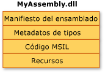
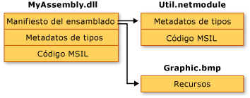

# Contenido de los ensambladosAssembly Contents
En general, un ensamblado estático está formado por cuatro elementos:In general, a static assembly can consist of four elements:  
  
-   El [manifiesto del ensamblado](../../../docs/framework/app-domains/assembly-manifest.md), que contiene los metadatos del ensamblado.The [assembly manifest](../../../docs/framework/app-domains/assembly-manifest.md), which contains assembly metadata.  
  
-   Los metadatos de tipos.Type metadata.  
  
-   El código de lenguaje intermedio de Microsoft (MSIL) que implementa los tipos.Microsoft intermediate language (MSIL) code that implements the types.  
  
-   Un conjunto de recursos.A set of resources.  
  
 El manifiesto del ensamblado es el único elemento obligatorio, pero se necesitan o bien los tipos o bien los recursos para proporcionar al ensamblado una funcionalidad significativa.Only the assembly manifest is required, but either types or resources are needed to give the assembly any meaningful functionality.  
  
 Estos elementos se pueden agrupar en un ensamblado de varias formas.There are several ways to group these elements in an assembly. Se puede agrupar todos los elementos en un solo archivo físico, como se observa en la ilustración siguiente.You can group all elements in a single physical file, which is shown in the following illustration.  
  
   
Ensamblado de único archivoSingle-file assembly  
  
 Alternativamente, los elementos de un ensamblado se pueden incluir en varios archivos.Alternatively, the elements of an assembly can be contained in several files. Estos archivos pueden ser módulos de código compilado (.netmodule), de recursos (como archivos .bmp o .jpg) u otros archivos necesarios para la aplicación.These files can be modules of compiled code (.netmodule), resources (such as .bmp or .jpg files), or other files required by the application. Puede crear un ensamblado de múltiples archivos para combinar módulos escritos en idiomas diferentes y optimizar la descarga de una aplicación al colocar los tipos que rara vez se utilizan en un módulo que se descargue sólo cuando sea necesario.Create a multifile assembly when you want to combine modules written in different languages and to optimize downloading an application by putting seldom used types in a module that is downloaded only when needed.  
  
 En la siguiente ilustración, el programador de una aplicación hipotética ha decidido separar el código de alguna utilidad en un módulo diferente y mantener un archivo de recursos grande (en este caso, una imagen .bmp) en su archivo original.In the following illustration, the developer of a hypothetical application has chosen to separate some utility code into a different module and to keep a large resource file (in this case a .bmp image) in its original file. .NET Framework descarga un archivo sólo cuando se hace referencia al mismo, por lo que la descarga de código se ve optimizada cuando se mantiene el código al que no se hace referencia frecuentemente en un archivo aparte de la aplicación.The .NET Framework downloads a file only when it is referenced; keeping infrequently referenced code in a separate file from the application optimizes code download.  
  
   
Ensamblado de múltiples archivosMultifile assembly  
  
> [!NOTE]
>  El sistema de archivos no vincula físicamente los archivos que forman un ensamblado de múltiples archivos.The files that make up a multifile assembly are not physically linked by the file system. En su lugar, se vinculan a través del manifiesto del ensamblado y Common Language Runtime los administra como una unidad.Rather, they are linked through the assembly manifest and the common language runtime manages them as a unit.  
  
 En esta ilustración, los tres archivos pertenecen a un ensamblado, como se describe en el manifiesto del ensamblado contenido en MyAssembly.dll.In this illustration, all three files belong to an assembly, as described in the assembly manifest contained in MyAssembly.dll. Para el sistema de archivos, se trata de tres archivos diferentes.To the file system, they are three separate files. Tenga en cuenta que el archivo Util.netmodule se compiló como módulo porque no contiene información de ensamblado.Note that the file Util.netmodule was compiled as a module because it contains no assembly information. Cuando se creó el ensamblado, el manifiesto del ensamblado se agregó a MyAssembly.dll, lo que indica su relación con Util.netmodule y Graphic.bmp.When the assembly was created, the assembly manifest was added to MyAssembly.dll, indicating its relationship with Util.netmodule and Graphic.bmp.  
  
 Actualmente, al diseñar el código fuente, se toman decisiones explícitas sobre cómo repartir la funcionalidad de una aplicación entre uno o más archivos.As you currently design your source code, you make explicit decisions about how to partition the functionality of your application into one or more files. Al diseñar el código de .NET Framework, tomará decisiones similares sobre cómo dividir la funcionalidad en uno o más ensamblados.When designing .NET Framework code, you will make similar decisions about how to partition the functionality into one or more assemblies.  
  
## Vea tambiénSee Also  
- [Ensamblados en Common Language RuntimeAssemblies in the Common Language Runtime](../../../docs/framework/app-domains/assemblies-in-the-common-language-runtime.md)  
- [Manifiesto del ensambladoAssembly Manifest](../../../docs/framework/app-domains/assembly-manifest.md)  
- [Consideraciones de seguridad sobre ensambladosAssembly Security Considerations](../../../docs/framework/app-domains/assembly-security-considerations.md)
