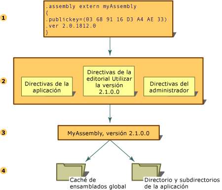

# Versiones de los ensambladosAssembly Versioning
La creación de versiones de ensamblados mediante Common Language Runtime se realiza en el nivel de ensamblado.All versioning of assemblies that use the common language runtime is done at the assembly level. La versión específica de un ensamblado y las versiones de los ensamblados dependientes se guardan en el manifiesto del ensamblado.The specific version of an assembly and the versions of dependent assemblies are recorded in the assembly's manifest. La directiva de versiones predeterminada para el motor en tiempo de ejecución es que las aplicaciones se ejecuten sólo en las versiones con las que se compilaron y comprobaron, a menos que se reemplace con una directiva de versiones explícita en los archivos de configuración (el archivo de configuración de la aplicación, el archivo de directivas de la compañía de software y el archivo de configuración del administrador del equipo).The default version policy for the runtime is that applications run only with the versions they were built and tested with, unless overridden by explicit version policy in configuration files (the application configuration file, the publisher policy file, and the computer's administrator configuration file).  
  
> [!NOTE]
>  La creación de versiones sólo se realiza en ensamblados con nombres seguros.Versioning is done only on assemblies with strong names.  
  
 El motor en tiempo de ejecución ejecuta varios pasos para resolver la solicitud de enlace de un ensamblado:The runtime performs several steps to resolve an assembly binding request:  
  
1.  Comprueba la referencia del ensamblado original para determinar la versión del ensamblado que se va a enlazar.Checks the original assembly reference to determine the version of the assembly to be bound.  
  
2.  Comprueba todos los archivos de configuración correspondientes para aplicar la directiva de versiones.Checks for all applicable configuration files to apply version policy.  
  
3.  Determina el ensamblado correcto a partir de la referencia del ensamblado original y las posibles redirecciones especificadas en los archivos de configuración, y determina la versión que debería enlazarse al ensamblado que realiza la llamada.Determines the correct assembly from the original assembly reference and any redirection specified in the configuration files, and determines the version that should be bound to the calling assembly.  
  
4.  Comprueba la caché global de ensamblados, el código base especificado en los archivos de configuración y, después, el directorio y los subdirectorios de la aplicación mediante las reglas de búsqueda que se describen en [How the Runtime Locates Assemblies](../../../docs/framework/deployment/how-the-runtime-locates-assemblies.md) (Cómo el tiempo de ejecución ubica ensamblados).Checks the global assembly cache, codebases specified in configuration files, and then checks the application's directory and subdirectories using the probing rules explained in [How the Runtime Locates Assemblies](../../../docs/framework/deployment/how-the-runtime-locates-assemblies.md).  
  
 La ilustración siguiente muestra estos pasos.The following illustration shows these steps.  
  
   
Resolver la solicitud de enlace de un ensambladoResolving an assembly binding request  
  
 Para obtener más información sobre cómo configurar aplicaciones, vea [Configuring Apps](../../../docs/framework/configure-apps/index.md) (Configurar aplicaciones).For more information about configuring applications, see [Configuring Apps](../../../docs/framework/configure-apps/index.md). Para obtener más información sobre la directiva de enlace, vea [How the Runtime Locates Assemblies](../../../docs/framework/deployment/how-the-runtime-locates-assemblies.md) (Cómo el tiempo de ejecución ubica ensamblados).For more information about binding policy, see [How the Runtime Locates Assemblies](../../../docs/framework/deployment/how-the-runtime-locates-assemblies.md).  
  
## Información de versiónVersion Information  
 Cada ensamblado tiene dos maneras distintas de expresar la información de versión:Each assembly has two distinct ways of expressing version information:  
  
-   El número de versión del ensamblado, que, junto con el nombre del ensamblado y la información de referencia cultural, es parte de la identidad del ensamblado.The assembly's version number, which, together with the assembly name and culture information, is part of the assembly's identity. El motor en tiempo de ejecución utiliza este número para imponer la directiva de versiones y juega un papel importante en el proceso de resolución de tipos en tiempo de ejecución.This number is used by the runtime to enforce version policy and plays a key part in the type resolution process at run time.  
  
-   Una versión informativa, que es una cadena que representa información adicional sobre la versión que se incluye sólo con carácter informativo.An informational version, which is a string that represents additional version information included for informational purposes only.  
  
### Número de versión del ensambladoAssembly Version Number  
 Cada ensamblado tiene un número de versión como parte de su identidad.Each assembly has a version number as part of its identity. Por tanto, el motor en tiempo de ejecución considera que son totalmente diferentes dos ensamblados que se diferencien por el número de versión.As such, two assemblies that differ by version number are considered by the runtime to be completely different assemblies. El número de versión se representa físicamente como una cadena de cuatro partes con el formato siguiente:This version number is physically represented as a four-part string with the following format:  
  
 \<*versión principal*>.\<*versión secundaria*>.\<*número de compilación*>.\<*revisión*>\<*major version*>.\<*minor version*>.\<*build number*>.\<*revision*>  
  
 Por ejemplo, la versión 1.5.1254.0 indica que 1 es la versión principal, 5 es la versión secundaria, 1254 es el número de compilación y 0 es el número de revisión.For example, version 1.5.1254.0 indicates 1 as the major version, 5 as the minor version, 1254 as the build number, and 0 as the revision number.  
  
 El número de versión se almacena en el manifiesto del ensamblado junto con otra información de identidad, incluidos el nombre del ensamblado y la clave pública, así como información sobre las relaciones e identidades de otros ensamblados relacionados con la aplicación.The version number is stored in the assembly manifest along with other identity information, including the assembly name and public key, as well as information on relationships and identities of other assemblies connected with the application.  
  
 Cuando se compila un ensamblado, la herramienta de programación registra la información de dependencia de cada ensamblado al que se haga referencia en el manifiesto.When an assembly is built, the development tool records dependency information for each assembly that is referenced in the assembly manifest. El motor en tiempo de ejecución utiliza estos números de versión, junto con la información de configuración establecida por un administrador, una aplicación o una compañía de software, para cargar la versión correcta de un ensamblado al que se hace referencia.The runtime uses these version numbers, in conjunction with configuration information set by an administrator, an application, or a publisher, to load the proper version of a referenced assembly.  
  
 El motor en tiempo de ejecución distingue los ensamblados normales de los ensamblados con nombres seguros para crear las versiones.The runtime distinguishes between regular and strong-named assemblies for the purposes of versioning. La comprobación de versión sólo se produce para los ensamblados con nombres seguros.Version checking only occurs with strong-named assemblies.  
  
 Para obtener información sobre cómo especificar directivas de enlace de versión, vea [Configuring Apps](../../../docs/framework/configure-apps/index.md) (Configurar aplicaciones).For information about specifying version binding policies, see [Configuring Apps](../../../docs/framework/configure-apps/index.md). Para obtener información sobre cómo el tiempo de ejecución usa la información de versión para buscar un ensamblado determinado, vea [How the Runtime Locates Assemblies](../../../docs/framework/deployment/how-the-runtime-locates-assemblies.md) (Cómo el tiempo de ejecución ubica los ensamblados).For information about how the runtime uses version information to find a particular assembly, see [How the Runtime Locates Assemblies](../../../docs/framework/deployment/how-the-runtime-locates-assemblies.md).  
  
### Versión informativa del ensambladoAssembly Informational Version  
 La versión informativa es una cadena que asocia a un ensamblado información adicional sobre la versión sólo con carácter informativo; esta información no se utiliza en tiempo de ejecución.The informational version is a string that attaches additional version information to an assembly for informational purposes only; this information is not used at run time. La versión informativa basada en texto corresponde a la literatura de marketing del producto, al paquete o al nombre del producto, y no la utiliza el motor en tiempo de ejecución.The text-based informational version corresponds to the product's marketing literature, packaging, or product name and is not used by the runtime. Por ejemplo, una versión informativa podría ser "Common Language Runtime version 1.0" o "NET Control SP 2".For example, an informational version could be "Common Language Runtime version 1.0" or "NET Control SP 2". En la ficha Versión del cuadro de diálogo de propiedades del archivo en Microsoft Windows, esta información aparece en el elemento "Product Version".On the Version tab of the file properties dialog in Microsoft Windows, this information appears in the item "Product Version".  
  
> [!NOTE]
>  Aunque es posible especificar cualquier texto, aparecerá un mensaje de advertencia durante la compilación si la cadena no tiene el formato utilizado por el número de versión del ensamblado o si, teniendo ese formato, contiene comodines.Although you can specify any text, a warning message appears on compilation if the string is not in the format used by the assembly version number, or if it is in that format but contains wildcards. Esta advertencia es inofensiva.This warning is harmless.  
  
 La versión informativa se representa utilizando el atributo personalizado <xref:System.Reflection.AssemblyInformationalVersionAttribute?displayProperty=nameWithType>.The informational version is represented using the custom attribute <xref:System.Reflection.AssemblyInformationalVersionAttribute?displayProperty=nameWithType>. Para obtener más información sobre el atributo de versión informativa, vea [Setting Assembly Attributes](../../../docs/framework/app-domains/set-assembly-attributes.md) (Establecer atributos de ensamblado).For more information about the informational version attribute, see [Setting Assembly Attributes](../../../docs/framework/app-domains/set-assembly-attributes.md).  
  
## Vea tambiénSee Also  
- [Cómo el motor en tiempo de ejecución ubica ensambladosHow the Runtime Locates Assemblies](../../../docs/framework/deployment/how-the-runtime-locates-assemblies.md)  
- [Configurar aplicacionesConfiguring Apps](../../../docs/framework/configure-apps/index.md)  
- [Configurar atributos de ensambladosSetting Assembly Attributes](../../../docs/framework/app-domains/set-assembly-attributes.md)  
- [Ensamblados en Common Language RuntimeAssemblies in the Common Language Runtime](../../../docs/framework/app-domains/assemblies-in-the-common-language-runtime.md)
