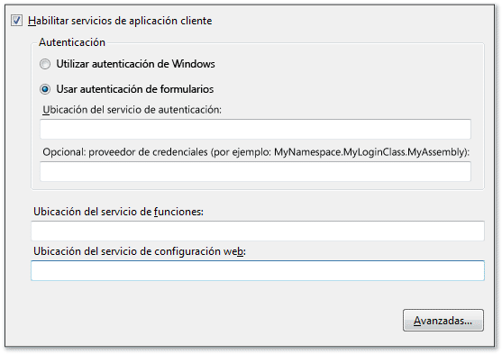
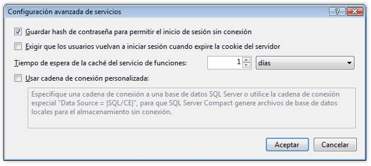

# <a name="how-to-configure-client-application-services"></a>Cómo: Configurar servicios de aplicaciones cliente
En este tema se describe cómo utilizar el **Diseñador de proyectos** de [!INCLUDE[vsprvs](../../../includes/vsprvs-md.md)] para habilitar y configurar servicios de aplicaciones cliente. Los servicios de aplicaciones cliente se pueden usar para validar a los usuarios y recuperar configuraciones y roles de usuario de un servicio de aplicaciones [!INCLUDE[ajax_current_short](../../../includes/ajax-current-short-md.md)] existente. Después de la configuración, se puede acceder a los servicios habilitados en el código de la aplicación, tal como se describe en [Información general sobre los servicios de aplicaciones cliente](../../../docs/framework/common-client-technologies/client-application-services-overview.md). Para más información sobre los servicios de la aplicación de [!INCLUDE[ajax_current_short](../../../includes/ajax-current-short-md.md)], consulte [Información general sobre los servicios de aplicación ASP.NET](http://msdn.microsoft.com/library/1162e529-0d70-44b2-b3ab-83e60c695013).  
  
 Puede habilitar y configurar servicios de aplicaciones cliente en la página **Servicios** del **Diseñador de proyectos**. La página **Servicios** actualiza los valores en el archivo App.config del proyecto. Para acceder al **Diseñador de proyectos**, utilice el comando **Propiedades** en el menú **Proyecto**. Para obtener más información sobre la página **Servicios**, consulte [Página Servicios, Diseñador de proyectos](https://msdn.microsoft.com/library/bb398109).  
  
 El siguiente procedimiento describe cómo realizar la configuración básica de servicios de aplicaciones cliente. Las opciones de configuración avanzada se describen en secciones posteriores.  
  
### <a name="to-configure-client-application-services"></a>Para configurar los servicios de aplicaciones cliente  
  
1.  En el **Explorador de soluciones**, seleccione un nodo de proyecto y, después, en el menú **Proyecto**, haga clic en **Propiedades**.  
  
     Aparece el **Diseñador de proyectos**.  
  
2.  Haga clic en la pestaña **Servicios**. Aparece la página **Servicios**, como se muestra en la ilustración siguiente.  
  
       
  
3.  En la página **Servicios**, seleccione **Habilitar servicios de aplicación cliente**.  
  
    > [!NOTE]
    >  Los servicios de aplicaciones cliente requieren la versión completa de .NET Framework y no son compatibles con .NET Framework Client Profile. Si la casilla **Habilitar servicios de aplicación cliente** está desactivada, compruebe que **Marco de trabajo de destino** esté establecido en .NET Framework 3.5 o posterior. Para ver el valor de **Marco de trabajo de destino** en C#, abra el Diseñador de proyectos y haga clic en la página **Aplicación**. Para ver el valor de **Marco de trabajo de destino** en Visual Basic, abra el Diseñador de proyectos, haga clic en la página **Compilar** y luego en **Opciones de compilación avanzadas**.  
  
4.  Seleccione **Usar autenticación de formularios** si planea proporcionar sus propios controles o el cuadro de diálogo de inicio de sesión, o seleccione **Usar autenticación de Windows** para utilizar la identidad proporcionada por el sistema operativo. Para más información, consulte [Información general sobre los servicios de aplicaciones cliente](../../../docs/framework/common-client-technologies/client-application-services-overview.md).  
  
    > [!NOTE]
    >  Si selecciona **Usar autenticación de Windows**, los servicios de aplicaciones cliente se configurarán automáticamente para utilizar una base de datos de SQL Server Compact. Esto se indica en el cuadro de diálogo **Configuración avanzada de servicios** tal como se describe en la sección siguiente. Si selecciona **Usar autenticación de formularios**, la opción **Usar cadena de conexión personalizada** no se desactivará automáticamente. Esto podría producir errores si la base de datos de [!INCLUDE[ssEW](../../../includes/ssew-md.md)] ya se ha generado para su uso con la autenticación de Windows. Para corregir estos errores, desactive la opción **Usar cadena de conexión personalizada** en el cuadro de diálogo **Configuración avanzada de servicios**.  
  
5.  Si ha seleccionado **Usar autenticación de formularios**, en el cuadro **Ubicación del servicio de autenticación**, especifique la dirección URL del host de servicio, sin incluir el nombre de archivo. El diseñador anexará automáticamente el nombre de archivo estándar (Authentication_JSON_AppService.axd) cuando escriba el valor en el archivo de configuración.  
  
6.  Si ha seleccionado **Usar autenticación de formularios**, tiene la opción de especificar un valor en el cuadro **Proveedor de credenciales**. El proveedor de credenciales debe implementar la interfaz <xref:System.Web.ClientServices.Providers.IClientFormsAuthenticationCredentialsProvider>. Mediante el uso de un proveedor de credenciales, puede separar la interfaz de usuario de inicio de sesión del otro código de aplicación. Esto permite crear un único cuadro de diálogo de inicio de sesión para usarlo en varias aplicaciones. Para más información, vea [Cómo: Implementar el inicio de sesión de usuarios con servicios de aplicaciones cliente](../../../docs/framework/common-client-technologies/how-to-implement-user-login-with-client-application-services.md).  
  
     Si especifica un proveedor de credenciales, debe hacerlo como un nombre de tipo calificado con el ensamblado. Para obtener más información, consulte <xref:System.Type.AssemblyQualifiedName%2A?displayProperty=nameWithType> y [Nombres del ensamblado](../../../docs/framework/app-domains/assembly-names.md). En su forma más simple, un nombre de tipo calificado con el ensamblado es similar al ejemplo siguiente:  
  
    ```  
    MyNamespace.MyLoginClass, MyAssembly  
    ```  
  
7.  En los cuadros de texto **Ubicación del servicio de roles** y **Ubicación del servicio de configuración web**, especifique la ubicación de cada servicio, sin incluir el nombre de archivo. El diseñador anexará automáticamente los nombres de archivo estándar (Role_JSON_AppService.axd y Profile_JSON_AppService.axd) cuando escriba el valor en el archivo de configuración.  
  
8.  Si lo desea, haga clic en **Avanzadas** para modificar la configuración avanzada, como el comportamiento de almacenamiento en caché local. Para obtener más información, vea el procedimiento siguiente.  
  
## <a name="advanced-configuration"></a>Configuración avanzada  
 Los procedimientos siguientes describen cómo configurar los servicios de aplicaciones cliente para escenarios menos comunes. Por ejemplo, puede utilizar estas opciones de configuración para aplicaciones implementadas en ubicaciones públicas, o utilizar una base de datos de SQL Server Compact cifrada como la caché de datos local.  
  
#### <a name="to-configure-advanced-settings-for-client-application-services"></a>Para configurar las opciones avanzadas de los servicios de aplicaciones cliente  
  
1.  En la página **Servicios** del **Diseñador de proyectos**, haga clic en **Avanzadas**.  
  
     Aparece el cuadro de diálogo **Configuración avanzada de servicios**, como se muestra en la ilustración siguiente. Para más información sobre este cuadro de diálogo, vea [Configuración avanzada de servicios (Cuadro de diálogo)](/visualstudio/ide/reference/advanced-settings-for-services-dialog-box).  
  
       
  
2.  Active o desactive **Guardar hash de contraseña para permitir el inicio de sesión sin conexión**. Cuando se selecciona esta opción, un formulario cifrado de la contraseña del usuario se almacenará en caché localmente. Esto es útil si implementa el modo sin conexión de la aplicación. Con esta opción seleccionada, puede validar a los usuarios incluso cuando la propiedad <xref:System.Web.ClientServices.ConnectivityStatus.IsOffline%2A> se haya establecido en `true`.  
  
3.  Active o desactive **Exigir que los usuarios vuelvan a iniciar sesión cuando expire la cookie del servidor**. La cookie de autenticación se configura en el servicio remoto e indica cuánto tiempo permanecerá activo el inicio de sesión de un usuario. Para más información sobre cómo configurar la cookie, consulte el atributo `timeout` en [Elemento forms para autenticación (esquema de configuración de ASP.NET)](http://msdn.microsoft.com/library/8163b8b5-ea6c-46c8-b5a9-c4c3de31c0b3).  
  
     Si selecciona esta opción y se intenta acceder a los roles remotos o a los servicios de configuración web después de que la cookie de autenticación haya expirado, se producirá una <xref:System.Net.WebException>. Puede controlar esta excepción y mostrar un cuadro de diálogo de inicio de sesión para volver a validar a los usuarios. Para obtener un ejemplo de este comportamiento, vea [Tutorial: Usar servicios de aplicaciones cliente](../../../docs/framework/common-client-technologies/walkthrough-using-client-application-services.md). Esta opción es útil en aplicaciones implementadas en ubicaciones públicas, ya que garantiza que los usuarios que dejan la aplicación en ejecución después de usarla no permanecen autenticados indefinidamente.  
  
     Si desactiva esta opción e intenta acceder a los servicios remotos después de que la cookie de autenticación haya expirado, los usuarios se volverán a validar automáticamente.  
  
4.  Especifique un valor para **Tiempo de espera de caché del servicio de roles**. Establezca este intervalo de tiempo en un valor pequeño si los roles se actualizan con frecuencia o en un valor mayor si se actualizan con poca frecuencia. Si implementa el modo sin conexión, establezca el intervalo de tiempo en un valor grande para evitar que la información del rol expire mientras la aplicación está sin conexión.  
  
     Cuando se llama al método <xref:System.Web.Security.RolePrincipal.IsInRole%2A>, el proveedor de roles accede a los valores de rol almacenados en caché o al servicio de roles. Para restablecer la caché y forzar este método a fin de acceder al servicio remoto mediante programación, llame al método <xref:System.Web.ClientServices.Providers.ClientRoleProvider.ResetCache%2A>.  
  
5.  Active o desactive **Usar cadena de conexión personalizada**. Para obtener más información, vea el procedimiento siguiente.  
  
#### <a name="to-configure-client-application-services-to-use-a-database-for-the-local-cache"></a>Para configurar los servicios de aplicaciones cliente y usar una base de datos en la memoria caché local  
  
1.  En la página **Servicios** del **Diseñador de proyectos**, haga clic en **Avanzadas**.  
  
     Aparece el cuadro de diálogo **Configuración avanzada de servicios**.  
  
2.  Seleccione **Usar cadena de conexión personalizada**.  
  
     El valor predeterminado de `Data Source = |SQL/CE|` aparece en el cuadro de texto.  
  
3.  Para generar y utilizar una base de datos de SQL Server Compact, mantenga el valor de cadena de conexión predeterminado. [!INCLUDE[vsprvs](../../../includes/vsprvs-md.md)] generará un archivo de base de datos y lo colocará en el directorio indicado por la propiedad <xref:System.Windows.Forms.Application.UserAppDataPath%2A?displayProperty=nameWithType>.  
  
4.  Para generar y utilizar una base de datos cifrada de [!INCLUDE[ssEW](../../../includes/ssew-md.md)], agregue los valores `password` y `encrypt database` en la cadena de conexión como se muestra en el ejemplo siguiente.  
  
    > [!NOTE]
    >  Asegúrese de especificar una contraseña segura, ya que no podrá cambiarla una vez generada la base de datos.  
  
    ```  
    Data Source = |SQL/CE|;password=<password>;encrypt database=true  
    ```  
  
5.  Para utilizar su propia base de datos de [!INCLUDE[ssNoVersion](../../../includes/ssnoversion-md.md)], especifique una cadena de conexión propia. Para obtener información sobre los formatos válidos de cadena de conexión, consulte la documentación de [!INCLUDE[ssNoVersion](../../../includes/ssnoversion-md.md)]. Esta base de datos no se genera automáticamente. La cadena de conexión debe hacer referencia a una base de datos existente que se puede crear mediante las siguientes instrucciones SQL.  
  
    ```  
    CREATE TABLE ApplicationProperties (PropertyName nvarchar(256),  
        PropertyValue nvarchar(256))  
    CREATE TABLE UserProperties (PropertyName nvarchar(256),  
        PropertyValue nvarchar(256))  
    CREATE TABLE Roles (UserName nvarchar(256),   
        RoleName nvarchar(256))  
    CREATE TABLE Settings (PropertyName nvarchar(256),   
        PropertyStoredAs nvarchar(1), PropertyValue nvarchar(2048))  
    ```  
  
## <a name="using-custom-providers"></a>Usar proveedores personalizados  
 De manera predeterminada, la característica de servicios de aplicaciones cliente usa los proveedores del espacio de nombres <xref:System.Web.ClientServices.Providers?displayProperty=nameWithType>. Al configurar la aplicación mediante la página **Servicios** del **Diseñador de proyectos**, las referencias a estos proveedores se agregan al archivo App.config. Estos proveedores predeterminados acceden a los proveedores correspondientes en el servidor. Los servicios web a menudo se configuran para acceder a los datos de usuario a través de proveedores como <xref:System.Web.Security.SqlMembershipProvider> y <xref:System.Web.Security.SqlRoleProvider>.  
  
 Si desea utilizar proveedores de servicios personalizados, lo normal es cambiar los proveedores en el servidor para que afecten a todas las aplicaciones cliente que acceden al servidor. Sin embargo, tiene la opción de utilizar proveedores no predeterminados en el cliente. Puede especificar los proveedores personalizados de autenticación o roles en el archivo App.config de su proyecto, como se muestra en el siguiente procedimiento. Para información sobre cómo crear una autenticación personalizada y proveedores de roles, vea [Implementar un proveedor de pertenencia](http://msdn.microsoft.com/library/d8658b8e-c962-4f64-95e1-4acce35e4582) e [Implementar un proveedor de roles](http://msdn.microsoft.com/library/851671ce-bf9b-43f2-aba4-bc9d28b11c7d). También puede usar un proveedor de configuración personalizado mediante la modificación de la clase `Settings` de su proyecto (a la que se accede como `Properties.Settings.Default` en C# y `My.Settings` en [!INCLUDE[vbprvb](../../../includes/vbprvb-md.md)]). Para más información, consulte [Arquitectura de configuración de la aplicación](../../../docs/framework/winforms/advanced/application-settings-architecture.md).  
  
#### <a name="to-configure-client-application-services-to-use-non-default-providers"></a>Para configurar los servicios de aplicaciones cliente y utilizar proveedores no predeterminados  
  
1.  Para usar un proveedor no predeterminado de servicios de roles o autenticación, complete primero todas las demás opciones de configuración mediante la página **Servicios**.  
  
2.  Cierre el **Diseñador de proyectos**. Esto es necesario porque la página **Servicios** actualizará automáticamente el archivo App.config aun cuando no se modifique su configuración. Si modifica manualmente el archivo App.config, tal como se describe en este procedimiento, y, después, regresa a la página **Servicios**, se restablecerán las modificaciones.  
  
3.  En el **Explorador de soluciones**, haga doble clic en App.config.  
  
     El archivo de configuración de la aplicación se abre en el editor de texto.  
  
4.  Busque el elemento `<providers>` en el elemento `<membership>` o `<roleManager>`. Estos elementos son elementos secundarios de `<system.web>`. El elemento `<membership>` se usa para especificar los proveedores de autenticación, mientras que el elemento `<roleManager>` se emplea para especificar los proveedores de roles.  
  
5.  Cree un elemento `<add>` como elemento secundario de `<providers>`. Especifique los atributos `name` y `type` tal como se muestra en el ejemplo siguiente. El valor del atributo `type` debe ser un nombre de tipo calificado con el ensamblado. Para obtener más información, consulte <xref:System.Type.AssemblyQualifiedName%2A?displayProperty=nameWithType> y [Nombres del ensamblado](../../../docs/framework/app-domains/assembly-names.md).  
  
    ```xml  
    <add name="MyCustomRoleProvider" type="MyNamespace.MyRoleProvider, MyAssembly" />  
    ```  
  
6.  Modifique el atributo `defaultProvider` del elemento `<membership>` o `<roleManager>` para especificar el valor del nombre del elemento `<add>` que agregó en el paso anterior.  
  
    ```xml  
    <roleManager enabled="true" defaultProvider="MyCustomRoleProvider">  
    ```  
  
## <a name="see-also"></a>Vea también  
 [Servicios de aplicación cliente](../../../docs/framework/common-client-technologies/client-application-services.md)  
 [Información general sobre los servicios de aplicaciones cliente](../../../docs/framework/common-client-technologies/client-application-services-overview.md)  
 [Página Servicios, Diseñador de proyectos](https://msdn.microsoft.com/library/bb398109)  
 [Cuadro de diálogo Configuración avanzada de servicios](/visualstudio/ide/reference/advanced-settings-for-services-dialog-box)  
 [Cómo: Implementar el inicio de sesión de usuarios con servicios de aplicaciones cliente](../../../docs/framework/common-client-technologies/how-to-implement-user-login-with-client-application-services.md)  
 [Tutorial: Usar servicios de aplicaciones cliente](../../../docs/framework/common-client-technologies/walkthrough-using-client-application-services.md)  
 [Implementar un proveedor de pertenencia](http://msdn.microsoft.com/library/d8658b8e-c962-4f64-95e1-4acce35e4582)  
 [Implementar un proveedor de roles](http://msdn.microsoft.com/library/851671ce-bf9b-43f2-aba4-bc9d28b11c7d)  
 [Arquitectura de configuración de la aplicación](../../../docs/framework/winforms/advanced/application-settings-architecture.md)  
 [Crear y configurar la base de datos de servicios de la aplicación para SQL Server](http://msdn.microsoft.com/library/ab894e83-7e2f-4af8-a116-b1bff8f815b2)
