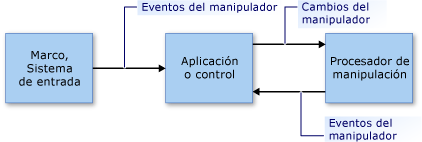

# Información general sobre manipulaciones e inerciaManipulations and Inertia Overview
Las *manipulaciones* permiten a los usuarios mover, girar y cambiar de tamaño los elementos de la interfaz de usuario (UI) con *manipuladores*.*Manipulations* enable users to move, rotate, and resize user interface (UI) elements by using *manipulators*. Un manipulador representa un mouse o (en los escenarios táctiles) un lápiz o un dedo.A manipulator represents a mouse or (in a touch-enabled scenario) a stylus or a finger.  
  
 La *inercia* emula el comportamiento real de los elementos de la UI que están en movimiento, ya que simula fuerzas de fricción en los elementos.*Inertia* emulates real-world behavior for UI elements that are in motion by simulating friction forces on the elements. Esto permite que el movimiento (lineal y angular) de los elementos se ralentice gradualmente antes de detenerse.This enables elements to gradually slow their movement (both linear and angular) before coming to a stop. Este artículo proporciona una introducción a las manipulaciones y la inercia en .NET Framework.This article provides an introduction to manipulations and inertia for the .NET Framework.  
  
## ManipulacionesManipulations  
 Cada manipulación trata una colección de manipuladores como un objeto compuesto.A manipulation treats a collection of manipulators as a composite object. La aplicación puede realizar el seguimiento de los cambios en el objeto compuesto en lugar de los componentes individuales.An application can track the changes to the composite object instead of the individual components.  
  
 Observe la imagen de la siguiente ilustración.Consider the image in the following illustration. El usuario puede utilizar dos manipuladores para mover, girar y escalar la imagen.A user can use two manipulators to move, rotate, and scale the image. Los cambios realizados en cada manipulador se interpretan junto con los demás manipuladores.The changes to each manipulator are interpreted together with the other manipulators.  
  
 Por ejemplo, si tiene dos manipuladores (1 y 2) en la imagen y mueve el manipulador 1 en dirección +Y (hacia abajo), el cambio que se realice en la imagen dependerá de lo que le ocurra al manipulador 2.For example, if you have two manipulators (1 and 2) on the image, and you move manipulator 1 in a +Y direction (down), the change to the image depends on what happens to manipulator 2. Si el manipulador 2 también se mueve en dirección +Y (hacia abajo), la imagen se moverá, simplemente, en la dirección +Y.If manipulator 2 also moves in the +Y direction (down), the image simply moves in the +Y direction. Pero si el manipulador 2 no cambia, o si se mueve en dirección -Y (hacia arriba), la imagen se reducirá o se girará.But if manipulator 2 does not change, or it moves in a -Y direction (up), the image is made smaller or rotated.  
  
   
  
 Imagen manipulada por dos manipuladoresAn image being manipulated by two manipulators  
  
 El procesamiento de la manipulación proporciona un marco que supervisa un subconjunto de manipuladores y los interpreta como si actuaran conjuntamente, en lugar de por separado.Manipulation processing provides a framework that monitors a subset of manipulators and interprets them as if they are acting together, instead of independently. Puede crear varios objetos del procesador de manipulación de forma simultánea, uno por cada elemento de la UI que vaya a manipularse en una aplicación.You can create several manipulation processor objects simultaneously, one for each UI element to be manipulated in an application. Al procesador de manipulación se le informa de qué dispositivos de entrada debe observar y este informa de las manipulaciones a través de [eventos de .NET](http://msdn.microsoft.com/library/17sde2xt.aspx).A manipulation processor is informed of which input devices to observe and it reports manipulations through [.NET events](http://msdn.microsoft.com/library/17sde2xt.aspx).  
  
 El procesador de manipulación no tiene información sobre el elemento concreto que se está manipulando.A manipulation processor does not have information about the particular element that is being manipulated. La aplicación, por su cuenta, aplica los cambios a un elemento específico de la aplicación.An application separately applies the changes to an application-specific element. Por ejemplo, una aplicación aplica transformaciones a una imagen o vuelve a dibujarla para mostrarla en su nueva ubicación o con otro tamaño u otra orientación.For example, an application applies transformations to an image or redraws it to display it at its new location or with a new size or orientation.  
  
 Las manipulaciones están diseñadas para [transformaciones afines](http://msdn.microsoft.com/library/ms533810\(VS.85\).aspx) bidimensionales (2D).Manipulations are designed for two-dimensional (2-D) [affine transformations](http://msdn.microsoft.com/library/ms533810\(VS.85\).aspx). Estas transformaciones incluyen trasladar, girar y escalar.These transformations include translate, rotate, and scale.  
  
### Partes de una manipulaciónParts of a Manipulation  
 Una manipulación es una colección de objetos <xref:System.Windows.Input.Manipulations.Manipulator2D>.A manipulation is a collection of <xref:System.Windows.Input.Manipulations.Manipulator2D> objects. La manipulación agregada se representa con un punto de origen y una elipse.This aggregate manipulation is represented by an origin point and an ellipse. El punto de origen es la posición media de todos los manipuladores que están manipulando un elemento.The origin point is the average position of all manipulators that are manipulating an element. La elipse tiene un radio que es la distancia media entre el origen y cada uno de los objetos <xref:System.Windows.Input.Manipulations.Manipulator2D>.The ellipse has a radius that is the average distance from the origin to each of the <xref:System.Windows.Input.Manipulations.Manipulator2D> objects.  
  
   
  
 Dos manipuladores (1 y 2), un origen y una elipse especifican una manipulaciónTwo manipulators (1 and 2), an origin, and an ellipse specify a manipulation  
  
 A medida que se agregan, se mueven o se quitan manipuladores de un elemento de la UI, la aplicación actualiza el objeto <xref:System.Windows.Input.Manipulations.ManipulationProcessor2D> llamando al método <xref:System.Windows.Input.Manipulations.ManipulationProcessor2D.ProcessManipulators%2A>.As manipulators are added, moved, or removed for a UI element, an application updates the <xref:System.Windows.Input.Manipulations.ManipulationProcessor2D> object by calling the <xref:System.Windows.Input.Manipulations.ManipulationProcessor2D.ProcessManipulators%2A> method. Cuando se inicia la manipulación por primera vez, se genera el evento <xref:System.Windows.Input.Manipulations.ManipulationProcessor2D.Started>.When the manipulation first begins, the <xref:System.Windows.Input.Manipulations.ManipulationProcessor2D.Started> event is raised.  
  
> [!NOTE]
>  El procesamiento de la manipulación es más eficiente cuando se utiliza en un entorno de actualización basado en el marco.Manipulation processing is more efficient when used in a frame-based update environment. Si se usa el procesamiento de la manipulación en una aplicación de Microsoft XNA, esto no es un problema, dado que el marco XNA proporciona actualizaciones basadas en el marco con el método [Game.Update](http://msdn.microsoft.com/library/microsoft.xna.framework.game.update.aspx).When using manipulation processing in a Microsoft XNA application, this is not a concern because the XNA framework provides frame-based updates using the [Game.Update](http://msdn.microsoft.com/library/microsoft.xna.framework.game.update.aspx) method. En otros entornos (como WinForms), puede que tenga que proporcionar su propia lógica basada en el marco para recopilar las manipulaciones y enviarlas periódicamente al método <xref:System.Windows.Input.Manipulations.ManipulationProcessor2D.ProcessManipulators%2A> en forma de lote.In another environment (such as WinForms), you might need to provide your own frame-based logic to collect manipulations and periodically send them to the <xref:System.Windows.Input.Manipulations.ManipulationProcessor2D.ProcessManipulators%2A> method as a batch.  
  
 A medida que cambian el número de manipuladores o su posición, se genera el evento <xref:System.Windows.Input.Manipulations.ManipulationProcessor2D.Delta>.As the number of manipulators or their position change, the <xref:System.Windows.Input.Manipulations.ManipulationProcessor2D.Delta> event is raised. Las propiedades del objeto <xref:System.Windows.Input.Manipulations.Manipulation2DDeltaEventArgs> que se pasa al controlador de eventos <xref:System.Windows.Input.Manipulations.ManipulationProcessor2D.Delta> especifican los cambios en el origen, la escala, la rotación y la traslación que se produjeron desde el último evento.Properties of the <xref:System.Windows.Input.Manipulations.Manipulation2DDeltaEventArgs> object that is passed to the <xref:System.Windows.Input.Manipulations.ManipulationProcessor2D.Delta> event handler specify changes in origin, scale, rotation, and translation that have occurred since the last event. El origen de la manipulación cambia cuando se mueven los manipuladores y cuando se agregan o se quitan manipuladores.The origin of the manipulation changes when manipulators move, and when manipulators are added or removed. Los valores de traslación especifican cuánto movimiento de X o Y incluye la manipulación.Translation values specify how much X or Y movement the manipulation includes.  
  
 Con los nuevos valores, la aplicación dibuja de nuevo el elemento de la UI.Using the new values, an application redraws the UI element.  
  
   
  
 El manipulador 1 se mueve y hace que el origen cambieManipulator 1 moves and causes the origin to change  
  
 Cuando se quita del objeto <xref:System.Windows.Input.Manipulations.ManipulationProcessor2D> el último manipulador que está asociado a la manipulación, se genera el evento <xref:System.Windows.Input.Manipulations.ManipulationProcessor2D.Completed>.When the last manipulator that is associated with the manipulation is removed from the <xref:System.Windows.Input.Manipulations.ManipulationProcessor2D> object, the <xref:System.Windows.Input.Manipulations.ManipulationProcessor2D.Completed> event is raised.  
  
### El modelo de procesamiento de la manipulaciónThe Manipulation Processing Model  
 Los procesadores de manipulación utilizan un modelo de uso directo.A manipulation processor uses a direct-usage model. Con este sencillo modelo, la aplicación debe pasar los detalles del evento de entrada al procesador de manipulación.With this simple model, an application must pass any input event details to the manipulation processor. Cualquier primitivo de entrada, como un dispositivo de mouse, un lápiz o un dedo, puede generar un evento de entrada.An input event might be raised by any input primitive, such as a mouse device, a stylus, or a finger. Este proceso proporciona un mecanismo de filtrado directo y un modelo de uso sencillo, para que la aplicación pueda procesar por lotes los eventos de entrada cuando sea necesario.This process provides a direct filtering mechanism and a simple usage model, so the application can batch input events when it is necessary.  
  
 La aplicación, para incluir un primitivo de entrada en el proceso de manipulación, crea una estructura de <xref:System.Windows.Input.Manipulations.Manipulator2D> a partir de los detalles del primitivo de entrada y pasa la estructura al procesador de manipulación con el método <xref:System.Windows.Input.Manipulations.ManipulationProcessor2D.ProcessManipulators%2A>.For an application to include an input primitive in the manipulation process, it creates a <xref:System.Windows.Input.Manipulations.Manipulator2D> structure from the details of the input primitive, and passes the structure to the manipulation processor using the <xref:System.Windows.Input.Manipulations.ManipulationProcessor2D.ProcessManipulators%2A> method. Entonces, el procesador de manipulación genera eventos que la aplicación debe administrar para actualizar el componente visual de la manera adecuada.The manipulation processor then raises events, which the application must handle to update the visual component in an appropriate way.  
  
   
  
 El modelo de procesamiento de la manipulaciónThe manipulation processing model  
  
## InerciaInertia  
 El procesador de inercia permite a las aplicaciones extrapolar la ubicación, la orientación y otras propiedades de un elemento de la UI simulando el comportamiento real.The inertia processor enables applications to extrapolate location, orientation, and other properties of a UI element by simulating real-world behavior.  
  
 Por ejemplo, cuando un usuario se desplaza por un elemento, puede continuar el movimiento, reducir la velocidad y, luego, detenerlo lentamente.For instance, when a user flicks an element, it can continue moving, decelerate, and then slowly stop. El procesador de inercia implementa este comportamiento haciendo que los valores de 2D afines (origen, escala, traslación y rotación) cambien durante un tiempo especificado a una velocidad de desaceleración especificada.The inertia processor implements this behavior by causing the affine 2-D values (origin, scale, translation, and rotation) to change over a specified time at a specified deceleration rate.  
  
 Como con el procesamiento de la manipulación, el procesador de inercia no tiene información sobre ningún elemento determinado de la UI.As with manipulation processing, an inertia processor does not have information about any particular UI element. En respuesta a los eventos que se generan en un objeto <xref:System.Windows.Input.Manipulations.InertiaProcessor2D>, la aplicación aplica los cambios por separado a un elemento específico de la aplicación.In response to events that are raised on an <xref:System.Windows.Input.Manipulations.InertiaProcessor2D> object, an application separately applies the changes to an application-specific element.  
  
 El procesamiento de la inercia y el de la manipulación suelen utilizarse conjuntamente.Inertia processing and manipulation processing are often used together. Sus interfaces son similares y los eventos que generan son (en algunos casos) idénticos.Their interfaces are similar, and the events that they raise are (in some cases) identical. Por lo general, el procesamiento de la inercia comienza cuando se completa la manipulación del elemento de la UI,Generally, inertia processing begins when the manipulation of the UI element is completed. escuchando al evento <xref:System.Windows.Input.Manipulations.ManipulationProcessor2D.Completed> e iniciando el procesamiento de la inercia a partir de ese controlador de eventos.This is accomplished by listening to the <xref:System.Windows.Input.Manipulations.ManipulationProcessor2D.Completed> event and starting the inertia processing from that event handler.  
  
## Vea tambiénSee Also  
 <xref:System.Windows.Input.Manipulations>
