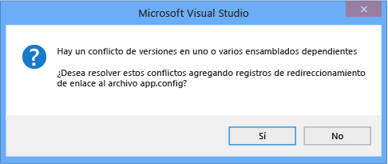

# <a name="how-to-enable-and-disable-automatic-binding-redirection"></a>Procedimiento para habilitar y deshabilitar redireccionamiento de enlaces automático

Al compilar aplicaciones en Visual Studio que tienen como destino la .NET Framework 4.5.1 y versiones posteriores, se pueden agregar automáticamente redirecciones de enlace al archivo de configuración de la aplicación para invalidar la unificación de ensamblados. Las redirecciones de enlace se agregan si la aplicación o sus componentes hacen referencia a más de una versión del mismo ensamblado, incluso si se especifican manualmente las redirecciones de enlace en el archivo de configuración de la aplicación. La característica de redirección de enlace automática afecta a las aplicaciones de escritorio y a las aplicaciones web que tienen como destino la .NET Framework 4.5.1 o una versión posterior, aunque el comportamiento es ligeramente diferente para una aplicación Web. Puede habilitar la redirección de enlace automática si tiene aplicaciones existentes destinadas a versiones anteriores de la .NET Framework, o puede deshabilitar esta característica si desea crear manualmente redirecciones de enlace.

## <a name="disable-automatic-binding-redirects-in-desktop-apps"></a>Deshabilitar las redirecciones de enlace automáticas en aplicaciones de escritorio

Las redirecciones de enlace automáticas están habilitadas de forma predeterminada para las aplicaciones de escritorio de Windows destinadas a .NET Framework 4.5.1 y versiones posteriores. Las redirecciones de enlace se agregan al archivo de configuración de salida (**app. config**) al compilar la aplicación e invalidar la unificación de ensamblados que, de lo contrario, podría tener lugar. El archivo **app. config** de origen no se modifica. Puede deshabilitar esta característica modificando el archivo de proyecto de la aplicación o anulando la selección de una casilla en las propiedades del proyecto en Visual Studio.

### <a name="disable-through-project-properties"></a>Deshabilitar a través de las propiedades del proyecto

Si tiene Visual Studio 2017 versión 15,7 o posterior, puede deshabilitar fácilmente las redirecciones de enlace generadas automáticamente en las páginas de propiedades del proyecto.

1. Haga clic con el botón derecho en el proyecto en el **Explorador de soluciones** y seleccione **Propiedades**.

2. En la página de la **aplicación** , desactive la opción **generar automáticamente redirecciones de enlace** .

3. Presione **Ctrl** + **S** para guardar el cambio.

### <a name="disable-manually-in-the-project-file"></a>Deshabilitar manualmente en el archivo de proyecto

1. Abra el archivo de proyecto para editarlo con uno de los métodos siguientes:

   - En Visual Studio, seleccione el proyecto en **Explorador de soluciones**y, a continuación, elija **Abrir carpeta en el explorador de archivos** en el menú contextual. En el explorador de archivos, busque el archivo de proyecto (. csproj o. vbproj) y ábralo en el Bloc de notas.
   - En Visual Studio, en **Explorador de soluciones**, haga clic con el botón derecho en el proyecto y elija **descargar el proyecto**. Vuelva a hacer clic con el botón derecho en el proyecto descargado y, a continuación, elija **Editar [nombreDeProyecto. csproj]**.

2. En el archivo de proyecto, busque la siguiente entrada de propiedad:

   ```xml
   <AutoGenerateBindingRedirects>true</AutoGenerateBindingRedirects>
   ```

3. Cambie `true` a `false`:

   ```xml
   <AutoGenerateBindingRedirects>false</AutoGenerateBindingRedirects>
   ```

## <a name="enable-automatic-binding-redirects-manually"></a>Habilitar las redirecciones de enlace automáticas manualmente

Puede habilitar las redirecciones de enlace automáticas en las aplicaciones existentes destinadas a versiones anteriores de la .NET Framework o en los casos en los que no se le pide automáticamente que agregue una redirección. Si va a tener como destino una versión más reciente del marco pero no se le pide automáticamente que agregue una redirección, es probable que obtenga una salida de la compilación que sugiere que se reasignen los ensamblados.

1. Abra el archivo de proyecto para editarlo con uno de los métodos siguientes:

   - En Visual Studio, seleccione el proyecto en **Explorador de soluciones**y, a continuación, elija **Abrir carpeta en el explorador de archivos** en el menú contextual. En el explorador de archivos, busque el archivo de proyecto (. csproj o. vbproj) y ábralo en el Bloc de notas.
   - En Visual Studio, en **Explorador de soluciones**, haga clic con el botón derecho en el proyecto y elija **descargar el proyecto**. Vuelva a hacer clic con el botón derecho en el proyecto descargado y, a continuación, elija **Editar [nombreDeProyecto. csproj]**.

2. Agregue el siguiente elemento al primer grupo de propiedades de configuración (bajo la \<PropertyGroup> etiqueta):

   ```xml
   <AutoGenerateBindingRedirects>true</AutoGenerateBindingRedirects>
   ```

   A continuación se muestra un ejemplo de archivo de proyecto con el elemento insertado:

   ```xml
   <?xml version="1.0" encoding="utf-8"?>
   <Project ToolsVersion="12.0" DefaultTargets="Build" xmlns="http://schemas.microsoft.com/developer/msbuild/2003">
     <Import Project="$(MSBuildExtensionsPath)\$(MSBuildToolsVersion)\Microsoft.Common.props" Condition="Exists('$(MSBuildExtensionsPath)\$(MSBuildToolsVersion)\Microsoft.Common.props')" />
     <PropertyGroup>
       <Configuration Condition=" '$(Configuration)' == '' ">Debug</Configuration>
       <Platform Condition=" '$(Platform)' == '' ">AnyCPU</Platform>
       <ProjectGuid>{123334}</ProjectGuid>
       ...
       <AutoGenerateBindingRedirects>true</AutoGenerateBindingRedirects>
     </PropertyGroup>
     ...
   </Project>
   ```

3. Compile la aplicación.

## <a name="enable-automatic-binding-redirects-in-web-apps"></a>Habilitación de las redirecciones de enlace automáticas en Web Apps

Las redirecciones de enlace automáticas se implementan de forma diferente para las aplicaciones web. Dado que el archivo de configuración de origen (**Web. config**) debe modificarse para las aplicaciones Web, las redirecciones de enlace no se agregan automáticamente al archivo de configuración. Sin embargo, Visual Studio le notifica los conflictos de enlace, por lo que podrá agregar redirecciones de enlace para resolverlos. Dado que siempre se le pide que agregue redirecciones de enlace, no necesita deshabilitar explícitamente esta característica para una aplicación Web.

Para agregar redirecciones de enlace a un archivo **Web. config** :

1. En Visual Studio, compile la aplicación y compruebe si hay advertencias de compilación.

   

2. Si hay conflictos de enlace de ensamblados, se mostrará una advertencia. Haga doble clic en la advertencia o seleccione la advertencia y presione **entrar**.

   Aparece un cuadro de diálogo que le permite agregar automáticamente las redirecciones de enlace necesarias al archivo **Web. config** de origen.

   

## <a name="see-also"></a>Consulte también

- [\<bindingRedirect>Element](./file-schema/runtime/bindingredirect-element.md)
- [Redirigir versiones de ensamblado](redirect-assembly-versions.md)
