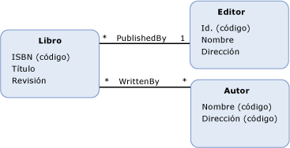
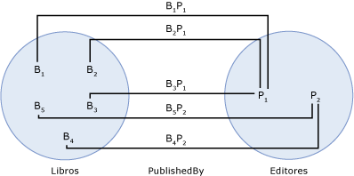

# extremo del conjunto de asociacionesassociation set end
Un *final del conjunto de asociaciones* identifica el [tipo de entidad](../../../../docs/framework/data/adonet/entity-type.md) y [conjunto de entidades](../../../../docs/framework/data/adonet/entity-set.md) al final de un [conjunto de asociaciones](../../../../docs/framework/data/adonet/association-set.md).An *association set end* identifies the [entity type](../../../../docs/framework/data/adonet/entity-type.md) and the [entity set](../../../../docs/framework/data/adonet/entity-set.md) at the end of an [association set](../../../../docs/framework/data/adonet/association-set.md). Los extremos de conjuntos de asociaciones se definen como parte de un conjunto de asociaciones, que debe tener exactamente dos extremos.Association set ends are defined as part of an association set; an association set must have exactly two association set ends.  
  
 Una definición de extremo de conjunto de asociaciones contiene la información siguiente:An association set end definition contains the following information:  
  
-   Uno de los tipos de entidad implicados en el conjunto de asociaciones.One of the entity types involved in the association set. (Necesario)(Required)  
  
-   El conjunto de entidades para el tipo de entidad implicado en el conjunto de asociaciones.The entity set for the entity type involved in the association set. (Necesario)(Required)  
  
## EjemploExample  
 El diagrama siguiente muestra un modelo conceptual con dos asociaciones: `WrittenBy` y `PublishedBy`.The diagram below shows a conceptual model with two associations: `WrittenBy` and `PublishedBy`.  
  
   
  
 El diagrama siguiente muestra un conjunto de asociaciones (`PublishedBy` y dos conjuntos de entidades (`Books` y `Publishers`) basados en el modelo conceptual mostrado anteriormente.The following diagram shows an association set (`PublishedBy`) and two entity sets (`Books` and `Publishers`) based on the conceptual model shown above. Los extremos del conjunto de asociaciones son los conjuntos de entidades `Books` y `Publishers`.The association set ends are the `Books` and `Publishers` entity sets. BI en el `Books` conjunto de entidades representa una instancia de la `Book` tipo de entidad en tiempo de ejecución.Bi in the `Books` entity set represents an instance of the `Book` entity type at run time. De forma similar, Pj representa un `Publisher` de instancia de la `Publishers` conjunto de entidades.Similarly, Pj represents a `Publisher` instance in the `Publishers` entity set. BiPj representa una instancia de la `PublishedBy` asociación en el `PublishedBy` conjunto de asociaciones.BiPj represents an instance of the `PublishedBy` association in the `PublishedBy` association set.  
  
   
  
 El [ADO.NET Entity Framework](../../../../docs/framework/data/adonet/ef/index.md) usa un DSL denominado lenguaje de definición de esquemas conceptuales ([CSDL](../../../../docs/framework/data/adonet/ef/language-reference/csdl-specification.md)) para definir los modelos conceptuales.The [ADO.NET Entity Framework](../../../../docs/framework/data/adonet/ef/index.md) uses a DSL called conceptual schema definition language ([CSDL](../../../../docs/framework/data/adonet/ef/language-reference/csdl-specification.md)) to define conceptual models. El siguiente CSDL define un contenedor de entidad con un conjunto de asociaciones para cada asociación en el diagrama anterior.The following CSDL defines an entity container with one association set for each association in the diagram above. Observe que los extremos del conjunto de asociaciones se definen como parte de cada definición del conjunto de asociaciones.Note that association set ends are defined as part of each association set definition.  
  
 [!code-xml[EDM_Example_Model#EntityContainerExample](../../../../samples/snippets/xml/VS_Snippets_Data/edm_example_model/xml/books.edmx#entitycontainerexample)]  
  
## Vea tambiénSee Also  
 [Conceptos básicos de modelo de datos de entidadEntity Data Model Key Concepts](../../../../docs/framework/data/adonet/entity-data-model-key-concepts.md)  
 [Entity Data ModelEntity Data Model](../../../../docs/framework/data/adonet/entity-data-model.md)
