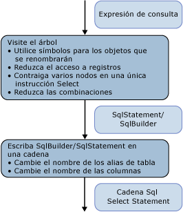

# <a name="architecture-and-design"></a>Arquitectura y diseño
El módulo de generación de SQL en el [proveedor de ejemplo](https://code.msdn.microsoft.com/windowsdesktop/Entity-Framework-Sample-6a9801d0) se implementa como un visitante en el árbol de expresión que representa el árbol de comandos. La generación se realiza en un paso único al árbol de expresión.  
  
 Los nodos del árbol se procesan de abajo arriba. En primer lugar, se genera una estructura intermedia: Instrucción SqlSelectStatement o SqlBuilder, implementan ISqlFragment. A continuación, la instrucción SQL de la cadena se genera a partir de esa estructura. Hay dos motivos para la estructura intermedia:  
  
-   Lógicamente, una instrucción SQL SELECT se rellena de manera desordenada. Los nodos que participan en la cláusula FROM se visitan antes que los nodos que participan en las cláusulas WHERE, GROUP BY y ORDER BY.  
  
-   Para cambiar el nombre de los alias, debe identificar todos los alias que se hayan utilizado para evitar colisiones durante el cambio de nombre. Para aplazar las opciones de cambio de nombre en SqlBuilder, utilice objetos Symbol para representar las columnas candidatas al cambio de nombre.  
  
   
  
 En la primera fase, cuando se visita el árbol de expresión, las expresiones se agrupan en instrucciones SqlSelectStatement y se elimina la información de estructura jerárquica de las combinaciones y de los alias de combinación. Durante esta fase, los objetos Symbol representan columnas o alias de entrada a los que se puede cambiar el nombre.  
  
 En la segunda fase, cuando se genera la cadena real, se cambia el nombre de los alias.  
  
## <a name="data-structures"></a>Estructuras de datos  
 Esta sección describen los tipos utilizados en el [proveedor de ejemplo](https://code.msdn.microsoft.com/windowsdesktop/Entity-Framework-Sample-6a9801d0) que usa para crear una instrucción SQL.  
  
### <a name="isqlfragment"></a>ISqlFragment  
 Esta sección abarca las clases que implementan la interfaz ISqlFragment, que sirve para dos fines:  
  
-   Un tipo de valor devuelto común para todos los métodos de visitante.  
  
-   Proporciona un método para escribir la cadena de SQL final.  
  
```  
internal interface ISqlFragment {  
   void WriteSql(SqlWriter writer, SqlGenerator sqlGenerator);  
}  
```  
  
#### <a name="sqlbuilder"></a>SqlBuilder  
 SqlBuilder es un dispositivo de recopilación para la cadena de SQL final, similar a StringBuilder. Está compuesto de las cadenas que constituyen el SQL final, junto con objetos ISqlFragment que se pueden convertir en cadenas.  
  
```  
internal sealed class SqlBuilder : ISqlFragment {  
   public void Append(object s)  
   public void AppendLine()  
   public bool IsEmpty  
}  
```  
  
#### <a name="sqlselectstatement"></a>SqlSelectStatement  
 SqlSelectStatement representa una instrucción SQL SELECT canónica de la forma "SELECT... DE.. WHERE... AGRUPAR POR... SE ORDENA POR".  
  
 Cada una de las cláusulas de SQL está representada por un objeto StringBuilder. Además, realiza un seguimiento de si se ha especificado Distinct y si la instrucción se encuentra en el nivel más alto. Si la instrucción no se encuentra en el nivel más alto, la cláusula ORDER BY se omite, a menos que la instrucción también tenga una cláusula TOP.  
  
 FromExtents contiene la lista de entradas de la instrucción SELECT. Normalmente, consta de un único elemento. Las instrucciones SELECT de las combinaciones pueden tener temporalmente más de un elemento.  
  
 Si un nodo Join crea la instrucción SELECT, SqlSelectStatement mantiene una lista de todas las extensiones cuya información de estructura jerárquica se ha eliminado en la combinación en AllJoinExtents. OuterExtents representa las referencias externas de la instrucción SqlSelectStatement y se utiliza para cambiar el nombre de los alias de entrada.  
  
```  
internal sealed class SqlSelectStatement : ISqlFragment {  
   internal bool IsDistinct { get, set };  
   internal bool IsTopMost  
  
   internal List<Symbol> AllJoinExtents { get, set };  
   internal List<Symbol> FromExtents { get};  
   internal Dictionary<Symbol, bool> OuterExtents { get};  
  
   internal TopClause Top { get, set };  
  
   internal SqlBuilder Select {get};  
   internal SqlBuilder From  
   internal SqlBuilder Where  
   internal SqlBuilder GroupBy  
   public SqlBuilder OrderBy  
}  
```  
  
#### <a name="topclause"></a>TopClause  
 TopClause representa la expresión TOP en una instrucción SqlSelectStatement. La propiedad TopCount indica cuántas filas TOP deben seleccionarse.  Cuando el valor de la propiedad WithTies es true, la cláusula TopClause se generó a partir de una expresión DbLimitExpession.  
  
```  
class TopClause : ISqlFragment {  
   internal bool WithTies {get}  
   internal ISqlFragment TopCount {get}  
   internal TopClause(ISqlFragment topCount, bool withTies)  
   internal TopClause(int topCount, bool withTies)  
}  
```  
  
### <a name="symbols"></a>Símbolos  
 Las clases relacionadas con Symbol y la tabla de símbolos cambian el nombre a los alias de entrada, eliminan información de estructura jerárquica de los alias de combinación y cambian el nombre a los alias de columna.  
  
 La clase Symbol representa una extensión, una instrucción SELECT anidada o una columna. Se utiliza en lugar de un alias real para permitir el cambio de nombre una vez utilizada y presenta también información adicional del artefacto que representa (como el tipo).  
  
```  
class Symbol : ISqlFragment {  
   internal Dictionary<string, Symbol> Columns {get}  
   internal bool NeedsRenaming {get, set}  
   internal bool IsUnnest {get, set}   //not used  
  
   public string Name{get}  
   public string NewName {get,set}  
   internal TypeUsage Type {get, set}  
  
   public Symbol(string name, TypeUsage type)  
}  
```  
  
 El nombre almacena el alias original de la extensión representada, la instrucción SELECT anidada o una columna.  
  
 NewName almacena el alias que se utilizará en la instrucción SELECT de SQL. Se establece originalmente en Name y solo se cambia el nombre si resulta necesario al generar la consulta de la cadena final.  
  
 El tipo solamente es útil para los símbolos que representan extensiones e instrucciones SELECT anidadas.  
  
#### <a name="symbolpair"></a>SymbolPair  
 La clase SymbolPair se encarga de la eliminación de la información de estructura jerárquica de los registros.  
  
 Tomemos como ejemplo una expresión de propiedad D(v, "j3.j2.j1.a.x"), donde v es una VarRef, j1, j2, j3 son las combinaciones, a es una extensión y x es una columna.  
  
 Esto tiene que ser traducido posteriormente a {j'}.{x'}. El campo de origen representa la instrucción SqlStatement extrema, que representa una expresión de combinación (por ejemplo, j2); es siempre un símbolo Join. El campo de columna se mueve de un símbolo de combinación al siguiente hasta que se detiene en un símbolo que no es de combinación. Es lo que se devuelve cuando se visita una expresión DbPropertyExpression, pero nunca se agrega a un SqlBuilder.  
  
```  
class SymbolPair : ISqlFragment {  
   public Symbol Source;  
   public Symbol Column;  
   public SymbolPair(Symbol source, Symbol column)  
}  
```  
  
#### <a name="joinsymbol"></a>JoinSymbol  
 Un símbolo Join es un objeto Symbol que representa una instrucción SELECT anidada con una combinación o una entrada de combinación.  
  
```  
internal sealed class JoinSymbol : Symbol {  
   internal List<Symbol> ColumnList {get, set}  
   internal List<Symbol> ExtentList {get}  
   internal List<Symbol> FlattenedExtentList {get, set}  
   internal Dictionary<string, Symbol> NameToExtent {get}  
   internal bool IsNestedJoin {get, set}  
  
   public JoinSymbol(string name, TypeUsage type, List<Symbol> extents)  
}  
```  
  
 ColumnList representa la lista de columnas de la cláusula SELECT si este símbolo representa una instrucción SELECT de SQL. ExtentList es la lista de extensiones de la cláusula SELECT. Si la combinación tiene varias extensiones sin información de estructura jerárquica en el nivel superior, FlattenedExtentList realiza un seguimiento de las extensiones para asegurarse de que el nombre de los alias de extensión se cambia correctamente.  
  
 NameToExtent tiene todas las extensiones de ExtentList como un diccionario. IsNestedJoin se utiliza para determinar si JoinSymbol es un símbolo de combinación normal o un símbolo con una instrucción SqlSelectStatement correspondiente.  
  
 Todas las listas se establecen una vez exactamente y después se utilizan para realizar búsquedas o para enumeraciones.  
  
#### <a name="symboltable"></a>SymbolTable  
 SymbolTable se utiliza para resolver nombres de variable como símbolos. SymbolTable se implementa como una pila con una nueva entrada para cada ámbito. Las búsquedas examinan la pila desde la parte superior a la parte inferior hasta que se encuentra una entrada.  
  
```  
internal sealed class SymbolTable {  
   internal void EnterScope()  
   internal void ExitScope()  
   internal void Add(string name, Symbol value)  
   internal Symbol Lookup(string name)  
}  
```  
  
 Hay solo una tabla SymbolTable por instancia del módulo de generación de Sql. Se entra y se sale de los ámbitos para cada nodo relacional. Todos los símbolos de ámbitos anteriores están visibles para los ámbitos posteriores, a menos que estén ocultos por otros símbolos con el mismo nombre.  
  
### <a name="global-state-for-the-visitor"></a>Estado global para el visitante  
 Para ayudar en el cambio de nombre de alias y columnas, mantenga una lista de todos los nombres de columna (AllColumnNames) y alias de extensión (AllExtentNames) utilizados en el primer paso al árbol de consultas.  La tabla de símbolos resuelve los nombres de variable como símbolos. IsVarRefSingle solo se utiliza a efectos de comprobación, no es estrictamente necesario.  
  
 Las dos pilas utilizadas mediante CurrentSelectStatement e IsParentAJoin se utilizan para pasar los "parámetros" de los nodos primarios a los secundarios, puesto que el patrón del visitante no permite el paso de parámetros.  
  
```  
internal Dictionary<string, int> AllExtentNames {get}  
internal Dictionary<string, int> AllColumnNames {get}  
SymbolTable symbolTable = new SymbolTable();  
bool isVarRefSingle = false;  
  
Stack<SqlSelectStatement> selectStatementStack;  
private SqlSelectStatement CurrentSelectStatement{get}  
  
Stack<bool> isParentAJoinStack;  
private bool IsParentAJoin{get}  
```  
  
## <a name="common-scenarios"></a>Escenarios comunes  
 En esta sección se explican los escenarios de proveedor más habituales.  
  
### <a name="grouping-expression-nodes-into-sql-statements"></a>Agrupar nodos de expresión en instrucciones SQL  
 Cuando se encuentra el primer nodo relacional (normalmente una extensión de DbScanExpression) al visitar el árbol de abajo arriba, se crea una instrucción SqlSelectStatement. Para generar una instrucción SELECT de SQL con el menor número de consultas anidadas posible, agregue tantos nodos primarios como sea posible en esa instrucción SqlSelectStatement.  
  
 La decisión sobre si un determinado nodo (relacional) se puede agregar a la instrucción SqlSelectStatement actual (la que se devolvió al visitar la entrada) o si es necesario iniciar una nueva instrucción es calculada por el método IsCompatible y depende del contenido de la instrucción SqlSelectStatement, que depende, a su vez, de qué nodos estaban situados por debajo del nodo especificado.  
  
 Normalmente, si las cláusulas de instrucciones SQL se evalúan después de las cláusulas en las que los nodos que se están considerando para la combinación no están vacíos, el nodo no se puede agregar a la instrucción actual. Por ejemplo, si el nodo siguiente es un objeto Filter, solo se podrá incorporar a la instrucción SqlSelectStatement actual si se cumple lo siguiente:  
  
-   La lista SELECT está vacía. Si no lo está, un nodo anterior al filtro generó la lista de selección y puede que el predicado haga referencia a las columnas generadas por esa lista SELECT.  
  
-   GROUPBY está vacío. Si no lo está, agregar el filtro significaría que el filtrado se produciría antes que la agrupación, lo cual no es correcto.  
  
-   La cláusula TOP está vacía. Si no lo está, agregar el filtro significaría que el filtrado se produciría antes que la ejecución de la cláusula TOP, lo cual no es correcto.  
  
 Esto no se aplica a los nodos no relacionales, como DbConstantExpression, o a expresiones aritméticas, porque se incluyen siempre como parte de una instrucción SqlSelectStatement existente.  
  
 Asimismo, al encontrar la raíz del árbol de combinaciones (un nodo de combinación que no tiene un elemento primario de combinación), se inicia una nueva instrucción SqlSelectStatement. Todos los elementos secundarios de combinación del lateral izquierdo se agregan a esa instrucción SqlSelectStatement.  
  
 Siempre que se inicia una instrucción SqlSelectStatement nueva, y la actual se agrega a la entrada, es posible que la instrucción SqlSelectStatement actual necesite completarse agregando columnas de proyección (una cláusula SELECT) si no existe una. Esto se realiza con el método AddDefaultColumns, que examina la propiedad FromExtents de la instrucción SqlSelectStatement y agrega todas las columnas que la lista de extensiones representada por FromExtents introduce en el ámbito de la lista de columnas proyectadas. El motivo de esto es porque en ese punto no se sabe a qué columnas hacen referencia los otros nodos. Esto se puede optimizar para proyectar solo las columnas que se puedan utilizar después.  
  
### <a name="join-flattening"></a>Eliminación de la información de estructura jerárquica de las combinaciones  
 La propiedad IsParentAJoin ayuda a determinar si se puede quitar la información de estructura jerárquica de una determinada combinación. En particular, la propiedad IsParentAJoin solo devuelve `true` para el elemento secundario izquierdo de una combinación y para cada DbScanExpression que sea una entrada inmediata de una combinación, en cuyo caso ese nodo secundario vuelve a utilizar la misma instrucción SqlSelectStatement que el elemento primario utilizaría después. Para obtener más información acerca de las expresiones, vea "Expresiones de combinación".  
  
### <a name="input-alias-redirecting"></a>Redirección de alias de entrada  
 La redirección de los alias de entrada se logra con la tabla de símbolos.  
  
 Para explicar la redirección de alias de entrada, consulte el primer ejemplo de [generar SQL de árboles de comandos: procedimientos recomendados](../../../../../docs/framework/data/adonet/ef/generating-sql-from-command-trees-best-practices.md).  En él, "a" necesita redirigirse a "b" en la proyección.  
  
 Cuando se crea un objeto SqlSelectStatement, la extensión que representa la entrada al nodo se coloca en la propiedad From del objeto SqlSelectStatement. Se crea un objeto Symbol (<symbol_b>) basado en el nombre del enlace de entrada ("b") para representar esa extensión y se anexa "AS" + <symbol_b> a la cláusula From.  El símbolo también se agrega a la propiedad FromExtents.  
  
 El símbolo también se agrega a la tabla de símbolos para vincularle el nombre del enlace de entrada ("b", <symbol_b>).  
  
 Si un nodo posterior vuelve a utilizar esa instrucción SqlSelectStatement, agrega una entrada a la tabla de símbolos para vincular su nombre de enlace de entrada a ese símbolo. En nuestro ejemplo, podría volver a usar la instrucción SqlSelectStatement y agregue la expresión DbProjectExpression con el nombre de enlace de entrada de "a" ("a", \< symbol_b >) a la tabla.  
  
 Cuando las expresiones hacen referencia al nombre de enlace de entrada del nodo que está reutilizando la instrucción SqlSelectStatement, esa referencia se resuelve usando la tabla de símbolos como el símbolo redirigido correcto. Cuando "a" de "a.x" se resuelva al visitar la expresión DbVariableReferenceExpression que representa "a", lo hará como el objeto Symbol <symbol_b>.  
  
### <a name="join-alias-flattening"></a>Eliminación de la información de estructura jerárquica de los alias de combinación  
 La eliminación de la información de estructura jerárquica de los alias de combinación se logra al visitar una expresión DbPropertyExpression, como se describe en la sección titulada DbPropertyExpression.  
  
### <a name="column-name-and-extent-alias-renaming"></a>Cambio de nombre de una columna y de un alias de extensión  
 El problema del nombre de columna y cambiar el nombre de alias de extensión se resuelve utilizando símbolos que solo se sustituyen con alias en la segunda fase de la generación que se describe en la sección titulada segunda fase de la generación de SQL: Generar el comando String.  
  
## <a name="first-phase-of-the-sql-generation-visiting-the-expression-tree"></a>Primera fase de la generación de SQL: Visitar el árbol de expresión  
 En esta sección se describe la primera fase de generación de SQL, cuando se visita la expresión que representa la consulta y se genera una estructura intermedia, SqlSelectStatement o SqlBuilder.  
  
 En esta sección se describen los principios de las visitas a las diferentes categorías de nodo de expresión y se ofrecen detalles sobre las visitas a determinados tipos de expresión.  
  
### <a name="relational-non-join-nodes"></a>Nodos relacionales (no de combinación)  
 Los siguientes tipos de expresión admiten nodos que no son de combinación:  
  
-   DbDistinctExpression  
  
-   DbFilterExpression  
  
-   DbGroupByExpression  
  
-   DbLimitExpession  
  
-   DbProjectExpression  
  
-   DbSkipExpression  
  
-   DbSortExpression  
  
 La visita a estos nodos sigue este patrón:  
  
1.  Visite la entrada relacional y obtenga la instrucción SqlSelectStatement resultante. La entrada a un nodo relacional puede ser:  
  
    -   Un nodo relacional, incluida una extensión (una expresión DbScanExpression, por ejemplo). Al visitar este tipo de nodo, se devuelve una instrucción SqlSelectStatement.  
  
    -   Una expresión de operación set (UNION ALL, por ejemplo). El resultado tiene que incluirse entre corchetes y colocarse en la cláusula FROM de una nueva instrucción SqlSelectStatement.  
  
2.  Compruebe si el nodo actual se puede agregar a la instrucción SqlSelectStatement generada por la entrada. Esto se describe en la sección titulada Agrupar expresiones en instrucciones SQL. En caso contrario,  
  
    -   Extraiga el objeto SqlSelectStatement actual.  
  
    -   Cree un nuevo objeto SqlSelectStatement y agregue el objeto SqlSelectStatement extraído como la cláusula FROM del nuevo objeto SqlSelectStatement.  
  
    -   Coloque el nuevo objeto en la parte superior de la pila.  
  
3.  Redirija el enlace de expresión de entrada al símbolo correcto de la entrada. Esta información se conserva en el objeto SqlSelectStatement.  
  
4.  Agregue un nuevo ámbito SymbolTable.  
  
5.  Visite la parte que no es de entrada de la expresión (por ejemplo, Projection y Predicate).  
  
6.  Extraiga todos los objetos agregados a las pilas globales.  
  
 DbSkipExpression no tiene un equivalente directo en SQL. Lógicamente, se traduce como:  
  
```  
SELECT Y.x1, Y.x2, ..., Y.xn  
FROM (  
   SELECT X.x1, X.x2, ..., X.xn, row_number() OVER (ORDER BY sk1, sk2, ...) AS [row_number]   
   FROM input as X   
   ) as Y  
WHERE Y.[row_number] > count   
ORDER BY sk1, sk2, ...  
```  
  
### <a name="join-expressions"></a>Expresiones de combinación  
 Las siguientes expresiones están consideradas como de combinación y se procesan de manera ordinaria utilizando el método VisitJoinExpression:  
  
-   DbApplyExpression  
  
-   DbJoinExpression  
  
-   DbCrossJoinExpression  
  
 A continuación se enumeran los pasos que deben seguirse en la visita:  
  
 Primero, antes de visitar los elementos secundarios, es necesario llamar a IsParentAJoin para comprobar si el nodo de combinación es un elemento secundario de una combinación situada en un lateral izquierdo. Si devuelve false, se inicia una nueva instrucción SqlSelectStatement. En ese sentido, las combinaciones se visitan de forma diferente al resto de los nodos, ya que el elemento primario (el nodo de combinación) crea la instrucción SqlSelectStatement para que la usen posiblemente los elementos secundarios.  
  
 En segundo lugar, procese las entradas de una en una. Para cada entrada:  
  
1.  Visite la entrada.  
  
2.  Posprocese el resultado de la visita a la entrada llamando a ProcessJoinInputResult, que se encarga de mantener la tabla de símbolos después de visitar un elemento secundario de una expresión de combinación y finalizar posiblemente la instrucción SqlSelectStatement generada por el elemento secundario. El resultado del elemento secundario puede ser:  
  
    -   Un objeto SqlSelectStatement distinto del objeto al que se agregará el elemento principal. En este caso, puede que resulte necesario completarlo agregando columnas predeterminadas. Si la entrada fue un objeto Join, tendrá que crear un nuevo símbolo de combinación. De lo contrario, cree un símbolo normal.  
  
    -   Una extensión (una expresión DbScanExpression, por ejemplo), en cuyo caso simplemente se agrega a la lista de entradas de la instrucción SqlSelectStatement del elemento primario.  
  
    -   Un objeto que no es SqlSelectStatement, en cuyo caso se coloca entre corchetes.  
  
    -   El mismo objeto SqlSelectStatement al que se agrega el elemento primario. En este caso, los símbolos de la lista FromExtents deben sustituirse por un nuevo objeto JoinSymbol único que los represente a todos.  
  
    -   En estos tres primeros casos, se llama a AddFromSymbol para agregar la cláusula AS y actualizar la tabla de símbolos.  
  
 En tercer lugar, se visita la condición de combinación (si existe).  
  
### <a name="set-operations"></a>Operaciones Set  
 El método VisitSetOpExpression procesa las operaciones set DbUnionAllExpression, DbExceptExpression y DbIntersectExpression. Crea un objeto SqlBuilder del tipo  
  
```xml  
<leftSqlSelectStatement> <setOp> <rightSqlSelectStatement>  
```  
  
 Donde \<leftSqlSelectStatement > y \<rightSqlSelectStatement > son instrucciones Sqlselectstatement obtenidas visitando cada una de las entradas, y \<setOp > es la operación correspondiente (UNION ALL, por ejemplo).  
  
### <a name="dbscanexpression"></a>DbScanExpression  
 Si se visita en un contexto de combinación (como una entrada a una combinación que representa un elemento secundario izquierdo de otra combinación), la expresión DbScanExpression devuelve un objeto SqlBuilder con el SQL de destino del correspondiente destino, que puede ser una consulta de definición, una tabla o una vista. De lo contrario, se crea una instrucción SqlSelectStatement con el campo FROM establecido para corresponderse con el destino correspondiente.  
  
### <a name="dbvariablereferenceexpression"></a>DbVariableReferenceExpression  
 La visita de una expresión DbVariableReferenceExpression devuelve el objeto Symbol correspondiente a esa expresión de referencia de variable en función de una búsqueda en la tabla de símbolos.  
  
### <a name="dbpropertyexpression"></a>DbPropertyExpression  
 La eliminación de la información de estructura jerárquica de los alias de combinación se identifica y procesa al visitar una expresión DbPropertyExpression.  
  
 Primero se visita la propiedad Instance, lo que da como resultado un objeto Symbol, JoinSymbol o SymbolPair. A continuación se muestra cómo se tratan estos tres casos:  
  
-   Si se devuelve un objeto JoinSymbol, su propiedad NameToExtent contiene un símbolo de la propiedad necesaria. Si el símbolo de la combinación representa una combinación anidada, se devuelve un nuevo par Symbol con el símbolo de la combinación para realizar un seguimiento del símbolo que podría utilizarse como alias de la instancia y el símbolo que representa la propiedad real para una resolución posterior.  
  
-   Si se devuelve un objeto SymbolPair y la parte Column es un símbolo de combinación, se devuelve de nuevo un símbolo de combinación, pero ahora la propiedad de columna se actualiza para señalar a la propiedad representada por la expresión de propiedad actual. De lo contrario, se devuelve un objeto SqlBuilder con el origen de SymbolPair como alias y el símbolo de la propiedad actual como columna.  
  
-   Si se devuelve un objeto Symbol, el método Visit devuelve un método SqlBuilder con esa instancia como alias y el nombre de propiedad como nombre de columna.  
  
### <a name="dbnewinstanceexpression"></a>DbNewInstanceExpression  
 Cuando se utiliza como la propiedad Projection de DbProjectExpression, DbNewInstanceExpression genera una lista separada por comas de los argumentos para representar las columnas proyectadas.  
  
 Cuando DbNewInstanceExpression tiene un tipo de valor devuelto de colección, y define una nueva colección de las expresiones proporcionadas como argumentos, los tres casos siguientes se tratan por separado:  
  
-   Si DbNewInstanceExpression tiene DbElementExpression como único argumento, se traduce como:  
  
    ```  
    NewInstance(Element(X)) =>  SELECT TOP 1 …FROM X  
    ```  
  
 Si DbNewInstanceExpression no tiene ningún argumento (representa una tabla vacía), DbNewInstanceExpression se traduce como:  
  
```  
SELECT CAST(NULL AS <primitiveType>) as X  
FROM (SELECT 1) AS Y WHERE 1=0  
```  
  
 De lo contrario, DbNewInstanceExpression genera una escala union-all de los argumentos:  
  
```  
SELECT <visit-result-arg1> as X  
UNION ALL SELECT <visit-result-arg2> as X  
UNION ALL …  
UNION ALL SELECT <visit-result-argN> as X  
```  
  
### <a name="dbfunctionexpression"></a>DbFunctionExpression  
 Las funciones canónicas e integradas se procesan de la misma manera: si necesitan un control especial (TRIM(cadena) como LTRIM(RTRIM(cadena), por ejemplo), se invoca al controlador adecuado. De lo contrario, se traducen como FunctionName(arg1, arg2, ..., argn).  
  
 Se utilizan diccionarios para realizar un seguimiento de qué funciones necesitan un control especial y sus controladores adecuados.  
  
 Las funciones definidas por el usuario se traducen como NamespaceName.FunctionName(arg1, arg2, ..., argn).  
  
### <a name="dbelementexpression"></a>DbElementExpression  
 El método que visita DbElementExpression solamente se invoca para visitar una expresión DbElementExpression cuando se usa para representar una subconsulta escalar. Por consiguiente, DbElementExpression se traduce en una instrucción SqlSelectStatement completa y agrega corchetes alrededor de ella.  
  
### <a name="dbquantifierexpression"></a>DbQuantifierExpression  
 En función del tipo de expresión (Any u All), la expresión DbQuantifierExpression se traduce como:  
  
```  
Any(input, x) => Exists(Filter(input,x))  
All(input, x) => Not Exists(Filter(input, not(x))  
```  
  
### <a name="dbnotexpression"></a>DbNotExpression  
 En algunos casos, es posible contraer la traducción de DbNotExpression con su expresión de entrada. Por ejemplo:  
  
```  
Not(IsNull(a)) =>  "a IS NOT NULL"  
Not(All(input, x) => Not (Not Exists(Filter(input, not(x))) => Exists(Filter(input, not(x))  
```  
  
 El motivo por el que se contrae por segunda vez es porque el proveedor introdujo ineficacias al traducir una expresión DbQuantifierExpression de tipo All. Por consiguiente, Entity Framework no podría haber realizado la simplificación.  
  
### <a name="dbisemptyexpression"></a>DbIsEmptyExpression  
 DbIsEmptyExpression se traduce como:  
  
```  
IsEmpty(inut) = Not Exists(input)  
```  
  
## <a name="second-phase-of-sql-generation-generating-the-string-command"></a>Segunda fase de generación de SQL: Generar el comando String  
 Al generar un comando SQL string, el objeto SqlSelectStatement genera los alias reales de los símbolos, lo que resuelve el problema del cambio de nombre de la columna y del alias de extensión.  
  
 El cambio de nombre del alias de extensión se produce al escribir el objeto SqlSelectStatement en una cadena. Primero, cree una lista de todos los alias utilizados por las extensiones exteriores. El nombre de cada símbolo en la propiedad FromExtents (o en AllJoinExtents si no es null) se cambia si entra en colisión con alguna de las extensiones exteriores. Si se necesita un cambio de nombre, no estará en conflicto con ninguna de las extensiones recopiladas en AllExtentNames.  
  
 El cambio de nombre de una columna se produce cuando se escribe un objeto Symbol en una cadena. AddDefaultColumns en la primera fase ha determinado si debe cambiarse el nombre de un determinado símbolo de columna. En la segunda fase, el cambio de nombre solamente se produce tras asegurarse de que el nombre generado no estará en conflicto con ninguno de los nombres utilizados en AllColumnNames  
  
 Para generar nombres únicos tanto para los alias de extensión como para las columnas, utilice <nombre_existente>_n, donde n es el alias más pequeño que no se ha utilizado todavía. La lista global de todos los alias aumenta la necesidad de realizar cambios de nombre en cascada.  
  
## <a name="see-also"></a>Vea también  
 [Generación de SQL en el proveedor de ejemplo](../../../../../docs/framework/data/adonet/ef/sql-generation-in-the-sample-provider.md)
