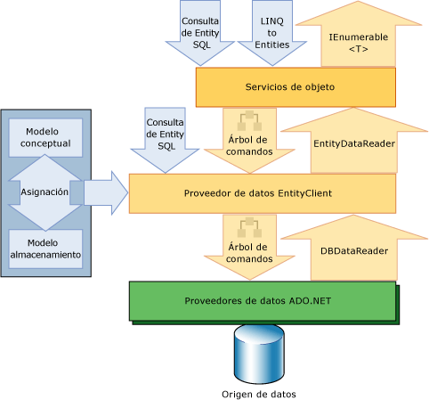

# Información general de Entity Framework

La Entity Framework es un conjunto de tecnologías de ADO.NET que admiten el desarrollo de aplicaciones de software orientadas a datos. Los arquitectos y programadores de aplicaciones orientadas a datos se han enfrentado a la necesidad de lograr dos objetivos muy diferentes. Deben modelar las entidades, las relaciones y la lógica de los problemas empresariales que resuelven, y también deben trabajar con los motores de datos que se usan para almacenar y recuperar los datos. Los datos pueden abarcar varios sistemas de almacenamiento, cada uno con sus propios protocolos; incluso las aplicaciones que funcionan con un único sistema de almacenamiento deben equilibrar los requisitos del sistema de almacenamiento con respecto a los requisitos de escribir un código de aplicación eficaz y fácil de mantener.

El Entity Framework permite a los desarrolladores trabajar con datos en forma de objetos y propiedades específicos del dominio, como clientes y direcciones de clientes, sin tener que preocuparse de las tablas y columnas de bases de datos subyacentes en las que se almacenan estos datos. Con Entity Framework, los desarrolladores pueden trabajar en un nivel más alto de abstracción cuando tratan con datos, y pueden crear y mantener aplicaciones orientadas a datos con menos código que en las aplicaciones tradicionales. Dado que el Entity Framework es un componente del .NET Framework, Entity Framework aplicaciones pueden ejecutarse en cualquier equipo en el que se haya instalado el .NET Framework a partir de la versión 3,5 SP1.

## Dar vida a los modelos
 Un enfoque de diseño habitual para crear una aplicación o un servicio consiste en dividir la aplicación o el servicio en tres partes: un modelo de dominio, un modelo lógico y un modelo físico. El modelo de dominio define las entidades y relaciones del sistema que se está modelando. El modelo lógico de una base de datos relacional normaliza las entidades y relaciones en tablas con restricciones de claves externas. El modelo físico abarca las capacidades de un motor de datos determinado especificando los detalles del almacenamiento en forma de particiones e índices.

 Los administradores de bases de datos refinan el modelo físico para mejorar el rendimiento, pero los programadores que escriben el código de la aplicación principalmente se limitan a trabajar con el modelo lógico escribiendo consultas SQL y llamando a procedimientos almacenados. Los modelos de dominio se suelen usar como una herramienta para capturar y comunicar los requisitos de una aplicación, con frecuencia como diagramas inertes que se ven y se explican en las primeras etapas de un proyecto, y a continuación se abandonan. Muchos equipos de desarrolladores omiten la creación de un modelo conceptual y comienzan especificando las tablas, columnas y claves en una base de datos relacional.

 El Entity Framework proporciona una vida a los modelos al permitir a los programadores consultar las entidades y relaciones en el modelo de dominio (denominado modelo *conceptual* en el Entity Framework) mientras se confía en el Entity Framework para traducir esas operaciones en comandos específicos del origen de datos. Esto libera a las aplicaciones de las dependencias codificadas de forma rígida en un origen de datos determinado.

 Al trabajar con Code First, el modelo conceptual se asigna al modelo de almacenamiento en código. El Entity Framework puede deducir el modelo conceptual en función de los tipos de objeto y las configuraciones adicionales que defina. Los metadatos de asignación se generan durante el tiempo de ejecución basándose en una combinación de cómo se definen los tipos de dominio e información de configuración adicional que se proporciona en código. Entity Framework genera la base de datos según sea necesario en función de los metadatos. Para obtener más información, vea [crear un modelo](/ef/ef6/modeling/).

 Cuando se trabaja con las Herramientas de Entity Data Model, el modelo conceptual, el modelo de almacenamiento y las asignaciones entre los dos se expresan en esquemas basados en XML y se definen en archivos que tienen extensiones de nombre correspondientes:

- El lenguaje de definición de esquemas conceptuales (CSDL) define el modelo conceptual. CSDL es la implementación del Entity Framework del [Entity Data Model](../entity-data-model.md). La extensión de archivo es .csdl.

- El lenguaje de definición de esquemas de almacenamiento (SSDL) define el modelo de almacenamiento, que también se denomina modelo lógico. La extensión de archivo es .ssdl.

- El lenguaje de especificación de asignaciones (MSL) define las asignaciones entre los modelos conceptual y de almacenamiento. La extensión de archivo es .msl.

El modelo de almacenamiento y las asignaciones pueden cambiar según sea necesario sin requerir cambios en el modelo conceptual, las clases de datos o el código de la aplicación. Dado que los modelos de almacenamiento son específicos del proveedor, puede trabajar con un modelo conceptual coherente a través de varios orígenes de datos.

El Entity Framework utiliza estos archivos de asignación y modelo para crear, leer, actualizar y eliminar operaciones en las entidades y relaciones del modelo conceptual en las operaciones equivalentes en el origen de datos. La Entity Framework incluso admite la asignación de entidades en el modelo conceptual a procedimientos almacenados en el origen de datos. Para obtener más información, vea las [Especificaciones de CSDL, SSDL y MSL](/ef/ef6/modeling/designer/advanced/edmx/csdl-spec).

## Asignar objetos a datos
 La programación orientada a objetos supone un desafío al interactuar con sistemas de almacenamiento de datos. Aunque la organización de clases suele reflejar la organización de las tablas de bases de datos relacionales, el ajuste no es perfecto. Varias tablas normalizadas suelen corresponder a una sola clase y las relaciones entre las clases se representan a menudo de forma diferente a las relaciones entre tablas. Por ejemplo, para representar el cliente de un pedido de ventas, una clase `Order` podría utilizar una propiedad que contiene una referencia a una instancia de una clase `Customer`, mientras que una fila de la tabla `Order` en una base de datos contiene una columna de clave externa con un valor que corresponde a un valor de clave principal en la tabla `Customer` (o conjunto de columnas). Una clase `Customer` podría tener una propiedad denominada `Orders` que contuviera una colección de instancias de la clase `Order`, mientras que la tabla `Customer` en una base de datos no tiene ninguna columna comparable. El Entity Framework proporciona a los desarrolladores la flexibilidad necesaria para representar relaciones de esta manera, o para modelar más estrechamente las relaciones que se representan en la base de datos.

 Las soluciones existentes han intentado cubrir este hueco, que se suele denominar "desigualdad de impedancia", asignando únicamente clases y propiedades orientadas a objetos a las tablas y columnas relacionales. En lugar de tomar este enfoque tradicional, el Entity Framework asigna las tablas relacionales, las columnas y las restricciones Foreign Key de los modelos lógicos a las entidades y relaciones en los modelos conceptuales. Esto permite una mayor flexibilidad al definir los objetos y optimizar el modelo lógico. Las herramientas de Entity Data Model generan clases de datos extensibles basadas en el modelo conceptual. Se trata de clases parciales que se pueden extender con miembros adicionales que el programador agrega. De forma predeterminada, las clases que se generan para un modelo conceptual determinado derivan de las clases base que proporcionan servicios para materializar las entidades como objetos y para realizar un seguimiento de los cambios y guardarlos. Los desarrolladores pueden utilizar estas clases para trabajar con las entidades y relaciones como objetos relacionados mediante asociaciones. Los desarrolladores también pueden personalizar las clases que se generan para un modelo conceptual. Para obtener más información, vea [trabajar con objetos](working-with-objects.md).

## Obtener acceso y cambiar los datos de la entidad

Como algo más que otra solución de asignación objeto-relacional, Entity Framework trata fundamentalmente de permitir que las aplicaciones obtengan acceso y cambien los datos que están representados como entidades y relaciones en el modelo conceptual. En el Entity Framework se usa información en los archivos de modelo y asignación para traducir las consultas de objeto con los tipos de entidad representados en el modelo conceptual en consultas específicas del origen de datos. Los resultados de la consulta se materializan en objetos que administra el Entity Framework. El Entity Framework proporciona las siguientes formas de consultar un modelo conceptual y devolver objetos:

- LINQ to Entities. Proporciona compatibilidad con Language-Integrated Query (LINQ) para consultar los tipos de entidad que se definen en un modelo conceptual. Para obtener más información, vea [LINQ to Entities](./language-reference/linq-to-entities.md).

- [!INCLUDE[esql](../../../../../includes/esql-md.md)]. Dialecto de SQL independiente del almacenamiento que trabaja directamente con entidades del modelo conceptual y que admite conceptos de Entity Data Model. [!INCLUDE[esql](../../../../../includes/esql-md.md)]se utiliza tanto con consultas de objeto como con consultas que se ejecutan con el proveedor de EntityClient. Para obtener más información, vea [información general sobre Entity SQL](./language-reference/entity-sql-overview.md).

El Entity Framework incluye el proveedor de datos de EntityClient. Este proveedor administra las conexiones, traduce las consultas de entidad en consultas específicas del origen de datos y devuelve un lector de datos que el Entity Framework utiliza para materializar los datos de la entidad en los objetos. Cuando no se requiere la materialización de los objetos, el proveedor de EntityClient también se puede utilizar como un proveedor de datos ADO.NET estándar habilitando las aplicaciones para ejecutar las consultas de [!INCLUDE[esql](../../../../../includes/esql-md.md)] y usar el lector de datos de solo lectura devuelto. Para obtener más información, consulte [Proveedor de EntityClient para Entity Framework](entityclient-provider-for-the-entity-framework.md).

El diagrama siguiente muestra la arquitectura de Entity Framework para el acceso a datos:

Las herramientas de Entity Data Model pueden generar una clase derivada de `System.Data.Objects.ObjectContext` o `System.Data.Entity.DbContext` que representa el contenedor de entidades en el modelo conceptual. Este contexto del objeto proporciona los medios para realizar el seguimiento de los cambios y administrar las identidades, la simultaneidad y las relaciones. Esta clase también expone un método `SaveChanges` que escribe las inserciones, actualizaciones y eliminaciones en el origen de datos. Al igual que las consultas, estas modificaciones son realizadas bien por los comandos que el sistema genera automáticamente o bien por los procedimientos almacenados que el programador especifica.

## Proveedores de datos

El `EntityClient` proveedor extiende el modelo de proveedor ADO.net accediendo a los datos en términos de entidades y relaciones conceptuales. Ejecuta consultas que utilizan [!INCLUDE[esql](../../../../../includes/esql-md.md)]. [!INCLUDE[esql](../../../../../includes/esql-md.md)] proporciona el lenguaje de consultas subyacente que permite a `EntityClient` comunicarse con la base de datos. Para obtener más información, consulte [Proveedor de EntityClient para Entity Framework](entityclient-provider-for-the-entity-framework.md).

El Entity Framework incluye un proveedor de datos SqlClient actualizado que admite árboles de comandos canónicos. Para obtener más información, vea [SqlClient para el Entity Framework](sqlclient-for-the-entity-framework.md).

## Herramientas de Entity Data Model

Junto con el tiempo de ejecución de Entity Framework, Visual Studio incluye las herramientas de asignación y modelado. Para obtener más información, vea [modelado y asignación](modeling-and-mapping.md).

## Saber más

Para obtener más información sobre el Entity Framework, consulte:

[Introducción](getting-started.md) : proporciona información sobre cómo ponerse en marcha rápidamente con la guía de [Inicio rápido](https://docs.microsoft.com/previous-versions/dotnet/netframework-4.0/bb399182(v=vs.100)), que muestra cómo crear una sencilla aplicación de Entity Framework.

[Entity Framework terminología](terminology.md) : define muchos de los términos introducidos por el Entity Data Model y el Entity Framework y que se usan en la documentación de Entity Framework.

[Recursos de Entity Framework](resources.md) : proporciona vínculos a temas conceptuales y vínculos a temas externos y recursos para crear aplicaciones de Entity Framework.

## Consulte también

- [ADO.NET Entity Framework](index.md)
