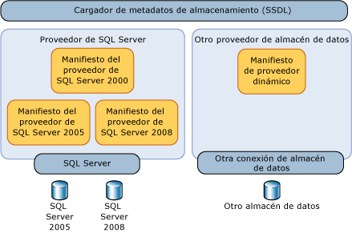
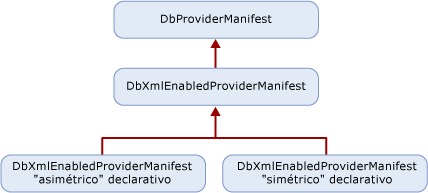

# <a name="provider-manifest-specification"></a>Especificación del manifiesto del proveedor
En esta sección se explica cómo puede un proveedor de almacén de datos admitir los tipos y funciones del almacén de datos.  
  
 Servicios de entidad funciona con independencia de un proveedor de almacén de datos concreto aunque permite a un proveedor de datos definir explícitamente la forma en que los modelos, las asignaciones y las consultas interactuarán con un almacén de datos subyacente. Sin una capa de abstracción, Servicios de entidad solo podría seleccionarse como destino en un determinado almacén de datos o proveedor de datos.  
  
 Los tipos que admite el proveedor están directa o indirectamente admitidos por la base de datos subyacente. Estos tipos no son necesariamente los tipos de almacén exactos, pero los tipos que usa el proveedor para admitir Entity Framework. Los tipos de proveedor/almacén se describen en los términos de Entity Data Model (EDM).  
  
 Los tipos de parámetro y de valores devueltos para las funciones admitidas por el almacén de datos se especifican en términos de EDM.  
  
## <a name="requirements"></a>Requisitos  
 Entity Framework y el almacén de datos deben poder pasar datos de un lado a otro en tipos conocidos sin pérdida de datos ni truncamiento.  
  
 Las herramientas deben ser capaces de cargar el manifiesto del proveedor en tiempo de diseño sin tener que abrir una conexión al almacén de datos.  
  
 Entity Framework distingue mayúsculas de minúsculas, pero es posible que el almacén de datos subyacente no lo sea. Cuando los artefactos de EDM (identificadores y nombres de tipo, por ejemplo) se definen y se usan en el manifiesto, deben usar la sensibilidad a mayúsculas y minúsculas de Entity Framework. Si en el manifiesto del proveedor aparecen elementos de almacén de datos que pueden distinguir entre mayúsculas y minúsculas, esa grafía debe mantenerse en el manifiesto del proveedor.  
  
 Entity Framework requiere un manifiesto de proveedor para todos los proveedores de datos. Si intenta usar un proveedor que no tiene un manifiesto de proveedor con Entity Framework, obtendrá un error.  
  
 En la tabla siguiente se describen los tipos de excepciones que Entity Framework produciría cuando surjan excepciones a través de la interacción del proveedor:  
  
|Problema|Excepción|  
|-----------|---------------|  
|El proveedor no admite GetProviderManifest en DbProviderServices.|ProviderIncompatibleException|  
|Falta el manifiesto del proveedor: el proveedor devuelve `null` cuando se intenta recuperar el manifiesto del proveedor.|ProviderIncompatibleException|  
|Manifiesto del proveedor no válido: el proveedor devuelve XML no válido cuando se intenta recuperar el manifiesto del proveedor.|ProviderIncompatibleException|  
  
## <a name="scenarios"></a>Escenarios  
 Un proveedor debe admitir los siguientes escenarios:  
  
### <a name="writing-a-provider-with-symmetric-type-mapping"></a>Escribir un proveedor con asignación de tipos simétrica  
 Puede escribir un proveedor para Entity Framework donde cada tipo de almacén se asigna a un único tipo de EDM, independientemente de la dirección de asignación. En el caso de un tipo de proveedor que tenga una asignación simple que se corresponda con un tipo de EDM, puede utilizar una solución simétrica, porque el sistema de tipos es simple o coincide con los tipos de EDM.  
  
 Puede utilizar la simplicidad de su dominio y generar un manifiesto del proveedor declarativo estático.  
  
 Puede escribir un archivo XML que tenga dos secciones:  
  
- Una lista de tipos de proveedor expresada en términos de "equivalente de EDM" de un tipo de almacén o función. Los tipos de almacén tienen tipos de EDM equivalentes. Las funciones de almacén tienen funciones de EDM correspondientes. Por ejemplo, varchar es un tipo de SQL Server, pero el tipo de EDM correspondiente es string.  
  
- Una lista de funciones admitida por el proveedor donde los tipos de parámetro y de valores devueltos se expresen en términos de EDM.  
  
### <a name="writing-a-provider-with-asymmetric-type-mapping"></a>Escribir un proveedor con asignación de tipos asimétrica  
 Al escribir un proveedor de almacén de datos para Entity Framework, la asignación de tipos de EDM a proveedor para algunos tipos puede ser diferente de la asignación de tipos de proveedor a EDM. Por ejemplo, la cadena PrimitiveTypeKind.String de EDM ilimitada se puede asignar a nvarchar(4000) en el proveedor, mientras que nvarchar(4000) se asigna a la cadena PrimitiveTypeKind.String(MaxLength=4000) de EDM.  
  
 Puede escribir un archivo XML que tenga dos secciones:  
  
- Una lista de tipos de proveedor expresada en términos de EDM y defina la asignación para ambas direcciones: EDM a proveedor y proveedor a EDM.  
  
- Una lista de funciones admitida por el proveedor donde los tipos de parámetro y de valores devueltos se expresen en términos de EDM.  
  
## <a name="provider-manifest-discoverability"></a>Detectabilidad del manifiesto del proveedor  
 Varios tipos de componente utilizan indirectamente el manifiesto en Servicios de entidad (por ejemplo Tools o Query), pero los metadatos lo aprovechan de forma más directa con el uso del cargador de metadatos del almacén de datos.  
  
   
  
 Sin embargo, un proveedor determinado puede admitir almacenes diferentes o distintas versiones del mismo almacén. Por consiguiente, un proveedor debe notificar un manifiesto distinto para cada almacén de datos compatible.  
  
### <a name="provider-manifest-token"></a>Token del manifiesto del proveedor  
 Cuando se abre una conexión al almacén de datos, el proveedor puede consultar información para devolver el manifiesto correcto. Esto puede no ser posible en escenarios sin conexión en los que no haya información de conexión disponible o cuando no se pueda conectar con el almacén. Identifique el manifiesto mediante el atributo `ProviderManifestToken` del elemento `Schema` en el archivo .ssdl. No hay ningún formato obligatorio para este atributo; el proveedor elige la información mínima necesaria para identificar un manifiesto sin abrir una conexión al almacén.  
  
 Por ejemplo:  
  
```xml  
<Schema Namespace="Northwind" Provider="System.Data.SqlClient" ProviderManifestToken="2005" xmlns:edm="http://schemas.microsoft.com/ado/2006/04/edm/ssdl" xmlns="http://schemas.microsoft.com/ado/2006/04/edm/ssdl">  
```  
  
## <a name="provider-manifest-programming-model"></a>Modelo de programación del manifiesto del proveedor  
 Los proveedores se derivan de <xref:System.Data.Common.DbXmlEnabledProviderManifest>, lo que les permite especificar sus manifiestos mediante declaración. La siguiente ilustración muestra la jerarquía de clases de un proveedor:  
  
   
  
### <a name="discoverability-api"></a>API de detectabilidad  
 El cargador Metadatos de almacenamiento (StoreItemCollection) carga el manifiesto de proveedor, bien mediante una conexión al almacén de datos o utilizando un token de manifiesto del proveedor.  
  
#### <a name="using-a-data-store-connection"></a>Utilizar una conexión al almacén de datos  
 Cuando la conexión del almacén de datos está disponible, llame <xref:System.Data.Common.DbProviderServices.GetProviderManifestToken%2A?displayProperty=nameWithType> para devolver el token que se pasa al <xref:System.Data.Common.DbProviderServices.GetProviderManifest%2A> método, que devuelve <xref:System.Data.Common.DbProviderManifest>. Este método delega en la `GetDbProviderManifestToken`implementación del proveedor de .  
  
```csharp
public string GetProviderManifestToken(DbConnection connection);  
public DbProviderManifest GetProviderManifest(string manifestToken);  
```  
  
#### <a name="using-a-provider-manifest-token"></a>Usar un token de manifiesto del proveedor  
 En el caso del escenario sin conexión, el token se toma de la representación SSDL. El SSDL le permite especificar un ProviderManifestToken (consulte elemento de [esquema (SSDL)](/ef/ef6/modeling/designer/advanced/edmx/ssdl-spec#schema-element-ssdl) para obtener más información). Por ejemplo, si no se puede abrir una conexión, SSDL tiene un token de manifiesto del proveedor que especifica información sobre el manifiesto.  
  
```csharp
public DbProviderManifest GetProviderManifest(string manifestToken);  
```  
  
### <a name="provider-manifest-schema"></a>Esquema del manifiesto del proveedor  
 El esquema de información definido para cada proveedor contiene la información estática que van a utilizar los metadatos:  
  
```xml  
<?xml version="1.0" encoding="utf-8"?>  
<xs:schema elementFormDefault="qualified"  
   xmlns:xs="http://www.w3.org/2001/XMLSchema"  
   targetNamespace="http://schemas.microsoft.com/ado/2006/04/edm/providermanifest"  
   xmlns:pm="http://schemas.microsoft.com/ado/2006/04/edm/providermanifest">  
  
  <xs:element name="ProviderManifest">  
    <xs:complexType>  
      <xs:sequence>  
        <xs:element name="Types" type="pm:TTypes" minOccurs="1" maxOccurs="1" />  
        <xs:element name="Functions" type="pm:TFunctions" minOccurs="0" maxOccurs="1"/>  
      </xs:sequence>  
      <xs:attribute name="Namespace" type="xs:string" use="required"/>  
    </xs:complexType>  
  </xs:element>  
  <xs:complexType name="TVersion">  
    <xs:attribute name="Major" type="xs:int" use="required" />  
    <xs:attribute name="Minor" type="xs:int" use="required" />  
    <xs:attribute name="Build" type="xs:int" use="required" />  
    <xs:attribute name="Revision" type="xs:int" use="required" />  
  </xs:complexType>  
  
  <xs:complexType name="TIntegerFacetDescription">  
    <xs:attribute name="Minimum" type="xs:int" use="optional" />  
    <xs:attribute name="Maximum" type="xs:int" use="optional" />  
    <xs:attribute name="DefaultValue" type="xs:int" use="optional" />  
    <xs:attribute name="Constant" type="xs:boolean" default="false" />  
  </xs:complexType>  
  
  <xs:complexType name="TBooleanFacetDescription">  
    <xs:attribute name="DefaultValue" type="xs:boolean" use="optional" />  
    <xs:attribute name="Constant" type="xs:boolean" default="true" />  
  </xs:complexType>  
  
  <xs:complexType name="TDateTimeFacetDescription">  
    <xs:attribute name="Constant" type="xs:boolean" default="false" />  
  </xs:complexType>  
  
  <xs:complexType name="TFacetDescriptions">  
    <xs:choice maxOccurs="unbounded">  
      <xs:element name="Precision" minOccurs="0" maxOccurs="1" type="pm:TIntegerFacetDescription"/>  
      <xs:element name="Scale" minOccurs="0" maxOccurs="1" type="pm:TIntegerFacetDescription"/>  
      <xs:element name="MaxLength" minOccurs="0" maxOccurs="1" type="pm:TIntegerFacetDescription"/>  
      <xs:element name="Unicode" minOccurs="0" maxOccurs="1" type="pm:TBooleanFacetDescription"/>  
      <xs:element name="FixedLength" minOccurs="0" maxOccurs="1" type="pm:TBooleanFacetDescription"/>  
    </xs:choice>  
  </xs:complexType>  
  
  <xs:complexType name="TType">  
    <xs:sequence>  
      <xs:element name="FacetDescriptions" type="pm:TFacetDescriptions" minOccurs="0" maxOccurs="1"/>  
    </xs:sequence>  
    <xs:attribute name="Name" type="xs:string" use="required"/>  
    <xs:attribute name="PrimitiveTypeKind" type="pm:TPrimitiveTypeKind" use="required" />  
  </xs:complexType>  
  
  <xs:complexType name="TTypes">  
    <xs:sequence>  
      <xs:element name="Type" type="pm:TType" minOccurs="0" maxOccurs="unbounded"/>  
    </xs:sequence>  
  </xs:complexType>  
  
  <xs:attributeGroup name="TFacetAttribute">  
    <xs:attribute name="Precision" type="xs:int" use="optional"/>  
    <xs:attribute name="Scale" type="xs:int" use="optional"/>  
    <xs:attribute name="MaxLength" type="xs:int" use="optional"/>  
    <xs:attribute name="Unicode" type="xs:boolean" use="optional"/>  
    <xs:attribute name="FixedLength" type="xs:boolean" use="optional"/>  
  </xs:attributeGroup>  
  
  <xs:complexType name="TFunctionParameter">  
    <xs:attribute name="Name" type="xs:string" use="required" />  
    <xs:attribute name="Type" type="xs:string" use="required" />  
    <xs:attributeGroup ref="pm:TFacetAttribute" />  
    <xs:attribute name="Mode" type="pm:TParameterDirection" use="required" />  
  </xs:complexType>  
  
  <xs:complexType name="TReturnType">  
    <xs:attribute name="Type" type="xs:string" use="required" />  
    <xs:attributeGroup ref="pm:TFacetAttribute" />  
  </xs:complexType>  
  
  <xs:complexType name="TFunction">  
    <xs:choice minOccurs="0" maxOccurs ="unbounded">  
      <xs:element name ="ReturnType" type="pm:TReturnType" minOccurs="0" maxOccurs="1" />  
      <xs:element name="Parameter" type="pm:TFunctionParameter" minOccurs="0" maxOccurs="unbounded"/>  
    </xs:choice>  
    <xs:attribute name="Name" type="xs:string" use="required" />  
    <xs:attribute name="Aggregate" type="xs:boolean" use="optional" />  
    <xs:attribute name="BuiltIn" type="xs:boolean" use="optional" />  
    <xs:attribute name="StoreFunctionName" type="xs:string" use="optional" />  
    <xs:attribute name="NiladicFunction" type="xs:boolean" use="optional" />  
    <xs:attribute name="ParameterTypeSemantics" type="pm:TParameterTypeSemantics" use="optional" default="AllowImplicitConversion" />  
  </xs:complexType>  
  
  <xs:complexType name="TFunctions">  
    <xs:sequence>  
      <xs:element name="Function" type="pm:TFunction" minOccurs="0" maxOccurs="unbounded"/>  
    </xs:sequence>  
  </xs:complexType>  
  
  <xs:simpleType name="TPrimitiveTypeKind">  
    <xs:restriction base="xs:string">  
      <xs:enumeration value="Binary"/>  
      <xs:enumeration value="Boolean"/>  
      <xs:enumeration value="Byte"/>  
      <xs:enumeration value="Decimal"/>  
      <xs:enumeration value="DateTime"/>  
      <xs:enumeration value="Time"/>  
      <xs:enumeration value="DateTimeOffset"/>
      <xs:enumeration value="Double"/>  
      <xs:enumeration value="Guid"/>  
      <xs:enumeration value="Single"/>  
      <xs:enumeration value="SByte"/>  
      <xs:enumeration value="Int16"/>  
      <xs:enumeration value="Int32"/>  
      <xs:enumeration value="Int64"/>  
      <xs:enumeration value="String"/>  
    </xs:restriction>  
  </xs:simpleType>  
  
  <xs:simpleType name="TParameterDirection">  
    <xs:restriction base="xs:string">  
      <xs:enumeration value="In"/>  
      <xs:enumeration value="Out"/>  
      <xs:enumeration value="InOut"/>  
    </xs:restriction>  
  </xs:simpleType>  
  
  <xs:simpleType name="TParameterTypeSemantics">  
    <xs:restriction base="xs:string">  
      <xs:enumeration value="ExactMatchOnly" />  
      <xs:enumeration value="AllowImplicitPromotion" />  
      <xs:enumeration value="AllowImplicitConversion" />  
    </xs:restriction>  
  </xs:simpleType>  
</xs:schema>  
```  
  
#### <a name="types-node"></a>Nodo Types  
 El nodo Types del manifiesto del proveedor contiene información sobre los tipos admitidos de forma nativa por el almacén de datos o a través del proveedor.  
  
##### <a name="type-node"></a>Nodo Type  
 Cada nodo Type define un tipo de proveedor en términos de EDM. El nodo Type describe el nombre del tipo de proveedor e información relacionada con el tipo de modelo al que está asignado, así como facetas que describen esa asignación de tipos.  
  
 Para expresar esta información de tipos en el manifiesto del proveedor, cada declaración de TypeInformation debe definir distintas descripciones de facetas para cada Type:  
  
|Nombre del atributo|Tipo de datos|Obligatorio|Valor predeterminado|Descripción|  
|--------------------|---------------|--------------|-------------------|-----------------|  
|Nombre|String|Sí|N/D|El nombre del tipo de datos específico del proveedor|  
|PrimitiveTypeKind|PrimitiveTypeKind|Sí|N/D|Nombre de tipo EDM|  
  
###### <a name="function-node"></a>Nodo Function  
 Cada nodo Function define una función única disponible a través del proveedor.  
  
|Nombre del atributo|Tipo de datos|Obligatorio|Valor predeterminado|Descripción|  
|--------------------|---------------|--------------|-------------------|-----------------|  
|Nombre|String|Sí|N/D|Identificador/nombre de la función|  
|ReturnType|String|Sin |Void|El tipo de valor devuelto EDM de la función|  
|Agregado|Boolean|Sin |False|True si la función es una función de agregado|  
|BuiltIn|Boolean|Sin |True|True si la función está integrada en el almacén de datos|  
|StoreFunctionName|String|Sin |\<Name>|Nombre de la función en el almacén de datos.  Permite un nivel de redirección de nombres de función.|  
|NiladicFunction|Boolean|Sin |False|True si la función no requiere parámetros y se invoca sin ningún parámetro|  
|ParameterType<br /><br /> Semántica|ParameterSemantics|Sin |AllowImplicit<br /><br /> Conversión|Opción de cómo la canalización de la consulta debe tratar la sustitución de tipos de parámetro:<br /><br /> - ExactMatchOnly<br />- AllowImplicitPromotion<br />- AllowImplicitConversion|  
  
 **Nodo Parameters**  
  
 Cada función tiene una colección de uno o más nodos Parameter.  
  
|Nombre del atributo|Tipo de datos|Obligatorio|Valor predeterminado|Descripción|  
|--------------------|---------------|--------------|-------------------|-----------------|  
|Nombre|String|Sí|N/D|Identificador/nombre del parámetro.|  
|Tipo|String|Sí|N/D|El tipo EDM del parámetro.|  
|Mode|Parámetro<br /><br /> Dirección|Sí|N/D|Dirección del parámetro:<br /><br /> - en<br />- fuera<br />- inout|  
  
##### <a name="namespace-attribute"></a>Atributo Namespace  
 Cada proveedor de almacén de datos debe definir un espacio de nombres o un grupo de espacios de nombres para la información definida en el manifiesto. Este espacio de nombres se puede utilizar en consultas de Entity SQL para resolver nombres de funciones y tipos. Por ejemplo: SqlServer. Ese espacio de nombres debe ser distinto del espacio de nombres canónico, EDM, definido por Servicios de entidad para que las consultas de Entity SQL admitan las funciones estándar.  
  
## <a name="see-also"></a>Consulte también

- [Escribir un proveedor de datos de Entity Framework](writing-an-ef-data-provider.md)
