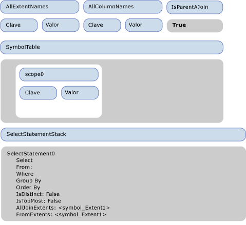
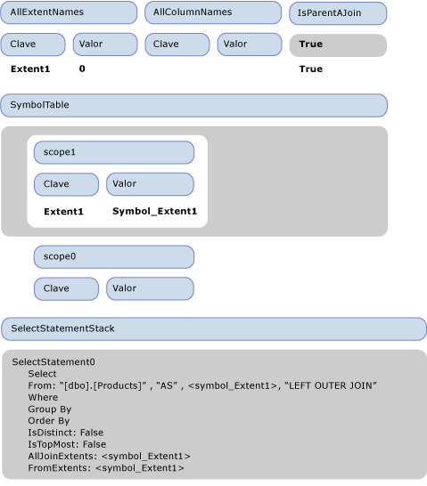
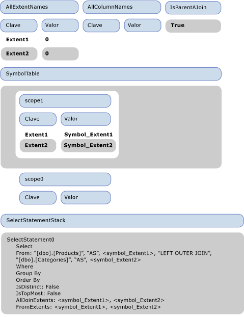
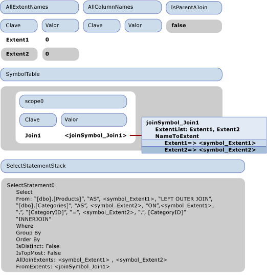
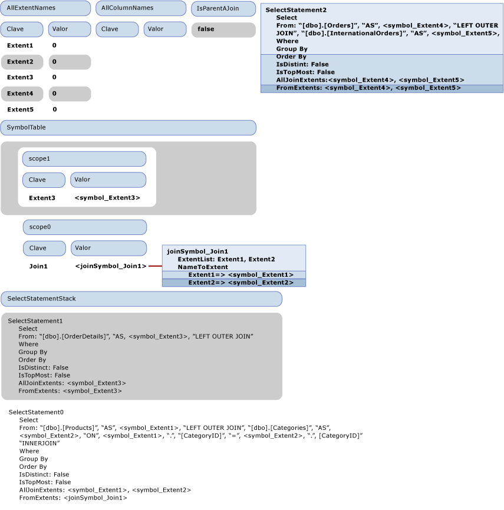
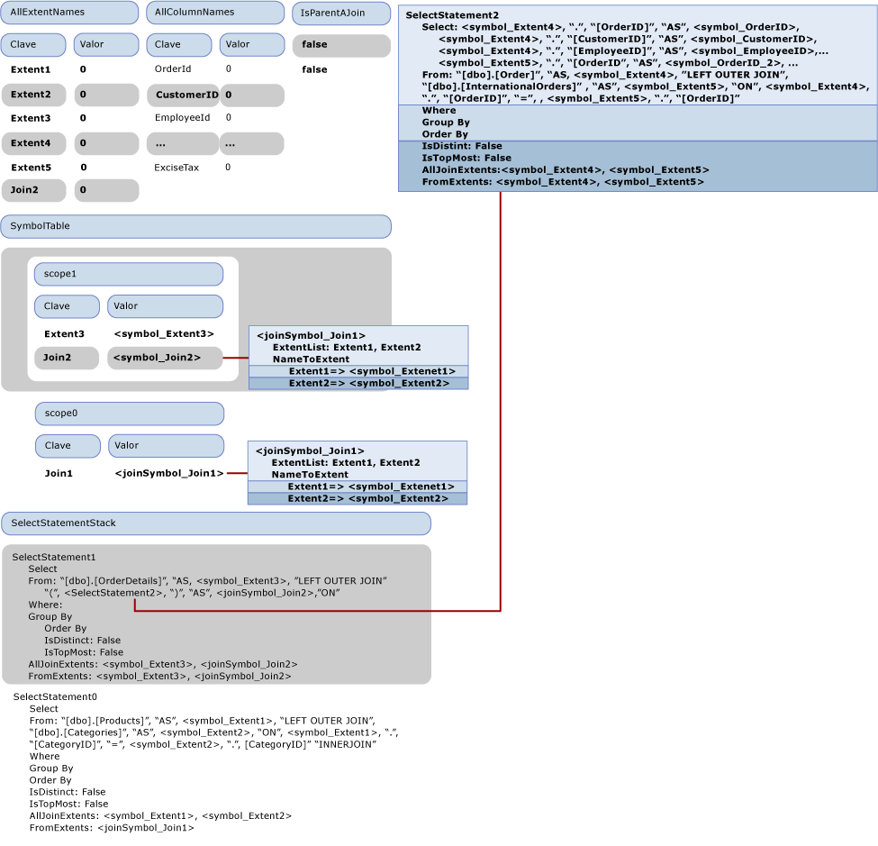

# <a name="walkthrough-sql-generation"></a><span data-ttu-id="3da70-102">Tutorial: Generación de SQL</span><span class="sxs-lookup"><span data-stu-id="3da70-102">Walkthrough: SQL Generation</span></span>

<span data-ttu-id="3da70-103">En este tema se muestra cómo se produce la generación de SQL en el [proveedor de ejemplo](https://code.msdn.microsoft.com/windowsdesktop/Entity-Framework-Sample-6a9801d0).</span><span class="sxs-lookup"><span data-stu-id="3da70-103">This topic illustrates how SQL generation occurs in the [Sample Provider](https://code.msdn.microsoft.com/windowsdesktop/Entity-Framework-Sample-6a9801d0).</span></span> <span data-ttu-id="3da70-104">La siguiente consulta de Entity SQL utiliza el modelo incluido con el proveedor de ejemplo:</span><span class="sxs-lookup"><span data-stu-id="3da70-104">The following Entity SQL query uses the model that is included with the sample provider:</span></span>

```sql
SELECT  j1.ProductId, j1.ProductName, j1.CategoryName, j2.ShipCountry, j2.ProductId
FROM (  SELECT P.ProductName, P.ProductId, P.Category.CategoryName
        FROM NorthwindEntities.Products AS P) as j1
INNER JOIN (SELECT OD.ProductId, OD.Order.ShipCountry as ShipCountry
            FROM NorthwindEntities.OrderDetails AS OD) as j2
            ON j1.ProductId == j2.ProductId
```

<span data-ttu-id="3da70-105">La consulta genera el siguiente árbol de comandos de salida que se pasa al proveedor:</span><span class="sxs-lookup"><span data-stu-id="3da70-105">The query produces the following output command tree that is passed to the provider:</span></span>

```
DbQueryCommandTree
|_Parameters
|_Query : Collection{Record['C1'=Edm.Int32, 'ProductID'=Edm.Int32, 'ProductName'=Edm.String, 'CategoryName'=Edm.String, 'ShipCountry'=Edm.String, 'ProductID1'=Edm.Int32]}
  |_Project
    |_Input : 'Join4'
    | |_InnerJoin
    |   |_Left : 'Join1'
    |   | |_LeftOuterJoin
    |   |   |_Left : 'Extent1'
    |   |   | |_Scan : dbo.Products
    |   |   |_Right : 'Extent2'
    |   |   | |_Scan : dbo.Categories
    |   |   |_JoinCondition
    |   |     |_
    |   |       |_Var(Extent1).CategoryID
    |   |       |_=
    |   |       |_Var(Extent2).CategoryID
    |   |_Right : 'Join3'
    |   | |_LeftOuterJoin
    |   |   |_Left : 'Extent3'
    |   |   | |_Scan : dbo.OrderDetails
    |   |   |_Right : 'Join2'
    |   |   | |_LeftOuterJoin
    |   |   |   |_Left : 'Extent4'
    |   |   |   | |_Scan : dbo.Orders
    |   |   |   |_Right : 'Extent5'
    |   |   |   | |_Scan : dbo.InternationalOrders
    |   |   |   |_JoinCondition
    |   |   |     |_
    |   |   |       |_Var(Extent4).OrderID
    |   |   |       |_=
    |   |   |       |_Var(Extent5).OrderID
    |   |   |_JoinCondition
    |   |     |_
    |   |       |_Var(Extent3).OrderID
    |   |       |_=
    |   |       |_Var(Join2).Extent4.OrderID
    |   |_JoinCondition
    |     |_
    |       |_Var(Join1).Extent1.ProductID
    |       |_=
    |       |_Var(Join3).Extent3.ProductID
    |_Projection
      |_NewInstance : Record['C1'=Edm.Int32, 'ProductID'=Edm.Int32, 'ProductName'=Edm.String, 'CategoryName'=Edm.String, 'ShipCountry'=Edm.String, 'ProductID1'=Edm.Int32]
        |_Column : 'C1'
        | |_1
        |_Column : 'ProductID'
        | |_Var(Join4).Join1.Extent1.ProductID
        |_Column : 'ProductName'
        | |_Var(Join4).Join1.Extent1.ProductName
        |_Column : 'CategoryName'
        | |_Var(Join4).Join1.Extent2.CategoryName
        |_Column : 'ShipCountry'
        | |_Var(Join4).Join3.Join2.Extent4.ShipCountry
        |_Column : 'ProductID1'
          |_Var(Join4).Join3.Extent3.ProductID
```

 <span data-ttu-id="3da70-106">En este tema se describe cómo traducir este árbol de comandos de salida en las siguientes instrucciones SQL.</span><span class="sxs-lookup"><span data-stu-id="3da70-106">This topic describes how to translate this output command tree into the following SQL statements.</span></span>

```sql
SELECT
1 AS [C1],
[Extent1].[ProductID] AS [ProductID],
[Extent1].[ProductName] AS [ProductName],
[Extent2].[CategoryName] AS [CategoryName],
[Join3].[ShipCountry] AS [ShipCountry],
[Join3].[ProductID] AS [ProductID1]
FROM   [dbo].[Products] AS [Extent1]
LEFT OUTER JOIN [dbo].[Categories] AS [Extent2] ON [Extent1].[CategoryID] = [Extent2].[CategoryID]
INNER JOIN
(SELECT [Extent3].[OrderID] AS [OrderID1], [Extent3].[ProductID] AS [ProductID], [Extent3].[UnitPrice] AS [UnitPrice], [Extent3].[Quantity] AS [Quantity], [Extent3].[Discount] AS [Discount], [Join2].[OrderID2], [Join2].[CustomerID], [Join2].[EmployeeID], [Join2].[OrderDate], [Join2].[RequiredDate], [Join2].[ShippedDate], [Join2].[Freight], [Join2].[ShipName], [Join2].[ShipAddress], [Join2].[ShipCity], [Join2].[ShipRegion], [Join2].[ShipPostalCode], [Join2].[ShipCountry], [Join2].[OrderID3], [Join2].[CustomsDescription], [Join2].[ExciseTax]
FROM  [dbo].[OrderDetails] AS [Extent3]
LEFT OUTER JOIN
      (SELECT [Extent4].[OrderID] AS [OrderID2], [Extent4].[CustomerID] AS [CustomerID], [Extent4].[EmployeeID] AS [EmployeeID], [Extent4].[OrderDate] AS [OrderDate], [Extent4].[RequiredDate] AS [RequiredDate], [Extent4].[ShippedDate] AS [ShippedDate], [Extent4].[Freight] AS [Freight], [Extent4].[ShipName] AS [ShipName], [Extent4].[ShipAddress] AS [ShipAddress], [Extent4].[ShipCity] AS [ShipCity], [Extent4].[ShipRegion] AS [ShipRegion], [Extent4].[ShipPostalCode] AS [ShipPostalCode], [Extent4].[ShipCountry] AS [ShipCountry], [Extent5].[OrderID] AS [OrderID3], [Extent5].[CustomsDescription] AS [CustomsDescription], [Extent5].[ExciseTax] AS [ExciseTax]
FROM  [dbo].[Orders] AS [Extent4]
LEFT OUTER JOIN [dbo].[InternationalOrders] AS [Extent5] ON [Extent4].[OrderID] = [Extent5].[OrderID]
      ) AS [Join2] ON [Extent3].[OrderID] = [Join2].[OrderID2]
   ) AS [Join3] ON [Extent1].[ProductID] = [Join3].[ProductID]
```

## <a name="first-phase-of-sql-generation-visiting-the-expression-tree"></a><span data-ttu-id="3da70-107">Primera fase de la generación de SQL: Visitar el árbol de expresión</span><span class="sxs-lookup"><span data-stu-id="3da70-107">First Phase of SQL Generation: Visiting the Expression Tree</span></span>

<span data-ttu-id="3da70-108">La siguiente figura muestra el estado vacío inicial del visitante.</span><span class="sxs-lookup"><span data-stu-id="3da70-108">The following figure illustrates the initial empty state of the visitor.</span></span>  <span data-ttu-id="3da70-109">A lo largo de este tema, solo se muestran las propiedades pertinentes a la explicación del tutorial.</span><span class="sxs-lookup"><span data-stu-id="3da70-109">Throughout this topic, only the properties relevant to the walkthrough explanation are shown.</span></span>

<span data-ttu-id="3da70-110"></span><span class="sxs-lookup"><span data-stu-id="3da70-110"></span></span>

<span data-ttu-id="3da70-111">Cuando se visita el nodo Project, se llama a VisitInputExpression en su entrada (Join4), que activa la visita de Join4 por el método VisitJoinExpression.</span><span class="sxs-lookup"><span data-stu-id="3da70-111">When the Project  node is visited, VisitInputExpression is called over its input (Join4), which triggers the visit of Join4 by the method VisitJoinExpression.</span></span> <span data-ttu-id="3da70-112">Dado que esta es la combinación de nivel superior, IsParentAJoin devuelve el valor false y se crea una nueva instrucción SqlSelectStatement (SelectStatement0) que se inserta en la pila de instrucciones SELECT.</span><span class="sxs-lookup"><span data-stu-id="3da70-112">Because this is a topmost join, IsParentAJoin returns false and a new SqlSelectStatement (SelectStatement0) is created and pushed on the SELECT statement stack.</span></span> <span data-ttu-id="3da70-113">Asimismo, se introduce un nuevo ámbito (scope0) en la tabla de símbolos.</span><span class="sxs-lookup"><span data-stu-id="3da70-113">Also, a new scope (scope0) is entered in the symbol table.</span></span> <span data-ttu-id="3da70-114">Antes de visitar la primera entrada (izquierda) de la combinación, se inserta "true" en la pila de IsParentAJoin.</span><span class="sxs-lookup"><span data-stu-id="3da70-114">Before the first (left) input of the join is visited, 'true' is pushed on the IsParentAJoin stack.</span></span> <span data-ttu-id="3da70-115">Justo antes de visitar Join1, que es la entrada izquierda de Join4, el estado del visitante es el que se muestra en la figura siguiente.</span><span class="sxs-lookup"><span data-stu-id="3da70-115">Right before Join1, which is the left input of Join4, is visited, the state of the visitor is as shown in the next figure.</span></span>

<span data-ttu-id="3da70-116"></span><span class="sxs-lookup"><span data-stu-id="3da70-116"></span></span>

<span data-ttu-id="3da70-117">Cuando el método de visita de combinación se invoca en Join4, IsParentAJoin es "true", por lo que reutiliza la instrucción de selección SelectStatement0 actual.</span><span class="sxs-lookup"><span data-stu-id="3da70-117">When the join visit method is invoked over Join4, IsParentAJoin is true, thus it reuses the current select statement SelectStatement0.</span></span> <span data-ttu-id="3da70-118">Se introduce un nuevo ámbito (scope1).</span><span class="sxs-lookup"><span data-stu-id="3da70-118">A new scope is entered (scope1).</span></span> <span data-ttu-id="3da70-119">Antes de visitar su elemento secundario izquierdo, Extent1, se inserta otro valor "true" en la pila de IsParentAJoin.</span><span class="sxs-lookup"><span data-stu-id="3da70-119">Before visiting its left child, Extent1, another true is pushed on the IsParentAJoin stack.</span></span>

<span data-ttu-id="3da70-120">Cuando se visita Extent1, dado que IsParentAJoin devuelve "true", devuelve un objeto SqlBuilder que contiene "[dbo].[Products]".</span><span class="sxs-lookup"><span data-stu-id="3da70-120">When Extent1 is visited, because IsParentAJoin returns true, it returns a SqlBuilder containing "[dbo].[Products]".</span></span> <span data-ttu-id="3da70-121">El control vuelve al método que visita Join4.</span><span class="sxs-lookup"><span data-stu-id="3da70-121">The control returns to the method visiting Join4.</span></span> <span data-ttu-id="3da70-122">Se extrae una entrada de IsParentAJoin y se llama a ProcessJoinInputResult, que anexa el resultado de la visita a Extent1 a la cláusula From de SelectStatement0.</span><span class="sxs-lookup"><span data-stu-id="3da70-122">An entry is popped from IsParentAJoin, and ProcessJoinInputResult is called, which appends the result of visiting Extent1 to the From clause of SelectStatement0.</span></span> <span data-ttu-id="3da70-123">Se crea un nuevo símbolo FROM, symbol_Extent1, para el nombre de enlace de entrada "Extent1" y se agrega a FromExtents de SelectStatement0. Asimismo, se anexan "As" y symbol_Extent1 a la cláusula FROM.</span><span class="sxs-lookup"><span data-stu-id="3da70-123">A new from symbol, symbol_Extent1, for the input binding name "Extent1" is created, added to the FromExtents of SelectStatement0, and also "As" and  symbol_Extent1 are appended to the from clause.</span></span> <span data-ttu-id="3da70-124">Se agrega una nueva entrada a AllExtentNames para "Extent1" con el valor de 0.</span><span class="sxs-lookup"><span data-stu-id="3da70-124">A new entry is added to AllExtentNames for "Extent1" with the value of 0.</span></span> <span data-ttu-id="3da70-125">Se agrega una nueva entrada al ámbito actual en la tabla de símbolos para asociar "Extent1" a su símbolo symbol_Extent1.</span><span class="sxs-lookup"><span data-stu-id="3da70-125">A new entry is added to the current scope in the symbol table to associate "Extent1" with its symbol symbol_Extent1.</span></span> <span data-ttu-id="3da70-126">Symbol_Extent1 también se agrega a AllJoinExtents de SqlSelectStatement.</span><span class="sxs-lookup"><span data-stu-id="3da70-126">Symbol_Extent1 is also added to the AllJoinExtents of the SqlSelectStatement.</span></span>

<span data-ttu-id="3da70-127">Antes de que se visite la entrada derecha de Join1, se agrega "LEFT OUTER JOIN" a la cláusula From de SelectStatement0.</span><span class="sxs-lookup"><span data-stu-id="3da70-127">Before the right input of Join1 is visited, "LEFT OUTER JOIN" is added to the From clause of SelectStatement0.</span></span> <span data-ttu-id="3da70-128">Dado que la entrada derecha es una expresión Scan, se inserta de nuevo "true" en la pila de IsParentAJoin.</span><span class="sxs-lookup"><span data-stu-id="3da70-128">Because the right input is a Scan expression, true is again pushed to the IsParentAJoin stack.</span></span> <span data-ttu-id="3da70-129">El estado antes de visitar la entrada derecha es el que se muestra en la figura siguiente.</span><span class="sxs-lookup"><span data-stu-id="3da70-129">The state before visiting the right input as shown in the next figure.</span></span>

<span data-ttu-id="3da70-130"></span><span class="sxs-lookup"><span data-stu-id="3da70-130"></span></span>

<span data-ttu-id="3da70-131">La entrada derecha se procesa de la misma manera que la entrada izquierda.</span><span class="sxs-lookup"><span data-stu-id="3da70-131">The right input is processed in the same way as the left input.</span></span> <span data-ttu-id="3da70-132">El estado después de visitar la entrada derecha es el que se muestra en la figura siguiente.</span><span class="sxs-lookup"><span data-stu-id="3da70-132">The state after visiting the right input is shown in the next figure.</span></span>

<span data-ttu-id="3da70-133"></span><span class="sxs-lookup"><span data-stu-id="3da70-133"></span></span>

<span data-ttu-id="3da70-134">A continuación, se inserta "false" en la pila de IsParentAJoin y se procesa la condición de combinación Var(Extent1).CategoryID == Var(Extent2).CategoryID.</span><span class="sxs-lookup"><span data-stu-id="3da70-134">Next "false" is pushed on the IsParentAJoin stack and the join condition Var(Extent1).CategoryID == Var(Extent2).CategoryID is processed.</span></span> <span data-ttu-id="3da70-135">Var (Extent1) se resuelve en \<symbol_Extent1 > después de una búsqueda en la tabla de símbolos.</span><span class="sxs-lookup"><span data-stu-id="3da70-135">Var(Extent1) is resolved to \<symbol_Extent1> after a look up in the symbol table.</span></span> <span data-ttu-id="3da70-136">Dado que la instancia se resuelve en un símbolo simple, como resultado del procesamiento de var (Extent1). CategoryID, SqlBuilder con \<symbol1 > ". CategoryID ".</span><span class="sxs-lookup"><span data-stu-id="3da70-136">Because the instance is resolved to a simple Symbol, as a result of processing Var(Extent1).CategoryID, a SqlBuilder with \<symbol1>."CategoryID" is returned.</span></span> <span data-ttu-id="3da70-137">De igual forma se procesa el otro lado de la comparación. El resultado de la visita de la condición de combinación se anexa a la cláusula FROM de SelectStatement1 y el valor "false" se extrae de la pila de IsParentAJoin.</span><span class="sxs-lookup"><span data-stu-id="3da70-137">Similarly the other side of the comparison is processed, and the result of visiting the join condition is appended to the FROM clause of SelectStatement1 and the value "false" is popped from the IsParentAJoin stack.</span></span>

<span data-ttu-id="3da70-138">Con esto, Join1 se ha procesado completamente y se ha extraído un ámbito de la tabla de símbolos.</span><span class="sxs-lookup"><span data-stu-id="3da70-138">With this, Join1 has completely been processed, and a scope is popped from the symbol table.</span></span>

<span data-ttu-id="3da70-139">El control vuelve a procesar Join4, el elemento primario de Join1.</span><span class="sxs-lookup"><span data-stu-id="3da70-139">Control returns to processing Join4, the parent of Join1.</span></span> <span data-ttu-id="3da70-140">Dado que el elemento secundario reutilizó la instrucción SELECT, las extensiones Join1 se reemplazan por un único \<símbolo de combinación joinSymbol_Join1 >.</span><span class="sxs-lookup"><span data-stu-id="3da70-140">Because the child reused the Select statement, the Join1 extents are replaced with a single Join symbol \<joinSymbol_Join1>.</span></span> <span data-ttu-id="3da70-141">También se agrega una nueva entrada a la tabla de símbolos para asociar \<Join1 a joinSymbol_Join1 >.</span><span class="sxs-lookup"><span data-stu-id="3da70-141">Also a new entry is added to the symbol table to associate Join1 with \<joinSymbol_Join1>.</span></span>

<span data-ttu-id="3da70-142">El nodo siguiente que se va a procesar es Join3, el segundo elemento secundario de Join4.</span><span class="sxs-lookup"><span data-stu-id="3da70-142">The next node to be processed is Join3, the second child of Join4.</span></span> <span data-ttu-id="3da70-143">Como es un elemento secundario derecho, se inserta "false" en la pila de IsParentAJoin.</span><span class="sxs-lookup"><span data-stu-id="3da70-143">As it is a right child, "false" is pushed to the IsParentAJoin stack.</span></span> <span data-ttu-id="3da70-144">En la figura siguiente se muestra el estado del visitante en este punto.</span><span class="sxs-lookup"><span data-stu-id="3da70-144">The state of the visitor at this point is illustrated in the next figure.</span></span>

<span data-ttu-id="3da70-145"></span><span class="sxs-lookup"><span data-stu-id="3da70-145"></span></span>

<span data-ttu-id="3da70-146">Para Join3, IsParentAJoin devuelve "false" y necesita iniciar una nueva instrucción SqlSelectStatement (SelectStatement1) e insertarla en la pila.</span><span class="sxs-lookup"><span data-stu-id="3da70-146">For Join3, IsParentAJoin returns false and needs to start a new SqlSelectStatement (SelectStatement1) and push it on the stack.</span></span> <span data-ttu-id="3da70-147">El procesamiento continúa de la misma forma que en las combinaciones anteriores, se inserta un nuevo ámbito en la pila y se procesan los elementos secundarios.</span><span class="sxs-lookup"><span data-stu-id="3da70-147">Processing continues as it did with the previous the previous joins, a new scope is pushed on the stack and the children are processed.</span></span> <span data-ttu-id="3da70-148">El elemento secundario izquierdo es una extensión (Extent3) y el elemento secundario derecho es una combinación (Join2) que también necesita iniciar una nueva instrucción sqlselectstatement: SelectStatement2.</span><span class="sxs-lookup"><span data-stu-id="3da70-148">The left child is an Extent (Extent3) and the right child is a join (Join2) which also needs to start a new SqlSelectStatement: SelectStatement2.</span></span> <span data-ttu-id="3da70-149">Los elementos secundarios de Join2 también son extensiones y se agregan en SelectStatement2.</span><span class="sxs-lookup"><span data-stu-id="3da70-149">The children on Join2 are Extents as well and are aggregated into SelectStatement2.</span></span>

<span data-ttu-id="3da70-150">En la siguiente figura se muestra el estado del visitante justo después de visitar Join2, pero antes de que se realice su procesamiento posterior (ProcessJoinInputResult):</span><span class="sxs-lookup"><span data-stu-id="3da70-150">The state of the visitor right after Join2 is visited, but before its post-processing (ProcessJoinInputResult) is done is shown in the next figure:</span></span>

<span data-ttu-id="3da70-151"></span><span class="sxs-lookup"><span data-stu-id="3da70-151"></span></span>

<span data-ttu-id="3da70-152">En la figura anterior, SelectStatement2 se muestra como flotante porque se extrajo de la pila, pero todavía no se ha procesado en el elemento primario.</span><span class="sxs-lookup"><span data-stu-id="3da70-152">In the previous figure, SelectStatement2 is shown as free floating because it was popped out of the stack, but not yet post processed by the parent.</span></span> <span data-ttu-id="3da70-153">Necesita agregarse a la parte FROM del elemento primario, pero no es una instrucción SQL completa sin una cláusula SELECT.</span><span class="sxs-lookup"><span data-stu-id="3da70-153">It needs to be added to the FROM part of the parent, but it is not a complete SQL statement without a SELECT clause.</span></span> <span data-ttu-id="3da70-154">Así que, en este punto, las columnas predeterminadas (todas las columnas generadas por sus entradas) se agregan a la lista de selección mediante el método AddDefaultColumns.</span><span class="sxs-lookup"><span data-stu-id="3da70-154">So, at this point, the default columns (all the columns produced by its inputs) are added to the select list by the method AddDefaultColumns.</span></span> <span data-ttu-id="3da70-155">AddDefaultColumns recorre en iteración los símbolos de FromExtents y para cada símbolo agrega todas las columnas introducidas en el ámbito.</span><span class="sxs-lookup"><span data-stu-id="3da70-155">AddDefaultColumns iterates over the symbols in FromExtents and for each symbol adds all the columns brought in scope.</span></span> <span data-ttu-id="3da70-156">Para un símbolo simple, examina el tipo de símbolo para recuperar todas sus propiedades que se van a agregar.</span><span class="sxs-lookup"><span data-stu-id="3da70-156">For a simple symbol, it looks at the symbol type to retrieve all its properties to be added.</span></span> <span data-ttu-id="3da70-157">También rellena el diccionario de AllColumnNames con los nombres de columna.</span><span class="sxs-lookup"><span data-stu-id="3da70-157">It also populates the AllColumnNames dictionary with the column names.</span></span> <span data-ttu-id="3da70-158">La instrucción SelectStatement2 completa se anexa a la cláusula FROM de SelectStatement1.</span><span class="sxs-lookup"><span data-stu-id="3da70-158">The completed SelectStatement2 is appended to the FROM clause of SelectStatement1.</span></span>

<span data-ttu-id="3da70-159">A continuación, se crea un nuevo símbolo de combinación para representar Join2, se marca como combinación anidada y se agrega a AllJoinExtents de SelectStatement1 y a la tabla de símbolos.</span><span class="sxs-lookup"><span data-stu-id="3da70-159">Next, a new join symbol is created to represent Join2, it is marked as a nested join and added to the AllJoinExtents of SelectStatement1 and added to the symbol table.</span></span>  <span data-ttu-id="3da70-160">Ahora es necesario procesar la condición de combinación de Join3, Var(Extent3).OrderID = Var(Join2).Extent4.OrderID.</span><span class="sxs-lookup"><span data-stu-id="3da70-160">Now the join condition of Join3, Var(Extent3).OrderID =  Var(Join2).Extent4.OrderID, needs to be processed.</span></span> <span data-ttu-id="3da70-161">El procesamiento del lado izquierdo es similar a la condición de combinación de Join1.</span><span class="sxs-lookup"><span data-stu-id="3da70-161">Processing of the left hand side is similar to the join condition of Join1.</span></span> <span data-ttu-id="3da70-162">Sin embargo, el procesamiento del lado derecho "Var(Join2).Extent4.OrderID" es diferente porque es necesario reducir la combinación.</span><span class="sxs-lookup"><span data-stu-id="3da70-162">However, the processing of the right and side "Var(Join2).Extent4.OrderID" is different because join flattening is required.</span></span>

<span data-ttu-id="3da70-163">La figura siguiente muestra el estado del visitante justo antes de procesar la expresión DbPropertyExpression "Var(Join2).Extent4.OrderID".</span><span class="sxs-lookup"><span data-stu-id="3da70-163">The next figure shows the state of the visitor right before the DbPropertyExpression "Var(Join2).Extent4.OrderID" is processed.</span></span>

<span data-ttu-id="3da70-164">Observe cómo se visita "Var(Join2).Extent4.OrderID".</span><span class="sxs-lookup"><span data-stu-id="3da70-164">Consider how "Var(Join2).Extent4.OrderID" is visited.</span></span> <span data-ttu-id="3da70-165">En primer lugar, se visita la propiedad de instancia "Var(Join2).Extent4", que es otra expresión DbPropertyExpression y visita primero su instancia "Var(Join2)".</span><span class="sxs-lookup"><span data-stu-id="3da70-165">First, the instance property "Var(Join2).Extent4" is visited, which is another DbPropertyExpression and first visits its instance "Var(Join2)".</span></span> <span data-ttu-id="3da70-166">En el ámbito de la parte superior de la tabla de símbolos, "Join2" se \<resuelve como joinSymbol_join2 >.</span><span class="sxs-lookup"><span data-stu-id="3da70-166">In the top most scope in the symbol table, "Join2" resolves to \<joinSymbol_join2>.</span></span> <span data-ttu-id="3da70-167">En el método de visita en el que DbPropertyExpression procesa "Var(Join2).Extent4", observe que se devuelve un símbolo de combinación al visitar la instancia y que es preciso quitar información de estructura jerárquica.</span><span class="sxs-lookup"><span data-stu-id="3da70-167">In the visit method for DbPropertyExpression processing "Var(Join2).Extent4" notice that a join symbol was returned when visiting the instance and flattening is required.</span></span>

<span data-ttu-id="3da70-168">Dado que se trata de una combinación anidada, se busca la propiedad "Extent4" en el Diccionario de NameToExtent del símbolo de combinación, se \<resuelve como symbol_Extent4 > y se devuelve un\<nuevo SymbolPair ( \<joinSymbol_join2 >, symbol_Extent4 >).</span><span class="sxs-lookup"><span data-stu-id="3da70-168">Since it is a nested join, we look up the property "Extent4" in the NameToExtent dictionary of the join symbol, resolve it to \<symbol_Extent4> and return a new SymbolPair(\<joinSymbol_join2>, \<symbol_Extent4>).</span></span> <span data-ttu-id="3da70-169">Dado que se devuelve un par de símbolos desde el procesamiento de la instancia de "var (Join2)". Extent4. OrderID ", la propiedad" OrderID "se resuelve desde el valor columnpart de ese par de símbolos\<(symbol_Extent4 >), que tiene una lista de las columnas de la extensión que representa.</span><span class="sxs-lookup"><span data-stu-id="3da70-169">Since a symbol pair is returned from the processing of the instance of "Var(Join2).Extent4.OrderID",  the property "OrderID" is resolved from the ColumnPart of that symbol pair (\<symbol_Extent4>), which has a list of the columns of the extent it represents.</span></span> <span data-ttu-id="3da70-170">Por lo tanto, "var (Join2). Extent4. OrderID "se resuelve en { \<joinSymbol_Join2 >,". ", \<symbol_OrderID >}.</span><span class="sxs-lookup"><span data-stu-id="3da70-170">So, "Var(Join2).Extent4.OrderID" is resolved to { \<joinSymbol_Join2>, ".", \<symbol_OrderID>}.</span></span>

<span data-ttu-id="3da70-171">De igual forma se procesa la condición de combinación de Join4.</span><span class="sxs-lookup"><span data-stu-id="3da70-171">The join condition of Join4 is similarly processed.</span></span> <span data-ttu-id="3da70-172">El control vuelve al método VisitInputExpression que procesó el proyecto de nivel superior.</span><span class="sxs-lookup"><span data-stu-id="3da70-172">The control returns to the VisitInputExpression method that processed the top most project.</span></span> <span data-ttu-id="3da70-173">Si se examina FromExtents de la instrucción SelectStatement0 devuelta, la entrada se identifica como una combinación, se quitan las extensiones originales y se reemplazan con una nueva extensión que únicamente incluye el símbolo de combinación.</span><span class="sxs-lookup"><span data-stu-id="3da70-173">Looking at the FromExtents of the returned SelectStatement0, the input is identified as a join, and removes the original extents and replaces them with a new extent with just the Join symbol.</span></span> <span data-ttu-id="3da70-174">La tabla de símbolos también se actualiza y, a continuación, se procesa la parte de la proyección del proyecto.</span><span class="sxs-lookup"><span data-stu-id="3da70-174">The symbol table is also updated and next the projection part of the Project is processed.</span></span> <span data-ttu-id="3da70-175">La resolución de las propiedades y la reducción de la extensión de la combinación se realizan como se ha descrito anteriormente.</span><span class="sxs-lookup"><span data-stu-id="3da70-175">The resolving of the properties and the flattening of the join extents is as described earlier.</span></span>

<span data-ttu-id="3da70-176"></span><span class="sxs-lookup"><span data-stu-id="3da70-176"></span></span>

<span data-ttu-id="3da70-177">Por último, se genera la siguiente instrucción SqlSelectStatement:</span><span class="sxs-lookup"><span data-stu-id="3da70-177">Finally, the following SqlSelectStatement is produced:</span></span>

```
SELECT:
  "1", " AS ", "[C1]",
  <symbol_Extent1>, ".", "[ProductID]", " AS ", "[ProductID]",
  <symbol_Extent1>, ".", "[ProductName]", " AS ", "[ProductName]",
  <symbol_Extent2>, ".", "[CategoryName]", " AS ", "[CategoryName]",
  <joinSymbol_Join3>, ".", <symbol_ShipCountry>, " AS ", "[ShipCountry]",
  <joinSymbol_Join3>, ".", <symbol_ProductID>, " AS ", "[ProductID1]"
FROM: "[dbo].[Products]", " AS ", <symbol_Extent1>,
        "LEFT OUTER JOIN ""[dbo].[Categories]", " AS ", <symbol_Extent2>, " ON ", <symbol_Extent1>, ".", "[CategoryID]", " = ", <symbol_Extent2>, ".", "[CategoryID]",
        "INNER JOIN ",
        " (", SELECT:
           <symbol_Extent3>, ".", "[OrderID]", " AS ", <symbol_OrderID>, ",
              <symbol_Extent3>, ".", "[ProductID]", " AS ", <symbol_ProductID>, ...,
         <joinSymbol_Join2>, ".", <symbol_OrderID_2>, ", ",
           <joinSymbol_Join2>, ".", <symbol_CustomerID>, ....,
        <joinSymbol_Join2>, ".", <symbol_OrderID_3>,
<joinSymbol_Join2>, ".", <symbol_CustomsDescription>,
<joinSymbol_Join2>, ".", <symbol_ExciseTax>
FROM: "[dbo].[OrderDetails]", " AS ", <symbol_Extent3>,
"LEFT OUTER JOIN ",
" (", SELECT:
<symbol_Extent4>, ".", "[OrderID]", " AS ", <symbol_OrderID_2>,
<symbol_Extent4>, ".", "[CustomerID]", " AS ", <symbol_CustomerID>, ...
<symbol_Extent5>, ".", "[OrderID]", " AS ", <symbol_OrderID_3>,
<symbol_Extent5>, ".", "[CustomsDescription]", " AS ", <symbol_CustomsDescription>,
<symbol_Extent5>, ".", "[ExciseTax]", " AS ", <symbol_ExciseTax>
FROM: "[dbo].[Orders]", " AS ", <symbol_Extent4>,
"LEFT OUTER JOIN ", , "[dbo].[InternationalOrders]", " AS ", <symbol_Extent5>,
" ON ", <symbol_Extent4>, ".", "[OrderID]", " = ", , <symbol_Extent5>, ".", "[OrderID]"
" )", " AS ", <joinSymbol_Join2>, " ON ", , , <symbol_Extent3>, ".", "[OrderID]", " = ", , <joinSymbol_Join2>, ".", <symbol_OrderID_2>
" )", " AS ", <joinSymbol_Join3>, " ON ", , , <symbol_Extent1>, ".", "[ProductID]", " = ", , <joinSymbol_Join3>, ".", <symbol_ProductID>
```

### <a name="second-phase-of-sql-generation-generating-the-string-command"></a><span data-ttu-id="3da70-178">Segunda fase de la generación de SQL: Generar el comando de cadena</span><span class="sxs-lookup"><span data-stu-id="3da70-178">Second Phase of SQL Generation: Generating the String Command</span></span>

<span data-ttu-id="3da70-179">La segunda fase genera los nombres reales de los símbolos; únicamente nos centraremos en los símbolos que representan las columnas denominadas "OrderID", ya que en este caso es necesario resolver un conflicto.</span><span class="sxs-lookup"><span data-stu-id="3da70-179">The second phase produces actual names for the symbols, and we only focus on the symbols representing columns named "OrderID", as in this case a conflict needs to be resolved.</span></span> <span data-ttu-id="3da70-180">Estas columnas se resaltan en la instrucción SqlSelectStatement.</span><span class="sxs-lookup"><span data-stu-id="3da70-180">These are highlighted in the SqlSelectStatement.</span></span> <span data-ttu-id="3da70-181">Tenga en cuenta que los sufijos utilizados en la figura solo pretenden destacar que se trata de instancias diferentes y no representan ningún nuevo nombre, ya que en esta fase todavía no se han asignado sus nombres finales (posiblemente diferentes de los nombres originales).</span><span class="sxs-lookup"><span data-stu-id="3da70-181">Note that the suffixes used in the figure are only to emphasize that these are different instances, not to represent any new names, as at this stage their final names (possibly different form the original names) have not been assigned yet.</span></span>

<span data-ttu-id="3da70-182">El primer símbolo encontrado al que se debe cambiar el \<nombre es symbol_OrderID >.</span><span class="sxs-lookup"><span data-stu-id="3da70-182">The first symbol found that needs to be renamed is \<symbol_OrderID>.</span></span> <span data-ttu-id="3da70-183">Su nuevo nombre se asigna como "OrderID1", 1 se marca como el último sufijo utilizado para "OrderID" y el símbolo se marca como símbolo que no necesita cambio de nombre.</span><span class="sxs-lookup"><span data-stu-id="3da70-183">Its new name is assigned as "OrderID1", 1 is marked as the last used suffix for "OrderID" and the symbol is marked as not needing renaming.</span></span> <span data-ttu-id="3da70-184">A continuación, se encuentra el \<primer uso de symbol_OrderID_2 >.</span><span class="sxs-lookup"><span data-stu-id="3da70-184">Next, the first usage of \<symbol_OrderID_2> is found.</span></span> <span data-ttu-id="3da70-185">Se cambia el nombre para utilizar el siguiente sufijo disponible ("OrderID2") y de nuevo se marca como símbolo que no necesita cambio de nombre, para que la próxima vez que se utilice no se cambie el nombre.</span><span class="sxs-lookup"><span data-stu-id="3da70-185">It is renamed to use the next available suffix ("OrderID2") and again marked as not needing renaming, so that next time it is used it does not get renamed.</span></span> <span data-ttu-id="3da70-186">Esto también se hace \<para symbol_OrderID_3 >.</span><span class="sxs-lookup"><span data-stu-id="3da70-186">This is done for \<symbol_OrderID_3> too.</span></span>

<span data-ttu-id="3da70-187">Al final de la segunda fase, se genera la instrucción SQL final.</span><span class="sxs-lookup"><span data-stu-id="3da70-187">At the end of the second phase, the final SQL statement is generated.</span></span>

## <a name="see-also"></a><span data-ttu-id="3da70-188">Vea también</span><span class="sxs-lookup"><span data-stu-id="3da70-188">See also</span></span>

- [<span data-ttu-id="3da70-189">Generación de SQL en el proveedor de ejemplo</span><span class="sxs-lookup"><span data-stu-id="3da70-189">SQL Generation in the Sample Provider</span></span>](sql-generation-in-the-sample-provider.md)
