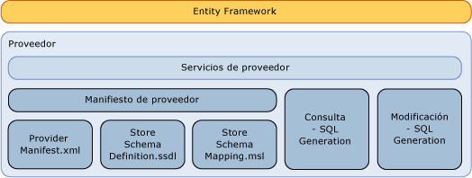

# Escribir un proveedor de datos de Entity FrameworkWriting an Entity Framework Data Provider
Esta sección describe cómo escribir un [!INCLUDE[adonet_ef](../../../../../includes/adonet-ef-md.md)] proveedor sea compatible con un origen de datos que no sean de SQL Server.This section discusses how to write an [!INCLUDE[adonet_ef](../../../../../includes/adonet-ef-md.md)] provider to support a data source other than SQL Server. El [!INCLUDE[adonet_ef](../../../../../includes/adonet-ef-md.md)] incluye un proveedor que admite SQL Server.The [!INCLUDE[adonet_ef](../../../../../includes/adonet-ef-md.md)] includes a provider that supports SQL Server.  
  
## Introducción al modelo de proveedor de Entity FrameworkIntroducing the Entity Framework Provider Model  
 [!INCLUDE[adonet_ef](../../../../../includes/adonet-ef-md.md)] es independiente de la base de datos, por lo que puede escribir un proveedor utilizando el modelo de proveedor de ADO.NET para conectar a un conjunto diverso de orígenes de datos.The [!INCLUDE[adonet_ef](../../../../../includes/adonet-ef-md.md)] is database independent, and you can write a provider by using the ADO.NET Provider Model to connect to a diverse set of data sources.  
  
 El proveedor de datos de Entity Framework (compilado mediante el modelo de proveedor de datos de ADO.NET) realiza las siguientes funciones:The Entity Framework data provider (built using the ADO.NET Data Provider model) performs the following functions:  
  
-   Asigna los tipos primitivos de Entity Data Model (EDM) a los tipos de proveedor.Maps Entity Data Model (EDM) primitive types to provider types.  
  
-   Expone funciones específicas del proveedor.Exposes provider-specific functions.  
  
-   Genera comandos específicos del proveedor para que un elemento DbQueryCommandTree determinado admita consultas de [!INCLUDE[adonet_ef](../../../../../includes/adonet-ef-md.md)].Generates provider-specific commands for a given DbQueryCommandTree to support [!INCLUDE[adonet_ef](../../../../../includes/adonet-ef-md.md)] queries.  
  
-   Genera comandos de actualización específicos del proveedor para que un elemento DbModificationCommandTree determinado admita las actualizaciones a través de [!INCLUDE[adonet_ef](../../../../../includes/adonet-ef-md.md)].Generates provider-specific update commands for a given DbModificationCommandTree to support updates through the [!INCLUDE[adonet_ef](../../../../../includes/adonet-ef-md.md)].  
  
-   Expone archivos de asignación para la definición de esquema de almacenamiento, para admitir la generación de un modelo basado en una base de datos.Exposes mapping files for the store schema definition, to support generation of a model based on a database.  
  
-   Expone metadatos (tablas y vistas, por ejemplo) a través de un modelo conceptual.Exposes metadata (tables and views, for example) via a conceptual model.  
  
   
  
## EjemploSample  
 Consulte la [proveedor de ejemplo de Entity Framework](https://go.microsoft.com/fwlink/?LinkId=180616) para obtener un ejemplo de un [!INCLUDE[adonet_ef](../../../../../includes/adonet-ef-md.md)] proveedor que admite un origen de datos que no sean de SQL Server.See the [Entity Framework Sample Provider](https://go.microsoft.com/fwlink/?LinkId=180616) for a sample of an [!INCLUDE[adonet_ef](../../../../../includes/adonet-ef-md.md)] provider that supports a data source other than SQL Server.  
  
## En esta secciónIn This Section  
 [Generación de SQLSQL Generation](../../../../../docs/framework/data/adonet/ef/sql-generation.md)  
  
 [Generación de SQL de modificaciónModification SQL Generation](../../../../../docs/framework/data/adonet/ef/modification-sql-generation.md)  
  
 [Especificación del manifiesto del proveedorProvider Manifest Specification](../../../../../docs/framework/data/adonet/ef/provider-manifest-specification.md)  
  
## Vea tambiénSee Also  
 [Trabajo con proveedores de datosWorking with Data Providers](../../../../../docs/framework/data/adonet/ef/working-with-data-providers.md)
