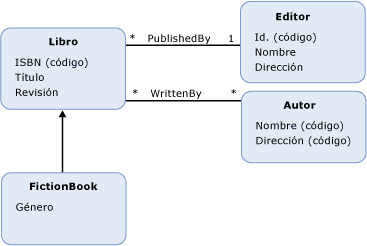

# Entity Data Model: Herencia
Entity Data Model \(EDM\) admite la herencia para los [tipos de entidad](../../../../docs/framework/data/adonet/entity-type.md).  La herencia en EDM es similar a la herencia para las clases en los lenguajes de programación orientados a objetos.  Al igual que en las clases de los lenguajes orientados a objetos, en un modelo conceptual se puede definir un tipo de entidad \(un *tipo derivado*\) que hereda de otro tipo de entidad \(el *tipo base*\).  Sin embargo, a diferencia de las clases de la programación orientada a objetos, en un modelo conceptual el tipo derivado siempre hereda todas las [propiedades](../../../../docs/framework/data/adonet/property.md) y las [propiedades de navegación](../../../../docs/framework/data/adonet/navigation-property.md) del tipo base.  No se pueden reemplazar las propiedades heredadas en un tipo derivado.  
  
 En un modelo conceptual, se pueden crear jerarquías de herencia en las que un tipo derivado hereda de otro tipo derivado.  El tipo situado en la parte superior de la jerarquía \(el único que no es un tipo derivado\) se denomina *tipo raíz*.  En una jerarquía de herencia, la [clave de entidad](../../../../docs/framework/data/adonet/entity-key.md) se debe definir en el tipo raíz.  
  
 No se pueden crear jerarquías de herencia en las que un tipo derivado hereda de más de un tipo.  Por ejemplo, en un modelo conceptual con un tipo de entidad `Book`, se podrían definir tipos derivados `FictionBook` y `NonFictionBook` que hereden de `Book`.  Sin embargo, no se podría definir un tipo que herede de los tipos `NonFictionBook` y `FictionBook`.  
  
## Ejemplo  
 El diagrama siguiente muestra un modelo conceptual con cuatro tipos de entidad: `Book`, `FictionBook`, `Publisher` y `Author`.  El tipo de entidad `FictionBook` es un tipo derivado, que hereda del tipo de entidad `Book`.  El tipo `FictionBook` hereda las propiedades `ISBN (Key)`, `Title` y `Revision`, y define una propiedad adicional denominada `Genre`.  
  
   
  
 [ADO.NET Entity Framework](../../../../docs/framework/data/adonet/ef/index.md) usa un lenguaje específico de dominio \(DSL\) denominado lenguaje de definición de esquemas conceptuales \([CSDL](../../../../docs/framework/data/adonet/ef/language-reference/csdl-specification.md)\) para definir los modelos conceptuales.  El código CSDL siguiente define un tipo de entidad, `FictionBook`, que hereda del tipo `Book` \(como en el diagrama anterior\):  
  
 [!code-xml[EDM_Example_Model#DerivedType](../../../../samples/snippets/xml/VS_Snippets_Data/edm_example_model/xml/books5.edmx#derivedtype)]  
  
## Vea también  
 [Conceptos clave de Entity Data Model](../../../../docs/framework/data/adonet/entity-data-model-key-concepts.md)   
 [Entity Data Model](../../../../docs/framework/data/adonet/entity-data-model.md)