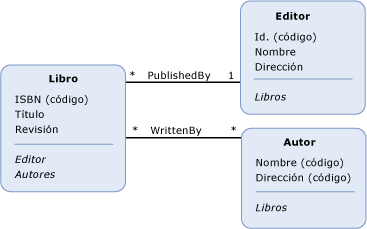

# Conceptos clave de Entity Data Model
Entity Data Model \(EDM\) utiliza tres conceptos clave para describir la estructura de datos: *tipo de entidad*, *tipo de asociación* y *propiedad*.  Estos son los conceptos más importantes para describir la estructura de datos en cualquier implementación de EDM.  
  
## Tipo de entidad  
 El [tipo de entidad](../../../../docs/framework/data/adonet/entity-type.md) es la unidad de creación fundamental para describir la estructura de datos con Entity Data Model.  En un modelo conceptual, los tipos de entidad se construyen a partir de las [propiedades](../../../../docs/framework/data/adonet/property.md) y describen la estructura de conceptos de nivel superior, como clientes y pedidos en una aplicación empresarial.  Del mismo modo que una definición de clase en un programa es una plantilla para las instancias de la clase, un tipo de entidad es una plantilla para las entidades.  Una entidad representa un objeto concreto \(como un cliente o pedido concreto\).  Cada entidad debe tener una [clave de entidad](../../../../docs/framework/data/adonet/entity-key.md) única dentro de un [conjunto de entidades](../../../../docs/framework/data/adonet/entity-set.md).  Un conjunto de entidades es una colección de instancias de un tipo de entidad concreto.  Los conjuntos de entidades \(y los [conjuntos de asociaciones](../../../../docs/framework/data/adonet/association-set.md)\) se agrupan de manera lógica en un [contenedor de entidades](../../../../docs/framework/data/adonet/entity-container.md).  
  
 Los tipos de entidad admiten la herencia: es decir, un tipo de entidad se puede derivar de otro.  Para obtener más información, consulta [Entity Data Model: Herencia](../../../../docs/framework/data/adonet/entity-data-model-inheritance.md).  
  
## Tipo de asociación  
 El [tipo de asociación](../../../../docs/framework/data/adonet/association-type.md) \(también denominado asociación\) es la unidad de creación fundamental para la descripción de relaciones en Entity Data Model \(EDM\).  En un modelo conceptual, una asociación representa una relación entre dos tipos de entidad \(como Customer y Order\).  Cada asociación tiene dos [extremos de la asociación](../../../../docs/framework/data/adonet/association-end.md) que especifican los tipos de entidad implicados en la asociación.  Cada extremo de la asociación también especifica una [multiplicidad de extremo de asociación](../../../../docs/framework/data/adonet/association-end-multiplicity.md) que indica el número de entidades que pueden estar en ese extremo de la asociación.  La multiplicidad de extremo de asociación puede tener el valor uno \(1\), cero o uno \(0..1\), o muchos \(\*\).  Es posible obtener acceso a las entidades situadas en un extremo de una asociación a través de las [propiedades de navegación](../../../../docs/framework/data/adonet/navigation-property.md) o las claves externas si estas se exponen en un tipo de entidad.  Para obtener más información, consulta [propiedad de clave externa](../../../../docs/framework/data/adonet/foreign-key-property.md).  
  
 En una aplicación, una instancia de una asociación representa una asociación concreta \(como por ejemplo una asociación entre una instancia Customer y una instancia Order\).  Las instancias de la asociación se agrupan de manera lógica en un [conjunto de asociaciones](../../../../docs/framework/data/adonet/association-set.md).  Los conjuntos de asociaciones \(y los [conjuntos de entidades](../../../../docs/framework/data/adonet/entity-set.md)\) se agrupan de manera lógica en un [contenedor de entidades](../../../../docs/framework/data/adonet/entity-container.md).  
  
## Propiedad  
 Los [tipos de entidad](../../../../docs/framework/data/adonet/entity-type.md) contienen [propiedades](../../../../docs/framework/data/adonet/property.md) que definen su estructura y características.  Por ejemplo, un tipo de entidad Customer puede tener propiedades como CustomerId, Name y Address.  
  
 Las propiedades en un modelo conceptual son análogas a las propiedades definidas en una clase en un programa.  Del mismo modo que las propiedades en una clase definen la forma de la clase y proporcionan información sobre los objetos, las propiedades en un modelo conceptual definen la forma de un tipo de entidad y proporcionan información sobre las instancias del tipo de entidad.  
  
 Una propiedad puede contener datos primitivos \(como una cadena, un entero o un valor booleano\) o estructura los datos \(como un tipo complejo\).  Para obtener más información, consulta [Entity Data Model: Tipos de datos primitivos](../../../../docs/framework/data/adonet/entity-data-model-primitive-data-types.md).  
  
## Representaciones de un modelo conceptual  
 Un *modelo conceptual* es una representación concreta de la estructura de algunos datos como entidades y relaciones.  Una manera de representar un modelo conceptual es con un diagrama.  El siguiente diagrama representa un modelo conceptual con tres tipos de entidad \(`Book`, `Publisher` y `Author`\) y dos asociaciones \(`PublishedBy` y `WrittenBy`\):  
  
   
  
 Esta representación, sin embargo, tiene algunas limitaciones a la hora de representar algunos detalles acerca del modelo.  Por ejemplo, la información sobre el tipo de propiedad y el conjunto de entidades no se representa en el diagrama.  La riqueza de un modelo conceptual se puede representar con mayor claridad mediante un lenguaje específico de dominio \(ADSL\).  [ADO.NET Entity Framework](../../../../docs/framework/data/adonet/ef/index.md) utiliza un ADSL basado en XML denominado *lenguaje de definición de esquemas conceptuales* \([CSDL](../../../../docs/framework/data/adonet/ef/language-reference/csdl-specification.md)\) para definir los modelos conceptuales.  A continuación se muestra la definición CSDL del modelo conceptual del diagrama anterior:  
  
 [!code-xml[EDM_Example_Model#EDMExampleCSDL](../../../../samples/snippets/xml/VS_Snippets_Data/edm_example_model/xml/books.edmx#edmexamplecsdl)]  
  
## Vea también  
 [Entity Data Model](../../../../docs/framework/data/adonet/entity-data-model.md)