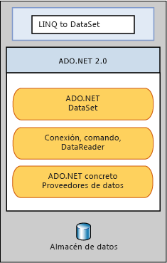

# LINQ to DataSetLINQ to DataSet
[!INCLUDE[linq_dataset](../../../../includes/linq-dataset-md.md)] facilita y acelera las consultas en datos almacenados en caché en un objeto <xref:System.Data.DataSet>. makes it easier and faster to query over data cached in a <xref:System.Data.DataSet> object. En concreto, [!INCLUDE[linq_dataset](../../../../includes/linq-dataset-md.md)] simplifica la consulta permitiendo a los desarrolladores escribir consultas en el lenguaje de programación mismo, en lugar de mediante un lenguaje de consulta independiente.Specifically, [!INCLUDE[linq_dataset](../../../../includes/linq-dataset-md.md)] simplifies querying by enabling developers to write queries from the programming language itself, instead of by using a separate query language. Esto es especialmente útil para [!INCLUDE[vsprvs](../../../../includes/vsprvs-md.md)] los desarrolladores, que ahora pueden aprovechar las ventajas de la comprobación de sintaxis en tiempo de compilación, tipos estáticos y compatibilidad con IntelliSense que proporciona el [!INCLUDE[vsprvs](../../../../includes/vsprvs-md.md)] en las consultas.This is especially useful for [!INCLUDE[vsprvs](../../../../includes/vsprvs-md.md)] developers, who can now take advantage of the compile-time syntax checking, static typing, and IntelliSense support provided by the [!INCLUDE[vsprvs](../../../../includes/vsprvs-md.md)] in their queries.  
  
 [!INCLUDE[linq_dataset](../../../../includes/linq-dataset-md.md)] también se puede usar para consultar los datos que se han consolidado de uno o más orígenes de datos. can also be used to query over data that has been consolidated from one or more data sources. Esto permite muchos casos que requieren flexibilidad en la forma de representar y controlar los datos, como consultar datos agregados localmente y almacenar en caché en el nivel medio en aplicaciones web.This enables many scenarios that require flexibility in how data is represented and handled, such as querying locally aggregated data and middle-tier caching in Web applications. En concreto, las aplicaciones de inteligencia empresaria, análisis e informes genéricos requieren este método de manipulación.In particular, generic reporting, analysis, and business intelligence applications require this method of manipulation.  
  
 El [!INCLUDE[linq_dataset](../../../../includes/linq-dataset-md.md)] funcionalidad se expone principalmente mediante métodos de extensión en la <xref:System.Data.DataRowExtensions> y <xref:System.Data.DataTableExtensions> clases.The [!INCLUDE[linq_dataset](../../../../includes/linq-dataset-md.md)] functionality is exposed primarily through the extension methods in the <xref:System.Data.DataRowExtensions> and <xref:System.Data.DataTableExtensions> classes. [!INCLUDE[linq_dataset](../../../../includes/linq-dataset-md.md)]se basa en y usa existente [!INCLUDE[ado_whidbey_long](../../../../includes/ado-whidbey-long-md.md)] arquitectura y no está destinada a reemplazar [!INCLUDE[ado_whidbey_long](../../../../includes/ado-whidbey-long-md.md)] en código de aplicación. builds on and uses the existing [!INCLUDE[ado_whidbey_long](../../../../includes/ado-whidbey-long-md.md)] architecture, and is not meant to replace [!INCLUDE[ado_whidbey_long](../../../../includes/ado-whidbey-long-md.md)] in application code. El código de ADO.NET 2.0 existente continuará funcionando en una aplicación [!INCLUDE[linq_dataset](../../../../includes/linq-dataset-md.md)].Existing ADO.NET 2.0 code will continue to function in a [!INCLUDE[linq_dataset](../../../../includes/linq-dataset-md.md)] application. La relación de [!INCLUDE[linq_dataset](../../../../includes/linq-dataset-md.md)] con [!INCLUDE[ado_whidbey_long](../../../../includes/ado-whidbey-long-md.md)] y los datos almacenados se muestran en el diagrama siguiente.The relationship of [!INCLUDE[linq_dataset](../../../../includes/linq-dataset-md.md)] to [!INCLUDE[ado_whidbey_long](../../../../includes/ado-whidbey-long-md.md)] and the data store is illustrated in the following diagram.  
  
   
  
## En esta secciónIn This Section  
 [IntroducciónGetting Started](../../../../docs/framework/data/adonet/getting-started-linq-to-dataset.md)  
  
 [Guía de programaciónProgramming Guide](../../../../docs/framework/data/adonet/programming-guide-linq-to-dataset.md)  
  
## ReferenciaReference  
 <xref:System.Data.DataTableExtensions>  
  
 <xref:System.Data.DataRowExtensions>  
  
 <xref:System.Data.DataRowComparer>  
  
## Vea tambiénSee Also  
 [LINQ (Language Integrated Query)LINQ (Language-Integrated Query)](http://msdn.microsoft.com/library/a73c4aec-5d15-4e98-b962-1274021ea93d)  
 [LINQ y ADO.NETLINQ and ADO.NET](../../../../docs/framework/data/adonet/linq-and-ado-net.md)  
 [ADO.NETADO.NET](../../../../docs/framework/data/adonet/index.md)
