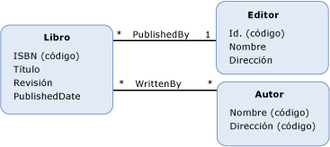

# función definida por el modelomodel-defined function
A *función definida por el modelo* es una función que se define en un modelo conceptual.A *model-defined function* is a function that is defined in a conceptual model. El cuerpo de una función definida por el modelo se expresa en [Entity SQL](../../../../docs/framework/data/adonet/ef/language-reference/entity-sql-language.md), lo que permite la función se exprese independientemente de las reglas o lenguajes admitidos en el origen de datos.The body of a model-defined function is expressed in [Entity SQL](../../../../docs/framework/data/adonet/ef/language-reference/entity-sql-language.md), which allows for the function to be expressed independently of rules or languages supported in the data source.  
  
 La definición para una función definida por el modelo contiene la información siguiente:A definition for a model-defined function contains the following information:  
  
-   El nombre de la función.A function name. (Necesario)(Required)  
  
-   El tipo del valor devuelto.The type of the return value. (Opcional)(Optional)  
  
    > [!NOTE]
    >  Si no se especifica ningún tipo de valor devuelto, este es void.If no return type is specified, the return value is void.  
  
-   Información de parámetros.Parameter information. (Opcional)(Optional)  
  
-   Un [Entity SQL](../../../../docs/framework/data/adonet/ef/language-reference/entity-sql-language.md) expresión que define el cuerpo de la función.An [Entity SQL](../../../../docs/framework/data/adonet/ef/language-reference/entity-sql-language.md) expression that defines the body of the function.  
  
 Tenga en cuenta que las funciones definidas por el modelo no admiten parámetros de salida.Note that model-defined functions do not support output parameters. Esta restricción se aplica para que las funciones definidas por el modelo puedan ser compuestas.This restriction is in place so that model-defined functions can be composed.  
  
## EjemploExample  
 El diagrama siguiente muestra un modelo conceptual con tres tipos de entidades: `Book`, `Publisher` y `Author`.The diagram below shows a conceptual model with three entity types: `Book`, `Publisher`, and `Author`.  
  
   
  
 El [ADO.NET Entity Framework](../../../../docs/framework/data/adonet/ef/index.md) usa un lenguaje específico de dominio (DSL) denominado lenguaje de definición de esquemas conceptuales ([CSDL](../../../../docs/framework/data/adonet/ef/language-reference/csdl-specification.md)) para definir los modelos conceptuales.The [ADO.NET Entity Framework](../../../../docs/framework/data/adonet/ef/index.md) uses a domain-specific language (DSL) called conceptual schema definition language ([CSDL](../../../../docs/framework/data/adonet/ef/language-reference/csdl-specification.md)) to define conceptual models. El código CSDL siguiente define una función en el modelo conceptual que devuelve el número de años transcurridos desde la publicación de una instancia de `Book` (en el diagrama anterior).The following CSDL defines a function in the conceptual model that returns the numbers of years since an instance of a `Book` (in the diagram above) was published.  
  
 [!code-xml[EDM_Example_Model#ModelDefinedFunction](../../../../samples/snippets/xml/VS_Snippets_Data/edm_example_model/xml/books4.edmx#modeldefinedfunction)]  
  
## Vea tambiénSee Also  
 [Conceptos básicos de modelo de datos de entidadEntity Data Model Key Concepts](../../../../docs/framework/data/adonet/entity-data-model-key-concepts.md)  
 [Entity Data ModelEntity Data Model](../../../../docs/framework/data/adonet/entity-data-model.md)  
 [Entity Data Model: Tipos de datos primitivosEntity Data Model: Primitive Data Types](../../../../docs/framework/data/adonet/entity-data-model-primitive-data-types.md)
