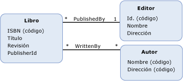

# restricción de integridad referencial
A *restricción de integridad referencial* en Entity Data Model (EDM) es similar a una restricción de integridad referencial en una base de datos relacional. En la misma manera que una columna (o columnas) de una tabla de base de datos pueden hacer referencia a la clave principal de otra tabla, un [propiedad](../../../../docs/framework/data/adonet/property.md) (o propiedades) de un [tipo de entidad](../../../../docs/framework/data/adonet/entity-type.md) pueden hacer referencia a la [clave de entidad ](../../../../docs/framework/data/adonet/entity-key.md) de otro tipo de entidad. El tipo de entidad que se hace referencia se denomina la *extremo principal* de la restricción. El tipo de entidad que hace referencia el extremo principal se denomina la *extremo dependiente* de la restricción.  
  
 Una restricción de integridad referencial se define como parte de un [asociación](../../../../docs/framework/data/adonet/association-type.md) entre dos tipos de entidad. La definición para una restricción de integridad referencial especifica la siguiente información:  
  
-   El extremo principal de la restricción. Es un tipo de entidad a cuya clave de entidad hace referencia el extremo dependiente.  
  
-   La clave de entidad del extremo principal.  
  
-   El extremo dependiente de la restricción. Es un tipo de entidad que tiene una o varias propiedades que hacen referencia a la clave de entidad del extremo principal.  
  
-   La propiedad o propiedades que hacen la referencia del extremo dependiente.  
  
 El propósito de las restricciones de integridad referencial de EDM es garantizar la existencia de asociaciones válidas. Para obtener más información, consulte [propiedad de clave externa](../../../../docs/framework/data/adonet/foreign-key-property.md).  
  
## Ejemplo  
 El diagrama siguiente muestra un modelo conceptual con dos asociaciones: `WrittenBy` y `PublishedBy`. El tipo de entidad `Book` tiene una propiedad, `PublisherId`, que hace referencia a la clave de entidad del tipo de entidad `Publisher` cuando se define una restricción de integridad referencial en la asociación `PublishedBy`.  
  
   
  
 El [ADO.NET Entity Framework](../../../../docs/framework/data/adonet/ef/index.md) usa un lenguaje específico de dominio (DSL) denominado lenguaje de definición de esquemas conceptuales ([CSDL](../../../../docs/framework/data/adonet/ef/language-reference/csdl-specification.md)) para definir los modelos conceptuales. El código CSDL siguiente define una restricción de integridad referencial en la asociación `PublishedBy` mostrada en el modelo conceptual anteriormente citado.  
  
 [!code-xml[EDM_Example_Model#RefConstraint](../../../../samples/snippets/xml/VS_Snippets_Data/edm_example_model/xml/books4.edmx#refconstraint)]  
  
## Vea también  
 [Conceptos clave de Entity Data Model](../../../../docs/framework/data/adonet/entity-data-model-key-concepts.md)  
 [Entity Data Model](../../../../docs/framework/data/adonet/entity-data-model.md)
