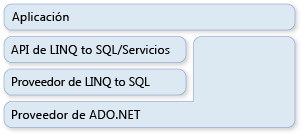

# ADO.NET y LINQ to SQLADO.NET and LINQ to SQL

[!INCLUDE[vbtecdlinq](../../../../../../includes/vbtecdlinq-md.md)] forma parte de la familia de tecnologías de ADO.NET.is part of the ADO.NET family of technologies. Se basa en los servicios proporcionados por el modelo de proveedor ADO.NET.It is based on services provided by the ADO.NET provider model. Por tanto, puede mezclar [!INCLUDE[vbtecdlinq](../../../../../../includes/vbtecdlinq-md.md)] código con las aplicaciones de ADO.net existentes y migrar las soluciones de ADO.net actuales a [!INCLUDE[vbtecdlinq](../../../../../../includes/vbtecdlinq-md.md)] .You can therefore mix [!INCLUDE[vbtecdlinq](../../../../../../includes/vbtecdlinq-md.md)] code with existing ADO.NET applications and migrate current ADO.NET solutions to [!INCLUDE[vbtecdlinq](../../../../../../includes/vbtecdlinq-md.md)]. La ilustración siguiente proporciona una visión de alto nivel de la relación.The following illustration provides a high-level view of the relationship.  
  
   
  
## ConexionesConnections  

 Puede proporcionar una conexión ADO.NET existente al crear un [!INCLUDE[vbtecdlinq](../../../../../../includes/vbtecdlinq-md.md)] <xref:System.Data.Linq.DataContext> .You can supply an existing ADO.NET connection when you create a [!INCLUDE[vbtecdlinq](../../../../../../includes/vbtecdlinq-md.md)] <xref:System.Data.Linq.DataContext>. Todas las operaciones realizadas en <xref:System.Data.Linq.DataContext> (incluidas las consultas) utilizan esta conexión proporcionada.All operations against the <xref:System.Data.Linq.DataContext> (including queries) use this provided connection. Si la conexión ya está abierta, la [!INCLUDE[vbtecdlinq](../../../../../../includes/vbtecdlinq-md.md)] deja tal cual cuando haya terminado.If the connection is already open, [!INCLUDE[vbtecdlinq](../../../../../../includes/vbtecdlinq-md.md)] leaves it as is when you are finished with it.  
  
 [!code-csharp[DLinqCommunicatingWithDatabase#4](../../../../../../samples/snippets/csharp/VS_Snippets_Data/DLinqCommunicatingWithDatabase/cs/Program.cs#4)]
 [!code-vb[DLinqCommunicatingWithDatabase#4](../../../../../../samples/snippets/visualbasic/VS_Snippets_Data/DLinqCommunicatingWithDatabase/vb/Module1.vb#4)]  
  
 Siempre puede tener acceso a la conexión y cerrarla usted mismo utilizando la propiedad <xref:System.Data.Linq.DataContext.Connection%2A>, como en el código siguiente:You can always access the connection and close it yourself by using the <xref:System.Data.Linq.DataContext.Connection%2A> property, as in the following code:  
  
 [!code-csharp[DLinqAdoNet#1](../../../../../../samples/snippets/csharp/VS_Snippets_Data/DLinqAdoNet/cs/Program.cs#1)]
 [!code-vb[DLinqAdoNet#1](../../../../../../samples/snippets/visualbasic/VS_Snippets_Data/DLinqAdoNet/vb/Module1.vb#1)]  
  
## TransaccionesTransactions  

 Puede proporcionar <xref:System.Data.Linq.DataContext> con su propia transacción de base de datos si la aplicación ya ha iniciado la transacción y desea incluir en ella su <xref:System.Data.Linq.DataContext>.You can supply your <xref:System.Data.Linq.DataContext> with your own database transaction when your application has already initiated the transaction and you want your <xref:System.Data.Linq.DataContext> to be involved.  
  
 El método preferido para realizar transacciones con la .NET Framework es usar el <xref:System.Transactions.TransactionScope> objeto.The preferred method of doing transactions with the .NET Framework is to use the <xref:System.Transactions.TransactionScope> object. Con este enfoque, puede realizar transacciones distribuidas que funcionan entre bases de datos y otros administradores de recursos residentes en memoria.By using this approach, you can make distributed transactions that work across databases and other memory-resident resource managers. Los ámbitos de transacción requieren pocos recursos para iniciarse.Transaction scopes require few resources to start. Se promueven a sí mismos a transacciones distribuidas solo cuando hay varias conexiones en el ámbito de la transacción.They promote themselves to distributed transactions only when there are multiple connections within the scope of the transaction.  
  
 [!code-csharp[DLinqAdoNet#2](../../../../../../samples/snippets/csharp/VS_Snippets_Data/DLinqAdoNet/cs/Program.cs#2)]
 [!code-vb[DLinqAdoNet#2](../../../../../../samples/snippets/visualbasic/VS_Snippets_Data/DLinqAdoNet/vb/Module1.vb#2)]  
  
 No puede utilizar este enfoque para todas las bases de datos.You cannot use this approach for all databases. Por ejemplo, la conexión SqlClient no puede promover las transacciones del sistema cuando funciona en un servidor SQL Server 2000.For example, the SqlClient connection cannot promote system transactions when it works against a SQL Server 2000 server. En su lugar, se da de alta automáticamente en una transacción distribuida completa cada vez que detecta que se utiliza un ámbito de transacción.Instead, it automatically enlists to a full, distributed transaction whenever it sees a transaction scope being used.  
  
## Comandos SQL directosDirect SQL Commands  

 A veces pueden darse situaciones en las que la capacidad de <xref:System.Data.Linq.DataContext> para realizar consultas o enviar cambios es insuficiente para la tarea especializada que se desea realizar.At times you can encounter situations where the ability of the <xref:System.Data.Linq.DataContext> to query or submit changes is insufficient for the specialized task you want to perform. En estas circunstancias, se puede utilizar el método <xref:System.Data.Linq.DataContext.ExecuteQuery%2A> para emitir comandos SQL a la base de datos y convertir los resultados de la consulta en objetos.In these circumstances you can use the <xref:System.Data.Linq.DataContext.ExecuteQuery%2A> method to issue SQL commands to the database and convert the query results to objects.  
  
 Por ejemplo, supongamos que los datos de la clase `Customer` ocupan dos tablas (customer1 y customer2).For example, assume that the data for the `Customer` class is spread over two tables (customer1 and customer2). La consulta siguiente devuelve una secuencia de objetos `Customer`:The following query returns a sequence of `Customer` objects:  
  
 [!code-csharp[DLinqAdoNet#3](../../../../../../samples/snippets/csharp/VS_Snippets_Data/DLinqAdoNet/cs/Program.cs#3)]
 [!code-vb[DLinqAdoNet#3](../../../../../../samples/snippets/visualbasic/VS_Snippets_Data/DLinqAdoNet/vb/Module1.vb#3)]  
  
 Siempre que los nombres de columna de los resultados tabulares coincidan con las propiedades de columna de la clase de entidad, [!INCLUDE[vbtecdlinq](../../../../../../includes/vbtecdlinq-md.md)] crea los objetos fuera de cualquier consulta SQL.As long as the column names in the tabular results match column properties of your entity class, [!INCLUDE[vbtecdlinq](../../../../../../includes/vbtecdlinq-md.md)] creates your objects out of any SQL query.  
  
### ParámetrosParameters  

 El método <xref:System.Data.Linq.DataContext.ExecuteQuery%2A> acepta parámetros:The <xref:System.Data.Linq.DataContext.ExecuteQuery%2A> method accepts parameters. El código siguiente ejecuta una consulta parametrizada:The following code executes a parameterized query:  
  
 [!code-csharp[DlinqAdoNet#4](../../../../../../samples/snippets/csharp/VS_Snippets_Data/DLinqAdoNet/cs/Program.cs#4)]
 [!code-vb[DlinqAdoNet#4](../../../../../../samples/snippets/visualbasic/VS_Snippets_Data/DLinqAdoNet/vb/Module1.vb#4)]  
  
> [!NOTE]
> Los parámetros se expresan en el texto de la consulta con la misma notación con llaves que `Console.WriteLine()` y `String.Format()`.Parameters are expressed in the query text by using the same curly notation used by `Console.WriteLine()` and `String.Format()`. `String.Format()` toma la cadena de consulta proporcionada y sustituye los parámetros entre llaves por nombres de parámetros generados, como `@p0`, `@p1` …, `@p(n)`.`String.Format()` takes the query string you provide and substitutes the curly-braced parameters with generated parameter names such as `@p0`, `@p1` …, `@p(n)`.  
  
## Vea tambiénSee also

- [Información generalBackground Information](background-information.md)
- [Procedimiento para reutilizar una conexión entre un comando de ADO.NET y un objeto DataContextHow to: Reuse a Connection Between an ADO.NET Command and a DataContext](how-to-reuse-a-connection-between-an-ado-net-command-and-a-datacontext.md)
