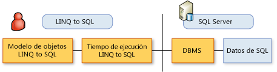

# Pasos habituales para usar LINQ to SQLTypical Steps for Using LINQ to SQL
Para implementar una aplicación [!INCLUDE[vbtecdlinq](../../../../../../includes/vbtecdlinq-md.md)], debe seguir los pasos que se describen más adelante en este tema.To implement a [!INCLUDE[vbtecdlinq](../../../../../../includes/vbtecdlinq-md.md)] application, you follow the steps described later in this topic. Observe que muchos pasos son opcionales.Note that many steps are optional. Es muy posible que pueda utilizar su modelo de objetos en su estado predeterminado.It is very possible that you can use your object model in its default state.  
  
 Para agilizar el proceso, utilice el [!INCLUDE[vs_ordesigner_long](../../../../../../includes/vs-ordesigner-long-md.md)] para crear su modelo de objetos y poder empezar a codificar sus consultas.For a really fast start, use the [!INCLUDE[vs_ordesigner_long](../../../../../../includes/vs-ordesigner-long-md.md)] to create your object model and start coding your queries.  
  
## Crear el modelo de objetosCreating the Object Model  
 El primer paso es crear un modelo de objetos a partir de los metadatos de una base de datos relacional existente.The first step is to create an object model from the metadata of an existing relational database. El modelo de objetos representa la base de datos según el lenguaje de programación del desarrollador.The object model represents the database according to the programming language of the developer. Para obtener más información, consulte [el modelo LINQ to SQL objeto](../../../../../../docs/framework/data/adonet/sql/linq/the-linq-to-sql-object-model.md).For more information, see [The LINQ to SQL Object Model](../../../../../../docs/framework/data/adonet/sql/linq/the-linq-to-sql-object-model.md).  
  
### 1. Seleccionar una herramienta para crear el modelo1. Select a tool to create the model.  
 Tres herramientas están disponibles para crear el modelo.Three tools are available for creating the model.  
  
-   El [!INCLUDE[vs_ordesigner_long](../../../../../../includes/vs-ordesigner-long-md.md)]The [!INCLUDE[vs_ordesigner_long](../../../../../../includes/vs-ordesigner-long-md.md)]  
  
     Este diseñador proporciona una interfaz de usuario completa para crear un modelo de objetos a partir de una base de datos existente.This designer provides a rich user interface for creating an object model from an existing database. Esta herramienta forma parte del IDE de Visual Studio y se adapta mejor a las bases de datos medianas o pequeñas.This tool is part of the Visual Studio IDE, and is best suited to small or medium databases.  
  
-   Herramienta de generación de código SQLMetalThe SQLMetal code-generation tool  
  
     Esta herramienta de línea de comandos proporciona un conjunto de opciones ligeramente diferentes de las del [!INCLUDE[vs_ordesigner_short](../../../../../../includes/vs-ordesigner-short-md.md)].This command-line utility provides a slightly different set of options from the [!INCLUDE[vs_ordesigner_short](../../../../../../includes/vs-ordesigner-short-md.md)]. Las bases de datos grandes se modelan mejor con esta herramienta.Modeling large databases is best done by using this tool. Para obtener más información, vea [SqlMetal.exe (Herramienta de generación de código)](../../../../../../docs/framework/tools/sqlmetal-exe-code-generation-tool.md).For more information, see [SqlMetal.exe (Code Generation Tool)](../../../../../../docs/framework/tools/sqlmetal-exe-code-generation-tool.md).  
  
-   Editor de códigoA code editor  
  
     Puede escribir su propio código utilizando el editor de código de Visual Studio u otro editor.You can write your own code by using either the Visual Studio code editor or another editor. No recomendamos este enfoque, que puede ser susceptible a errores, cuando se tiene una base de datos existente y se puede utilizar el [!INCLUDE[vs_ordesigner_short](../../../../../../includes/vs-ordesigner-short-md.md)] o la herramienta SQLMetal.We do not recommend this approach, which can be prone to errors, when you have an existing database and can use either the [!INCLUDE[vs_ordesigner_short](../../../../../../includes/vs-ordesigner-short-md.md)] or the SQLMetal tool. Sin embargo, el editor de código puede ser muy útil para perfeccionar o modificar el código ya generado con otras herramientas.However, the code editor can be valuable for refining or modifying code you have already generated by using other tools. Para obtener más información, vea [Cómo: Personalizar las clases de entidad mediante el Editor de código](../../../../../../docs/framework/data/adonet/sql/linq/how-to-customize-entity-classes-by-using-the-code-editor.md).For more information, see [How to: Customize Entity Classes by Using the Code Editor](../../../../../../docs/framework/data/adonet/sql/linq/how-to-customize-entity-classes-by-using-the-code-editor.md).  
  
### 2. Seleccionar el tipo de código que se desea generar2. Select the kind of code you want to generate.  
  
-   Un C# o archivo de código fuente de Visual Basic para la asignación basada en atributos.A C# or Visual Basic source code file for attribute-based mapping.  
  
     Después, incluirá este archivo de código en el proyecto de Visual Studio.You then include this code file in your Visual Studio project. Para obtener más información, consulte [asignación basada en atributos](../../../../../../docs/framework/data/adonet/sql/linq/attribute-based-mapping.md).For more information, see [Attribute-Based Mapping](../../../../../../docs/framework/data/adonet/sql/linq/attribute-based-mapping.md).  
  
-   Un archivo XML para la asignación externa.An XML file for external mapping.  
  
     Con este enfoque puede mantener los metadatos de la asignación fuera del código de aplicación.By using this approach, you can keep the mapping metadata out of your application code. Para obtener más información, consulte [asignaciones externas](../../../../../../docs/framework/data/adonet/sql/linq/external-mapping.md).For more information, see [External Mapping](../../../../../../docs/framework/data/adonet/sql/linq/external-mapping.md).  
  
    > [!NOTE]
    >  El [!INCLUDE[vs_ordesigner_short](../../../../../../includes/vs-ordesigner-short-md.md)] no admite la generación de archivos de asignación externos.The [!INCLUDE[vs_ordesigner_short](../../../../../../includes/vs-ordesigner-short-md.md)] does not support the generation of external mapping files. Debe utilizar la herramienta SQLMetal para implementar esta característica.You must use the SQLMetal tool to implement this feature.  
  
-   Un archivo DBML, que se puede modificar antes de generar el archivo de código definitivo.A DBML file, which you can modify before generating a final code file.  
  
     Ésta es una característica avanzada.This is an advanced feature.  
  
### 3. Perfeccionar el archivo de código para reflejar las necesidades de una aplicación3. Refine the code file to reflect the needs of your application.  
 Para este propósito, puede utilizar el [!INCLUDE[vs_ordesigner_short](../../../../../../includes/vs-ordesigner-short-md.md)] o el editor de código.For this purpose, you can use either the [!INCLUDE[vs_ordesigner_short](../../../../../../includes/vs-ordesigner-short-md.md)] or the code editor.  
  
## Usar el modelo de objetosUsing the Object Model  
 La ilustración siguiente muestra la relación entre el programador y los datos en un escenario de dos niveles.The following illustration shows the relationship between the developer and the data in a two-tier scenario. Para otros escenarios, consulte [de N niveles y las aplicaciones remotas con LINQ to SQL](../../../../../../docs/framework/data/adonet/sql/linq/n-tier-and-remote-applications-with-linq-to-sql.md).For other scenarios, see [N-Tier and Remote Applications with LINQ to SQL](../../../../../../docs/framework/data/adonet/sql/linq/n-tier-and-remote-applications-with-linq-to-sql.md).  
  
   
  
 Ahora que tiene un modelo de objetos, debe describir las solicitudes de información y manipular los datos dentro de ese modelo.Now that you have the object model, you describe information requests and manipulate data within that model. Debe pensar en términos de los objetos y las propiedades del modelo de objetos, y no en términos de las filas y columnas de la base de datos.You think in terms of the objects and properties in your object model and not in terms of the rows and columns of the database. No tratará directamente con la base de datos.You do not deal directly with the database.  
  
 Al indicar a [!INCLUDE[vbtecdlinq](../../../../../../includes/vbtecdlinq-md.md)] que ejecute una consulta que ha descrito o una llamada `SubmitChanges()` en los datos que se ha manipulado, [!INCLUDE[vbtecdlinq](../../../../../../includes/vbtecdlinq-md.md)] se comunica con la base de datos en el idioma de la base de datos.When you instruct [!INCLUDE[vbtecdlinq](../../../../../../includes/vbtecdlinq-md.md)] to either execute a query that you have described or call `SubmitChanges()` on data that you have manipulated, [!INCLUDE[vbtecdlinq](../../../../../../includes/vbtecdlinq-md.md)] communicates with the database in the language of the database.  
  
 A continuación, se presentan los pasos típicos para utilizar el modelo de objetos creado.The following represents typical steps for using the object model that you have created.  
  
### 1. Crear consultas para recuperar información de la base de datos1. Create queries to retrieve information from the database.  
 Para obtener más información, consulte [conceptos sobre consultas](../../../../../../docs/framework/data/adonet/sql/linq/query-concepts.md) y [ejemplos de consultas](../../../../../../docs/framework/data/adonet/sql/linq/query-examples.md).For more information, see [Query Concepts](../../../../../../docs/framework/data/adonet/sql/linq/query-concepts.md) and [Query Examples](../../../../../../docs/framework/data/adonet/sql/linq/query-examples.md).  
  
### 2. Invalidar los comportamientos predeterminados de Insert, Update y Delete2. Override default behaviors for Insert, Update, and Delete.  
 Este paso es opcional.This step is optional. Para obtener más información, consulte [personalizar Insert, Update y las operaciones de eliminación](../../../../../../docs/framework/data/adonet/sql/linq/customizing-insert-update-and-delete-operations.md).For more information, see [Customizing Insert, Update, and Delete Operations](../../../../../../docs/framework/data/adonet/sql/linq/customizing-insert-update-and-delete-operations.md).  
  
### 3. Establecer las opciones adecuadas para detectar y notificar conflictos de simultaneidad3. Set appropriate options to detect and report concurrency conflicts.  
 Puede mantener la configuración de administración de conflictos de simultaneidad predeterminada del modelo o puede cambiarla para ajustarla sus fines concretos.You can leave your model with its default values for handling concurrency conflicts, or you can change it to suit your purposes. Para obtener más información, vea [Cómo: Especificar qué miembros se comprueban los conflictos de simultaneidad](../../../../../../docs/framework/data/adonet/sql/linq/how-to-specify-which-members-are-tested-for-concurrency-conflicts.md) y [Cómo: Especificar las excepciones de simultaneidad cuando se inician](../../../../../../docs/framework/data/adonet/sql/linq/how-to-specify-when-concurrency-exceptions-are-thrown.md).For more information, see [How to: Specify Which Members are Tested for Concurrency Conflicts](../../../../../../docs/framework/data/adonet/sql/linq/how-to-specify-which-members-are-tested-for-concurrency-conflicts.md) and [How to: Specify When Concurrency Exceptions are Thrown](../../../../../../docs/framework/data/adonet/sql/linq/how-to-specify-when-concurrency-exceptions-are-thrown.md).  
  
### 4. Establecer una jerarquía de herencia4. Establish an inheritance hierarchy.  
 Este paso es opcional.This step is optional. Para obtener más información, consulte [compatibilidad de herencia](../../../../../../docs/framework/data/adonet/sql/linq/inheritance-support.md).For more information, see [Inheritance Support](../../../../../../docs/framework/data/adonet/sql/linq/inheritance-support.md).  
  
### 5. Proporcionar una interfaz de usuario adecuada5. Provide an appropriate user interface.  
 Este paso es opcional y depende de cómo se vaya a utilizar la aplicación.This step is optional, and depends on how your application will be used.  
  
### 6. Depurar y probar la aplicación6. Debug and test your application.  
 Para obtener más información, consulte [compatibilidad con depuración](../../../../../../docs/framework/data/adonet/sql/linq/debugging-support.md).For more information, see [Debugging Support](../../../../../../docs/framework/data/adonet/sql/linq/debugging-support.md).  
  
## Vea tambiénSee also

- [IntroducciónGetting Started](../../../../../../docs/framework/data/adonet/sql/linq/getting-started.md)
- [Creación del modelo de objetosCreating the Object Model](../../../../../../docs/framework/data/adonet/sql/linq/creating-the-object-model.md)
- [Procedimientos almacenadosStored Procedures](../../../../../../docs/framework/data/adonet/sql/linq/stored-procedures.md)
