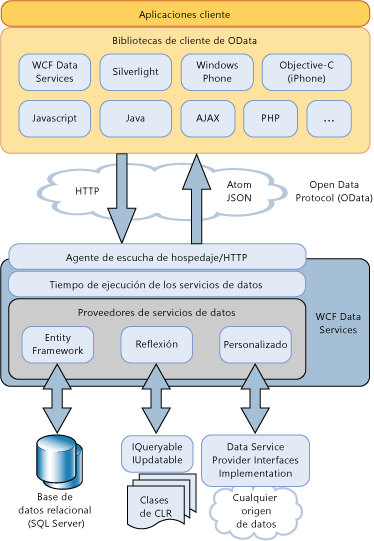

# Información general sobre Data Services de WCF
[!INCLUDE[ssAstoria](../../../../includes/ssastoria-md.md)] permite la creación y el consumo de servicios de datos para la Web o en una intranet mediante el [!INCLUDE[ssODataFull](../../../../includes/ssodatafull-md.md)]. [!INCLUDE[ssODataShort](../../../../includes/ssodatashort-md.md)] permite exponer los datos como recursos direccionables mediante URI. Esto permite tener acceso a los datos y modificarlos usando la semántica de Representational State Transfer (REST), específicamente los verbos HTTP estándar GET, PUT, POST y DELETE. En este tema se proporciona información general sobre los modelos y los procedimientos definidos por [!INCLUDE[ssODataShort](../../../../includes/ssodatashort-md.md)], así como las funciones proporcionadas por [!INCLUDE[ssAstoria](../../../../includes/ssastoria-md.md)] para aprovechar las ventajas de [!INCLUDE[ssODataShort](../../../../includes/ssodatashort-md.md)] en las aplicaciones basadas en .NET Framework.  
  
## Direccionamiento de datos como recursos  
 [!INCLUDE[ssODataShort](../../../../includes/ssodatashort-md.md)] expone los datos como recursos direccionables a través de identificadores uniformes de recursos (URI). Las rutas de acceso de recursos se construyen según las convenciones del modelo entidad-relación de Entity Data Model. En este modelo, las entidades representan unidades operacionales de datos en un dominio de aplicación, como clientes, pedidos, elementos y productos. Para obtener más información, consulte [Entity Data Model](../../../../docs/framework/data/adonet/entity-data-model.md).  
  
 En [!INCLUDE[ssODataShort](../../../../includes/ssodatashort-md.md)], los recursos de entidades se direccionan como conjunto de entidades que contiene instancias de tipos de entidad. Por ejemplo, el URI `http://services.odata.org/Northwind/Northwind.svc/Customers('ALFKI')/Orders` devuelve todos los pedidos de la `Northwind` servicio de datos que están relacionados con el cliente con un `CustomerID` valor de `ALFKI.`  
  
 Las expresiones de consulta permiten realizar operaciones de consulta tradicionales en los recursos, como filtrarlos, ordenarlos y paginarlos. Por ejemplo, el URI `http://services.odata.org/Northwind/Northwind.svc/Customers('ALFKI')/Orders?$filter=Freight gt 50` filtra los recursos para devolver solo los pedidos cuyo costo de flete sea mayor que 50 dólares. Para obtener más información, consulte [acceso a recursos de servicio de datos](../../../../docs/framework/data/wcf/accessing-data-service-resources-wcf-data-services.md).  
  
## Interoperabilidad en el acceso a los datos  
 [!INCLUDE[ssODataShort](../../../../includes/ssodatashort-md.md)] se basa en protocolos estándar de Internet para que los servicios de datos puedan interoperar con aplicaciones que no usan .NET Framework. Dado que puede usar a los URI estándar para direccionar los datos, puede tener acceso la aplicación y los datos modificados mediante la semántica de representational state transfer (REST), específicamente los verbos HTTP estándar de GET, PUT, POST y eliminar. Esto le permite tener acceso a estos servicios desde cualquier cliente que pueda analizar y tener acceso a los datos que se transmiten mediante los protocolos HTTP estándar.  
  
 [!INCLUDE[ssODataShort](../../../../includes/ssodatashort-md.md)] define un conjunto de extensiones del protocolo de publicación Atom (AtomPub). Es compatible con solicitudes y respuestas HTTP en más de un formato de datos para adaptarse a diversas aplicaciones y plataformas de cliente. Una fuente [!INCLUDE[ssODataShort](../../../../includes/ssodatashort-md.md)] puede representar los datos en formato Atom, JavaScript Object Notation (JSON) y como XML sin formato. Aunque Atom es el formato predeterminado, el formato de la fuente se especifica en el encabezado de la solicitud HTTP. Para obtener más información, consulte [OData: formato Atom](http://go.microsoft.com/fwlink/?LinkID=185794) y [OData: formato JSON](http://go.microsoft.com/fwlink/?LinkID=185795).  
  
 Cuando se publican los datos como un [!INCLUDE[ssODataShort](../../../../includes/ssodatashort-md.md)] fuente, [!INCLUDE[ssAstoria](../../../../includes/ssastoria-md.md)] se basa en otros servicios de Internet existentes para operaciones como el almacenamiento en caché y la autenticación. Para lograr esto, [!INCLUDE[ssAstoria](../../../../includes/ssastoria-md.md)] se integra con aplicaciones de hospedaje existentes y servicios, como ASP.NET, Windows Communication Foundation (WCF) e Internet Information Services (IIS).  
  
## Independencia de almacenamiento  
 Aunque los recursos se direccionan basándose en un modelo entidad-relación, [!INCLUDE[ssAstoria](../../../../includes/ssastoria-md.md)] expone las fuentes de [!INCLUDE[ssODataShort](../../../../includes/ssodatashort-md.md)] sin tener en cuenta el origen de datos subyacente. Después de que [!INCLUDE[ssAstoria](../../../../includes/ssastoria-md.md)] acepte una solicitud HTTP para un recurso identificado mediante un URI, se deserializa la solicitud y se pasa una representación de la misma a un proveedor de [!INCLUDE[ssAstoria](../../../../includes/ssastoria-md.md)]. Este proveedor traduce la solicitud en un formato específico del origen de datos y la ejecuta en el origen de datos subyacente. [!INCLUDE[ssAstoria](../../../../includes/ssastoria-md.md)] logra la independencia de almacenamiento separando el modelo conceptual que direcciona los recursos indicados por [!INCLUDE[ssODataShort](../../../../includes/ssodatashort-md.md)] del esquema específico del origen de datos subyacente.  
  
 [!INCLUDE[ssAstoria](../../../../includes/ssastoria-md.md)] se integra con ADO.NET Entity Framework para que puedan crearse servicios de datos que exponen datos relacionales. Puede usar las herramientas de Entity Data Model para crear un modelo de datos que contiene recursos direccionables como entidades y al mismo tiempo definir la asignación entre este modelo y las tablas de la base de datos subyacente. Para obtener más información, consulte [proveedor de Entity Framework](../../../../docs/framework/data/wcf/entity-framework-provider-wcf-data-services.md).  
  
 [!INCLUDE[ssAstoria](../../../../includes/ssastoria-md.md)] También le permite crear servicios de datos que exponen las estructuras de datos que devuelven una implementación de la <xref:System.Linq.IQueryable%601> interfaz. Esto le permite crear servicios de datos que exponen los datos procedentes de tipos de .NET Framework. Si también se implementa la interfaz <xref:System.Data.Services.IUpdatable>, se admiten las operaciones de creación, actualización y eliminación. Para obtener más información, consulte [proveedor de reflexión](../../../../docs/framework/data/wcf/reflection-provider-wcf-data-services.md).  
  
 Para ver una ilustración de cómo [!INCLUDE[ssAstoria](../../../../includes/ssastoria-md.md)] se integra con estos proveedores de datos, vea el diagrama de arquitectura más adelante en este tema.  
  
## Lógica de negocios personalizada  
 [!INCLUDE[ssAstoria](../../../../includes/ssastoria-md.md)] resulta muy sencillo agregar lógica de negocios personalizada a un servicio de datos a través de operaciones de servicio e interceptores. Las operaciones de servicio son métodos definidos en el servidor direccionables a través de URI con el mismo formato que los recursos de datos. Las operaciones de servicio también pueden usar la sintaxis de las expresiones de consulta para filtrar, ordenar y paginar los datos devueltos por una operación. Por ejemplo, el URI `http://localhost:12345/Northwind.svc/GetOrdersByCity?city='London'&$orderby=OrderDate&$top=10&$skip=10` representa una llamada a una operación de servicio denominada `GetOrdersByCity` en el servicio de datos de Northwind que devuelve los pedidos para los clientes residentes en Londres, con los resultados paginados ordenados por `OrderDate`. Para obtener más información, consulte [las operaciones del servicio](../../../../docs/framework/data/wcf/service-operations-wcf-data-services.md).  
  
 Los interceptores permiten integrar la lógica de la aplicación personalizada en el procesamiento de los mensajes de solicitud o respuesta de un servicio de datos. Se llama a los interceptores cuando se produce una acción de consulta, inserción, actualización o eliminación en el conjunto de entidades especificado. Un interceptor puede modificar después los datos, aplicar la directiva de autorización o incluso terminar la operación. Los métodos de interceptor se deben registrar explícitamente para un conjunto de entidades determinado expuesto por un servicio de datos. Para obtener más información, consulte [interceptores](../../../../docs/framework/data/wcf/interceptors-wcf-data-services.md).  
  
## Bibliotecas de cliente  
 [!INCLUDE[ssODataShort](../../../../includes/ssodatashort-md.md)] define un conjunto de modelos uniformes para interactuar con los servicios de datos. Esto proporciona una oportunidad para crear componentes reutilizables que se basan en estos servicios, como las bibliotecas de cliente que resulten más fácil usar servicios de datos.  
  
 [!INCLUDE[ssAstoria](../../../../includes/ssastoria-md.md)] incluye bibliotecas de cliente para aplicaciones cliente basadas en .NET Framework o en Silverlight. Estas bibliotecas de cliente le permiten interactuar con los servicios de datos mediante objetos de .NET Framework. También admiten consultas basadas en objetos y consultas LINQ, carga de objetos relacionados, seguimiento de cambios y resolución de identidades. Para obtener más información, consulte [biblioteca de cliente de WCF Data Services](../../../../docs/framework/data/wcf/wcf-data-services-client-library.md).  
  
 Además el [!INCLUDE[ssODataShort](../../../../includes/ssodatashort-md.md)] bibliotecas de cliente incluidas con .NET Framework y con Silverlight, hay otras bibliotecas de cliente que permiten utilizar una [!INCLUDE[ssODataShort](../../../../includes/ssodatashort-md.md)] de la fuente en aplicaciones cliente, como aplicaciones PHP, AJAX y Java. Para obtener más información, consulte el [SDK de OData](http://go.microsoft.com/fwlink/?LinkID=185796).  
  
## Información general sobre la arquitectura  
 El diagrama siguiente ilustra la [!INCLUDE[ssAstoria](../../../../includes/ssastoria-md.md)] arquitectura para exponer [!INCLUDE[ssODataShort](../../../../includes/ssodatashort-md.md)] fuentes y usar dichas fuentes en [!INCLUDE[ssODataShort](../../../../includes/ssodatashort-md.md)]-bibliotecas de cliente habilitadas:  
  
   
  
## Vea también  
 [Servicios de datos de WCF 4.5](../../../../docs/framework/data/wcf/index.md)  
 [Introducción](../../../../docs/framework/data/wcf/getting-started-with-wcf-data-services.md)  
 [Definir Servicios de datos de WCF](../../../../docs/framework/data/wcf/defining-wcf-data-services.md)  
 [Obtener acceso a un servicio de datos (WCF Data Services)](http://msdn.microsoft.com/library/1e54a2b9-2ec6-4002-b8f8-c1d8df37c350)  
 [Biblioteca cliente de Servicios de datos de WCF](../../../../docs/framework/data/wcf/wcf-data-services-client-library.md)  
 [Transferencia de estado representacional (REST)](http://go.microsoft.com/fwlink/?LinkId=113919)
