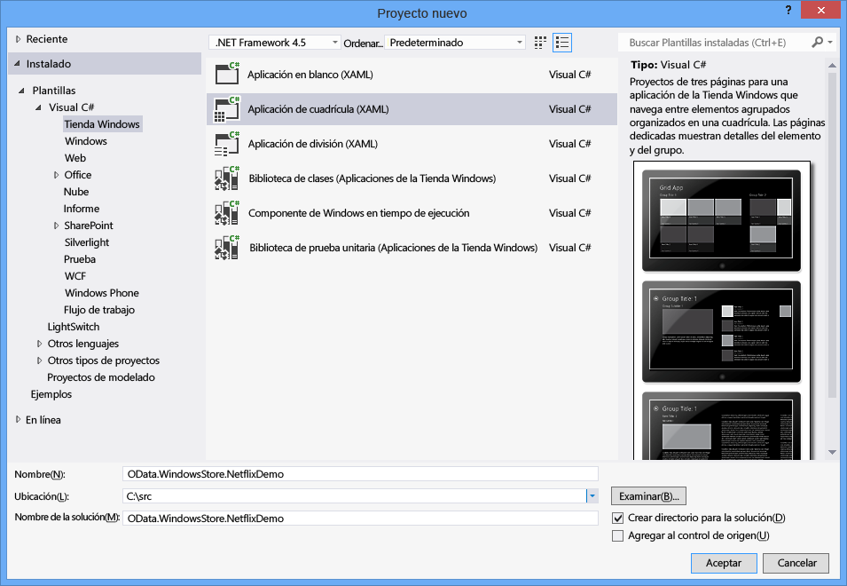
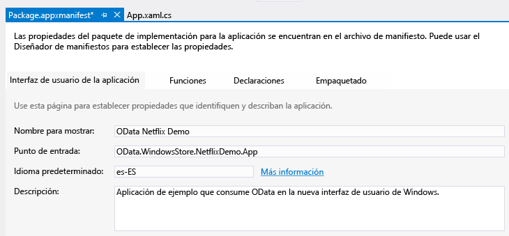
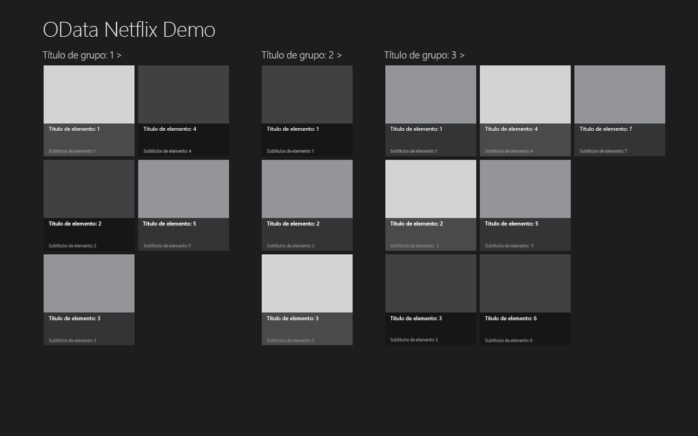
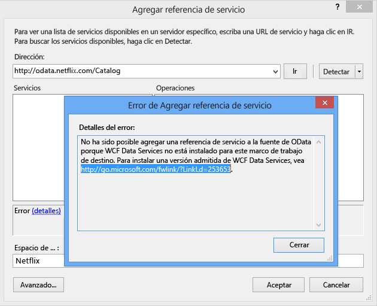
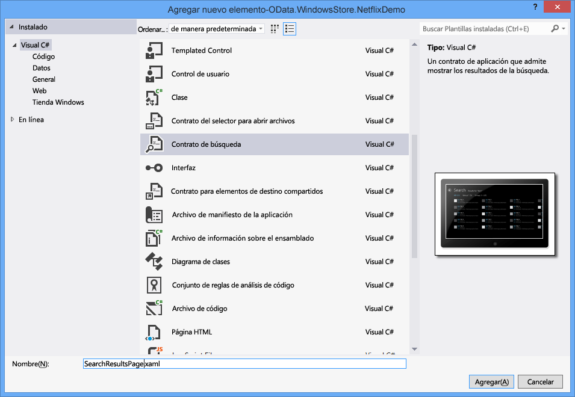

# <a name="writing-a-windows-store-app-that-consumes-an-odata-service"></a><span data-ttu-id="1fad0-102">Escribir una Aplicación de la Tienda Windows que usa un servicio de OData</span><span class="sxs-lookup"><span data-stu-id="1fad0-102">Writing a Windows Store App that consumes an OData Service</span></span>
<span data-ttu-id="1fad0-103">Windows 8 presenta un nuevo tipo de aplicación: la aplicación de la tienda de Windows.</span><span class="sxs-lookup"><span data-stu-id="1fad0-103">Windows 8 introduces a new type of application: the Windows Store app.</span></span> <span data-ttu-id="1fad0-104">Las aplicaciones de la Tienda de Windows tienen una apariencia y funcionamiento actualizados, que se ejecutan en una serie de dispositivos y están disponibles en la Tienda de Windows.</span><span class="sxs-lookup"><span data-stu-id="1fad0-104">Windows Store apps have a brand new look and feel, run on a variety of devices, and are made available on the Windows Store.</span></span> <span data-ttu-id="1fad0-105">Este tema describe cómo escribir una aplicación de la Tienda de Windows que use un servicio de OData, específicamente el servicio OData del catálogo de NetFlix.</span><span class="sxs-lookup"><span data-stu-id="1fad0-105">This topic describes how to write a Windows Store app that consumes an OData service, specifically the NetFlix Catalog OData service.</span></span> <span data-ttu-id="1fad0-106">Para obtener más información acerca de aplicaciones de la tienda de Windows, lea [Introducción a aplicaciones de la tienda de Windows](http://msdn.microsoft.com/library/windows/apps/br211386.aspx).</span><span class="sxs-lookup"><span data-stu-id="1fad0-106">For more information about Windows Store Apps, please read [Getting Started with Windows Store apps](http://msdn.microsoft.com/library/windows/apps/br211386.aspx).</span></span>  
  
## <a name="prerequisites"></a><span data-ttu-id="1fad0-107">Requisitos previos</span><span class="sxs-lookup"><span data-stu-id="1fad0-107">Prerequisites</span></span>  
  
1.  [<span data-ttu-id="1fad0-108">Microsoft Windows 8</span><span class="sxs-lookup"><span data-stu-id="1fad0-108">Microsoft Windows 8</span></span>](http://go.microsoft.com/fwlink/p/?LinkId=266654)  
  
2.  [<span data-ttu-id="1fad0-109">Microsoft Visual Studio 2012</span><span class="sxs-lookup"><span data-stu-id="1fad0-109">Microsoft Visual Studio 2012</span></span>](http://go.microsoft.com/fwlink/p/?LinkId=266655)  
  
3.  [<span data-ttu-id="1fad0-110">Servicios de datos WCF</span><span class="sxs-lookup"><span data-stu-id="1fad0-110">WCF Data Services</span></span>](http://msdn.microsoft.com/data/bb931106)  
  
#### <a name="creating-the-default-windows-store-grid-application"></a><span data-ttu-id="1fad0-111">Crear la Aplicación de cuadrícula de la Tienda de Windows predeterminada</span><span class="sxs-lookup"><span data-stu-id="1fad0-111">Creating the default Windows Store Grid Application</span></span>  
  
1.  <span data-ttu-id="1fad0-112">Cree una nueva aplicación de cuadrícula de la Tienda de Windows usando C# y XAML.</span><span class="sxs-lookup"><span data-stu-id="1fad0-112">Create a new Windows Store Grid Application using C# and XAML.</span></span> <span data-ttu-id="1fad0-113">Asigne un nombre a la aplicación OData.WindowsStore.NetflixDemo:</span><span class="sxs-lookup"><span data-stu-id="1fad0-113">Name the application OData.WindowsStore.NetflixDemo:</span></span>  
  
     <span data-ttu-id="1fad0-114"></span><span class="sxs-lookup"><span data-stu-id="1fad0-114"></span></span>  
  
2.  <span data-ttu-id="1fad0-115">Abra Package.appxmanifest y escriba un nombre descriptivo en el cuadro de texto Nombre para mostrar.</span><span class="sxs-lookup"><span data-stu-id="1fad0-115">Open the Package.appxmanifest and enter a friendly name in the Display name text box.</span></span> <span data-ttu-id="1fad0-116">Esto especifica el nombre de aplicación usado con la funcionalidad de búsqueda de Windows 8.</span><span class="sxs-lookup"><span data-stu-id="1fad0-116">This specifies the application name used with the Windows 8 search functionality.</span></span>  
  
     <span data-ttu-id="1fad0-117"></span><span class="sxs-lookup"><span data-stu-id="1fad0-117"></span></span>  
  
3.  <span data-ttu-id="1fad0-118">Escriba un nombre descriptivo en el \<AppName > elemento en el archivo App.xaml.</span><span class="sxs-lookup"><span data-stu-id="1fad0-118">Enter a friendly name in the \<AppName> element in the App.xaml file.</span></span> <span data-ttu-id="1fad0-119">Esto establece el nombre de la aplicación que se muestra cuando se inicia la aplicación:</span><span class="sxs-lookup"><span data-stu-id="1fad0-119">This sets the application name that is displayed when the application is launched:</span></span>  
  
     <span data-ttu-id="1fad0-120"></span><span class="sxs-lookup"><span data-stu-id="1fad0-120"></span></span>  
  
4.  <span data-ttu-id="1fad0-121">Compilar e iniciar la aplicación.</span><span class="sxs-lookup"><span data-stu-id="1fad0-121">Build and launch the application.</span></span> <span data-ttu-id="1fad0-122">La primera vez que se ve la pantalla de presentación de la aplicación.</span><span class="sxs-lookup"><span data-stu-id="1fad0-122">You first see the application’s splash screen.</span></span> <span data-ttu-id="1fad0-123">La captura de pantalla siguiente muestra la pantalla de presentación predeterminada.</span><span class="sxs-lookup"><span data-stu-id="1fad0-123">The screenshot below displays the default splash screen.</span></span> <span data-ttu-id="1fad0-124">La imagen usada se almacena en la carpeta Activos del proyecto.</span><span class="sxs-lookup"><span data-stu-id="1fad0-124">The image used is stored in the project’s Assets folder.</span></span>  
  
     <span data-ttu-id="1fad0-125"></span><span class="sxs-lookup"><span data-stu-id="1fad0-125"></span></span>  
  
     <span data-ttu-id="1fad0-126">Entonces, podrá ver la aplicación.</span><span class="sxs-lookup"><span data-stu-id="1fad0-126">Then the application will be displayed.</span></span>  
  
     <span data-ttu-id="1fad0-127"></span><span class="sxs-lookup"><span data-stu-id="1fad0-127"></span></span>  
  
     <span data-ttu-id="1fad0-128">La aplicación predeterminada define un conjunto de clases en SampleDataSource.cs: SampleDataGroup y SampleDataItem, que derivan de SampleDataCommon, que a su vez deriva de BindableBase.</span><span class="sxs-lookup"><span data-stu-id="1fad0-128">The default application defines a set of classes in SampleDataSource.cs: SampleDataGroup and SampleDataItem, both of which are derived from SampleDataCommon, which itself is derived from BindableBase.</span></span> <span data-ttu-id="1fad0-129">SampleDataGroup y SampleDataItem se enlazan a la GridView predeterminada.</span><span class="sxs-lookup"><span data-stu-id="1fad0-129">SampleDataGroup and SampleDataItem are bound to the default GridView.</span></span> <span data-ttu-id="1fad0-130">SampleDataSource.cs se encuentra en la carpeta DataModel en el proyecto de NetflixDemo.</span><span class="sxs-lookup"><span data-stu-id="1fad0-130">SampleDataSource.cs is located in the DataModel folder within the NetflixDemo project.</span></span> <span data-ttu-id="1fad0-131">La aplicación muestra una colección agrupada.</span><span class="sxs-lookup"><span data-stu-id="1fad0-131">The application displays a grouped collection.</span></span> <span data-ttu-id="1fad0-132">Cada grupo contiene cualquier número de elementos, representado por SampleDataGroup y SampleDataItem, respectivamente.</span><span class="sxs-lookup"><span data-stu-id="1fad0-132">Each group contains any number of items, represented by SampleDataGroup and SampleDataItem, respectively.</span></span> <span data-ttu-id="1fad0-133">En la captura de pantalla anterior puede ver un grupo denominado Título de grupo 1 y todos los elementos del grupo mostrados juntos.</span><span class="sxs-lookup"><span data-stu-id="1fad0-133">In the previous screen shot you can see a group called Group Title 1 and all of the items in the group displayed together.</span></span>  
  
     <span data-ttu-id="1fad0-134">La página principal de la aplicación es GroupedItemsPage.xaml.</span><span class="sxs-lookup"><span data-stu-id="1fad0-134">The main page of the application is GroupedItemsPage.xaml.</span></span> <span data-ttu-id="1fad0-135">Contiene una GridView que muestra los datos de ejemplo creados por la clase SampleDataSource.cs.</span><span class="sxs-lookup"><span data-stu-id="1fad0-135">It contains a GridView that displays the sample data created by the SampleDataSource.cs class.</span></span> <span data-ttu-id="1fad0-136">App.xaml.cs carga GroupedItemsPage en una llamada a rootFrame.Navigate:</span><span class="sxs-lookup"><span data-stu-id="1fad0-136">The GroupedItemsPage is loaded by the App.xaml.cs in a call to rootFrame.Navigate:</span></span>  
  
    ```csharp  
    if (!rootFrame.Navigate(typeof(GroupedItemsPage), "AllGroups"))  
    {  
        throw new Exception("Failed to create initial page");  
    }  
    ```  
  
     <span data-ttu-id="1fad0-137">Esto hace que GroupedItemsPage se convierta en instancia y se llame al LoadState.</span><span class="sxs-lookup"><span data-stu-id="1fad0-137">This causes the GroupedItemsPage to be instantiated and it’s LoadState method is called.</span></span> <span data-ttu-id="1fad0-138">LoadState hace que la instancia estática SampleDataSource se cree, lo que crea a su vez una colección de objetos SampleDataGroup.</span><span class="sxs-lookup"><span data-stu-id="1fad0-138">LoadState causes the static SampleDataSource instance to be created, which creates a collection of SampleDataGroup objects.</span></span> <span data-ttu-id="1fad0-139">Cada objeto SampleDataGroup contiene una colección de objetos SampleDataItem.</span><span class="sxs-lookup"><span data-stu-id="1fad0-139">Each SampleDataGroup object contains a collection of SampleDataItem objects.</span></span> <span data-ttu-id="1fad0-140">LoadState almacena la colección de objetos SampleDataGroup en DefaultViewModel:</span><span class="sxs-lookup"><span data-stu-id="1fad0-140">LoadState stores the collection of SampleDataGroup objects in the DefaultViewModel:</span></span>  
  
    ```csharp  
    protected override void LoadState(Object navigationParameter, Dictionary<String, Object> pageState)  
    {  
        var sampleDataGroups = SampleDataSource.GetGroups((String)navigationParameter);  
        this.DefaultViewModel["Groups"] = sampleDataGroups;  
    }  
    ```  
  
     <span data-ttu-id="1fad0-141">DefaultViewModel se enlaza, a continuación, a la GridView.</span><span class="sxs-lookup"><span data-stu-id="1fad0-141">The DefaultViewModel is then bound to the GridView.</span></span> <span data-ttu-id="1fad0-142">Esto se referencia en el archivo GroupedItemsPage.xaml al configurar el enlace de datos.</span><span class="sxs-lookup"><span data-stu-id="1fad0-142">This is referenced in the GroupedItemsPage.xaml file when configuring the data binding.</span></span>  
  
    ```xaml
    <CollectionViewSource  
                x:Name="groupedItemsViewSource"  
                Source="{Binding Groups}"  
                IsSourceGrouped="true"  
                ItemsPath="TopItems"  
                d:Source="{Binding AllGroups, Source={d:DesignInstance Type=data:SampleDataSource, IsDesignTimeCreatable=True}}"/>  
    ```  
  
     <span data-ttu-id="1fad0-143">CollectionViewSource se usa como proxy para administrar colecciones agrupadas.</span><span class="sxs-lookup"><span data-stu-id="1fad0-143">The CollectionViewSource is used as a proxy for handling grouped collections.</span></span> <span data-ttu-id="1fad0-144">Cuando se produce el enlace, recorre la colección de objetos de SampleDataGroup para rellenar GridView.</span><span class="sxs-lookup"><span data-stu-id="1fad0-144">When binding occurs, it iterates through the collection of SampleDataGroup objects to populate the GridView.</span></span>  <span data-ttu-id="1fad0-145">El atributo ItemsPath indica a CollectionViewSource qué propiedad de cada objeto SampleDataGroup debe usar para encontrar el SampleDataItems que contiene.</span><span class="sxs-lookup"><span data-stu-id="1fad0-145">The ItemsPath attribute tells the CollectionViewSource what property on each SampleDataGroup object to use to find the SampleDataItems it contains.</span></span> <span data-ttu-id="1fad0-146">En este caso cada objeto SampleDataGroup contiene una colección de objetos TopItems.</span><span class="sxs-lookup"><span data-stu-id="1fad0-146">In this case each SampleDataGroup object contains a TopItems collection of SampleDataItem objects.</span></span>  
  
     <span data-ttu-id="1fad0-147">Para la aplicación de Netflix, las películas se agrupan por el género.</span><span class="sxs-lookup"><span data-stu-id="1fad0-147">For the Netflix application, movies are grouped by genre.</span></span> <span data-ttu-id="1fad0-148">La aplicación muestra varios géneros y una lista de películas de ese género.</span><span class="sxs-lookup"><span data-stu-id="1fad0-148">So the application displays a number of genres and a list of movies within that genre.</span></span>  
  
#### <a name="add-a-service-reference-to-the-netflix-odata-service"></a><span data-ttu-id="1fad0-149">Agregar una referencia de servicio al servicio Netflix OData</span><span class="sxs-lookup"><span data-stu-id="1fad0-149">Add a Service Reference to the Netflix OData Service</span></span>  
  
1.  <span data-ttu-id="1fad0-150">Antes de poder realizar cualquier llamada al servicio de Netflix OData necesitamos agregar una referencia de servicio.</span><span class="sxs-lookup"><span data-stu-id="1fad0-150">Before we can make any calls to the Netflix OData service we need to add a service reference.</span></span> <span data-ttu-id="1fad0-151">En el Explorador de soluciones, haga clic con el botón secundario en el proyecto y seleccione Agregar referencia de servicio...</span><span class="sxs-lookup"><span data-stu-id="1fad0-151">Right-click the project in the Solution Explorer and select Add Service Reference…</span></span>  
  
     <span data-ttu-id="1fad0-152"></span><span class="sxs-lookup"><span data-stu-id="1fad0-152"></span></span>  
  
2.  <span data-ttu-id="1fad0-153">Escriba la dirección URL para el servicio de Netflix OData en la barra de direcciones y haga clic en Ir.</span><span class="sxs-lookup"><span data-stu-id="1fad0-153">Enter the URL for the Netflix OData service in the Address bar and click Go.</span></span> <span data-ttu-id="1fad0-154">Establezca el espacio de nombres de referencia de servicio en Netflix y haga clic en Aceptar.</span><span class="sxs-lookup"><span data-stu-id="1fad0-154">Set the Namespace of the service reference to Netflix and click OK.</span></span>  
  
     <span data-ttu-id="1fad0-155"></span><span class="sxs-lookup"><span data-stu-id="1fad0-155"></span></span>  
  
    > [!NOTE]
    >  <span data-ttu-id="1fad0-156">Si aún no ha instalado [WCF datos servicios herramientas para aplicaciones tienda Windows](http://go.microsoft.com/fwlink/p/?LinkId=266652), se le pedirá con un mensaje como el anterior.</span><span class="sxs-lookup"><span data-stu-id="1fad0-156">If you have not yet installed [WCF Data Services Tools for Windows Store Apps](http://go.microsoft.com/fwlink/p/?LinkId=266652), you will be prompted with a message such as the one above.</span></span> <span data-ttu-id="1fad0-157">Deberá descargar e instalar las herramientas a las que se hace referencia en el vínculo para continuar.</span><span class="sxs-lookup"><span data-stu-id="1fad0-157">You will need to download and install the tools referenced in the link to continue.</span></span>  
  
 <span data-ttu-id="1fad0-158">Agregar una referencia de servicio genera clases muy tipadas que WCF Data Services usará para analizar el OData devuelto por el servicio de Netflix OData.</span><span class="sxs-lookup"><span data-stu-id="1fad0-158">Adding a service reference generates strongly typed classes that WCF Data Services will use to parse the OData returned by the Netflix OData service.</span></span> <span data-ttu-id="1fad0-159">Las clases definidas en SampleDataSource.cs se pueden enlazar a GridView, de manera que necesitamos transferir los datos de las clases de cliente generadas de OData a las clases enlazables definidas en SampleDataSource.cs.</span><span class="sxs-lookup"><span data-stu-id="1fad0-159">The classes defined in SampleDataSource.cs can be bound to the GridView so we need to transfer the data from the generated OData client classes into the bindable classes defined in SampleDataSource.cs.</span></span>  <span data-ttu-id="1fad0-160">Para ello, necesitamos realizar algunos cambios en el modelo de datos definido en SampleDataSource.cs.</span><span class="sxs-lookup"><span data-stu-id="1fad0-160">In order to do this, we need to make some changes to the data model defined in SampleDataSource.cs.</span></span>  
  
#### <a name="update-the-data-model-for-the-application"></a><span data-ttu-id="1fad0-161">Actualizar el modelo de datos para la aplicación</span><span class="sxs-lookup"><span data-stu-id="1fad0-161">Update the data model for the application</span></span>  
  
1.  <span data-ttu-id="1fad0-162">Reemplace el código existente en SampleDataSource.cs con el código de [este](https://gist.github.com/3419288).</span><span class="sxs-lookup"><span data-stu-id="1fad0-162">Replace the existing code in SampleDataSource.cs with the code from [this gist](https://gist.github.com/3419288).</span></span> <span data-ttu-id="1fad0-163">El código actualizado agrega un método de LoadMovies (a la clase de SampleDataSource) que realiza una consulta en el servicio de Netflix OData y rellena una lista de géneros (allGroups) y en cada género una lista de películas.</span><span class="sxs-lookup"><span data-stu-id="1fad0-163">The updated code adds a LoadMovies method (to the SampleDataSource class)  that performs a query against the Netflix OData service and populates a list of genres (allGroups) and within each genre a list of movies.</span></span> <span data-ttu-id="1fad0-164">La clase SampleDataGroup se usa para representar un género y la clase SampleDataItem se usa para representar una película.</span><span class="sxs-lookup"><span data-stu-id="1fad0-164">The SampleDataGroup class is used to represent a genre and the SampleDataItem class is used to represent a movie.</span></span>  
  
    ```csharp  
    public static async void LoadMovies()  
    {  
        IEnumerable<Title> titles = await ((DataServiceQuery<Title>)Context.Titles  
            .Expand("Genres,AudioFormats,AudioFormats/Language,Awards,Cast")  
            .Where(t => t.Rating == "PG")  
            .OrderByDescending(t => t.ReleaseYear)  
            .Take(300)).ExecuteAsync();  
  
        foreach (Title title in titles)  
        {  
            foreach (Genre netflixGenre in title.Genres)  
            {  
                SampleDataGroup genre = GetGroup(netflixGenre.Name);  
                if (genre == null)  
                {  
                    genre = new SampleDataGroup(netflixGenre.Name, netflixGenre.Name, String.Empty, title.BoxArt.LargeUrl, String.Empty);  
                    Instance.AllGroups.Add(genre);  
                }  
                var content = new StringBuilder();  
                // Write additional things to content here if you want them to display in the item detail.  
                genre.Items.Add(new SampleDataItem(title.Id, title.Name, String.Format("{0}rnrn{1} ({2})", title.Synopsis, title.Rating, title.ReleaseYear), title.BoxArt.HighDefinitionUrl ?? title.BoxArt.LargeUrl, "Description", content.ToString()));  
            }  
        }  
    }  
    ```  
  
     <span data-ttu-id="1fad0-165">El [modelo asincrónico basado en tareas](http://go.microsoft.com/fwlink/p/?LinkId=266651) (TAP) se usa de forma asincrónica para obtener 300 (tomas) reciente (OrderByDescending) clasificación PG (Where) películas valoradas de Netflix.</span><span class="sxs-lookup"><span data-stu-id="1fad0-165">The [Task-based Asynchronous Pattern](http://go.microsoft.com/fwlink/p/?LinkId=266651) (TAP) is used to asynchronously get 300 (Take) recent (OrderByDescending) PG-rated (Where) movies back from Netflix.</span></span> <span data-ttu-id="1fad0-166">El resto de código crea SimpleDataItems y SimpleDataGroups de entidades que fueron devueltas en la fuente OData.</span><span class="sxs-lookup"><span data-stu-id="1fad0-166">The rest of the code constructs SimpleDataItems and SimpleDataGroups from the entities that were returned in the OData feed.</span></span>  
  
     <span data-ttu-id="1fad0-167">La clase SampleDataSource también implementa un método de búsqueda simple.</span><span class="sxs-lookup"><span data-stu-id="1fad0-167">The SampleDataSource class also implements a simple search method.</span></span> <span data-ttu-id="1fad0-168">En este caso, realiza una búsqueda simple en memoria de las películas cargadas.</span><span class="sxs-lookup"><span data-stu-id="1fad0-168">In this case, it does a simple in-memory search of the loaded movies.</span></span>  
  
    ```csharp  
    public static IEnumerable<SampleDataItem> Search(string searchString)  
    {  
            var regex = new Regex(searchString, RegexOptions.CultureInvariant | RegexOptions.IgnoreCase | RegexOptions.IgnorePatternWhitespace);  
            return Instance.AllGroups  
                .SelectMany(g => g.Items)  
                .Where(m => regex.IsMatch(m.Title) || regex.IsMatch(m.Subtitle))  
                    .Distinct(new SampleDataItemComparer());  
    }  
    ```  
  
     <span data-ttu-id="1fad0-169">También SampleDataSource.cs se define una clase denominada ExtensionMethods.</span><span class="sxs-lookup"><span data-stu-id="1fad0-169">Also in SampleDataSource.cs a class called ExtensionMethods is defined.</span></span> <span data-ttu-id="1fad0-170">Cada uno de estos métodos de extensión usa el patrón TAP para que SampleDataSource pueda ejecutar una consulta de OData sin bloquear la interfaz de usuario.</span><span class="sxs-lookup"><span data-stu-id="1fad0-170">Each of these extension methods uses the TAP pattern to allow the SampleDataSource to execute an OData query without blocking the UI.</span></span> <span data-ttu-id="1fad0-171">Por ejemplo, el código siguiente usa el método Task.Factory.FromAsync para implementar TAP.</span><span class="sxs-lookup"><span data-stu-id="1fad0-171">For example, the following code uses the Task.Factory.FromAsync method to implement TAP.</span></span>  
  
    ```csharp  
    public static async Task<IEnumerable<T>> ExecuteAsync<T>(this DataServiceQuery<T> query)  
    {  
        return await Task.Factory.FromAsync<IEnumerable<T>>(query.BeginExecute(null, null), query.EndExecute);  
    }  
    ```  
  
     <span data-ttu-id="1fad0-172">Como en la aplicación predeterminada, la página principal de la aplicación es GroupedItemsPage.</span><span class="sxs-lookup"><span data-stu-id="1fad0-172">As in the default application, the main page of the application is GroupedItemsPage.</span></span> <span data-ttu-id="1fad0-173">Esta vez, sin embargo, muestra películas recuperadas de Netflix agrupadas por el género.</span><span class="sxs-lookup"><span data-stu-id="1fad0-173">This time, however, it displays the movies retrieved from Netflix grouped by genre.</span></span>  <span data-ttu-id="1fad0-174">Cuando GroupedItemsPage se convierte en instancia, se llama al método LoadState.</span><span class="sxs-lookup"><span data-stu-id="1fad0-174">When the GroupedItemsPage is instantiated, its LoadState method is called.</span></span> <span data-ttu-id="1fad0-175">LoadState hace que la instancia estática SampleDataSource se cree, realizando una llamada al servicio de Netflix OData como se describía anteriormente.</span><span class="sxs-lookup"><span data-stu-id="1fad0-175">LoadState causes the static SampleDataSource instance to be created, making a call to the Netflix OData service as discussed previously.</span></span> <span data-ttu-id="1fad0-176">LoadState almacena la colección de géneros (objetos SampleDataGroup) en DefaultViewModel:</span><span class="sxs-lookup"><span data-stu-id="1fad0-176">LoadState stores the collection of genres (SampleDataGroup objects) in the DefaultViewModel:</span></span>  
  
    ```csharp  
    protected override void LoadState(Object navigationParameter, Dictionary<String, Object> pageState)  
    {  
  
        var sampleDataGroups = SampleDataSource.GetGroups((String)navigationParameter);  
        this.DefaultViewModel["Groups"] = sampleDataGroups;  
    }  
    ```  
  
     <span data-ttu-id="1fad0-177">Como se ha descrito anteriormente, DefaultViewModel se usa para enlazar datos en GridView.</span><span class="sxs-lookup"><span data-stu-id="1fad0-177">As described previously, the DefaultViewModel is then used to bind the data to the GridView.</span></span>  
  
#### <a name="add-a-search-contract-to-allow-the-application-to-participate-in-windows-search"></a><span data-ttu-id="1fad0-178">Agregar un contrato de búsqueda para permitir que la aplicación participe en búsqueda de Windows</span><span class="sxs-lookup"><span data-stu-id="1fad0-178">Add a search contract to allow the application to participate in Windows search</span></span>  
  
1.  <span data-ttu-id="1fad0-179">Agregar un contrato de búsqueda a la aplicación.</span><span class="sxs-lookup"><span data-stu-id="1fad0-179">Add a search contract to the application.</span></span> <span data-ttu-id="1fad0-180">Esto permite a la aplicación integrarse con la experiencia de búsqueda de Windows 8.</span><span class="sxs-lookup"><span data-stu-id="1fad0-180">This allows the application to integrate with the Windows 8 search experience.</span></span> <span data-ttu-id="1fad0-181">Dé un nombre al contrato de búsqueda SearchResultsPage.xaml</span><span class="sxs-lookup"><span data-stu-id="1fad0-181">Name the search contract SearchResultsPage.xaml</span></span>  
  
     <span data-ttu-id="1fad0-182"></span><span class="sxs-lookup"><span data-stu-id="1fad0-182"></span></span>  
  
2.  <span data-ttu-id="1fad0-183">Modifique la línea 58 de SearchResultsPage.xaml.cs eliminando las comillas incrustadas alrededor de queryText.</span><span class="sxs-lookup"><span data-stu-id="1fad0-183">Modify line 58 of SearchResultsPage.xaml.cs by removing the embedded quotes around queryText.</span></span>  
  
    ```csharp  
    // Communicate results through the view model  
    this.DefaultViewModel["QueryText"] = queryText;  
    this.DefaultViewModel["Filters"] = filterList;  
    this.DefaultViewModel["ShowFilters"] = filterList.Count > 1;  
    ```  
  
3.  <span data-ttu-id="1fad0-184">Inserte las dos líneas de código siguientes en la línea 81 en SearchResultsPage.xaml.cs para recuperar los resultados de la búsqueda.</span><span class="sxs-lookup"><span data-stu-id="1fad0-184">Insert the following two lines of code at line 81 in SearchResultsPage.xaml.cs to retrieve the search results.</span></span>  
  
    ```csharp  
    // TODO: Respond to the change in active filter by setting this.DefaultViewModel["Results"]  
                    //       to a collection of items with bindable Image, Title, Subtitle, and Description properties  
                    var searchValue = (string)this.DefaultViewModel["QueryText"];  
                    this.DefaultViewModel["Results"] = new List<SampleDataItem>(SampleDataSource.Search(searchValue));  
    ```  
  
 <span data-ttu-id="1fad0-185">Cuando un usuario invoca una búsqueda de Windows, escribe un término de búsqueda y después toca el icono de la aplicación de demostración de Netflix en la barra de búsqueda, el método LoadState de SearchResultsPage se ejecuta.</span><span class="sxs-lookup"><span data-stu-id="1fad0-185">When a user invokes Windows search, types in a search term and then touches the Netflix Demo app icon in the search bar, the LoadState method of the SearchResultsPage is executed.</span></span> <span data-ttu-id="1fad0-186">El parámetro de navegación enviado a LoadState contiene el texto de la consulta.</span><span class="sxs-lookup"><span data-stu-id="1fad0-186">The navigation parameter sent to LoadState contains the query text.</span></span> <span data-ttu-id="1fad0-187">A continuación se llama al método Filter_SelectionChanged que después llama al método Search en la clase SampleDataSource.</span><span class="sxs-lookup"><span data-stu-id="1fad0-187">Next the Filter_SelectionChanged method is called which then calls the Search method on the SampleDataSource class.</span></span> <span data-ttu-id="1fad0-188">Los resultados se devuelven como se muestran en la página SearchResultsPage.xaml.</span><span class="sxs-lookup"><span data-stu-id="1fad0-188">The results are returned and displayed in the SearchResultsPage.xaml page.</span></span>  
  
```csharp  
/// <summary>  
        /// Invoked when a filter is selected using the ComboBox in snapped view state.  
        /// </summary>  
        /// <param name="sender">The ComboBox instance.</param>  
        /// <param name="e">Event data describing how the selected filter was changed.</param>  
        void Filter_SelectionChanged(object sender, SelectionChangedEventArgs e)  
        {  
            // Determine what filter was selected  
            var selectedFilter = e.AddedItems.FirstOrDefault() as Filter;  
            if (selectedFilter != null)  
            {  
                // Mirror the results into the corresponding Filter object to allow the  
                // RadioButton representation used when not snapped to reflect the change  
                selectedFilter.Active = true;  
  
                // TODO: Respond to the change in active filter by setting this.DefaultViewModel["Results"]  
                //       to a collection of items with bindable Image, Title, Subtitle, and Description properties  
                var searchValue = (string)this.DefaultViewModel["QueryText"];  
                this.DefaultViewModel["Results"] = new List<SampleDataItem>(SampleDataSource.Search(searchValue));  
  
                // Ensure results are found  
                object results;  
                ICollection resultsCollection;  
                if (this.DefaultViewModel.TryGetValue("Results", out results) &&  
                    (resultsCollection = results as ICollection) != null &&  
                    resultsCollection.Count != 0)  
                {  
                    VisualStateManager.GoToState(this, "ResultsFound", true);  
                    return;  
                }  
            }  
  
            // Display informational text when there are no search results.  
            VisualStateManager.GoToState(this, "NoResultsFound", true);  
        }  
```  
  
 <span data-ttu-id="1fad0-189">Para obtener más información sobre la integración de búsqueda en una aplicación, vea [búsqueda: integrar la experiencia de búsqueda de Windows 8](http://go.microsoft.com/fwlink/p/?LinkId=266650).</span><span class="sxs-lookup"><span data-stu-id="1fad0-189">For more information on integrating search into an application see, [Search: integrating into the Windows 8 search experience](http://go.microsoft.com/fwlink/p/?LinkId=266650).</span></span>  
  
## <a name="run-the-application"></a><span data-ttu-id="1fad0-190">Ejecutar la aplicación</span><span class="sxs-lookup"><span data-stu-id="1fad0-190">Run the application</span></span>  
 <span data-ttu-id="1fad0-191">Inicie la aplicación presionando F5.</span><span class="sxs-lookup"><span data-stu-id="1fad0-191">Launch the application by pressing F5.</span></span> <span data-ttu-id="1fad0-192">Observe que tardará segundos en cargar las imágenes en la versión de la aplicación.</span><span class="sxs-lookup"><span data-stu-id="1fad0-192">Note that it will take a few seconds to load the images upon application launch.</span></span> <span data-ttu-id="1fad0-193">Además, es posible que el primer intento de búsqueda no devuelva ningún resultado.</span><span class="sxs-lookup"><span data-stu-id="1fad0-193">Also, your first search attempt may not return any results.</span></span> <span data-ttu-id="1fad0-194">En una aplicación del mundo real, querría tratar estos dos problemas.</span><span class="sxs-lookup"><span data-stu-id="1fad0-194">In a real-world application, you would want to deal with both of these issues.</span></span>  
  
 <span data-ttu-id="1fad0-195">La aplicación llama al servicio de Netflix OData, recibe los datos en las clases de cliente OData generadas y después transfiere esos datos a clases de datos enlazables (SampleDataSource, SampleDataGroup y SampleDataItem).</span><span class="sxs-lookup"><span data-stu-id="1fad0-195">The application calls the Netflix OData service, receives the data in the generated OData client classes and then transfers that data to bindable data classes (SampleDataSource, SampleDataGroup, and SampleDataItem).</span></span> <span data-ttu-id="1fad0-196">Usa estas clases enlazables para enlazar datos en GridView.</span><span class="sxs-lookup"><span data-stu-id="1fad0-196">It uses these bindable classes to bind the data to the GridView.</span></span> <span data-ttu-id="1fad0-197">Si no está familiarizado con cómo funciona databinding de XAML, vea [cómo agrupar elementos en una lista o una cuadrícula (aplicaciones de la tienda Windows con C# / VB/C++ y XAML)](http://msdn.microsoft.com/library/windows/apps/xaml/hh780627).</span><span class="sxs-lookup"><span data-stu-id="1fad0-197">If you are unfamiliar with how XAML databinding works see [How to group items in a list or grid (Windows Store apps using C#/VB/C++ and XAML)](http://msdn.microsoft.com/library/windows/apps/xaml/hh780627).</span></span>
