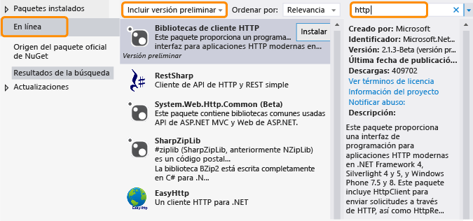

# .NET Framework y versiones fuera de banda
.NET Framework ha evolucionado para adaptarse a distintas plataformas, como aplicaciones de Windows Phone, de la Tienda Windows y aplicaciones de escritorio y web tradicionales, y para maximizar la reutilización de código. Además de las versiones de .NET Framework periódicas, publicamos nuevas características fuera de banda (OOB) para mejorar el desarrollo multiplataforma o para incluir una nueva funcionalidad. En este tema se trata la dirección que seguirá en el futuro .NET Framework y sus versiones OOB.  
  
## Ventajas de las versiones OOB  
 La publicación de nuevos componentes o actualizaciones de componentes fuera de banda permite a Microsoft proporcionar actualizaciones frecuentes a .NET Framework. Además, podemos recopilar los comentarios de clientes y responder a ellos más rápidamente.  
  
 Cuando utilice una característica de OOB en su aplicación, los usuarios no tendrán que instalar la versión más reciente de .NET Framework para ejecutar la aplicación, ya que los ensamblados de OOB se implementan con el paquete de aplicación.  
  
## Cómo se distribuyen los paquetes OOB  
Las versiones OOB para componentes básicos de Common Language Runtime (CLR) se entregan a través de [NuGet](https://www.nuget.org/), que es un administrador de paquetes para .NET. NuGet permite examinar y agregar bibliotecas a los proyectos de .NET Framework con facilidad desde el Explorador de soluciones de Visual Studio. NuGet se incluye con todas las ediciones de Visual Studio a partir de Visual Studio 2012. Para saber si NuGet está instalado, busque **Administrador de paquetes de biblioteca** en el menú **Herramientas** de Visual Studio. Si no está instalado:  
  
1.  En la barra de menús de Visual Studio, elija **Herramientas**, **Extensiones y actualizaciones** (en Visual Studio 2010, elija **Administrador de extensiones**).  
  
     Se abre el cuadro de diálogo **Extensiones y actualizaciones**.  
  
2.  Elija **En línea**, **Administrador de paquetes NuGet** y, a continuación, elija **Descargar**.  
  
3.  Una vez finalizada la descarga, reinicie Visual Studio.  
  
 Para obtener instrucciones de instalación detalladas, consulte [Instalación de NuGet](http://docs.nuget.org/docs/start-here/installing-nuget) en el sitio web de documentos de NuGet. Para más información sobre NuGet, consulte la [documentación correspondiente](http://docs.nuget.org/).  
  
## Usar un paquete OOB de NuGet  
 Después de instalar NuGet, puede buscar y agregar referencias a paquetes de NuGet utilizando el Explorador de soluciones de Visual Studio:  
  
1.  Abra el menú contextual para su proyecto en Visual Studio y, después, elija **Administrar paquetes NuGet**. (Esta opción también está disponible en el menú **Proyecto**).  
  
2.  En el panel de la izquierda, elija **En línea**.  
  
3.  Si desea utilizar los paquetes de versión preliminar, en el cuadro de lista desplegable del panel central, elija **Incluir versión preliminar** en lugar de **Solo estable**.  
  
4.  En el panel derecho, utilice el cuadro **Buscar** para buscar el paquete que desee usar. Algunos paquetes de Microsoft se identifican mediante el logotipo de Microsoft .NET Framework, y en todos ellos se identifica Microsoft como el editor.  
  
   
  
 Tal como se ha mencionado, al implementar una aplicación que utiliza un paquete de OOB, los ensamblados de OOB se distribuirán con el paquete de aplicación.  
  
## Tipos de versiones de OOB  
 Normalmente, un paquete de OOB tiene una o varias versiones preliminares y una versión estable. La licencia que acompaña a una versión preliminar no suele permitir la redistribución, pero permite probar un paquete y proporcionar comentarios. Los comentarios se incorporan en las actualizaciones realizadas en el paquete. NuGet se distribuye con una versión final como un paquete estable e incluye una licencia que permite redistribuir el paquete de NuGet con la aplicación. Microsoft admite los paquetes estables. Microsoft proporciona compatibilidad con IntelliSense y otros tipos de documentación (por ejemplo, entradas de blog y respuestas en foros) para todos los paquetes. Además, el código fuente puede estar disponible con algunos paquetes, pero no todos. Si quiere recibir anuncios relacionados con paquetes nuevos y actualizados, suscríbase al [Blog de .NET Framework](http://blogs.msdn.com/b/dotnet/).  
  
 Si quiere encontrar paquetes tanto de versiones preliminares como estables, elija **Incluir versión preliminar** en el Administrador de paquetes NuGet.  
  
 Si quiere recibir notificaciones cuando se publiquen versiones de paquetes estables, suscríbase a [la fuente de .NET Framework](https://nuget.org/api/v2/curated-feeds/dotnetframework/Packages/).  
  
## Vea también  
 [Introducción](../../../docs/framework/get-started/index.md)
