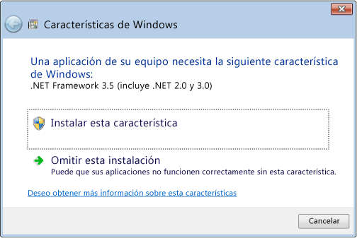

# Instalación de .NET Framework 3.5 en Windows 8, Windows 8.1 y Windows 10

.NET Framework es una parte integral de muchas aplicaciones que se ejecutan en Windows y proporciona la funcionalidad común para que dichas aplicaciones puedan ejecutarse. Para los desarrolladores, .NET Framework ofrece un modelo de programación coherente para compilar aplicaciones. Si usa el sistema operativo Windows, es posible que .NET Framework ya esté instalado en el equipo. En concreto, [!INCLUDE[net_v45](../../../includes/net-v45-md.md)] está incluido en [!INCLUDE[win8](../../../includes/win8-md.md)], [!INCLUDE[net_v451](../../../includes/net-v451-md.md)] está incluido en [!INCLUDE[win81](../../../includes/win81-md.md)], y [!INCLUDE[net_v46](../../../includes/net-v46-md.md)] está incluido en Windows 10.  
  
Aun así, .NET Framework 3.5 no se instala automáticamente con [!INCLUDE[win8](../../../includes/win8-md.md)], [!INCLUDE[win81](../../../includes/win81-md.md)] o Windows 10, y se debe habilitar por separado para ejecutar aplicaciones que dependen de él. Esto debe hacerse a través de Windows Update, que se invoca de tres maneras. Todas ellas requieren una conexión a Internet:  
  
- [Instalar .NET Framework 3.5 a petición](#OnDemand)  
  
- [Habilitar .NET Framework 3.5 en el Panel de control](#ControlPanel)  
  
- [Descargue el instalador de .NET Framework 3.5](http://www.microsoft.com/en-us/download/details.aspx?id=21) (Nota: .NET Framework no se descarga directamente, sino que se descarga un instalador que invoca a Windows Update).  
  
Durante la instalación es posible que encuentre el error 0x800f0906, 0x800f0907 o 0x800f081f. En ese caso, vea [Error durante la instalación de .NET Framework 3.5: 0x800f0906, 0x800f0907 o 0x800f081f](https://support.microsoft.com/help/2734782/net-framework-3-5-installation-error-0x800f0906--0x800f081f--0x800f09). Tenga en cuenta que estos errores pueden resolverse si instala la [actualización de seguridad 3005628](https://support.microsoft.com/kb/3005628).  
  
Si alguno de los métodos anteriores falla, o si no tiene conexión a Internet, es necesario usar el medio de instalación de Windows. Para obtener más información, consulte el método 3 del error 0x800f0906 en el [artículo que trata sobre el error de instalación de .NET Framework 3.5](https://support.microsoft.com/en-us/kb/2734782). Si no tiene los medios para realizar la instalación, vea [Crear medios de instalación de Windows 8.1](http://windows.microsoft.com/en-US/windows-8/create-reset-refresh-media?woldogcb=0).  
  
**Notas importantes:**
  
- En general, no desinstale ninguna versión de .NET Framework presente en el equipo. Las diferentes aplicaciones dependen de diferentes versiones de Framework, y es posible que varias versiones de .NET Framework coexistan en un único equipo al mismo tiempo.  
  
- .NET Framework 3.5 también es utilizado por aplicaciones compiladas para las versiones 2.0 y 3.0.  
  
- Si instala un paquete de idioma de Windows antes de instalar .NET Framework 3.5, podría producirse un error en la instalación de .NET Framework 3.5. Instale .NET Framework 3.5 antes de instalar cualquier paquete de idioma de Windows.  
  
- Windows CardSpace no está disponible con .NET Framework 3.5 en [!INCLUDE[win8](../../../includes/win8-md.md)].  
  
- Debido a las complicaciones en la forma de instalar .NET Framework 3.5, lamentablemente no es posible proporcionar un instalador independiente que se pueda ejecutar por separado de Windows Update. Si el resto de métodos da error, debe recurrir al medio de instalación, tal como se describió anteriormente.  
  
   
## Instalar .NET Framework 3.5 a petición

Si una aplicación requiere .NET Framework 3.5 pero no encuentra esa versión habilitada en el equipo, aparecerá el cuadro de mensaje siguiente durante la instalación o cuando se ejecute la aplicación por primera vez. En el cuadro de mensaje, elija **Instalar esta característica** para habilitar .NET Framework 3.5. Esta opción requiere una conexión a Internet.  
  
  
  
   
## Habilitar .NET Framework 3.5 en el Panel de control

Puede habilitar .NET Framework 3.5 mediante el Panel de control. Esta opción requiere una conexión a Internet.  
  
1. Presione la tecla Windows  en el teclado. Escriba "Características de Windows" y pulse ENTRAR. Se abrirá el cuadro de diálogo **Activar o desactivar las características de Windows** . Como alternativa, abra el Panel de control, haga clic en los elementos de **Programas** y, luego, seleccione **Activar o desactivar las características de Windows** en **Programas y características**.  
  
2. Active la casilla **.NET Framework 3.5 (incluye .NET 2.0 y 3.0)**, seleccione **Aceptar** y reinicie el equipo si se le solicita.  
  
No es necesario que seleccione los elementos secundarios para la **activación HTTP de Windows Communication Foundation (WCF)**, a menos que sea un desarrollador que requiera la funcionalidad de asignación de scripts y controladores de WCF.
  
## Vea también

[Guía de instalación](../../../docs/framework/get-started/index.md)

