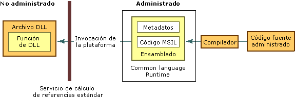

# Consumir funciones DLL no administradasConsuming Unmanaged DLL Functions
La invocación de plataforma es un servicio que permite al código administrado llamar a funciones no administradas implementadas en bibliotecas de vínculos dinámicos (DLL), como los de la API Win32.Platform invoke is a service that enables managed code to call unmanaged functions implemented in dynamic link libraries (DLLs), such as those in the Win32 API. Busca y llama a una función exportada y calcula las referencias de sus argumentos (enteros, cadenas, matrices, estructuras etc.) a través de los límites de interoperación según sea necesario.It locates and invokes an exported function and marshals its arguments (integers, strings, arrays, structures, and so on) across the interoperation boundary as needed. Para más información sobre este servicio, vea [Aproximación a la invocación de plataforma](http://msdn.microsoft.com/library/ba9dd55b-2eaa-45cd-8afd-75cb8d64d243).For more information about this service, see [A Closer Look at Platform Invoke](http://msdn.microsoft.com/library/ba9dd55b-2eaa-45cd-8afd-75cb8d64d243).  
  
 En esta sección se presentan varias tareas asociadas con el consumo de funciones DLL no administradas.This section introduces several tasks associated with consuming unmanaged DLL functions. Además de las tareas siguientes, hay consideraciones generales y un vínculo que proporciona más información y ejemplos.In addition to the following tasks, there are general considerations and a link providing additional information and examples.  
  
#### Para consumir funciones DLL exportadasTo consume exported DLL functions  
  
1.  [Identificar funciones en archivos DLL](../../../docs/framework/interop/identifying-functions-in-dlls.md).[Identify functions in DLLs](../../../docs/framework/interop/identifying-functions-in-dlls.md).  
  
     Como mínimo, debe especificar el nombre de la función y el nombre del archivo DLL que la contiene.Minimally, you must specify the name of the function and name of the DLL that contains it.  
  
2.  [Crear una clase para contener funciones de archivos DLL](../../../docs/framework/interop/creating-a-class-to-hold-dll-functions.md).[Create a class to hold DLL functions](../../../docs/framework/interop/creating-a-class-to-hold-dll-functions.md).  
  
     Puede usar una clase existente, crear una clase individual para cada función no administrada o crear una clase que contiene un conjunto de funciones no administradas relacionadas.You can use an existing class, create an individual class for each unmanaged function, or create one class that contains a set of related unmanaged functions.  
  
3.  [Crear prototipos en código administrado](../../../docs/framework/interop/creating-prototypes-in-managed-code.md).[Create prototypes in managed code](../../../docs/framework/interop/creating-prototypes-in-managed-code.md).  
  
     [Visual Basic] Use la instrucción **Declare** con las palabras clave **Function** y **Lib**.[Visual Basic] Use the **Declare** statement with the **Function** and **Lib** keywords. En algunos casos excepcionales, puede usar **DllImportAttribute** con las palabras clave **Shared Function**.In some rare cases, you can use the **DllImportAttribute** with the **Shared Function** keywords. Estos casos se explican más adelante en esta sección.These cases are explained later in this section.  
  
     [C#] Use **DllImportAttribute** para identificar el archivo DLL y la función.[C#] Use the **DllImportAttribute** to identify the DLL and function. Marque el método con los modificadores **static** y **extern**.Mark the method with the **static** and **extern** modifiers.  
  
     [C++] Use **DllImportAttribute** para identificar el archivo DLL y la función.[C++] Use the **DllImportAttribute** to identify the DLL and function. Marque la función o el método contenedor con **extern "C"**.Mark the wrapper method or function with **extern "C"**.  
  
4.  [Llamar a una función DLL](../../../docs/framework/interop/calling-a-dll-function.md).[Call a DLL function](../../../docs/framework/interop/calling-a-dll-function.md).  
  
     Llame al método de la clase administrada como haría con cualquier otro método administrado.Call the method on your managed class as you would any other managed method. [Pasar estructuras](../../../docs/framework/interop/passing-structures.md) e [implementar funciones de devolución de llamada](../../../docs/framework/interop/callback-functions.md) son casos especiales.[Passing structures](../../../docs/framework/interop/passing-structures.md) and [implementing callback functions](../../../docs/framework/interop/callback-functions.md) are special cases.  
  
 Para obtener ejemplos que muestran cómo construir declaraciones basadas en .NET para usarse con la invocación de plataforma, vea [Serialización de datos con invocación de plataforma](../../../docs/framework/interop/marshaling-data-with-platform-invoke.md).For examples that demonstrate how to construct .NET-based declarations to be used with platform invoke, see [Marshaling Data with Platform Invoke](../../../docs/framework/interop/marshaling-data-with-platform-invoke.md).  
  
## Aproximación a la invocación de plataformaA closer look at platform invoke  
 La invocación de plataforma usa metadatos para encontrar las funciones exportadas y calcular las referencias de sus argumentos en tiempo de ejecución.Platform invoke relies on metadata to locate exported functions and marshal their arguments at run time. En la siguiente ilustración se muestra este proceso.The following illustration shows this process.  
  
   
Una invocación de plataforma llama a una función DLL no administradaA platform invoke call to an unmanaged DLL function  
  
 Cuando la invocación de plataforma llama a una función no administrada, realiza la siguiente secuencia de acciones:When platform invoke calls an unmanaged function, it performs the following sequence of actions:  
  
1.  Busca el archivo DLL que contiene la función.Locates the DLL containing the function.  
  
2.  Carga el archivo DLL en la memoria.Loads the DLL into memory.  
  
3.  Busca la dirección de la función en la memoria, inserta sus argumentos en la pila y calcula las referencias de los datos si es necesario.Locates the address of the function in memory and pushes its arguments onto the stack, marshaling data as required.  
  
    > [!NOTE]
    >  La búsqueda y carga del archivo DLL y la búsqueda de la dirección de la función en memoria solo se realiza en la primera llamada a la función.Locating and loading the DLL, and locating the address of the function in memory occur only on the first call to the function.  
  
4.  Transfiere el control a la función no administrada.Transfers control to the unmanaged function.  
  
 La invocación de plataforma devuelve las excepciones generadas por la función no administrada al llamador administrado.Platform invoke throws exceptions generated by the unmanaged function to the managed caller.  
  
## Vea tambiénSee Also  
 [Interoperating with Unmanaged Code](../../../docs/framework/interop/index.md) (Interoperar con código no administrado)[Interoperating with Unmanaged Code](../../../docs/framework/interop/index.md)  
 [Ejemplos de invocación de plataformaPlatform Invoke Examples](../../../docs/framework/interop/platform-invoke-examples.md)  
 [Serialización de interoperabilidadInterop Marshaling](../../../docs/framework/interop/interop-marshaling.md)  
 [Consumir funciones DLL no administradasConsuming Unmanaged DLL Functions](../../../docs/framework/interop/consuming-unmanaged-dll-functions.md)
