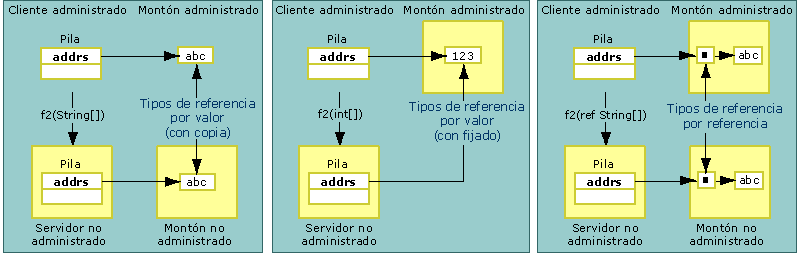

# Copying and Pinning
Al calcular las referencias de datos, el contador de referencias interoperativo puede copiar o anclar los datos cuyas referencias se calculan.  Al copiar los datos, se coloca una copia de los mismos de una ubicación de la memoria a otra.  En la ilustración siguiente se muestran las diferencias entre copiar un tipo de valor y copiar un tipo pasado por referencia de la memoria administrada a la no administrada.  
  
   
Tipos de valor pasados por valor y por referencia  
  
 En los argumentos de método pasados por valor se calculan las referencias para código no administrado como valores de la pila.  El proceso de copia es directo.  Los argumentos que se pasan por referencia se pasan como punteros en la pila.  Los tipos de referencia también se pasan por valor y por referencia.  Como se puede apreciar en la ilustración siguiente, los tipos de referencia pasados por valor se copian o se anclan.  
  
   
Tipos de referencia pasados por valor y por referencia  
  
 El anclaje bloquea los datos temporalmente en la ubicación de memoria actual, evitando así que el recolector de elementos no utilizados de Common Language Runtime vuelva a ubicarlos.  El contador de referencias ancla los datos para reducir la sobrecarga de trabajo que supone la copia y mejorar el rendimiento.  El tipo de los datos determina si se copian o se anclan durante el proceso de cálculo de referencias.  El anclaje se realiza automáticamente durante el cálculo de referencias para objetos como <xref:System.String>; sin embargo, también se puede anclar manualmente la memoria mediante la clase <xref:System.Runtime.InteropServices.GCHandle>.  
  
## Clases con formato que pueden transferirse en bloque de bits  
 Las clases con formato [que pueden transferirse en bloque de bits](../../../docs/framework/interop/blittable-and-non-blittable-types.md) tienen una colocación ancla \(con formato\) y una representación común de los datos en la memoria administrada y en la memoria no administrada.  Cuando se requiere realizar el cálculo de referencias de estos tipos, un puntero al objeto del montón se pasa directamente al destinatario de la llamada.  El destinatario de la llamada puede cambiar el contenido de la ubicación de memoria a la que hace referencia el puntero.  
  
> [!NOTE]
>  El destinatario de la llamada puede cambiar el contenido de la memoria si el parámetro está marcado como Out o In\/Out.  Por el contrario, el destinatario de la llamada debe evitar cambiar el contenido cuando el parámetro se establece para calcular las referencias como In, que es la opción predeterminada para tipos con formato que pueden transferirse en bloque de bits.  Al modificar un objeto In, se generan problemas cuando se exporta la misma clase a una biblioteca de tipos y se usa para realizar llamadas entre apartamentos.  
  
## Clases con formato que no pueden transferirse en bloque de bits  
 Las clases con formato [que no pueden transferirse en bloque de bits](../../../docs/framework/interop/blittable-and-non-blittable-types.md) tienen una colocación ancla \(con formato\) pero la representación de los datos es distinta en la memoria administrada y en la no administrada.  Es posible que haya que transformar los datos en las circunstancias siguientes:  
  
-   Si en una clase que no puede transferirse en bloque de bits se calculan las referencias por valor, el destinatario de la llamada recibe un puntero a una copia de la estructura de datos.  
  
-   Si en una clase que no puede transferirse en bloque de bits se calculan las referencias por referencia, el destinatario de la llamada recibe un puntero a un puntero a una copia de la estructura de datos.  
  
-   Si el atributo <xref:System.Runtime.InteropServices.InAttribute> está establecido, esta copia siempre se inicializa con el estado de la instancia, realizando el cálculo de referencias si es necesario.  
  
-   Si el atributo <xref:System.Runtime.InteropServices.OutAttribute> está establecido, el estado siempre se copia en la instancia en la devolución, realizando el cálculo de referencias si es necesario.  
  
-   Si los atributos **InAttribute** y **OutAttribute** están establecidos, se requieren ambas copias.  Si se omite algún atributo, el contador de referencias puede eliminar alguna copia para optimizar.  
  
## Tipos de referencia  
 Los tipos de referencia se pueden pasar por valor o por referencia.  Cuando se pasan por valor, un puntero al tipo se pasa en la pila.  Cuando se pasan por referencia, un puntero a un puntero al tipo se pasa en la pila.  
  
 Los tipos de referencia presentan el siguiente comportamiento condicional:  
  
-   Si un tipo de referencia se pasa por valor y tiene miembros de tipos que no pueden transferirse en bloque de bits, los tipos se convierten dos veces:  
  
    -   Cuando un argumento se pasa al lado no administrado.  
  
    -   Al volver de la llamada.  
  
     Para evitar copias y conversiones innecesarias, se calculan las referencias de estos tipos como parámetros In.  Debe aplicar explícitamente **InAttribute** y **OutAttribute** a un argumento para que el llamador vea los cambios que realiza el destinatario de la llamada.  
  
-   Si se pasa un tipo de referencia por valor y sólo tiene miembros de tipos que pueden transferirse en bloque de bits, puede anclarse durante el cálculo de referencias y el llamador ve cualquier cambio que realice el destinatario de la llamada en los miembros del tipo.  Aplique **InAttribute** y **OutAttribute** explícitamente si desea lograr este comportamiento.  Sin estos atributos direccionales, el contador de referencias interoperativo no exporta información direccional a la biblioteca de tipos \(exporta como In, que es la opción predeterminada\) y esto puede causar problemas con el cálculo de referencias entre apartamentos COM.  
  
-   Si se pasa un tipo de referencia por referencia, se calcularán las referencias como In\/Out de forma predeterminada.  
  
## System.String y System.Text.StringBuilder  
 Cuando se calculan las referencias de datos para código no administrado por valor o por referencia, el contador de referencias normalmente copia los datos a un búfer secundario \(y posiblemente convierte los juegos de caracteres durante la copia\) y pasa una referencia al búfer para el destinatario de la llamada.  A menos que la referencia sea un **BSTR** asignado con **SysAllocString**, la referencia siempre se asigna con **CoTaskMemAlloc**.  
  
 Como optimización, cuando se calculan las referencias de un tipo de cadena por valor \(como una cadena de caracteres de Unicode\), el contador de referencias pasa al destinatario de la llamada un puntero directo a las cadenas administradas en el búfer interno de Unicode en lugar de copiarlo a un búfer nuevo.  
  
> [!CAUTION]
>  Cuando se pasa una cadena por valor, el destinatario de la llamada nunca debe alterar la referencia que pasa el contador de referencias.  Si se hace, se puede dañar el montón administrado.  
  
 Cuando <xref:System.String?displayProperty=fullName> se pasa mediante referencia, el contador de referencias copia el contenido de la cadena a un búfer secundario antes de realizar la llamada.  A continuación, copia el contenido del búfer a una cadena en la devolución de la llamada.  Esta técnica garantiza que la cadena administrada inmutable permanezca inalterada.  
  
 Cuando <xref:System.Text.StringBuilder?displayProperty=fullName> se pasa mediante un valor, el contador de referencias pasa una referencia al búfer interno de **StringBuilder** directamente para el llamador.  El llamador y el destinatario de la llamada deben acordar el tamaño del búfer.  El llamador es responsable de crear un **StringBuilder** con la longitud adecuada.  El destinatario de la llamada debe adoptar las precauciones necesarias para garantizar que el búfer no se sobrecargue.  **StringBuilder** es una excepción a la regla que indica que los tipos de referencia pasados por valor se pasan como parámetros In de forma predeterminada.  Siempre se pasa como In\/Out.  
  
## Vea también  
 [Default Marshaling Behavior](../../../docs/framework/interop/default-marshaling-behavior.md)   
 [Memory Management with the Interop Marshaler](http://msdn.microsoft.com/es-es/417206ce-ee3e-4619-9529-0c0b686c7bee)   
 [Directional Attributes](http://msdn.microsoft.com/es-es/241ac5b5-928e-4969-8f58-1dbc048f9ea2)   
 [Interop Marshaling](../../../docs/framework/interop/interop-marshaling.md)