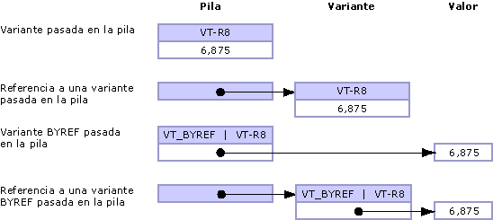

# <a name="default-marshaling-for-objects"></a><span data-ttu-id="f8bb1-102">Serialización predeterminada para objetos</span><span class="sxs-lookup"><span data-stu-id="f8bb1-102">Default Marshaling for Objects</span></span>
<span data-ttu-id="f8bb1-103">Los parámetros y campos de tipo <xref:System.Object?displayProperty=nameWithType> pueden exponerse a código no administrado como uno de los siguientes tipos:</span><span class="sxs-lookup"><span data-stu-id="f8bb1-103">Parameters and fields typed as <xref:System.Object?displayProperty=nameWithType> can be exposed to unmanaged code as one of the following types:</span></span>  
  
-   <span data-ttu-id="f8bb1-104">Una variante cuando el objeto es un parámetro.</span><span class="sxs-lookup"><span data-stu-id="f8bb1-104">A variant when the object is a parameter.</span></span>  
  
-   <span data-ttu-id="f8bb1-105">Una interfaz cuando el objeto es un campo de estructura.</span><span class="sxs-lookup"><span data-stu-id="f8bb1-105">An interface when the object is a structure field.</span></span>  
  
 <span data-ttu-id="f8bb1-106">Solo la interoperabilidad COM admite la serialización para tipos de objeto.</span><span class="sxs-lookup"><span data-stu-id="f8bb1-106">Only COM interop supports marshaling for object types.</span></span> <span data-ttu-id="f8bb1-107">El comportamiento predeterminado consiste en serializar los objetos en variantes de COM.</span><span class="sxs-lookup"><span data-stu-id="f8bb1-107">The default behavior is to marshal objects to COM variants.</span></span> <span data-ttu-id="f8bb1-108">Estas reglas se aplican solo al tipo **Object** y no se aplican a objetos fuertemente tipados que se derivan de la clase **Object**.</span><span class="sxs-lookup"><span data-stu-id="f8bb1-108">These rules apply only to the type **Object** and do not apply to strongly typed objects that derive from the **Object** class.</span></span>  
  
 <span data-ttu-id="f8bb1-109">En este tema se proporciona la siguiente información adicional sobre la serialización de tipos de objeto:</span><span class="sxs-lookup"><span data-stu-id="f8bb1-109">This topic provides the following additional information about marshaling object types:</span></span>  
  
-   [<span data-ttu-id="f8bb1-110">Opciones de serialización</span><span class="sxs-lookup"><span data-stu-id="f8bb1-110">Marshaling Options</span></span>](#cpcondefaultmarshalingforobjectsanchor7)  
  
-   [<span data-ttu-id="f8bb1-111">Serialización de Object en Interface</span><span class="sxs-lookup"><span data-stu-id="f8bb1-111">Marshaling Object to Interface</span></span>](#cpcondefaultmarshalingforobjectsanchor2)  
  
-   [<span data-ttu-id="f8bb1-112">Serialización de Object en Variant</span><span class="sxs-lookup"><span data-stu-id="f8bb1-112">Marshaling Object to Variant</span></span>](#cpcondefaultmarshalingforobjectsanchor3)  
  
-   [<span data-ttu-id="f8bb1-113">Serialización de Variant en Object</span><span class="sxs-lookup"><span data-stu-id="f8bb1-113">Marshaling Variant to Object</span></span>](#cpcondefaultmarshalingforobjectsanchor4)  
  
-   [<span data-ttu-id="f8bb1-114">Serialización de variantes ByRef</span><span class="sxs-lookup"><span data-stu-id="f8bb1-114">Marshaling ByRef Variants</span></span>](#cpcondefaultmarshalingforobjectsanchor6)  
  
<a name="cpcondefaultmarshalingforobjectsanchor7"></a>   
## <a name="marshaling-options"></a><span data-ttu-id="f8bb1-115">Opciones de serialización</span><span class="sxs-lookup"><span data-stu-id="f8bb1-115">Marshaling Options</span></span>  
 <span data-ttu-id="f8bb1-116">En la tabla siguiente se muestran las opciones de serialización para el tipo de datos **Object**.</span><span class="sxs-lookup"><span data-stu-id="f8bb1-116">The following table shows the marshaling options for the **Object** data type.</span></span> <span data-ttu-id="f8bb1-117">El atributo <xref:System.Runtime.InteropServices.MarshalAsAttribute> proporciona varios valores de enumeración <xref:System.Runtime.InteropServices.UnmanagedType> para serializar objetos.</span><span class="sxs-lookup"><span data-stu-id="f8bb1-117">The <xref:System.Runtime.InteropServices.MarshalAsAttribute> attribute provides several <xref:System.Runtime.InteropServices.UnmanagedType> enumeration values to marshal objects.</span></span>  
  
|<span data-ttu-id="f8bb1-118">Tipo de enumeración</span><span class="sxs-lookup"><span data-stu-id="f8bb1-118">Enumeration type</span></span>|<span data-ttu-id="f8bb1-119">Descripción de formato no administrado</span><span class="sxs-lookup"><span data-stu-id="f8bb1-119">Description of unmanaged format</span></span>|  
|----------------------|-------------------------------------|  
|<span data-ttu-id="f8bb1-120">**UnmanagedType.Struct**</span><span class="sxs-lookup"><span data-stu-id="f8bb1-120">**UnmanagedType.Struct**</span></span><br /><br /> <span data-ttu-id="f8bb1-121">(valor predeterminado para parámetros)</span><span class="sxs-lookup"><span data-stu-id="f8bb1-121">(default for parameters)</span></span>|<span data-ttu-id="f8bb1-122">Una variante de estilo COM.</span><span class="sxs-lookup"><span data-stu-id="f8bb1-122">A COM-style variant.</span></span>|  
|<span data-ttu-id="f8bb1-123">**UnmanagedType.Interface**</span><span class="sxs-lookup"><span data-stu-id="f8bb1-123">**UnmanagedType.Interface**</span></span>|<span data-ttu-id="f8bb1-124">Una interfaz **IDispatch** si es posible; de lo contrario, una interfaz **IUnknown**.</span><span class="sxs-lookup"><span data-stu-id="f8bb1-124">An **IDispatch** interface, if possible; otherwise, an **IUnknown** interface.</span></span>|  
|<span data-ttu-id="f8bb1-125">**UnmanagedType.IUnknown**</span><span class="sxs-lookup"><span data-stu-id="f8bb1-125">**UnmanagedType.IUnknown**</span></span><br /><br /> <span data-ttu-id="f8bb1-126">(valor predeterminado para campos)</span><span class="sxs-lookup"><span data-stu-id="f8bb1-126">(default for fields)</span></span>|<span data-ttu-id="f8bb1-127">Una interfaz **IUnknown**.</span><span class="sxs-lookup"><span data-stu-id="f8bb1-127">An **IUnknown** interface.</span></span>|  
|<span data-ttu-id="f8bb1-128">**UnmanagedType.IDispatch**</span><span class="sxs-lookup"><span data-stu-id="f8bb1-128">**UnmanagedType.IDispatch**</span></span>|<span data-ttu-id="f8bb1-129">Una interfaz **IDispatch**.</span><span class="sxs-lookup"><span data-stu-id="f8bb1-129">An **IDispatch** interface.</span></span>|  
  
 <span data-ttu-id="f8bb1-130">En el ejemplo siguiente se muestra la definición de interfaz administrada para `MarshalObject`.</span><span class="sxs-lookup"><span data-stu-id="f8bb1-130">The following example shows the managed interface definition for `MarshalObject`.</span></span>  
  
```vb  
Interface MarshalObject  
   Sub SetVariant(o As Object)  
   Sub SetVariantRef(ByRef o As Object)  
   Function GetVariant() As Object  
  
   Sub SetIDispatch( <MarshalAs(UnmanagedType.IDispatch)> o As Object)  
   Sub SetIDispatchRef(ByRef <MarshalAs(UnmanagedType.IDispatch)> o _  
      As Object)  
   Function GetIDispatch() As <MarshalAs(UnmanagedType.IDispatch)> Object  
   Sub SetIUnknown( <MarshalAs(UnmanagedType.IUnknown)> o As Object)  
   Sub SetIUnknownRef(ByRef <MarshalAs(UnmanagedType.IUnknown)> o _  
      As Object)  
   Function GetIUnknown() As <MarshalAs(UnmanagedType.IUnknown)> Object  
End Interface  
```  
  
```csharp  
interface MarshalObject {  
   void SetVariant(Object o);  
   void SetVariantRef(ref Object o);  
   Object GetVariant();  
  
   void SetIDispatch ([MarshalAs(UnmanagedType.IDispatch)]Object o);  
   void SetIDispatchRef([MarshalAs(UnmanagedType.IDispatch)]ref Object o);  
   [MarshalAs(UnmanagedType.IDispatch)] Object GetIDispatch();  
   void SetIUnknown ([MarshalAs(UnmanagedType.IUnknown)]Object o);  
   void SetIUnknownRef([MarshalAs(UnmanagedType.IUnknown)]ref Object o);  
   [MarshalAs(UnmanagedType.IUnknown)] Object GetIUnknown();  
}  
```  
  
 <span data-ttu-id="f8bb1-131">En el código siguiente se exporta la interfaz `MarshalObject` a una biblioteca de tipos.</span><span class="sxs-lookup"><span data-stu-id="f8bb1-131">The following code exports the `MarshalObject` interface to a type library.</span></span>  
  
```  
interface MarshalObject {  
   HRESULT SetVariant([in] VARIANT o);  
   HRESULT SetVariantRef([in,out] VARIANT *o);  
   HRESULT GetVariant([out,retval] VARIANT *o)   
   HRESULT SetIDispatch([in] IDispatch *o);  
   HRESULT SetIDispatchRef([in,out] IDispatch **o);  
   HRESULT GetIDispatch([out,retval] IDispatch **o)   
   HRESULT SetIUnknown([in] IUnknown *o);  
   HRESULT SetIUnknownRef([in,out] IUnknown **o);  
   HRESULT GetIUnknown([out,retval] IUnknown **o)   
}  
```  
  
> [!NOTE]
>  <span data-ttu-id="f8bb1-132">El serializador de interoperabilidad libera automáticamente cualquier objeto asignado dentro de la variante tras la llamada.</span><span class="sxs-lookup"><span data-stu-id="f8bb1-132">The interop marshaler automatically frees any allocated object inside the variant after the call.</span></span>  
  
 <span data-ttu-id="f8bb1-133">En el ejemplo siguiente se muestra un tipo de valor con formato.</span><span class="sxs-lookup"><span data-stu-id="f8bb1-133">The following example shows a formatted value type.</span></span>  
  
```vb  
Public Structure ObjectHolder  
   Dim o1 As Object  
   <MarshalAs(UnmanagedType.IDispatch)> Public o2 As Object  
End Structure  
```  
  
```csharp  
public struct ObjectHolder {  
   Object o1;  
   [MarshalAs(UnmanagedType.IDispatch)]public Object o2;  
}  
```  
  
 <span data-ttu-id="f8bb1-134">En el código siguiente se exporta el tipo con formato a una biblioteca de tipos.</span><span class="sxs-lookup"><span data-stu-id="f8bb1-134">The following code exports the formatted type to a type library.</span></span>  
  
```  
struct ObjectHolder {  
   VARIANT o1;  
   IDispatch *o2;  
}  
```  
  
<a name="cpcondefaultmarshalingforobjectsanchor2"></a>   
## <a name="marshaling-object-to-interface"></a><span data-ttu-id="f8bb1-135">Serialización de Object en Interface</span><span class="sxs-lookup"><span data-stu-id="f8bb1-135">Marshaling Object to Interface</span></span>  
 <span data-ttu-id="f8bb1-136">Cuando un objeto se expone a COM como una interfaz, esa interfaz es la interfaz de clase para el tipo administrado <xref:System.Object> (la interfaz **_Object**).</span><span class="sxs-lookup"><span data-stu-id="f8bb1-136">When an object is exposed to COM as an interface, that interface is the class interface for the managed type <xref:System.Object> (the **_Object** interface).</span></span> <span data-ttu-id="f8bb1-137">Esta interfaz tiene el tipo de **IDispatch** (<xref:System.Runtime.InteropServices.UnmanagedType>) o **IUnknown** (**UnmanagedType.IUnknown**) en la biblioteca de tipos resultante.</span><span class="sxs-lookup"><span data-stu-id="f8bb1-137">This interface is typed as an **IDispatch** (<xref:System.Runtime.InteropServices.UnmanagedType>) or an **IUnknown** (**UnmanagedType.IUnknown**) in the resulting type library.</span></span> <span data-ttu-id="f8bb1-138">Los clientes COM pueden invocar dinámicamente los miembros de la clase administrada o cualquier miembro implementado por sus clases derivadas a través de la interfaz **_Object**.</span><span class="sxs-lookup"><span data-stu-id="f8bb1-138">COM clients can dynamically invoke the members of the managed class or any members implemented by its derived classes through the **_Object** interface.</span></span> <span data-ttu-id="f8bb1-139">El cliente puede llamar a **QueryInterface** para obtener cualquier otra interfaz implementada explícitamente por el tipo administrado.</span><span class="sxs-lookup"><span data-stu-id="f8bb1-139">The client can also call **QueryInterface** to obtain any other interface explicitly implemented by the managed type.</span></span>  
  
<a name="cpcondefaultmarshalingforobjectsanchor3"></a>   
## <a name="marshaling-object-to-variant"></a><span data-ttu-id="f8bb1-140">Serialización de Object en Variant</span><span class="sxs-lookup"><span data-stu-id="f8bb1-140">Marshaling Object to Variant</span></span>  
 <span data-ttu-id="f8bb1-141">Cuando un objeto se serializa en una variante, el tipo de variante interno se determina en tiempo de ejecución, según las reglas siguientes:</span><span class="sxs-lookup"><span data-stu-id="f8bb1-141">When an object is marshaled to a variant, the internal variant type is determined at run time, based on the following rules:</span></span>  
  
-   <span data-ttu-id="f8bb1-142">Si la referencia de objeto es NULL (**Nothing** en Visual Basic), el objeto se serializa en una variante del tipo **VT_EMPTY**.</span><span class="sxs-lookup"><span data-stu-id="f8bb1-142">If the object reference is null (**Nothing** in Visual Basic), the object is marshaled to a variant of type **VT_EMPTY**.</span></span>  
  
-   <span data-ttu-id="f8bb1-143">Si el objeto es una instancia de cualquier tipo enumerado en la tabla siguiente, el tipo de variante resultante se determina mediante las reglas integradas en el serializador y mostradas en la tabla.</span><span class="sxs-lookup"><span data-stu-id="f8bb1-143">If the object is an instance of any type listed in the following table, the resulting variant type is determined by the rules built into the marshaler and shown in the table.</span></span>  
  
-   <span data-ttu-id="f8bb1-144">Otros objetos que necesiten controlar explícitamente el comportamiento de serialización pueden implementar la interfaz <xref:System.IConvertible>.</span><span class="sxs-lookup"><span data-stu-id="f8bb1-144">Other objects that need to explicitly control the marshaling behavior can implement the <xref:System.IConvertible> interface.</span></span> <span data-ttu-id="f8bb1-145">En ese caso, el tipo de variante se determina por el código de tipo devuelto por el método <xref:System.IConvertible.GetTypeCode%2A?displayProperty=nameWithType>.</span><span class="sxs-lookup"><span data-stu-id="f8bb1-145">In that case, the variant type is determined by the type code returned from the <xref:System.IConvertible.GetTypeCode%2A?displayProperty=nameWithType> method.</span></span> <span data-ttu-id="f8bb1-146">En caso contrario, el objeto se serializa como una variante de tipo **VT_UNKNOWN**.</span><span class="sxs-lookup"><span data-stu-id="f8bb1-146">Otherwise, the object is marshaled as a variant of type **VT_UNKNOWN**.</span></span>  
  
### <a name="marshaling-system-types-to-variant"></a><span data-ttu-id="f8bb1-147">Serialización de tipos de sistema en Variant</span><span class="sxs-lookup"><span data-stu-id="f8bb1-147">Marshaling System Types to Variant</span></span>  
 <span data-ttu-id="f8bb1-148">En la tabla siguiente se muestran los tipos de objeto administrados y sus tipos de variante COM correspondientes.</span><span class="sxs-lookup"><span data-stu-id="f8bb1-148">The following table shows managed object types and their corresponding COM variant types.</span></span> <span data-ttu-id="f8bb1-149">Estos tipos solo se convierten cuando la firma del método al que se llama es de tipo <xref:System.Object?displayProperty=nameWithType>.</span><span class="sxs-lookup"><span data-stu-id="f8bb1-149">These types are converted only when the signature of the method being called is of type <xref:System.Object?displayProperty=nameWithType>.</span></span>  
  
|<span data-ttu-id="f8bb1-150">Tipo de objeto</span><span class="sxs-lookup"><span data-stu-id="f8bb1-150">Object type</span></span>|<span data-ttu-id="f8bb1-151">Tipo de variante COM</span><span class="sxs-lookup"><span data-stu-id="f8bb1-151">COM variant type</span></span>|  
|-----------------|----------------------|  
|<span data-ttu-id="f8bb1-152">Referencia de objeto nula (**Nothing** en Visual Basic).</span><span class="sxs-lookup"><span data-stu-id="f8bb1-152">Null object reference (**Nothing** in Visual Basic).</span></span>|<span data-ttu-id="f8bb1-153">**VT_EMPTY**</span><span class="sxs-lookup"><span data-stu-id="f8bb1-153">**VT_EMPTY**</span></span>|  
|<xref:System.DBNull?displayProperty=nameWithType>|<span data-ttu-id="f8bb1-154">**VT_NULL**</span><span class="sxs-lookup"><span data-stu-id="f8bb1-154">**VT_NULL**</span></span>|  
|<xref:System.Runtime.InteropServices.ErrorWrapper?displayProperty=nameWithType>|<span data-ttu-id="f8bb1-155">**VT_ERROR**</span><span class="sxs-lookup"><span data-stu-id="f8bb1-155">**VT_ERROR**</span></span>|  
|<xref:System.Reflection.Missing?displayProperty=nameWithType>|<span data-ttu-id="f8bb1-156">**VT_ERROR** con **E_PARAMNOTFOUND**</span><span class="sxs-lookup"><span data-stu-id="f8bb1-156">**VT_ERROR** with **E_PARAMNOTFOUND**</span></span>|  
|<xref:System.Runtime.InteropServices.DispatchWrapper?displayProperty=nameWithType>|<span data-ttu-id="f8bb1-157">**VT_DISPATCH**</span><span class="sxs-lookup"><span data-stu-id="f8bb1-157">**VT_DISPATCH**</span></span>|  
|<xref:System.Runtime.InteropServices.UnknownWrapper?displayProperty=nameWithType>|<span data-ttu-id="f8bb1-158">**VT_UNKNOWN**</span><span class="sxs-lookup"><span data-stu-id="f8bb1-158">**VT_UNKNOWN**</span></span>|  
|<xref:System.Runtime.InteropServices.CurrencyWrapper?displayProperty=nameWithType>|<span data-ttu-id="f8bb1-159">**VT_CY**</span><span class="sxs-lookup"><span data-stu-id="f8bb1-159">**VT_CY**</span></span>|  
|<xref:System.Boolean?displayProperty=nameWithType>|<span data-ttu-id="f8bb1-160">**VT_BOOL**</span><span class="sxs-lookup"><span data-stu-id="f8bb1-160">**VT_BOOL**</span></span>|  
|<xref:System.SByte?displayProperty=nameWithType>|<span data-ttu-id="f8bb1-161">**VT_I1**</span><span class="sxs-lookup"><span data-stu-id="f8bb1-161">**VT_I1**</span></span>|  
|<xref:System.Byte?displayProperty=nameWithType>|<span data-ttu-id="f8bb1-162">**VT_UI1**</span><span class="sxs-lookup"><span data-stu-id="f8bb1-162">**VT_UI1**</span></span>|  
|<xref:System.Int16?displayProperty=nameWithType>|<span data-ttu-id="f8bb1-163">**VT_I2**</span><span class="sxs-lookup"><span data-stu-id="f8bb1-163">**VT_I2**</span></span>|  
|<xref:System.UInt16?displayProperty=nameWithType>|<span data-ttu-id="f8bb1-164">**VT_UI2**</span><span class="sxs-lookup"><span data-stu-id="f8bb1-164">**VT_UI2**</span></span>|  
|<xref:System.Int32?displayProperty=nameWithType>|<span data-ttu-id="f8bb1-165">**VT_I4**</span><span class="sxs-lookup"><span data-stu-id="f8bb1-165">**VT_I4**</span></span>|  
|<xref:System.UInt32?displayProperty=nameWithType>|<span data-ttu-id="f8bb1-166">**VT_UI4**</span><span class="sxs-lookup"><span data-stu-id="f8bb1-166">**VT_UI4**</span></span>|  
|<xref:System.Int64?displayProperty=nameWithType>|<span data-ttu-id="f8bb1-167">**VT_I8**</span><span class="sxs-lookup"><span data-stu-id="f8bb1-167">**VT_I8**</span></span>|  
|<xref:System.UInt64?displayProperty=nameWithType>|<span data-ttu-id="f8bb1-168">**VT_UI8**</span><span class="sxs-lookup"><span data-stu-id="f8bb1-168">**VT_UI8**</span></span>|  
|<xref:System.Single?displayProperty=nameWithType>|<span data-ttu-id="f8bb1-169">**VT_R4**</span><span class="sxs-lookup"><span data-stu-id="f8bb1-169">**VT_R4**</span></span>|  
|<xref:System.Double?displayProperty=nameWithType>|<span data-ttu-id="f8bb1-170">**VT_R8**</span><span class="sxs-lookup"><span data-stu-id="f8bb1-170">**VT_R8**</span></span>|  
|<xref:System.Decimal?displayProperty=nameWithType>|<span data-ttu-id="f8bb1-171">**VT_DECIMAL**</span><span class="sxs-lookup"><span data-stu-id="f8bb1-171">**VT_DECIMAL**</span></span>|  
|<xref:System.DateTime?displayProperty=nameWithType>|<span data-ttu-id="f8bb1-172">**VT_DATE**</span><span class="sxs-lookup"><span data-stu-id="f8bb1-172">**VT_DATE**</span></span>|  
|<xref:System.String?displayProperty=nameWithType>|<span data-ttu-id="f8bb1-173">**VT_BSTR**</span><span class="sxs-lookup"><span data-stu-id="f8bb1-173">**VT_BSTR**</span></span>|  
|<xref:System.IntPtr?displayProperty=nameWithType>|<span data-ttu-id="f8bb1-174">**VT_INT**</span><span class="sxs-lookup"><span data-stu-id="f8bb1-174">**VT_INT**</span></span>|  
|<xref:System.UIntPtr?displayProperty=nameWithType>|<span data-ttu-id="f8bb1-175">**VT_UINT**</span><span class="sxs-lookup"><span data-stu-id="f8bb1-175">**VT_UINT**</span></span>|  
|<xref:System.Array?displayProperty=nameWithType>|<span data-ttu-id="f8bb1-176">**VT_ARRAY**</span><span class="sxs-lookup"><span data-stu-id="f8bb1-176">**VT_ARRAY**</span></span>|  
  
 <span data-ttu-id="f8bb1-177">Con la interfaz `MarshalObject` definida en el ejemplo anterior, en el ejemplo de código siguiente se muestra cómo pasar varios tipos de variantes a un servidor COM.</span><span class="sxs-lookup"><span data-stu-id="f8bb1-177">Using the `MarshalObject` interface defined in the previous example, the following code example demonstrates how to pass various types of variants to a COM server.</span></span>  
  
```vb  
Dim mo As New MarshalObject()  
mo.SetVariant(Nothing)         ' Marshal as variant of type VT_EMPTY.  
mo.SetVariant(System.DBNull.Value) ' Marshal as variant of type VT_NULL.  
mo.SetVariant(CInt(27))        ' Marshal as variant of type VT_I2.  
mo.SetVariant(CLng(27))        ' Marshal as variant of type VT_I4.  
mo.SetVariant(CSng(27.0))      ' Marshal as variant of type VT_R4.  
mo.SetVariant(CDbl(27.0))      ' Marshal as variant of type VT_R8.  
```  
  
```csharp  
MarshalObject mo = new MarshalObject();  
mo.SetVariant(null);            // Marshal as variant of type VT_EMPTY.  
mo.SetVariant(System.DBNull.Value); // Marshal as variant of type VT_NULL.  
mo.SetVariant((int)27);          // Marshal as variant of type VT_I2.  
mo.SetVariant((long)27);          // Marshal as variant of type VT_I4.  
mo.SetVariant((single)27.0);   // Marshal as variant of type VT_R4.  
mo.SetVariant((double)27.0);   // Marshal as variant of type VT_R8.  
```  
  
 <span data-ttu-id="f8bb1-178">Los tipos COM que no tienen tipos administrados correspondientes se pueden serializar mediante clases contenedoras como <xref:System.Runtime.InteropServices.ErrorWrapper>, <xref:System.Runtime.InteropServices.DispatchWrapper>, <xref:System.Runtime.InteropServices.UnknownWrapper> y <xref:System.Runtime.InteropServices.CurrencyWrapper>.</span><span class="sxs-lookup"><span data-stu-id="f8bb1-178">COM types that do not have corresponding managed types can be marshaled using wrapper classes such as <xref:System.Runtime.InteropServices.ErrorWrapper>, <xref:System.Runtime.InteropServices.DispatchWrapper>, <xref:System.Runtime.InteropServices.UnknownWrapper>, and <xref:System.Runtime.InteropServices.CurrencyWrapper>.</span></span> <span data-ttu-id="f8bb1-179">En el ejemplo de código siguiente se muestra cómo usar estos contenedores para pasar varios tipos de variantes a un servidor COM.</span><span class="sxs-lookup"><span data-stu-id="f8bb1-179">The following code example demonstrates how to use these wrappers to pass various types of variants to a COM server.</span></span>  
  
```vb  
Imports System.Runtime.InteropServices  
' Pass inew as a variant of type VT_UNKNOWN interface.  
mo.SetVariant(New UnknownWrapper(inew))  
' Pass inew as a variant of type VT_DISPATCH interface.  
mo.SetVariant(New DispatchWrapper(inew))  
' Pass a value as a variant of type VT_ERROR interface.  
mo.SetVariant(New ErrorWrapper(&H80054002))  
' Pass a value as a variant of type VT_CURRENCY interface.  
mo.SetVariant(New CurrencyWrapper(New Decimal(5.25)))  
```  
  
```csharp  
using System.Runtime.InteropServices;  
// Pass inew as a variant of type VT_UNKNOWN interface.  
mo.SetVariant(new UnknownWrapper(inew));  
// Pass inew as a variant of type VT_DISPATCH interface.  
mo.SetVariant(new DispatchWrapper(inew));  
// Pass a value as a variant of type VT_ERROR interface.  
mo.SetVariant(new ErrorWrapper(0x80054002));  
// Pass a value as a variant of type VT_CURRENCY interface.  
mo.SetVariant(new CurrencyWrapper(new Decimal(5.25)));  
```  
  
 <span data-ttu-id="f8bb1-180">Las clases contenedoras se definen en el espacio de nombres <xref:System.Runtime.InteropServices>.</span><span class="sxs-lookup"><span data-stu-id="f8bb1-180">The wrapper classes are defined in the <xref:System.Runtime.InteropServices> namespace.</span></span>  
  
### <a name="marshaling-the-iconvertible-interface-to-variant"></a><span data-ttu-id="f8bb1-181">Serialización de la interfaz IConvertible en Variant</span><span class="sxs-lookup"><span data-stu-id="f8bb1-181">Marshaling the IConvertible Interface to Variant</span></span>  
 <span data-ttu-id="f8bb1-182">Otros tipos distintos a los de la sección anterior pueden controlar cómo se serializan mediante la implementación de la interfaz <xref:System.IConvertible>.</span><span class="sxs-lookup"><span data-stu-id="f8bb1-182">Types other than those listed in the previous section can control how they are marshaled by implementing the <xref:System.IConvertible> interface.</span></span> <span data-ttu-id="f8bb1-183">Si el objeto implementa la interfaz **IConvertible**, el tipo de variante COM se determina en tiempo de ejecución por el valor de la enumeración <xref:System.TypeCode> devuelto desde el método <xref:System.IConvertible.GetTypeCode%2A?displayProperty=nameWithType>.</span><span class="sxs-lookup"><span data-stu-id="f8bb1-183">If the object implements the **IConvertible** interface, the COM variant type is determined at run time by the value of the <xref:System.TypeCode> enumeration returned from the <xref:System.IConvertible.GetTypeCode%2A?displayProperty=nameWithType> method.</span></span>  
  
 <span data-ttu-id="f8bb1-184">En la tabla siguiente se muestran los valores posibles para la enumeración **TypeCode** y el tipo de variante COM correspondiente para cada valor.</span><span class="sxs-lookup"><span data-stu-id="f8bb1-184">The following table shows the possible values for the **TypeCode** enumeration and the corresponding COM variant type for each value.</span></span>  
  
|<span data-ttu-id="f8bb1-185">TypeCode</span><span class="sxs-lookup"><span data-stu-id="f8bb1-185">TypeCode</span></span>|<span data-ttu-id="f8bb1-186">Tipo de variante COM</span><span class="sxs-lookup"><span data-stu-id="f8bb1-186">COM variant type</span></span>|  
|--------------|----------------------|  
|<span data-ttu-id="f8bb1-187">**TypeCode.Empty**</span><span class="sxs-lookup"><span data-stu-id="f8bb1-187">**TypeCode.Empty**</span></span>|<span data-ttu-id="f8bb1-188">**VT_EMPTY**</span><span class="sxs-lookup"><span data-stu-id="f8bb1-188">**VT_EMPTY**</span></span>|  
|<span data-ttu-id="f8bb1-189">**TypeCode.Object**</span><span class="sxs-lookup"><span data-stu-id="f8bb1-189">**TypeCode.Object**</span></span>|<span data-ttu-id="f8bb1-190">**VT_UNKNOWN**</span><span class="sxs-lookup"><span data-stu-id="f8bb1-190">**VT_UNKNOWN**</span></span>|  
|<span data-ttu-id="f8bb1-191">**TypeCode.DBNull**</span><span class="sxs-lookup"><span data-stu-id="f8bb1-191">**TypeCode.DBNull**</span></span>|<span data-ttu-id="f8bb1-192">**VT_NULL**</span><span class="sxs-lookup"><span data-stu-id="f8bb1-192">**VT_NULL**</span></span>|  
|<span data-ttu-id="f8bb1-193">**TypeCode.Boolean**</span><span class="sxs-lookup"><span data-stu-id="f8bb1-193">**TypeCode.Boolean**</span></span>|<span data-ttu-id="f8bb1-194">**VT_BOOL**</span><span class="sxs-lookup"><span data-stu-id="f8bb1-194">**VT_BOOL**</span></span>|  
|<span data-ttu-id="f8bb1-195">**TypeCode.Char**</span><span class="sxs-lookup"><span data-stu-id="f8bb1-195">**TypeCode.Char**</span></span>|<span data-ttu-id="f8bb1-196">**VT_UI2**</span><span class="sxs-lookup"><span data-stu-id="f8bb1-196">**VT_UI2**</span></span>|  
|<span data-ttu-id="f8bb1-197">**TypeCode.Sbyte**</span><span class="sxs-lookup"><span data-stu-id="f8bb1-197">**TypeCode.Sbyte**</span></span>|<span data-ttu-id="f8bb1-198">**VT_I1**</span><span class="sxs-lookup"><span data-stu-id="f8bb1-198">**VT_I1**</span></span>|  
|<span data-ttu-id="f8bb1-199">**TypeCode.Byte**</span><span class="sxs-lookup"><span data-stu-id="f8bb1-199">**TypeCode.Byte**</span></span>|<span data-ttu-id="f8bb1-200">**VT_UI1**</span><span class="sxs-lookup"><span data-stu-id="f8bb1-200">**VT_UI1**</span></span>|  
|<span data-ttu-id="f8bb1-201">**TypeCode.Int16**</span><span class="sxs-lookup"><span data-stu-id="f8bb1-201">**TypeCode.Int16**</span></span>|<span data-ttu-id="f8bb1-202">**VT_I2**</span><span class="sxs-lookup"><span data-stu-id="f8bb1-202">**VT_I2**</span></span>|  
|<span data-ttu-id="f8bb1-203">**TypeCode.UInt16**</span><span class="sxs-lookup"><span data-stu-id="f8bb1-203">**TypeCode.UInt16**</span></span>|<span data-ttu-id="f8bb1-204">**VT_UI2**</span><span class="sxs-lookup"><span data-stu-id="f8bb1-204">**VT_UI2**</span></span>|  
|<span data-ttu-id="f8bb1-205">**TypeCode.Int32**</span><span class="sxs-lookup"><span data-stu-id="f8bb1-205">**TypeCode.Int32**</span></span>|<span data-ttu-id="f8bb1-206">**VT_I4**</span><span class="sxs-lookup"><span data-stu-id="f8bb1-206">**VT_I4**</span></span>|  
|<span data-ttu-id="f8bb1-207">**TypeCode.UInt32**</span><span class="sxs-lookup"><span data-stu-id="f8bb1-207">**TypeCode.UInt32**</span></span>|<span data-ttu-id="f8bb1-208">**VT_UI4**</span><span class="sxs-lookup"><span data-stu-id="f8bb1-208">**VT_UI4**</span></span>|  
|<span data-ttu-id="f8bb1-209">**TypeCode.Int64**</span><span class="sxs-lookup"><span data-stu-id="f8bb1-209">**TypeCode.Int64**</span></span>|<span data-ttu-id="f8bb1-210">**VT_I8**</span><span class="sxs-lookup"><span data-stu-id="f8bb1-210">**VT_I8**</span></span>|  
|<span data-ttu-id="f8bb1-211">**TypeCode.UInt64**</span><span class="sxs-lookup"><span data-stu-id="f8bb1-211">**TypeCode.UInt64**</span></span>|<span data-ttu-id="f8bb1-212">**VT_UI8**</span><span class="sxs-lookup"><span data-stu-id="f8bb1-212">**VT_UI8**</span></span>|  
|<span data-ttu-id="f8bb1-213">**TypeCode.Single**</span><span class="sxs-lookup"><span data-stu-id="f8bb1-213">**TypeCode.Single**</span></span>|<span data-ttu-id="f8bb1-214">**VT_R4**</span><span class="sxs-lookup"><span data-stu-id="f8bb1-214">**VT_R4**</span></span>|  
|<span data-ttu-id="f8bb1-215">**TypeCode.Double**</span><span class="sxs-lookup"><span data-stu-id="f8bb1-215">**TypeCode.Double**</span></span>|<span data-ttu-id="f8bb1-216">**VT_R8**</span><span class="sxs-lookup"><span data-stu-id="f8bb1-216">**VT_R8**</span></span>|  
|<span data-ttu-id="f8bb1-217">**TypeCode.Decimal**</span><span class="sxs-lookup"><span data-stu-id="f8bb1-217">**TypeCode.Decimal**</span></span>|<span data-ttu-id="f8bb1-218">**VT_DECIMAL**</span><span class="sxs-lookup"><span data-stu-id="f8bb1-218">**VT_DECIMAL**</span></span>|  
|<span data-ttu-id="f8bb1-219">**TypeCode.DateTime**</span><span class="sxs-lookup"><span data-stu-id="f8bb1-219">**TypeCode.DateTime**</span></span>|<span data-ttu-id="f8bb1-220">**VT_DATE**</span><span class="sxs-lookup"><span data-stu-id="f8bb1-220">**VT_DATE**</span></span>|  
|<span data-ttu-id="f8bb1-221">**TypeCode.String**</span><span class="sxs-lookup"><span data-stu-id="f8bb1-221">**TypeCode.String**</span></span>|<span data-ttu-id="f8bb1-222">**VT_BSTR**</span><span class="sxs-lookup"><span data-stu-id="f8bb1-222">**VT_BSTR**</span></span>|  
|<span data-ttu-id="f8bb1-223">No se admite.</span><span class="sxs-lookup"><span data-stu-id="f8bb1-223">Not supported.</span></span>|<span data-ttu-id="f8bb1-224">**VT_INT**</span><span class="sxs-lookup"><span data-stu-id="f8bb1-224">**VT_INT**</span></span>|  
|<span data-ttu-id="f8bb1-225">No se admite.</span><span class="sxs-lookup"><span data-stu-id="f8bb1-225">Not supported.</span></span>|<span data-ttu-id="f8bb1-226">**VT_UINT**</span><span class="sxs-lookup"><span data-stu-id="f8bb1-226">**VT_UINT**</span></span>|  
|<span data-ttu-id="f8bb1-227">No se admite.</span><span class="sxs-lookup"><span data-stu-id="f8bb1-227">Not supported.</span></span>|<span data-ttu-id="f8bb1-228">**VT_ARRAY**</span><span class="sxs-lookup"><span data-stu-id="f8bb1-228">**VT_ARRAY**</span></span>|  
|<span data-ttu-id="f8bb1-229">No se admite.</span><span class="sxs-lookup"><span data-stu-id="f8bb1-229">Not supported.</span></span>|<span data-ttu-id="f8bb1-230">**VT_RECORD**</span><span class="sxs-lookup"><span data-stu-id="f8bb1-230">**VT_RECORD**</span></span>|  
|<span data-ttu-id="f8bb1-231">No se admite.</span><span class="sxs-lookup"><span data-stu-id="f8bb1-231">Not supported.</span></span>|<span data-ttu-id="f8bb1-232">**VT_CY**</span><span class="sxs-lookup"><span data-stu-id="f8bb1-232">**VT_CY**</span></span>|  
|<span data-ttu-id="f8bb1-233">No se admite.</span><span class="sxs-lookup"><span data-stu-id="f8bb1-233">Not supported.</span></span>|<span data-ttu-id="f8bb1-234">**VT_VARIANT**</span><span class="sxs-lookup"><span data-stu-id="f8bb1-234">**VT_VARIANT**</span></span>|  
  
 <span data-ttu-id="f8bb1-235">El valor de la variante COM se determina mediante una llamada a la interfaz **IConvertible.To** *Tipo*, donde **To** *Tipo* es la rutina de conversión que se corresponde con el tipo que se devolvió desde **IConvertible.GetTypeCode**.</span><span class="sxs-lookup"><span data-stu-id="f8bb1-235">The value of the COM variant is determined by calling the **IConvertible.To** *Type* interface, where **To** *Type* is the conversion routine that corresponds to the type that was returned from **IConvertible.GetTypeCode**.</span></span> <span data-ttu-id="f8bb1-236">Por ejemplo, un objeto que devuelve **TypeCode.Double** de **IConvertible.GetTypeCode** se serializa como una variante COM de tipo **VT_R8**.</span><span class="sxs-lookup"><span data-stu-id="f8bb1-236">For example, an object that returns **TypeCode.Double** from **IConvertible.GetTypeCode** is marshaled as a COM variant of type **VT_R8**.</span></span> <span data-ttu-id="f8bb1-237">Puede obtener el valor de la variante (almacenado en el campo **dblVal** de la variante COM) si convierte a la interfaz **IConvertible** y llama al método <xref:System.IConvertible.ToDouble%2A>.</span><span class="sxs-lookup"><span data-stu-id="f8bb1-237">You can obtain the value of the variant (stored in the **dblVal** field of the COM variant) by casting to the **IConvertible** interface and calling the <xref:System.IConvertible.ToDouble%2A> method.</span></span>  
  
<a name="cpcondefaultmarshalingforobjectsanchor4"></a>   
## <a name="marshaling-variant-to-object"></a><span data-ttu-id="f8bb1-238">Serialización de Variant en Object</span><span class="sxs-lookup"><span data-stu-id="f8bb1-238">Marshaling Variant to Object</span></span>  
 <span data-ttu-id="f8bb1-239">Al serializar una variante en un objeto, el tipo y, a veces, el valor de la variante serializada determina el tipo de objeto generado.</span><span class="sxs-lookup"><span data-stu-id="f8bb1-239">When marshaling a variant to an object, the type, and sometimes the value, of the marshaled variant determines the type of object produced.</span></span> <span data-ttu-id="f8bb1-240">En la siguiente tabla se identifica cada tipo de variante y el tipo de objeto correspondiente que el serializador crea cuando se pasa una variante desde COM a .NET Framework.</span><span class="sxs-lookup"><span data-stu-id="f8bb1-240">The following table identifies each variant type and the corresponding object type that the marshaler creates when a variant is passed from COM to the .NET Framework.</span></span>  
  
|<span data-ttu-id="f8bb1-241">Tipo de variante COM</span><span class="sxs-lookup"><span data-stu-id="f8bb1-241">COM variant type</span></span>|<span data-ttu-id="f8bb1-242">Tipo de objeto</span><span class="sxs-lookup"><span data-stu-id="f8bb1-242">Object type</span></span>|  
|----------------------|-----------------|  
|<span data-ttu-id="f8bb1-243">**VT_EMPTY**</span><span class="sxs-lookup"><span data-stu-id="f8bb1-243">**VT_EMPTY**</span></span>|<span data-ttu-id="f8bb1-244">Referencia de objeto nula (**Nothing** en Visual Basic).</span><span class="sxs-lookup"><span data-stu-id="f8bb1-244">Null object reference (**Nothing** in Visual Basic).</span></span>|  
|<span data-ttu-id="f8bb1-245">**VT_NULL**</span><span class="sxs-lookup"><span data-stu-id="f8bb1-245">**VT_NULL**</span></span>|<xref:System.DBNull?displayProperty=nameWithType>|  
|<span data-ttu-id="f8bb1-246">**VT_DISPATCH**</span><span class="sxs-lookup"><span data-stu-id="f8bb1-246">**VT_DISPATCH**</span></span>|<span data-ttu-id="f8bb1-247">**System.__ComObject** o null si (pdispVal == null)</span><span class="sxs-lookup"><span data-stu-id="f8bb1-247">**System.__ComObject** or null if (pdispVal == null)</span></span>|  
|<span data-ttu-id="f8bb1-248">**VT_UNKNOWN**</span><span class="sxs-lookup"><span data-stu-id="f8bb1-248">**VT_UNKNOWN**</span></span>|<span data-ttu-id="f8bb1-249">**System.__ComObject** o null si (punkVal == null)</span><span class="sxs-lookup"><span data-stu-id="f8bb1-249">**System.__ComObject** or null if (punkVal == null)</span></span>|  
|<span data-ttu-id="f8bb1-250">**VT_ERROR**</span><span class="sxs-lookup"><span data-stu-id="f8bb1-250">**VT_ERROR**</span></span>|<xref:System.UInt32?displayProperty=nameWithType>|  
|<span data-ttu-id="f8bb1-251">**VT_BOOL**</span><span class="sxs-lookup"><span data-stu-id="f8bb1-251">**VT_BOOL**</span></span>|<xref:System.Boolean?displayProperty=nameWithType>|  
|<span data-ttu-id="f8bb1-252">**VT_I1**</span><span class="sxs-lookup"><span data-stu-id="f8bb1-252">**VT_I1**</span></span>|<xref:System.SByte?displayProperty=nameWithType>|  
|<span data-ttu-id="f8bb1-253">**VT_UI1**</span><span class="sxs-lookup"><span data-stu-id="f8bb1-253">**VT_UI1**</span></span>|<xref:System.Byte?displayProperty=nameWithType>|  
|<span data-ttu-id="f8bb1-254">**VT_I2**</span><span class="sxs-lookup"><span data-stu-id="f8bb1-254">**VT_I2**</span></span>|<xref:System.Int16?displayProperty=nameWithType>|  
|<span data-ttu-id="f8bb1-255">**VT_UI2**</span><span class="sxs-lookup"><span data-stu-id="f8bb1-255">**VT_UI2**</span></span>|<xref:System.UInt16?displayProperty=nameWithType>|  
|<span data-ttu-id="f8bb1-256">**VT_I4**</span><span class="sxs-lookup"><span data-stu-id="f8bb1-256">**VT_I4**</span></span>|<xref:System.Int32?displayProperty=nameWithType>|  
|<span data-ttu-id="f8bb1-257">**VT_UI4**</span><span class="sxs-lookup"><span data-stu-id="f8bb1-257">**VT_UI4**</span></span>|<xref:System.UInt32?displayProperty=nameWithType>|  
|<span data-ttu-id="f8bb1-258">**VT_I8**</span><span class="sxs-lookup"><span data-stu-id="f8bb1-258">**VT_I8**</span></span>|<xref:System.Int64?displayProperty=nameWithType>|  
|<span data-ttu-id="f8bb1-259">**VT_UI8**</span><span class="sxs-lookup"><span data-stu-id="f8bb1-259">**VT_UI8**</span></span>|<xref:System.UInt64?displayProperty=nameWithType>|  
|<span data-ttu-id="f8bb1-260">**VT_R4**</span><span class="sxs-lookup"><span data-stu-id="f8bb1-260">**VT_R4**</span></span>|<xref:System.Single?displayProperty=nameWithType>|  
|<span data-ttu-id="f8bb1-261">**VT_R8**</span><span class="sxs-lookup"><span data-stu-id="f8bb1-261">**VT_R8**</span></span>|<xref:System.Double?displayProperty=nameWithType>|  
|<span data-ttu-id="f8bb1-262">**VT_DECIMAL**</span><span class="sxs-lookup"><span data-stu-id="f8bb1-262">**VT_DECIMAL**</span></span>|<xref:System.Decimal?displayProperty=nameWithType>|  
|<span data-ttu-id="f8bb1-263">**VT_DATE**</span><span class="sxs-lookup"><span data-stu-id="f8bb1-263">**VT_DATE**</span></span>|<xref:System.DateTime?displayProperty=nameWithType>|  
|<span data-ttu-id="f8bb1-264">**VT_BSTR**</span><span class="sxs-lookup"><span data-stu-id="f8bb1-264">**VT_BSTR**</span></span>|<xref:System.String?displayProperty=nameWithType>|  
|<span data-ttu-id="f8bb1-265">**VT_INT**</span><span class="sxs-lookup"><span data-stu-id="f8bb1-265">**VT_INT**</span></span>|<xref:System.Int32?displayProperty=nameWithType>|  
|<span data-ttu-id="f8bb1-266">**VT_UINT**</span><span class="sxs-lookup"><span data-stu-id="f8bb1-266">**VT_UINT**</span></span>|<xref:System.UInt32?displayProperty=nameWithType>|  
|<span data-ttu-id="f8bb1-267">**VT_ARRAY** &#124; **VT_\***</span><span class="sxs-lookup"><span data-stu-id="f8bb1-267">**VT_ARRAY** &#124; **VT_\***</span></span>|<xref:System.Array?displayProperty=nameWithType>|  
|<span data-ttu-id="f8bb1-268">**VT_CY**</span><span class="sxs-lookup"><span data-stu-id="f8bb1-268">**VT_CY**</span></span>|<xref:System.Decimal?displayProperty=nameWithType>|  
|<span data-ttu-id="f8bb1-269">**VT_RECORD**</span><span class="sxs-lookup"><span data-stu-id="f8bb1-269">**VT_RECORD**</span></span>|<span data-ttu-id="f8bb1-270">Tipo de valor de conversión boxing correspondiente.</span><span class="sxs-lookup"><span data-stu-id="f8bb1-270">Corresponding boxed value type.</span></span>|  
|<span data-ttu-id="f8bb1-271">**VT_VARIANT**</span><span class="sxs-lookup"><span data-stu-id="f8bb1-271">**VT_VARIANT**</span></span>|<span data-ttu-id="f8bb1-272">No se admite.</span><span class="sxs-lookup"><span data-stu-id="f8bb1-272">Not supported.</span></span>|  
  
 <span data-ttu-id="f8bb1-273">Es posible que los tipos de variante que se pasan desde COM a código administrado y después otra vez a COM no conserven el mismo tipo de variante para la duración de la llamada.</span><span class="sxs-lookup"><span data-stu-id="f8bb1-273">Variant types passed from COM to managed code and then back to COM might not retain the same variant type for the duration of the call.</span></span> <span data-ttu-id="f8bb1-274">Tenga en cuenta lo que sucede cuando una variante de tipo **VT_DISPATCH** se pasa desde COM a .NET Framework.</span><span class="sxs-lookup"><span data-stu-id="f8bb1-274">Consider what happens when a variant of type **VT_DISPATCH** is passed from COM to the .NET Framework.</span></span> <span data-ttu-id="f8bb1-275">Durante la serialización, la variante se convierte en un <xref:System.Object?displayProperty=nameWithType>.</span><span class="sxs-lookup"><span data-stu-id="f8bb1-275">During marshaling, the variant is converted to a <xref:System.Object?displayProperty=nameWithType>.</span></span> <span data-ttu-id="f8bb1-276">Si después se pasa **Object** a COM, se vuelve a serializar en una variante de tipo **VT_UNKNOWN**.</span><span class="sxs-lookup"><span data-stu-id="f8bb1-276">If the **Object** is then passed back to COM, it is marshaled back to a variant of type **VT_UNKNOWN**.</span></span> <span data-ttu-id="f8bb1-277">No hay ninguna garantía de que la variante que se genera cuando se serializa un objeto desde código administrado a COM sea del mismo tipo que la variante usada inicialmente para generar el objeto.</span><span class="sxs-lookup"><span data-stu-id="f8bb1-277">There is no guarantee that the variant produced when an object is marshaled from managed code to COM will be the same type as the variant initially used to produce the object.</span></span>  
  
<a name="cpcondefaultmarshalingforobjectsanchor6"></a>   
## <a name="marshaling-byref-variants"></a><span data-ttu-id="f8bb1-278">Serialización de variantes ByRef</span><span class="sxs-lookup"><span data-stu-id="f8bb1-278">Marshaling ByRef Variants</span></span>  
 <span data-ttu-id="f8bb1-279">Aunque las variantes se pueden pasar por valor o por referencia, la marca **VT_BYREF** también se puede usar con cualquier tipo de variante para indicar que el contenido de la variante se está pasando por referencia en lugar de por valor.</span><span class="sxs-lookup"><span data-stu-id="f8bb1-279">Although variants themselves can be passed by value or by reference, the **VT_BYREF** flag can also be used with any variant type to indicate that the contents of the variant are being passed by reference instead of by value.</span></span> <span data-ttu-id="f8bb1-280">La diferencia entre serializar variantes por referencia y serializar una variante con la marca **VT_BYREF** establecida puede resultar confusa.</span><span class="sxs-lookup"><span data-stu-id="f8bb1-280">The difference between marshaling variants by reference and marshaling a variant with the **VT_BYREF** flag set can be confusing.</span></span> <span data-ttu-id="f8bb1-281">En la siguiente ilustración se explican las diferencias.</span><span class="sxs-lookup"><span data-stu-id="f8bb1-281">The following illustration clarifies the differences.</span></span>  
  
 <span data-ttu-id="f8bb1-282"></span><span class="sxs-lookup"><span data-stu-id="f8bb1-282"></span></span>  
<span data-ttu-id="f8bb1-283">Variantes pasadas por valor y por referencia</span><span class="sxs-lookup"><span data-stu-id="f8bb1-283">Variants passed by value and by reference</span></span>  
  
 <span data-ttu-id="f8bb1-284">**Comportamiento predeterminado para la serialización de objetos y variantes por valor**</span><span class="sxs-lookup"><span data-stu-id="f8bb1-284">**Default behavior for marshaling objects and variants by value**</span></span>  
  
-   <span data-ttu-id="f8bb1-285">Cuando se pasan objetos desde código administrado a COM, el contenido del objeto se copia en una nueva variante creada por el serializador mediante las reglas definidas en [Serialización de Object en Variant](#cpcondefaultmarshalingforobjectsanchor3).</span><span class="sxs-lookup"><span data-stu-id="f8bb1-285">When passing objects from managed code to COM, the contents of the object are copied into a new variant created by the marshaler, using the rules defined in [Marshaling Object to Variant](#cpcondefaultmarshalingforobjectsanchor3).</span></span> <span data-ttu-id="f8bb1-286">Los cambios realizados en la variante en el lado no administrado no se propagan al objeto original en la devolución de la llamada.</span><span class="sxs-lookup"><span data-stu-id="f8bb1-286">Changes made to the variant on the unmanaged side are not propagated back to the original object on return from the call.</span></span>  
  
-   <span data-ttu-id="f8bb1-287">Al pasar variantes de COM a código administrado, el contenido de la variante se copia en un objeto recién creado, con las reglas definidas en [Serialización de Variant en Object](#cpcondefaultmarshalingforobjectsanchor4).</span><span class="sxs-lookup"><span data-stu-id="f8bb1-287">When passing variants from COM to managed code, the contents of the variant are copied to a newly created object, using the rules defined in [Marshaling Variant to Object](#cpcondefaultmarshalingforobjectsanchor4).</span></span> <span data-ttu-id="f8bb1-288">Los cambios realizados en el objeto en el lado no administrado no se propagan a la variante original en la devolución de la llamada.</span><span class="sxs-lookup"><span data-stu-id="f8bb1-288">Changes made to the object on the managed side are not propagated back to the original variant on return from the call.</span></span>  
  
 <span data-ttu-id="f8bb1-289">**Comportamiento predeterminado para la serialización de objetos y variantes por referencia**</span><span class="sxs-lookup"><span data-stu-id="f8bb1-289">**Default behavior for marshaling objects and variants by reference**</span></span>  
  
 <span data-ttu-id="f8bb1-290">Para propagar los cambios de vuelta al autor de la llamada, los parámetros deben pasarse por referencia.</span><span class="sxs-lookup"><span data-stu-id="f8bb1-290">To propagate changes back to the caller, the parameters must be passed by reference.</span></span> <span data-ttu-id="f8bb1-291">Por ejemplo, puede usar la palabra clave **ref** de C# (o **ByRef** en código administrado de Visual Basic) para pasar parámetros por referencia.</span><span class="sxs-lookup"><span data-stu-id="f8bb1-291">For example, you can use the **ref** keyword in C# (or **ByRef** in Visual Basic managed code) to pass parameters by reference.</span></span> <span data-ttu-id="f8bb1-292">En COM, los parámetros de referencia se pasan con un puntero como una **variante \***.</span><span class="sxs-lookup"><span data-stu-id="f8bb1-292">In COM, reference parameters are passed using a pointer such as a **variant \***.</span></span>  
  
-   <span data-ttu-id="f8bb1-293">Cuando se pasa un objeto a COM por referencia, el serializador crea una variante y copia el contenido de la referencia de objeto en la variante antes de que se realice la llamada.</span><span class="sxs-lookup"><span data-stu-id="f8bb1-293">When passing an object to COM by reference, the marshaler creates a new variant and copies the contents of the object reference into the variant before the call is made.</span></span> <span data-ttu-id="f8bb1-294">La variante se pasa a la función no administrada, donde el usuario tiene libertad para cambiar el contenido de la variante.</span><span class="sxs-lookup"><span data-stu-id="f8bb1-294">The variant is passed to the unmanaged function where the user is free to change the contents of the variant.</span></span> <span data-ttu-id="f8bb1-295">En la devolución de la llamada, los cambios realizados en la variante en el lado no administrado se propagan al objeto original.</span><span class="sxs-lookup"><span data-stu-id="f8bb1-295">On return from the call, any changes made to the variant on the unmanaged side are propagated back to the original object.</span></span> <span data-ttu-id="f8bb1-296">Si el tipo de la variante difiere del tipo de la variante que se pasa a la llamada, los cambios se propagan a un objeto de un tipo diferente.</span><span class="sxs-lookup"><span data-stu-id="f8bb1-296">If the type of the variant differs from the type of the variant passed to the call, then the changes are propagated back to an object of a different type.</span></span> <span data-ttu-id="f8bb1-297">Es decir, el tipo del objeto pasado en la llamada puede diferir del tipo del objeto devuelto de la llamada.</span><span class="sxs-lookup"><span data-stu-id="f8bb1-297">That is, the type of the object passed into the call can differ from the type of the object returned from the call.</span></span>  
  
-   <span data-ttu-id="f8bb1-298">Cuando se pasa una variante por referencia a código administrado, el serializador crea un objeto y copia el contenido de la variante en el objeto antes de que se realice la llamada.</span><span class="sxs-lookup"><span data-stu-id="f8bb1-298">When passing a variant to managed code by reference, the marshaler creates a new object and copies the contents of the variant into the object before making the call.</span></span> <span data-ttu-id="f8bb1-299">Se pasa una referencia al objeto a la función administrada, donde el usuario tiene libertad para cambiar el contenido del objeto.</span><span class="sxs-lookup"><span data-stu-id="f8bb1-299">A reference to the object is passed to the managed function, where the user is free to change the object.</span></span> <span data-ttu-id="f8bb1-300">En la devolución de la llamada, los cambios realizados en el objeto al que se hace referencia se propagan a la variante original.</span><span class="sxs-lookup"><span data-stu-id="f8bb1-300">On return from the call, any changes made to the referenced object are propagated back to the original variant.</span></span> <span data-ttu-id="f8bb1-301">Si el tipo del objeto difiere del tipo del objeto pasado en la llamada, el tipo de la variante original se cambia y el valor se propaga a la variante.</span><span class="sxs-lookup"><span data-stu-id="f8bb1-301">If the type of the object differs from the type of the object passed in to the call, the type of the original variant is changed and the value is propagated back into the variant.</span></span> <span data-ttu-id="f8bb1-302">Como antes, el tipo de la variante pasada en la llamada puede diferir del tipo de la variante devuelta de la llamada.</span><span class="sxs-lookup"><span data-stu-id="f8bb1-302">Again, the type of the variant passed into the call can differ from the type of the variant returned from the call.</span></span>  
  
 <span data-ttu-id="f8bb1-303">**Comportamiento predeterminado para serializar una variante con la marca VT_BYREF establecida**</span><span class="sxs-lookup"><span data-stu-id="f8bb1-303">**Default behavior for marshaling a variant with the VT_BYREF flag set**</span></span>  
  
-   <span data-ttu-id="f8bb1-304">Una variante que se pasa a código administrado por valor puede tener la marca **VT_BYREF** establecida para indicar que la variante contiene una referencia en lugar de un valor.</span><span class="sxs-lookup"><span data-stu-id="f8bb1-304">A variant being passed to managed code by value can have the **VT_BYREF** flag set to indicate that the variant contains a reference instead of a value.</span></span> <span data-ttu-id="f8bb1-305">En este caso, la variante se sigue serializando en un objeto porque la variante se pasa por valor.</span><span class="sxs-lookup"><span data-stu-id="f8bb1-305">In this case, the variant is still marshaled to an object because the variant is being passed by value.</span></span> <span data-ttu-id="f8bb1-306">El serializador desreferencia automáticamente el contenido de la variante y la copia en un objeto recién creado antes de realizar la llamada.</span><span class="sxs-lookup"><span data-stu-id="f8bb1-306">The marshaler automatically dereferences the contents of the variant and copies it into a newly created object before making the call.</span></span> <span data-ttu-id="f8bb1-307">Después, el objeto se pasa a la función administrada; pero en la devolución de la llamada, el objeto no se propaga a la variante original.</span><span class="sxs-lookup"><span data-stu-id="f8bb1-307">The object is then passed into the managed function; however, on return from the call, the object is not propagated back into the original variant.</span></span> <span data-ttu-id="f8bb1-308">Se perderán los cambios realizados en el objeto administrado.</span><span class="sxs-lookup"><span data-stu-id="f8bb1-308">Changes made to the managed object are lost.</span></span>  
  
    > [!CAUTION]
    >  <span data-ttu-id="f8bb1-309">No hay ninguna manera de cambiar el valor de una variante pasada por valor, aunque la variante tenga establecida la marca **VT_BYREF**.</span><span class="sxs-lookup"><span data-stu-id="f8bb1-309">There is no way to change the value of a variant passed by value, even if the variant has the **VT_BYREF** flag set.</span></span>  
  
-   <span data-ttu-id="f8bb1-310">Una variante que se pasa a código administrado por referencia también puede tener la marca **VT_BYREF** establecida para indicar que la variante contiene otra referencia.</span><span class="sxs-lookup"><span data-stu-id="f8bb1-310">A variant being passed to managed code by reference can also have the **VT_BYREF** flag set to indicate that the variant contains another reference.</span></span> <span data-ttu-id="f8bb1-311">En ese caso, la variante se serializa en un objeto **ref** porque la variante se pasa por referencia.</span><span class="sxs-lookup"><span data-stu-id="f8bb1-311">If it does, the variant is marshaled to a **ref** object because the variant is being passed by reference.</span></span> <span data-ttu-id="f8bb1-312">El serializador desreferencia automáticamente el contenido de la variante y la copia en un objeto recién creado antes de realizar la llamada.</span><span class="sxs-lookup"><span data-stu-id="f8bb1-312">The marshaler automatically dereferences the contents of the variant and copies it into a newly created object before making the call.</span></span> <span data-ttu-id="f8bb1-313">En la devolución de la llamada, el valor del objeto se propaga a la referencia dentro de la variante original solo si el objeto es del mismo tipo que el objeto que se pasa.</span><span class="sxs-lookup"><span data-stu-id="f8bb1-313">On return from the call, the value of the object is propagated back to the reference within the original variant only if the object is the same type as the object passed in.</span></span> <span data-ttu-id="f8bb1-314">Es decir, la propagación no cambia el tipo de una variante con la marca **VT_BYREF** establecida.</span><span class="sxs-lookup"><span data-stu-id="f8bb1-314">That is, propagation does not change the type of a variant with the **VT_BYREF** flag set.</span></span> <span data-ttu-id="f8bb1-315">Si el tipo del objeto se cambia durante la llamada, se inicia una excepción <xref:System.InvalidCastException> en la devolución de la llamada.</span><span class="sxs-lookup"><span data-stu-id="f8bb1-315">If the type of the object is changed during the call, an <xref:System.InvalidCastException> occurs on return from the call.</span></span>  
  
 <span data-ttu-id="f8bb1-316">En la tabla siguiente se resumen las reglas de propagación para variantes y objetos.</span><span class="sxs-lookup"><span data-stu-id="f8bb1-316">The following table summarizes the propagation rules for variants and objects.</span></span>  
  
|<span data-ttu-id="f8bb1-317">De</span><span class="sxs-lookup"><span data-stu-id="f8bb1-317">From</span></span>|<span data-ttu-id="f8bb1-318">En</span><span class="sxs-lookup"><span data-stu-id="f8bb1-318">To</span></span>|<span data-ttu-id="f8bb1-319">Los cambios se propagan</span><span class="sxs-lookup"><span data-stu-id="f8bb1-319">Changes propagated back</span></span>|  
|----------|--------|-----------------------------|  
|<span data-ttu-id="f8bb1-320">**Variante**  *v*</span><span class="sxs-lookup"><span data-stu-id="f8bb1-320">**Variant**  *v*</span></span>|<span data-ttu-id="f8bb1-321">**Objeto**  *o*</span><span class="sxs-lookup"><span data-stu-id="f8bb1-321">**Object**  *o*</span></span>|<span data-ttu-id="f8bb1-322">Nunca</span><span class="sxs-lookup"><span data-stu-id="f8bb1-322">Never</span></span>|  
|<span data-ttu-id="f8bb1-323">**Objeto**  *o*</span><span class="sxs-lookup"><span data-stu-id="f8bb1-323">**Object**  *o*</span></span>|<span data-ttu-id="f8bb1-324">**Variante**  *v*</span><span class="sxs-lookup"><span data-stu-id="f8bb1-324">**Variant**  *v*</span></span>|<span data-ttu-id="f8bb1-325">Nunca</span><span class="sxs-lookup"><span data-stu-id="f8bb1-325">Never</span></span>|  
|<span data-ttu-id="f8bb1-326">**Variante**   ***\****  *pv*</span><span class="sxs-lookup"><span data-stu-id="f8bb1-326">**Variant**   ***\****  *pv*</span></span>|<span data-ttu-id="f8bb1-327">**Objeto de ref**  *o*</span><span class="sxs-lookup"><span data-stu-id="f8bb1-327">**Ref Object**  *o*</span></span>|<span data-ttu-id="f8bb1-328">Always</span><span class="sxs-lookup"><span data-stu-id="f8bb1-328">Always</span></span>|  
|<span data-ttu-id="f8bb1-329">**Objeto de ref**  *o*</span><span class="sxs-lookup"><span data-stu-id="f8bb1-329">**Ref object**  *o*</span></span>|<span data-ttu-id="f8bb1-330">**Variante**   ***\****  *pv*</span><span class="sxs-lookup"><span data-stu-id="f8bb1-330">**Variant**   ***\****  *pv*</span></span>|<span data-ttu-id="f8bb1-331">Always</span><span class="sxs-lookup"><span data-stu-id="f8bb1-331">Always</span></span>|  
|<span data-ttu-id="f8bb1-332">**Variante**  *v* **(VT_BYREF** *&#124;* **VT_\*)**</span><span class="sxs-lookup"><span data-stu-id="f8bb1-332">**Variant**  *v* **(VT_BYREF** *&#124;* **VT_\*)**</span></span>|<span data-ttu-id="f8bb1-333">**Objeto**  *o*</span><span class="sxs-lookup"><span data-stu-id="f8bb1-333">**Object**  *o*</span></span>|<span data-ttu-id="f8bb1-334">Nunca</span><span class="sxs-lookup"><span data-stu-id="f8bb1-334">Never</span></span>|  
|<span data-ttu-id="f8bb1-335">**Variante**  *v* **(VT_BYREF** *&#124;* **VT_)**</span><span class="sxs-lookup"><span data-stu-id="f8bb1-335">**Variant**  *v* **(VT_BYREF** *&#124;* **VT_)**</span></span>|<span data-ttu-id="f8bb1-336">**Objeto de ref**  *o*</span><span class="sxs-lookup"><span data-stu-id="f8bb1-336">**Ref Object**  *o*</span></span>|<span data-ttu-id="f8bb1-337">Solo si el tipo no ha cambiado.</span><span class="sxs-lookup"><span data-stu-id="f8bb1-337">Only if the type has not changed.</span></span>|  
  
## <a name="see-also"></a><span data-ttu-id="f8bb1-338">Vea también</span><span class="sxs-lookup"><span data-stu-id="f8bb1-338">See Also</span></span>  
 [<span data-ttu-id="f8bb1-339">Comportamiento predeterminado del cálculo de referencias</span><span class="sxs-lookup"><span data-stu-id="f8bb1-339">Default Marshaling Behavior</span></span>](default-marshaling-behavior.md)  
 [<span data-ttu-id="f8bb1-340">Tipos que pueden o que no pueden transferirse en bloque de bits</span><span class="sxs-lookup"><span data-stu-id="f8bb1-340">Blittable and Non-Blittable Types</span></span>](blittable-and-non-blittable-types.md)  
 <span data-ttu-id="f8bb1-341">[Atributos direccionales](https://msdn.microsoft.com/library/241ac5b5-928e-4969-8f58-1dbc048f9ea2(v=vs.100))</span><span class="sxs-lookup"><span data-stu-id="f8bb1-341">[Directional Attributes](https://msdn.microsoft.com/library/241ac5b5-928e-4969-8f58-1dbc048f9ea2(v=vs.100))</span></span>  
 [<span data-ttu-id="f8bb1-342">Copiar y fijar</span><span class="sxs-lookup"><span data-stu-id="f8bb1-342">Copying and Pinning</span></span>](copying-and-pinning.md)
