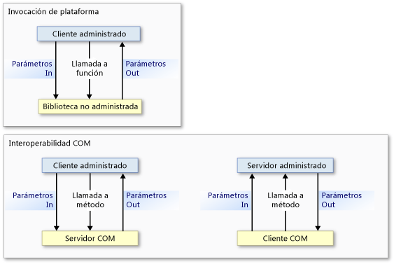
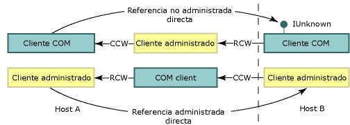

# Serialización de interoperabilidadInterop Marshaling
 La serialización de interoperabilidad rige cómo se pasan los datos en argumentos de método y valores devueltos entre la memoria administrada y la no administrada durante las llamadas.Interop marshaling governs how data is passed in method arguments and return values between managed and unmanaged memory during calls. La serialización de interoperabilidad es una actividad en tiempo de ejecución realizada por el servicio de serialización de Common Language Runtime.Interop marshaling is a run-time activity performed by the common language runtime's marshaling service.  
  
 La mayoría de los tipos de datos tienen representaciones comunes tanto en la memoria administrada como en la no administrada.Most data types have common representations in both managed and unmanaged memory. El administrador de serialización de interoperabilidad controla esos tipos automáticamente.The interop marshaler handles these types for you. El resto de tipos pueden ser ambiguos o no estar representados en la memoria administrada.Other types can be ambiguous or not represented at all in managed memory.  
  
 Un tipo ambiguo puede tener varias representaciones no administradas que se asignan a un solo tipo administrado, o bien no tener información de tipos, como el tamaño de una matriz.An ambiguous type can have either multiple unmanaged representations that map to a single managed type, or missing type information, such as the size of an array. Para los tipos ambiguos, el administrador de serialización proporciona una representación predeterminada y varias representaciones alternativas si existen.For ambiguous types, the marshaler provides a default representation and alternative representations where multiple representations exist. Se pueden proporcionar instrucciones explícitas al administrador de serialización sobre cómo serializar un tipo ambiguo.You can supply explicit instructions to the marshaler on how it is to marshal an ambiguous type.  
  
 Esta información general contiene las siguientes secciones:This overview contains the following sections:  
  
-   [Modelos de invocación de plataforma e interoperabilidad COMPlatform Invoke and COM Interop Models](#platform_invoke_and_com_interop_models)  
  
-   [Serialización y contenedores COMMarshaling and COM Apartments](#marshaling_and_com_apartments)  
  
-   [Serialización de llamadas remotasMarshaling Remote Calls](#marshaling_remote_calls)  
  
-   [Temas relacionadosRelated Topics](#related_topics)  
  
-   [ReferenciaReference](#reference)  
  
   
## Modelos de invocación de plataforma e interoperabilidad COMPlatform Invoke and COM Interop Models  
 Common Language Runtime proporciona dos mecanismos para interoperar con código no administrado:The common language runtime provides two mechanisms for interoperating with unmanaged code:  
  
-   Invocación de plataforma, que permite al código administrado llamar a funciones exportadas desde una biblioteca no administrada.Platform invoke, which enables managed code to call functions exported from an unmanaged library.  
  
-   Interoperabilidad COM, que permite al código administrado interactuar con modelos de objetos componentes (COM) a través de interfaces.COM interop, which enables managed code to interact with Component Object Model (COM) objects through interfaces.  
  
 Tanto la invocación de plataforma como la interoperabilidad COM usan serialización de interoperabilidad para mover con precisión los argumentos de método desde el llamador al destinatario y viceversa, si es necesario.Both platform invoke and COM interop use interop marshaling to accurately move method arguments between caller and callee and back, if required. Como se muestra en la siguiente ilustración, una llamada al método de invocación de plataforma fluye desde el código administrado al no administrado y nunca en sentido contrario, excepto cuando hay [funciones de devolución de llamada](../../../docs/framework/interop/callback-functions.md) implicadas.As the following illustration shows, a platform invoke method call flows from managed to unmanaged code and never the other way, except when [callback functions](../../../docs/framework/interop/callback-functions.md) are involved. Aunque las llamadas de invocación de plataforma solo pueden realizarse desde código administrado a código no administrado, los datos pueden fluir en ambas direcciones como parámetros de entrada o salida.Even though platform invoke calls can flow only from managed to unmanaged code, data can flow in both directions as input or output parameters. Las llamadas a métodos de interoperabilidad COM pueden fluir en ambas direcciones.COM interop method calls can flow in either direction.  
  
   
Flujo de llamadas de invocación de plataforma e interoperabilidad COMPlatform invoke and COM interop call flow  
  
 En el nivel más bajo, ambos mecanismos usan el mismo servicio de serialización de interoperabilidad; sin embargo, hay determinados tipos de datos que solo se admiten en la interoperabilidad COM o en la invocación de plataforma.At the lowest level, both mechanisms use the same interop marshaling service; however, certain data types are supported exclusively by COM interop or platform invoke. Para obtener más información, vea [Comportamiento de serialización predeterminado](../../../docs/framework/interop/default-marshaling-behavior.md).For details, see [Default Marshaling Behavior](../../../docs/framework/interop/default-marshaling-behavior.md).  
  
 [Volver al principioBack to top](#top)  
  
   
## Serialización y apartamentos COMMarshaling and COM Apartments  
 El administrador de serialización de interoperabilidad serializa datos entre el montón de Common Language Runtime y el montón no administrado.The interop marshaler marshals data between the common language runtime heap and the unmanaged heap. La serialización se produce siempre que el llamador y el destinatario no pueden operar en la misma instancia de datos.Marshaling occurs whenever the caller and callee cannot operate on the same instance of data. El administrador de serialización de interoperabilidad permite al llamador y al destinatario operar en los mismos datos, incluso aunque tengan su propia copia de los datos.The interop marshaler makes it possible for the caller and callee to appear to be operating on the same data even if they have their own copy of the data.  
  
 COM también dispone de un administrador de serialización que serializa datos entre apartamentos COM o diferentes procesos COM.COM also has a marshaler that marshals data between COM apartments or different COM processes. Al realizar llamadas entre código administrado y no administrado en el mismo apartamento COM, el administrador de serialización de interoperabilidad es el único administrador de serialización implicado.When calling between managed and unmanaged code within the same COM apartment, the interop marshaler is the only marshaler involved. Al realizar llamadas entre código administrado y código no administrado en un apartamento COM diferente o en un proceso diferente, están implicados tanto el administrador de serialización de interoperabilidad como el administrador de serialización de COM.When calling between managed code and unmanaged code in a different COM apartment or a different process, both the interop marshaler and the COM marshaler are involved.  
  
### Clientes COM y servidores administradosCOM Clients and Managed Servers  
 Un servidor administrado exportado con una biblioteca de tipos registrada por la [herramienta de registro de ensamblados (Regasm.exe)](../../../docs/framework/tools/regasm-exe-assembly-registration-tool.md) tiene una entrada del Registro `ThreadingModel` establecida en `Both`.An exported managed server with a type library registered by the [Regasm.exe (Assembly Registration Tool)](../../../docs/framework/tools/regasm-exe-assembly-registration-tool.md) has a `ThreadingModel` registry entry set to `Both`. Este valor indica que el servidor puede activarse en un contenedor uniproceso (STA) o en un contenedor multiproceso (MTA).This value indicates that the server can be activated in a single-threaded apartment (STA) or a multithreaded apartment (MTA). El objeto de servidor se crea en el mismo apartamento que su llamador, como se muestra en la tabla siguiente.The server object is created in the same apartment as its caller, as shown in the following table.  
  
|Cliente COMCOM client|Servidor .NET.NET server|Requisitos de serializaciónMarshaling requirements|  
|----------------|-----------------|-----------------------------|  
|STASTA|`Both` se convierte en STA.`Both` becomes STA.|Serialización en mismo apartamento.Same-apartment marshaling.|  
|MTAMTA|`Both` se convierte en MTA.`Both` becomes MTA.|Serialización en mismo apartamento.Same-apartment marshaling.|  
  
 Dado que el cliente y el servidor están en el mismo apartamento, el servicio de serialización de interoperabilidad controla automáticamente toda la serialización de datos.Because the client and server are in the same apartment, the interop marshaling service automatically handles all data marshaling. La ilustración siguiente muestra cómo opera el servicio de serialización de interoperabilidad entre montones administrados y no administrados dentro del mismo apartamento de estilo COM.The following illustration shows the interop marshaling service operating between managed and unmanaged heaps within the same COM-style apartment.  
  
   
Proceso de serialización en el mismo apartamentoSame-apartment marshaling process  
  
 Si planea exportar un servidor administrado, tenga en cuenta que el cliente COM determina el apartamento del servidor.If you plan to export a managed server, be aware that the COM client determines the apartment of the server. Un servidor administrado llamado por un cliente COM inicializado en un MTA debe garantizar la seguridad de subprocesos.A managed server called by a COM client initialized in an MTA must ensure thread safety.  
  
### Clientes administrados y servidores COMManaged Clients and COM Servers  
 La configuración predeterminada para apartamentos de cliente administrado es MTA; sin embargo, el tipo de aplicación del cliente .NET puede cambiar la configuración predeterminada.The default setting for managed client apartments is MTA; however, the application type of the .NET client can change the default setting. Por ejemplo, una configuración de apartamento de cliente [!INCLUDE[vbprvblong](../../../includes/vbprvblong-md.md)] es STA.For example, a [!INCLUDE[vbprvblong](../../../includes/vbprvblong-md.md)] client apartment setting is STA. Puede usar <xref:System.STAThreadAttribute?displayProperty=nameWithType>, <xref:System.MTAThreadAttribute?displayProperty=nameWithType>, la propiedad <xref:System.Threading.Thread.ApartmentState%2A?displayProperty=nameWithType> o la propiedad <xref:System.Web.UI.Page.AspCompatMode%2A?displayProperty=nameWithType> para examinar y cambiar la configuración de apartamento de un cliente administrado.You can use the <xref:System.STAThreadAttribute?displayProperty=nameWithType>, the <xref:System.MTAThreadAttribute?displayProperty=nameWithType>, the <xref:System.Threading.Thread.ApartmentState%2A?displayProperty=nameWithType> property, or the <xref:System.Web.UI.Page.AspCompatMode%2A?displayProperty=nameWithType> property to examine and change the apartment setting of a managed client.  
  
 El autor del componente establece la afinidad del subproceso de un servidor COM.The author of the component sets the thread affinity of a COM server. En la tabla siguiente se muestran las combinaciones de configuraciones de apartamentos para clientes .NET y servidores COM.The following table shows the combinations of apartment settings for .NET clients and COM servers. También se muestran los requisitos de serialización resultantes para las combinaciones.It also shows the resulting marshaling requirements for the combinations.  
  
|Cliente .NET.NET client|Servidor COMCOM server|Requisitos de serializaciónMarshaling requirements|  
|-----------------|----------------|-----------------------------|  
|MTA (valor predeterminado)MTA (default)|MTAMTA   STASTA|Serialización de interoperabilidad.Interop marshaling.   Serialización de interoperabilidad y COM.Interop and COM marshaling.|  
|STASTA|MTAMTA   STASTA|Serialización de interoperabilidad y COM.Interop and COM marshaling.   Serialización de interoperabilidad.Interop marshaling.|  
  
 Cuando un cliente administrado y un servidor no administrado están en el mismo apartamento, el servicio de serialización de interoperabilidad controla toda la serialización de datos.When a managed client and unmanaged server are in the same apartment, the interop marshaling service handles all data marshaling. Sin embargo, cuando el cliente y el servidor se inicializan en apartamentos diferentes, también es necesaria la serialización de COM.However, when client and server are initialized in different apartments, COM marshaling is also required. La ilustración siguiente muestra los elementos de una llamada entre apartamentos.The following illustration shows the elements of a cross-apartment call.  
  
   
Llamada entre apartamentos entre un cliente .NET y un objeto COMCross-apartment call between a .NET client and COM object  
  
 Para una serialización entre apartamentos, puede hacer lo siguiente:For cross-apartment marshaling, you can do the following:  
  
-   Aceptar la sobrecarga que supone la serialización entre apartamentos, que solo es apreciable cuando hay muchas llamadas que cruzan el límite.Accept the overhead of the cross-apartment marshaling, which is noticeable only when there are many calls across the boundary. Debe registrar la biblioteca de tipos del componente COM para que las llamadas crucen correctamente el límite del apartamento.You must register the type library of the COM component for calls to successfully cross the apartment boundary.  
  
-   Establecer el subproceso de cliente en STA o MTA para alterar el subproceso principal.Alter the main thread by setting the client thread to STA or MTA. Por ejemplo, si el cliente de C# llama a muchos componentes COM de STA, puede evitar la serialización entre apartamentos si establece el subproceso principal en STA.For example, if your C# client calls many STA COM components, you can avoid cross-apartment marshaling by setting the main thread to STA.  
  
    > [!NOTE]
    >  Una vez que se establece el subproceso de un cliente C# en STA, las llamadas a componentes COM de MTA requerirán la serialización entre apartamentos.Once the thread of a C# client is set to STA, calls to MTA COM components will require cross-apartment marshaling.  
  
 Para obtener instrucciones sobre cómo seleccionar explícitamente un modelo de contenedor, vea [Subprocesamiento administrado y no administrado](http://msdn.microsoft.com/en-us/db425c20-4b2f-4433-bf96-76071c7881e5).For instructions on explicitly selecting an apartment model, see [Managed and Unmanaged Threading](http://msdn.microsoft.com/en-us/db425c20-4b2f-4433-bf96-76071c7881e5).  
  
 [Volver al principioBack to top](#top)  
  
   
## Serialización de llamadas remotasMarshaling Remote Calls  
 Al igual que con la serialización entre apartamentos, la serialización de COM participa en todas las llamadas entre código administrado y no administrado siempre que los objetos residan en procesos independientes.As with cross-apartment marshaling, COM marshaling is involved in each call between managed and unmanaged code whenever the objects reside in separate processes. Por ejemplo:For example:  
  
-   Un cliente COM que invoca a un servidor administrado en un host remoto usa COM distribuido (DCOM).A COM client that invokes a managed server on a remote host uses distributed COM (DCOM).  
  
-   Un cliente administrado que invoca a un servidor COM en un host remoto usa DCOM.A managed client that invokes a COM server on a remote host uses DCOM.  
  
 En la ilustración siguiente se muestra cómo la serialización de interoperabilidad y la serialización de COM proporcionan canales de comunicación a través de procesos y límites de hosts.The following illustration shows how interop marshaling and COM marshaling provide communications channels across process and host boundaries.  
  
   
Serialización entre procesosCross-process marshaling  
  
### Conservar la identidadPreserving Identity  
 Common Language Runtime conserva la identidad de las referencias administradas y no administradas.The common language runtime preserves the identity of managed and unmanaged references. En la siguiente ilustración se muestra el flujo de referencias directas no administradas (fila superior) y de referencias directas administradas (fila inferior) entre procesos y límites de hosts.The following illustration shows the flow of direct unmanaged references (top row) and direct managed references (bottom row) across process and host boundaries.  
  
   
Paso de referencia entre límites de hosts y procesosReference passing across process and host boundaries  
  
 En esta ilustración:In this illustration:  
  
-   Un cliente no administrado obtiene una referencia a un objeto COM de un objeto administrado que obtiene esta referencia de un host remoto.An unmanaged client gets a reference to a COM object from a managed object that gets this reference from a remote host. El mecanismo de comunicación remota es DCOM.The remoting mechanism is DCOM.  
  
-   Un cliente administrado obtiene una referencia a un objeto administrado de un objeto COM que obtiene esta referencia de un host remoto.A managed client gets a reference to a managed object from a COM object that gets this reference from a remote host. El mecanismo de comunicación remota es DCOM.The remoting mechanism is DCOM.  
  
    > [!NOTE]
    >  La biblioteca de tipos exportada del servidor administrado debe estar registrada.The exported type library of the managed server must be registered.  
  
 El número de límites de procesos entre llamador y destinatario es irrelevante; la misma referencia directa se produce para las llamadas en proceso y fuera de proceso.The number of process boundaries between caller and callee is irrelevant; the same direct referencing occurs for in-process and out-of-process calls.  
  
### Comunicación remota administradaManaged Remoting  
 El runtime también proporciona comunicación remota administrada que puede usarse para establecer un canal de comunicaciones entre objetos administrados a través varios procesos y límites de hosts.The runtime also provides managed remoting, which you can use to establish a communications channel between managed objects across process and host boundaries. La comunicación remota administrada puede alojar un firewall entre los componentes de la comunicación, como se muestra en la ilustración siguiente.Managed remoting can accommodate a firewall between the communicating components, as the following illustration shows.  
  
   
Llamadas remotas a través de firewalls que usan SOAP o la clase TcpChannelRemote calls across firewalls using SOAP or the TcpChannel class  
  
 Algunas llamadas no administradas pueden canalizarse mediante SOAP, como las llamadas entre [componentes con servicio](http://msdn.microsoft.com/en-us/f109ee24-81ad-4d99-9892-51ac6f34978c) y COM.Some unmanaged calls can be channeled through SOAP, such as the calls between [serviced components](http://msdn.microsoft.com/en-us/f109ee24-81ad-4d99-9892-51ac6f34978c) and COM.  
  
 [Volver al principioBack to top](#top)  
  
   
## Temas relacionadosRelated Topics  
  
|TítuloTitle|DescripciónDescription|  
|-----------|-----------------|  
|[Comportamiento predeterminado del cálculo de referenciasDefault Marshaling Behavior](../../../docs/framework/interop/default-marshaling-behavior.md)|Describe las reglas que usa el servicio de serialización de interoperabilidad para serializar datos.Describes the rules that the interop marshaling service uses to marshal data.|  
|[Serialización de datos con invocación de plataformaMarshaling Data with Platform Invoke](../../../docs/framework/interop/marshaling-data-with-platform-invoke.md)|Describe cómo se declaran parámetros de método y se pasan argumentos a funciones exportadas por bibliotecas no administradas.Describes how to declare method parameters and pass arguments to functions exported by unmanaged libraries.|  
|[Serialización de datos con la interoperabilidad COMMarshaling Data with COM Interop](../../../docs/framework/interop/marshaling-data-with-com-interop.md)|Describe cómo se personalizan los contenedores COM para alterar el comportamiento de la serialización.Describes how to customize COM wrappers to alter marshaling behavior.|  
|[Cómo: Migrar código administrado DCOM a WCFHow to: Migrate Managed-Code DCOM to WCF](../../../docs/framework/interop/how-to-migrate-managed-code-dcom-to-wcf.md)|Describe cómo se migra de DCOM a WCF.Describes how to migrate from DCOM to WCF.|  
|[Asignar resultados HRESULT y excepcionesHow to: Map HRESULTs and Exceptions](../../../docs/framework/interop/how-to-map-hresults-and-exceptions.md)|Describe cómo se asignan excepciones personalizadas a valores HRESULT y proporciona la asignación completa de cada HRESULT a su clase de excepción comparable en .NET Framework.Describes how to map custom exceptions to HRESULTs and provides the complete mapping from each HRESULT to its comparable exception class in the .NET Framework.|  
|[Interoperar mediante tipos genéricosInteroperating Using Generic Types](http://msdn.microsoft.com/en-us/26b88e03-085b-4b53-94ba-a5a9c709ce58)|Describe qué acciones se admiten al usar tipos genéricos para la interoperabilidad COM.Describes which actions are supported when using generic types for COM interoperability.|  
|[Interoperating with Unmanaged Code](../../../docs/framework/interop/index.md) (Interoperar con código no administrado)[Interoperating with Unmanaged Code](../../../docs/framework/interop/index.md)|Describe los servicios de interoperabilidad proporcionados por Common Language Runtime.Describes interoperability services provided by the common language runtime.|  
|[Interoperabilidad COM avanzadaAdvanced COM Interoperability](http://msdn.microsoft.com/en-us/3ada36e5-2390-4d70-b490-6ad8de92f2fb)|Proporciona vínculos a más información sobre la incorporación de componentes COM en una aplicación de .NET Framework.Provides links to more information about incorporating COM components into your .NET Framework application.|  
|[Consideraciones de diseño para interoperacionesDesign Considerations for Interoperation](http://msdn.microsoft.com/en-us/b59637f6-fe35-40d6-ae72-901e7a707689)|Proporciona sugerencias para escribir componentes COM integrados.Provides tips for writing integrated COM components.|  
  
 [Volver al principioBack to top](#top)  
  
   
## ReferenciaReference  
 <xref:System.Runtime.InteropServices?displayProperty=nameWithType>  
  
 [Volver al principioBack to top](#top)
