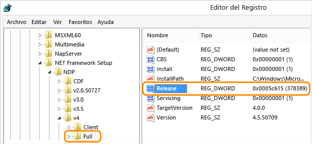

# <a name="how-to-determine-which-net-framework-versions-are-installed"></a><span data-ttu-id="0c70d-103">Procedimiento para determinar qué versiones de .NET Framework están instaladas</span><span class="sxs-lookup"><span data-stu-id="0c70d-103">How to: Determine which .NET Framework versions are installed</span></span>

<span data-ttu-id="0c70d-104">Los usuarios pueden [instalar](../install/index.md) y ejecutar varias versiones de .NET Framework en sus equipos.</span><span class="sxs-lookup"><span data-stu-id="0c70d-104">Users can [install](../install/index.md) and run multiple versions of the .NET Framework on their computers.</span></span> <span data-ttu-id="0c70d-105">Al desarrollar o implementar una aplicación, puede que necesite conocer las versiones de .NET Framework que están instaladas en el equipo del usuario.</span><span class="sxs-lookup"><span data-stu-id="0c70d-105">When you develop or deploy your app, you might need to know which .NET Framework versions are installed on the user’s computer.</span></span> <span data-ttu-id="0c70d-106">El registro contiene una lista de las versiones de .NET Framework instaladas en un equipo.</span><span class="sxs-lookup"><span data-stu-id="0c70d-106">The registry contains a list of the .NET Framework versions installed on a computer.</span></span>

<span data-ttu-id="0c70d-107">.NET Framework está formado por dos componentes principales con versiones separadas:</span><span class="sxs-lookup"><span data-stu-id="0c70d-107">The .NET Framework consists of two main components, which are versioned separately:</span></span>

- <span data-ttu-id="0c70d-108">Un conjunto de ensamblados, que son colecciones de tipos y recursos que proporcionan funciones a las aplicaciones.</span><span class="sxs-lookup"><span data-stu-id="0c70d-108">A set of assemblies, which are collections of types and resources that provide the functionality for your apps.</span></span> <span data-ttu-id="0c70d-109">.NET Framework y los ensamblados comparten el mismo número de versión.</span><span class="sxs-lookup"><span data-stu-id="0c70d-109">The .NET Framework and assemblies share the same version number.</span></span> <span data-ttu-id="0c70d-110">Por ejemplo, las versiones de .NET Framework incluyen 4.5, 4.6.1 y 4.7.2.</span><span class="sxs-lookup"><span data-stu-id="0c70d-110">For example, .NET Framework versions include 4.5, 4.6.1, and 4.7.2.</span></span>

- <span data-ttu-id="0c70d-111">Common Language Runtime (CLR), que administra y ejecuta el código de la aplicación.</span><span class="sxs-lookup"><span data-stu-id="0c70d-111">The common language runtime (CLR), which manages and executes your app's code.</span></span> <span data-ttu-id="0c70d-112">Normalmente, una misma versión de CLR admite varias versiones de .NET Framework.</span><span class="sxs-lookup"><span data-stu-id="0c70d-112">A single CLR version typically supports multiple .NET Framework versions.</span></span> <span data-ttu-id="0c70d-113">Por ejemplo, la versión de CLR 4.0.30319.*xxxxx* donde *xxxxx* es inferior a 42000, admite las versiones 4 a la 4.5.2 de .NET Framework.</span><span class="sxs-lookup"><span data-stu-id="0c70d-113">For example, CLR version 4.0.30319.*xxxxx* where *xxxxx* is less than 42000, supports .NET Framework versions 4 through 4.5.2.</span></span> <span data-ttu-id="0c70d-114">La versión de CLR mayor o igual que 4.0.30319.42000 admite las versiones de .NET Framework a partir de .NET Framework 4.6.</span><span class="sxs-lookup"><span data-stu-id="0c70d-114">CLR version greater than or equal to 4.0.30319.42000 supports .NET Framework versions starting with .NET Framework 4.6.</span></span>

<span data-ttu-id="0c70d-115">La comunidad ha creado herramientas que ayudan a detectar qué versiones de .NET Framework están instaladas:</span><span class="sxs-lookup"><span data-stu-id="0c70d-115">Community-maintained tools are available to help detect which .NET Framework versions are installed:</span></span>

- [https://github.com/jmalarcon/DotNetVersions](https://github.com/jmalarcon/DotNetVersions)

  <span data-ttu-id="0c70d-116">Una línea de comandos de .NET 2.0.</span><span class="sxs-lookup"><span data-stu-id="0c70d-116">A .NET 2.0 command-line tool.</span></span>

- [https://github.com/EliteLoser/DotNetVersionLister](https://github.com/EliteLoser/DotNetVersionLister)

  <span data-ttu-id="0c70d-117">Un módulo de PowerShell 2.0.</span><span class="sxs-lookup"><span data-stu-id="0c70d-117">A PowerShell 2.0 module.</span></span>

<span data-ttu-id="0c70d-118">Para obtener información sobre cómo detectar las actualizaciones instaladas de cada versión de .NET Framework, vea [Cómo: Determinar las actualizaciones de .NET Framework que están instaladas](how-to-determine-which-net-framework-updates-are-installed.md).</span><span class="sxs-lookup"><span data-stu-id="0c70d-118">For information about detecting the installed updates for each version of the .NET Framework, see [How to: Determine which .NET Framework updates are installed](how-to-determine-which-net-framework-updates-are-installed.md).</span></span>

## <a name="detect-net-framework-45-and-later-versions"></a><span data-ttu-id="0c70d-119">Detección de .NET Framework 4.5 y versiones posteriores</span><span class="sxs-lookup"><span data-stu-id="0c70d-119">Detect .NET Framework 4.5 and later versions</span></span>

<span data-ttu-id="0c70d-120">La versión de .NET Framework (4.5 y posteriores) instalada en un equipo se muestra en el Registro, en **HKEY_LOCAL_MACHINE\\SOFTWARE\\Microsoft\\NET Framework Setup\\NDP\\V4\\Full**.</span><span class="sxs-lookup"><span data-stu-id="0c70d-120">The version of .NET Framework (4.5 and later) installed on a machine is listed in the registry at **HKEY_LOCAL_MACHINE\\SOFTWARE\\Microsoft\\NET Framework Setup\\NDP\\v4\\Full**.</span></span> <span data-ttu-id="0c70d-121">Si falta la subclave **Full**, significa que .NET Framework 4.5 o superior no está instalado.</span><span class="sxs-lookup"><span data-stu-id="0c70d-121">If the **Full** subkey is missing, then .NET Framework 4.5 or above isn't installed.</span></span>

> [!NOTE]
> <span data-ttu-id="0c70d-122">La carpeta **NET Framework Setup** del Registro *no* comienza con un punto.</span><span class="sxs-lookup"><span data-stu-id="0c70d-122">The **NET Framework Setup** subkey in the registry path does *not* begin with a period.</span></span>

<span data-ttu-id="0c70d-123">El valor REG_DWORD de **Release** del Registro representa la versión de .NET Framework que está instalada.</span><span class="sxs-lookup"><span data-stu-id="0c70d-123">The **Release** REG_DWORD value in the registry represents the version of .NET Framework installed.</span></span>

<a name="version_table"></a>

| <span data-ttu-id="0c70d-124">Versión de .NET Framework</span><span class="sxs-lookup"><span data-stu-id="0c70d-124">.NET Framework version</span></span> | <span data-ttu-id="0c70d-125">Valor de **Release**</span><span class="sxs-lookup"><span data-stu-id="0c70d-125">Value of **Release**</span></span> |
| ---------------------- | -------------------------- |
| <span data-ttu-id="0c70d-126">.NET Framework 4.5</span><span class="sxs-lookup"><span data-stu-id="0c70d-126">.NET Framework 4.5</span></span>     | <span data-ttu-id="0c70d-127">Todos los sistemas operativos Windows: 378389</span><span class="sxs-lookup"><span data-stu-id="0c70d-127">All Windows operating systems: 378389</span></span> |
| <span data-ttu-id="0c70d-128">.NET Framework 4.5.1</span><span class="sxs-lookup"><span data-stu-id="0c70d-128">.NET Framework 4.5.1</span></span>   | <span data-ttu-id="0c70d-129">En Windows 8.1 y Windows Server 2012 R2: 378675</span><span class="sxs-lookup"><span data-stu-id="0c70d-129">On Windows 8.1 and Windows Server 2012 R2: 378675</span></span><br /><span data-ttu-id="0c70d-130">En todos los demás sistemas operativos Windows: 378758</span><span class="sxs-lookup"><span data-stu-id="0c70d-130">On all other Windows operating systems: 378758</span></span> |
| <span data-ttu-id="0c70d-131">.NET Framework 4.5.2</span><span class="sxs-lookup"><span data-stu-id="0c70d-131">.NET Framework 4.5.2</span></span>   | <span data-ttu-id="0c70d-132">Todos los sistemas operativos Windows: 379893</span><span class="sxs-lookup"><span data-stu-id="0c70d-132">All Windows operating systems: 379893</span></span> |
| <span data-ttu-id="0c70d-133">.NET Framework 4.6</span><span class="sxs-lookup"><span data-stu-id="0c70d-133">.NET Framework 4.6</span></span>     | <span data-ttu-id="0c70d-134">En Windows 10: 393295</span><span class="sxs-lookup"><span data-stu-id="0c70d-134">On Windows 10: 393295</span></span><br /><span data-ttu-id="0c70d-135">En todos los demás sistemas operativos Windows: 393297</span><span class="sxs-lookup"><span data-stu-id="0c70d-135">On all other Windows operating systems: 393297</span></span> |
| <span data-ttu-id="0c70d-136">.NET Framework 4.6.1</span><span class="sxs-lookup"><span data-stu-id="0c70d-136">.NET Framework 4.6.1</span></span>   | <span data-ttu-id="0c70d-137">En sistemas con la actualización de noviembre de Windows 10: 394254</span><span class="sxs-lookup"><span data-stu-id="0c70d-137">On Windows 10 November Update systems: 394254</span></span><br /><span data-ttu-id="0c70d-138">En todos los demás sistemas operativos Windows (incluido Windows 10): 394271</span><span class="sxs-lookup"><span data-stu-id="0c70d-138">On all other Windows operating systems (including Windows 10): 394271</span></span> |
| <span data-ttu-id="0c70d-139">.NET Framework 4.6.2</span><span class="sxs-lookup"><span data-stu-id="0c70d-139">.NET Framework 4.6.2</span></span>   | <span data-ttu-id="0c70d-140">En la Actualización de aniversario de Windows 10 y Windows Server 2016: 394802</span><span class="sxs-lookup"><span data-stu-id="0c70d-140">On Windows 10 Anniversary Update and Windows Server 2016: 394802</span></span><br /><span data-ttu-id="0c70d-141">En todos los demás sistemas operativos Windows (incluidos otros sistemas operativos Windows 10): 394806</span><span class="sxs-lookup"><span data-stu-id="0c70d-141">On all other Windows operating systems (including other Windows 10 operating systems): 394806</span></span> |
| <span data-ttu-id="0c70d-142">.NET Framework 4.7</span><span class="sxs-lookup"><span data-stu-id="0c70d-142">.NET Framework 4.7</span></span>     | <span data-ttu-id="0c70d-143">En Windows 10 Creators Update: 460798</span><span class="sxs-lookup"><span data-stu-id="0c70d-143">On Windows 10 Creators Update: 460798</span></span><br /><span data-ttu-id="0c70d-144">En todos los demás sistemas operativos Windows (incluidos otros sistemas operativos Windows 10): 460805</span><span class="sxs-lookup"><span data-stu-id="0c70d-144">On all other Windows operating systems (including other Windows 10 operating systems): 460805</span></span> |
| <span data-ttu-id="0c70d-145">.NET Framework 4.7.1</span><span class="sxs-lookup"><span data-stu-id="0c70d-145">.NET Framework 4.7.1</span></span>   | <span data-ttu-id="0c70d-146">En Windows 10 Fall Creators Update y Windows Server, versión 1709: 461308</span><span class="sxs-lookup"><span data-stu-id="0c70d-146">On Windows 10 Fall Creators Update and Windows Server, version 1709: 461308</span></span><br/><span data-ttu-id="0c70d-147">En todos los demás sistemas operativos Windows (incluidos otros sistemas operativos Windows 10): 461310</span><span class="sxs-lookup"><span data-stu-id="0c70d-147">On all other Windows operating systems (including other Windows 10 operating systems): 461310</span></span> |
| <span data-ttu-id="0c70d-148">.NET Framework 4.7.2</span><span class="sxs-lookup"><span data-stu-id="0c70d-148">.NET Framework 4.7.2</span></span>   | <span data-ttu-id="0c70d-149">En la actualización de Windows 10 de abril de 2018 y Windows Server, versión 1803: 461808</span><span class="sxs-lookup"><span data-stu-id="0c70d-149">On Windows 10 April 2018 Update and Windows Server, version 1803: 461808</span></span><br/><span data-ttu-id="0c70d-150">En todos los sistemas operativos diferentes de la Actualización de abril de 2018 de Windows 10 y Windows Server, versión 1803: 461814</span><span class="sxs-lookup"><span data-stu-id="0c70d-150">On all Windows operating systems other than Windows 10 April 2018 Update and Windows Server, version 1803: 461814</span></span> |
| <span data-ttu-id="0c70d-151">.NET Framework 4.8</span><span class="sxs-lookup"><span data-stu-id="0c70d-151">.NET Framework 4.8</span></span>     | <span data-ttu-id="0c70d-152">En la actualización de Windows 10 de mayo de 2019 y en la de noviembre de 2019: 528040</span><span class="sxs-lookup"><span data-stu-id="0c70d-152">On Windows 10 May 2019 Update and Windows 10 November 2019 Update: 528040</span></span><br/><span data-ttu-id="0c70d-153">En Windows 10 y Windows Server, versión 1909: 528209</span><span class="sxs-lookup"><span data-stu-id="0c70d-153">On Windows 10 and Windows Server, version 1909: 528209</span></span><br/><span data-ttu-id="0c70d-154">En todos los demás sistemas operativos Windows (incluidos otros sistemas operativos Windows 10): 528049</span><span class="sxs-lookup"><span data-stu-id="0c70d-154">On all other Windows operating systems (including other Windows 10 operating systems): 528049</span></span> |

### <a name="minimum-version"></a><span data-ttu-id="0c70d-155">Versión mínima</span><span class="sxs-lookup"><span data-stu-id="0c70d-155">Minimum version</span></span>

<span data-ttu-id="0c70d-156">Para determinar si existe una versión *mínima* de .NET Framework, use el valor más bajo de REG_DWORD de **Release** para esa versión de la tabla anterior.</span><span class="sxs-lookup"><span data-stu-id="0c70d-156">To determine whether a *minimum* version of the .NET Framework is present, use the smallest **Release** REG_DWORD value for that version from the previous table.</span></span>

<span data-ttu-id="0c70d-157">Por ejemplo, si la aplicación se ejecuta en .NET Framework 4.8 o en una versión posterior, pruebe un valor de REG_DWORD de **Release** que sea *mayor o igual que* 528040.</span><span class="sxs-lookup"><span data-stu-id="0c70d-157">For example, if your application runs under .NET Framework 4.8 or a later version, test for a **Release** REG_DWORD value that is *greater than or equal to* 528040.</span></span>

| <span data-ttu-id="0c70d-158">Versión de .NET Framework</span><span class="sxs-lookup"><span data-stu-id="0c70d-158">.NET Framework version</span></span> | <span data-ttu-id="0c70d-159">Valor mínimo</span><span class="sxs-lookup"><span data-stu-id="0c70d-159">Minimum value</span></span> |
| ---------------------- | ------------- |
| <span data-ttu-id="0c70d-160">.NET Framework 4.5</span><span class="sxs-lookup"><span data-stu-id="0c70d-160">.NET Framework 4.5</span></span>     | <span data-ttu-id="0c70d-161">378389</span><span class="sxs-lookup"><span data-stu-id="0c70d-161">378389</span></span> |
| <span data-ttu-id="0c70d-162">.NET Framework 4.5.1</span><span class="sxs-lookup"><span data-stu-id="0c70d-162">.NET Framework 4.5.1</span></span>   | <span data-ttu-id="0c70d-163">378675</span><span class="sxs-lookup"><span data-stu-id="0c70d-163">378675</span></span> |
| <span data-ttu-id="0c70d-164">.NET Framework 4.5.2</span><span class="sxs-lookup"><span data-stu-id="0c70d-164">.NET Framework 4.5.2</span></span>   | <span data-ttu-id="0c70d-165">379893</span><span class="sxs-lookup"><span data-stu-id="0c70d-165">379893</span></span> |
| <span data-ttu-id="0c70d-166">.NET Framework 4.6</span><span class="sxs-lookup"><span data-stu-id="0c70d-166">.NET Framework 4.6</span></span>     | <span data-ttu-id="0c70d-167">393295</span><span class="sxs-lookup"><span data-stu-id="0c70d-167">393295</span></span> |
| <span data-ttu-id="0c70d-168">.NET Framework 4.6.1</span><span class="sxs-lookup"><span data-stu-id="0c70d-168">.NET Framework 4.6.1</span></span>   | <span data-ttu-id="0c70d-169">394254</span><span class="sxs-lookup"><span data-stu-id="0c70d-169">394254</span></span> |
| <span data-ttu-id="0c70d-170">.NET Framework 4.6.2</span><span class="sxs-lookup"><span data-stu-id="0c70d-170">.NET Framework 4.6.2</span></span>   | <span data-ttu-id="0c70d-171">394802</span><span class="sxs-lookup"><span data-stu-id="0c70d-171">394802</span></span> |
| <span data-ttu-id="0c70d-172">.NET Framework 4.7</span><span class="sxs-lookup"><span data-stu-id="0c70d-172">.NET Framework 4.7</span></span>     | <span data-ttu-id="0c70d-173">460798</span><span class="sxs-lookup"><span data-stu-id="0c70d-173">460798</span></span> |
| <span data-ttu-id="0c70d-174">.NET Framework 4.7.1</span><span class="sxs-lookup"><span data-stu-id="0c70d-174">.NET Framework 4.7.1</span></span>   | <span data-ttu-id="0c70d-175">461308</span><span class="sxs-lookup"><span data-stu-id="0c70d-175">461308</span></span> |
| <span data-ttu-id="0c70d-176">.NET Framework 4.7.2</span><span class="sxs-lookup"><span data-stu-id="0c70d-176">.NET Framework 4.7.2</span></span>   | <span data-ttu-id="0c70d-177">461808</span><span class="sxs-lookup"><span data-stu-id="0c70d-177">461808</span></span> |
| <span data-ttu-id="0c70d-178">.NET Framework 4.8</span><span class="sxs-lookup"><span data-stu-id="0c70d-178">.NET Framework 4.8</span></span>     | <span data-ttu-id="0c70d-179">528040</span><span class="sxs-lookup"><span data-stu-id="0c70d-179">528040</span></span> |

### <a name="use-registry-editor"></a><span data-ttu-id="0c70d-180">Uso del Editor del Registro</span><span class="sxs-lookup"><span data-stu-id="0c70d-180">Use Registry Editor</span></span>

01. <span data-ttu-id="0c70d-181">En el menú **Inicio**, seleccione **Ejecutar**, escriba *regedit* y haga clic en **Aceptar**.</span><span class="sxs-lookup"><span data-stu-id="0c70d-181">From the **Start** menu, choose **Run**, enter *regedit*, and then select **OK**.</span></span>

    <span data-ttu-id="0c70d-182">Debe tener credenciales de administrador para ejecutar regedit.</span><span class="sxs-lookup"><span data-stu-id="0c70d-182">You must have administrative credentials to run regedit.</span></span>

01. <span data-ttu-id="0c70d-183">En el Editor del Registro, abra la subclave siguiente: **HKEY_LOCAL_MACHINE\\SOFTWARE\\Microsoft\\NET Framework Setup\\NDP\\v4\\Full**.</span><span class="sxs-lookup"><span data-stu-id="0c70d-183">In the Registry Editor, open the following subkey: **HKEY_LOCAL_MACHINE\\SOFTWARE\\Microsoft\\NET Framework Setup\\NDP\\v4\\Full**.</span></span> <span data-ttu-id="0c70d-184">Si la subclave **Full** no está presente, significa que .NET Framework 4.5 (o una versión posterior) no está instalado.</span><span class="sxs-lookup"><span data-stu-id="0c70d-184">If the **Full** subkey isn't present, then you don't have the .NET Framework 4.5 or later installed.</span></span>

01. <span data-ttu-id="0c70d-185">Busque una entrada REG_DWORD denominada **Release**.</span><span class="sxs-lookup"><span data-stu-id="0c70d-185">Check for a REG_DWORD entry named **Release**.</span></span> <span data-ttu-id="0c70d-186">Si existe, significa que tiene instalado .NET Framework 4.5 o una versión posterior.</span><span class="sxs-lookup"><span data-stu-id="0c70d-186">If it exists, then you have .NET Framework 4.5 or later installed.</span></span> <span data-ttu-id="0c70d-187">Su valor corresponde a una versión concreta de .NET Framework.</span><span class="sxs-lookup"><span data-stu-id="0c70d-187">Its value corresponds to a particular version of the .NET Framework.</span></span> <span data-ttu-id="0c70d-188">En la ilustración siguiente, por ejemplo, el valor de la entrada **Release** es 528040, que es la clave de versión de .NET Framework 4.8.</span><span class="sxs-lookup"><span data-stu-id="0c70d-188">In the following figure, for example, the value of the **Release** entry is 528040, which is the release key for .NET Framework 4.8.</span></span>

    <span data-ttu-id="0c70d-189"></span><span class="sxs-lookup"><span data-stu-id="0c70d-189"></span></span>

### <a name="use-powershell-to-check-for-a-minimum-version"></a><span data-ttu-id="0c70d-190">Uso de PowerShell para comprobar si hay una versión mínima</span><span class="sxs-lookup"><span data-stu-id="0c70d-190">Use PowerShell to check for a minimum version</span></span>

<span data-ttu-id="0c70d-191">Use comandos de PowerShell para comprobar el valor de la entrada **Release** de la subclave **HKEY_LOCAL_MACHINE\\SOFTWARE\\Microsoft\\NET Framework Setup\\NDP\\v4\\Full**.</span><span class="sxs-lookup"><span data-stu-id="0c70d-191">Use PowerShell commands to check the value of the **Release** entry of the **HKEY_LOCAL_MACHINE\\SOFTWARE\\Microsoft\\NET Framework Setup\\NDP\\v4\\Full** subkey.</span></span>

<span data-ttu-id="0c70d-192">En los ejemplos siguientes se comprueba el valor de la entrada **Release** para determinar si está instalado .NET Framework 4.6.2 o una versión posterior.</span><span class="sxs-lookup"><span data-stu-id="0c70d-192">The following examples check the value of the **Release** entry to determine whether the .NET Framework 4.6.2 or later is installed.</span></span> <span data-ttu-id="0c70d-193">Este código devuelve `True` si está instalado y `False` en caso contrario.</span><span class="sxs-lookup"><span data-stu-id="0c70d-193">This code returns `True` if it's installed and `False` otherwise.</span></span>

```PowerShell
(Get-ItemProperty "HKLM:SOFTWARE\Microsoft\NET Framework Setup\NDP\v4\Full").Release -ge 394802
```

### <a name="query-the-registry-using-code"></a><span data-ttu-id="0c70d-194">Consulta del registro mediante código</span><span class="sxs-lookup"><span data-stu-id="0c70d-194">Query the registry using code</span></span>

01. <span data-ttu-id="0c70d-195">Use los métodos <xref:Microsoft.Win32.RegistryKey.OpenBaseKey%2A?displayProperty=nameWithType> y <xref:Microsoft.Win32.RegistryKey.OpenSubKey%2A?displayProperty=nameWithType> para acceder a la subclave **HKEY_LOCAL_MACHINE\\SOFTWARE\\Microsoft\\NET Framework Setup\\NDP\\v4\\Full** en el Registro de Windows.</span><span class="sxs-lookup"><span data-stu-id="0c70d-195">Use the <xref:Microsoft.Win32.RegistryKey.OpenBaseKey%2A?displayProperty=nameWithType> and <xref:Microsoft.Win32.RegistryKey.OpenSubKey%2A?displayProperty=nameWithType> methods to access the **HKEY_LOCAL_MACHINE\\SOFTWARE\\Microsoft\\NET Framework Setup\\NDP\\v4\\Full** subkey in the Windows registry.</span></span>

    > [!IMPORTANT]
    > <span data-ttu-id="0c70d-196">Si la aplicación que está ejecutando es de 32 bits y se ejecuta en Windows de 64 bits, las rutas de acceso del Registro serán diferentes de las mostradas anteriormente.</span><span class="sxs-lookup"><span data-stu-id="0c70d-196">If the app you're running is 32-bit and running in 64-bit Windows, the registry paths will be different than previously listed.</span></span> <span data-ttu-id="0c70d-197">El registro de 64 bits está disponible en la subclave **HKEY_LOCAL_MACHINE\\SOFTWARE\\Wow6432Node\\** .</span><span class="sxs-lookup"><span data-stu-id="0c70d-197">The 64-bit registry is available in the **HKEY_LOCAL_MACHINE\\SOFTWARE\\Wow6432Node\\** subkey.</span></span> <span data-ttu-id="0c70d-198">Por ejemplo, la subclave del Registro para .NET Framework 4.5 es **HKEY_LOCAL_MACHINE\\SOFTWARE\\Wow6432Node\\Microsoft\\NET Framework Setup\\NDP\\V4\\Full**.</span><span class="sxs-lookup"><span data-stu-id="0c70d-198">For example, the registry subkey for .NET Framework 4.5 is **HKEY_LOCAL_MACHINE\\SOFTWARE\\Wow6432Node\\Microsoft\\NET Framework Setup\\NDP\\v4\\Full**.</span></span>

01. <span data-ttu-id="0c70d-199">Compruebe el valor REG_DWORD de **Release** para determinar la versión que está instalada.</span><span class="sxs-lookup"><span data-stu-id="0c70d-199">Check the **Release** REG_DWORD value to determine the installed version.</span></span> <span data-ttu-id="0c70d-200">Para que sea compatible con versiones posteriores, puede buscar un valor mayor o igual que el valor que se muestra en la [tabla de versiones de .NET Framework](#version_table).</span><span class="sxs-lookup"><span data-stu-id="0c70d-200">To be forward-compatible, check for a value greater than or equal to the value listed in the [.NET Framework version table](#version_table).</span></span>

<span data-ttu-id="0c70d-201">En el ejemplo siguiente se comprueba el valor de la entrada **Release** del Registro para buscar .NET Framework 4.5 y las versiones posteriores que están instaladas:</span><span class="sxs-lookup"><span data-stu-id="0c70d-201">The following example checks the value of the **Release** entry in the registry to find the .NET Framework 4.5 and later versions that are installed:</span></span>

[!code-csharp[ListVersions#5](../../../samples/snippets/csharp/framework/migration-guide/versions-installed3.cs)]
[!code-vb[ListVersions#5](../../../samples/snippets/visualbasic/framework/migration-guide/versions-installed3.vb)]

<span data-ttu-id="0c70d-202">Este ejemplo sigue la práctica recomendada para la comprobación de versión:</span><span class="sxs-lookup"><span data-stu-id="0c70d-202">This example follows the recommended practice for version checking:</span></span>

- <span data-ttu-id="0c70d-203">Comprueba si el valor de la entrada **Release** es *mayor o igual* que el valor de las claves de versión conocidas.</span><span class="sxs-lookup"><span data-stu-id="0c70d-203">It checks whether the value of the **Release** entry is *greater than or equal to* the value of the known release keys.</span></span>
- <span data-ttu-id="0c70d-204">Realiza la comprobación en orden, desde la versión más reciente hasta la más antigua.</span><span class="sxs-lookup"><span data-stu-id="0c70d-204">It checks in order from most recent version to earliest version.</span></span>

## <a name="detect-net-framework-10-through-40"></a><span data-ttu-id="0c70d-205">Detección de .NET Framework 1.0 a 4.0</span><span class="sxs-lookup"><span data-stu-id="0c70d-205">Detect .NET Framework 1.0 through 4.0</span></span>

<span data-ttu-id="0c70d-206">Cada versión de .NET Framework de 1.1 a 4.0 aparece como una subclave en **HKEY_LOCAL_MACHINE\\SOFTWARE\\Microsoft\\NET Framework Setup\\NDP**.</span><span class="sxs-lookup"><span data-stu-id="0c70d-206">Each version of .NET Framework from 1.1 to 4.0 is listed as a subkey at **HKEY_LOCAL_MACHINE\\SOFTWARE\\Microsoft\\NET Framework Setup\\NDP**.</span></span> <span data-ttu-id="0c70d-207">En la tabla siguiente se muestra la ruta de acceso a cada versión de .NET Framework.</span><span class="sxs-lookup"><span data-stu-id="0c70d-207">The following table lists the path to each .NET Framework version.</span></span> <span data-ttu-id="0c70d-208">Para la mayoría de las versiones, hay un valor REG_DWORD de **Install** de `1` que indica que esta versión está instalada.</span><span class="sxs-lookup"><span data-stu-id="0c70d-208">For most versions, there's a **Install** REG_DWORD value of `1` to indicate this version is installed.</span></span> <span data-ttu-id="0c70d-209">En estas subclaves, hay también un valor REG_SZ de **Version** que contiene una cadena de versión.</span><span class="sxs-lookup"><span data-stu-id="0c70d-209">In these subkeys, there's also a **Version** REG_SZ value that contains a version string.</span></span>

> [!NOTE]
> <span data-ttu-id="0c70d-210">La carpeta **NET Framework Setup** del Registro *no* comienza con un punto.</span><span class="sxs-lookup"><span data-stu-id="0c70d-210">The **NET Framework Setup** subkey in the registry path does *not* begin with a period.</span></span>

| <span data-ttu-id="0c70d-211">Versión de Framework</span><span class="sxs-lookup"><span data-stu-id="0c70d-211">Framework Version</span></span>  | <span data-ttu-id="0c70d-212">Subclave del Registro</span><span class="sxs-lookup"><span data-stu-id="0c70d-212">Registry Subkey</span></span> | <span data-ttu-id="0c70d-213">Valor</span><span class="sxs-lookup"><span data-stu-id="0c70d-213">Value</span></span> |
| ------------------ | --------------- | ----- |
| <span data-ttu-id="0c70d-214">1.0</span><span class="sxs-lookup"><span data-stu-id="0c70d-214">1.0</span></span>                | <span data-ttu-id="0c70d-215">**HKLM\\Software\\Microsoft\\.NETFramework\\Policy\\v1.0\\3705**</span><span class="sxs-lookup"><span data-stu-id="0c70d-215">**HKLM\\Software\\Microsoft\\.NETFramework\\Policy\\v1.0\\3705**</span></span>     | <span data-ttu-id="0c70d-216">**Install** REG_SZ es igual a `1`</span><span class="sxs-lookup"><span data-stu-id="0c70d-216">**Install** REG_SZ equals `1`</span></span> |
| <span data-ttu-id="0c70d-217">1.1</span><span class="sxs-lookup"><span data-stu-id="0c70d-217">1.1</span></span>                | <span data-ttu-id="0c70d-218">**HKLM\\Software\\Microsoft\\NET Framework Setup\\NDP\\v1.1.4322**</span><span class="sxs-lookup"><span data-stu-id="0c70d-218">**HKLM\\Software\\Microsoft\\NET Framework Setup\\NDP\\v1.1.4322**</span></span>   | <span data-ttu-id="0c70d-219">**Install** REG_DWORD es igual a `1`</span><span class="sxs-lookup"><span data-stu-id="0c70d-219">**Install** REG_DWORD equals `1`</span></span> |
| <span data-ttu-id="0c70d-220">2.0</span><span class="sxs-lookup"><span data-stu-id="0c70d-220">2.0</span></span>                | <span data-ttu-id="0c70d-221">**HKLM\\Software\\Microsoft\\NET Framework Setup\\NDP\\v2.0.50727**</span><span class="sxs-lookup"><span data-stu-id="0c70d-221">**HKLM\\Software\\Microsoft\\NET Framework Setup\\NDP\\v2.0.50727**</span></span>  | <span data-ttu-id="0c70d-222">**Install** REG_DWORD es igual a `1`</span><span class="sxs-lookup"><span data-stu-id="0c70d-222">**Install** REG_DWORD equals `1`</span></span> |
| <span data-ttu-id="0c70d-223">3.0</span><span class="sxs-lookup"><span data-stu-id="0c70d-223">3.0</span></span>                | <span data-ttu-id="0c70d-224">**HKLM\\Software\\Microsoft\\NET Framework Setup\\NDP\\v3.0\\Setup**</span><span class="sxs-lookup"><span data-stu-id="0c70d-224">**HKLM\\Software\\Microsoft\\NET Framework Setup\\NDP\\v3.0\\Setup**</span></span> | <span data-ttu-id="0c70d-225">**InstallSuccess** REG_DWORD es igual a `1`</span><span class="sxs-lookup"><span data-stu-id="0c70d-225">**InstallSuccess** REG_DWORD equals `1`</span></span> |
| <span data-ttu-id="0c70d-226">3.5</span><span class="sxs-lookup"><span data-stu-id="0c70d-226">3.5</span></span>                | <span data-ttu-id="0c70d-227">**HKLM\\Software\\Microsoft\\NET Framework Setup\\NDP\\v3.5**</span><span class="sxs-lookup"><span data-stu-id="0c70d-227">**HKLM\\Software\\Microsoft\\NET Framework Setup\\NDP\\v3.5**</span></span>        | <span data-ttu-id="0c70d-228">**Install** REG_DWORD es igual a `1`</span><span class="sxs-lookup"><span data-stu-id="0c70d-228">**Install** REG_DWORD equals `1`</span></span> |
| <span data-ttu-id="0c70d-229">4.0 Client Profile</span><span class="sxs-lookup"><span data-stu-id="0c70d-229">4.0 Client Profile</span></span> | <span data-ttu-id="0c70d-230">**HKLM\\Software\\Microsoft\\NET Framework Setup\\NDP\\v4\\Client**</span><span class="sxs-lookup"><span data-stu-id="0c70d-230">**HKLM\\Software\\Microsoft\\NET Framework Setup\\NDP\\v4\\Client**</span></span>  | <span data-ttu-id="0c70d-231">**Install** REG_DWORD es igual a `1`</span><span class="sxs-lookup"><span data-stu-id="0c70d-231">**Install** REG_DWORD equals `1`</span></span> |
| <span data-ttu-id="0c70d-232">4.0 Full Profile</span><span class="sxs-lookup"><span data-stu-id="0c70d-232">4.0 Full Profile</span></span>   | <span data-ttu-id="0c70d-233">**HKLM\\Software\\Microsoft\\NET Framework Setup\\NDP\\v4\\Full**</span><span class="sxs-lookup"><span data-stu-id="0c70d-233">**HKLM\\Software\\Microsoft\\NET Framework Setup\\NDP\\v4\\Full**</span></span>    | <span data-ttu-id="0c70d-234">**Install** REG_DWORD es igual a `1`</span><span class="sxs-lookup"><span data-stu-id="0c70d-234">**Install** REG_DWORD equals `1`</span></span> |

> [!IMPORTANT]
> <span data-ttu-id="0c70d-235">Si la aplicación que está ejecutando es de 32 bits y se ejecuta en Windows de 64 bits, las rutas de acceso del Registro serán diferentes de las mostradas anteriormente.</span><span class="sxs-lookup"><span data-stu-id="0c70d-235">If the app you're running is 32-bit and running in 64-bit Windows, the registry paths will be different than previously listed.</span></span> <span data-ttu-id="0c70d-236">El registro de 64 bits está disponible en la subclave **HKEY_LOCAL_MACHINE\\SOFTWARE\\Wow6432Node\\** .</span><span class="sxs-lookup"><span data-stu-id="0c70d-236">The 64-bit registry is available in the **HKEY_LOCAL_MACHINE\\SOFTWARE\\Wow6432Node\\** subkey.</span></span> <span data-ttu-id="0c70d-237">Por ejemplo, la subclave del Registro para .NET Framework 3.5 es **HKEY_LOCAL_MACHINE\\SOFTWARE\\Wow6432Node\\Microsoft\\NET Framework Setup\\NDP\\v3.5**.</span><span class="sxs-lookup"><span data-stu-id="0c70d-237">For example, the registry subkey for .NET Framework 3.5 is **HKEY_LOCAL_MACHINE\\SOFTWARE\\Wow6432Node\\Microsoft\\NET Framework Setup\\NDP\\v3.5**.</span></span>

<span data-ttu-id="0c70d-238">Tenga en cuenta que la ruta de acceso del registro a la subclave de .NET Framework 1.0 es diferente de la de los demás.</span><span class="sxs-lookup"><span data-stu-id="0c70d-238">Notice that the registry path to the .NET Framework 1.0 subkey is different from the others.</span></span>

### <a name="use-registry-editor-older-framework-versions"></a><span data-ttu-id="0c70d-239">Uso del Editor del Registro (versiones anteriores de la plataforma)</span><span class="sxs-lookup"><span data-stu-id="0c70d-239">Use Registry Editor (older framework versions)</span></span>

01. <span data-ttu-id="0c70d-240">En el menú **Inicio**, seleccione **Ejecutar**, escriba *regedit* y haga clic en **Aceptar**.</span><span class="sxs-lookup"><span data-stu-id="0c70d-240">From the **Start** menu, choose **Run**, enter *regedit*, and then select **OK**.</span></span>

    <span data-ttu-id="0c70d-241">Debe tener credenciales de administrador para ejecutar regedit.</span><span class="sxs-lookup"><span data-stu-id="0c70d-241">You must have administrative credentials to run regedit.</span></span>

01. <span data-ttu-id="0c70d-242">Abra la subclave que coincida con la versión que desea comprobar.</span><span class="sxs-lookup"><span data-stu-id="0c70d-242">Open the subkey that matches the version you want to check.</span></span> <span data-ttu-id="0c70d-243">Use la tabla de la sección [Detección de .NET Framework 1.0 a 4.0](#detect-net-framework-10-through-40).</span><span class="sxs-lookup"><span data-stu-id="0c70d-243">Use the table in the [Detect .NET Framework 1.0 through 4.0](#detect-net-framework-10-through-40) section.</span></span>

    <span data-ttu-id="0c70d-244">En la siguiente ilustración se muestra la subclave y su valor de **Version** para .NET Framework 3.5.</span><span class="sxs-lookup"><span data-stu-id="0c70d-244">The following figure shows the subkey and its **Version** value for .NET Framework 3.5.</span></span>

    <span data-ttu-id="0c70d-245"></span><span class="sxs-lookup"><span data-stu-id="0c70d-245"></span></span>

### <a name="query-the-registry-using-code-older-framework-versions"></a><span data-ttu-id="0c70d-246">Consultar el registro mediante código (versiones anteriores de la plataforma)</span><span class="sxs-lookup"><span data-stu-id="0c70d-246">Query the registry using code (older framework versions)</span></span>

<span data-ttu-id="0c70d-247">Use la clase <xref:Microsoft.Win32.RegistryKey?displayProperty=nameWithType> para acceder a la subclave **HKEY_LOCAL_MACHINE\\SOFTWARE\\Microsoft\\NET Framework Setup\\NDP** en el Registro de Windows.</span><span class="sxs-lookup"><span data-stu-id="0c70d-247">Use the <xref:Microsoft.Win32.RegistryKey?displayProperty=nameWithType> class to access the **HKEY_LOCAL_MACHINE\\SOFTWARE\\Microsoft\\NET Framework Setup\\NDP** subkey in the Windows registry.</span></span>

> [!IMPORTANT]
> <span data-ttu-id="0c70d-248">Si la aplicación que está ejecutando es de 32 bits y se ejecuta en Windows de 64 bits, las rutas de acceso del Registro serán diferentes de las mostradas anteriormente.</span><span class="sxs-lookup"><span data-stu-id="0c70d-248">If the app you're running is 32-bit and running in 64-bit Windows, the registry paths will be different than previously listed.</span></span> <span data-ttu-id="0c70d-249">El registro de 64 bits está disponible en la subclave **HKEY_LOCAL_MACHINE\\SOFTWARE\\Wow6432Node\\** .</span><span class="sxs-lookup"><span data-stu-id="0c70d-249">The 64-bit registry is available in the **HKEY_LOCAL_MACHINE\\SOFTWARE\\Wow6432Node\\** subkey.</span></span> <span data-ttu-id="0c70d-250">Por ejemplo, la subclave del Registro para .NET Framework 3.5 es **HKEY_LOCAL_MACHINE\\SOFTWARE\\Wow6432Node\\Microsoft\\NET Framework Setup\\NDP\\v3.5**.</span><span class="sxs-lookup"><span data-stu-id="0c70d-250">For example, the registry subkey for .NET Framework 3.5 is **HKEY_LOCAL_MACHINE\\SOFTWARE\\Wow6432Node\\Microsoft\\NET Framework Setup\\NDP\\v3.5**.</span></span>

<span data-ttu-id="0c70d-251">En el ejemplo siguiente se buscan las versiones 1 a 4 de .NET Framework que están instaladas:</span><span class="sxs-lookup"><span data-stu-id="0c70d-251">The following example finds the .NET Framework 1 through 4 versions that are installed:</span></span>

[!code-csharp[ListVersions](../../../samples/snippets/csharp/framework/migration-guide/versions-installed1.cs)]
[!code-vb[ListVersions](../../../samples/snippets/visualbasic/framework/migration-guide/versions-installed1.vb)]

## <a name="find-clr-versions"></a><span data-ttu-id="0c70d-252">Búsqueda de versiones de CLR</span><span class="sxs-lookup"><span data-stu-id="0c70d-252">Find CLR versions</span></span>

<span data-ttu-id="0c70d-253">El CLR de .NET Framework que se instala con .NET Framework tiene versiones independientes.</span><span class="sxs-lookup"><span data-stu-id="0c70d-253">The .NET Framework CLR installed with .NET Framework is versioned separately.</span></span> <span data-ttu-id="0c70d-254">Hay dos maneras de detectar la versión del CLR de .NET Framework:</span><span class="sxs-lookup"><span data-stu-id="0c70d-254">There are two ways to detect the version of the .NET Framework CLR:</span></span>

- <span data-ttu-id="0c70d-255">**La herramienta Clrver.exe**</span><span class="sxs-lookup"><span data-stu-id="0c70d-255">**The Clrver.exe tool**</span></span>

  <span data-ttu-id="0c70d-256">Use la [herramienta de versión de CLR (Clrver.exe)](../tools/clrver-exe-clr-version-tool.md) para determinar qué versiones de CLR están instaladas en un equipo.</span><span class="sxs-lookup"><span data-stu-id="0c70d-256">Use the [CLR Version tool (Clrver.exe)](../tools/clrver-exe-clr-version-tool.md) to determine which versions of the CLR are installed on a computer.</span></span> <span data-ttu-id="0c70d-257">Abra el [símbolo del sistema para desarrolladores de Visual Studio](../tools/developer-command-prompt-for-vs.md) y escriba `clrver`.</span><span class="sxs-lookup"><span data-stu-id="0c70d-257">Open the [Developer Command Prompt for Visual Studio](../tools/developer-command-prompt-for-vs.md) and enter `clrver`.</span></span>

  <span data-ttu-id="0c70d-258">Resultados del ejemplo:</span><span class="sxs-lookup"><span data-stu-id="0c70d-258">Sample output:</span></span>

  ```console
  Versions installed on the machine:
  v2.0.50727
  v4.0.30319
  ```

- <span data-ttu-id="0c70d-259">**La clase `Environment`**</span><span class="sxs-lookup"><span data-stu-id="0c70d-259">**The `Environment` class**</span></span>

  > [!IMPORTANT]
  > <span data-ttu-id="0c70d-260">Para .NET Framework 4.5 y versiones posteriores, no use la propiedad <xref:System.Environment.Version%2A?displayProperty=nameWithType> para detectar la versión de CLR.</span><span class="sxs-lookup"><span data-stu-id="0c70d-260">For .NET Framework 4.5 and later versions, don't use the <xref:System.Environment.Version%2A?displayProperty=nameWithType> property to detect the version of the CLR.</span></span> <span data-ttu-id="0c70d-261">En su lugar, consulte el Registro como se describe en [Detección de .NET Framework 4.5 y versiones posteriores](#detect-net-framework-45-and-later-versions).</span><span class="sxs-lookup"><span data-stu-id="0c70d-261">Instead, query the registry as described in [Detect .NET Framework 4.5 and later versions](#detect-net-framework-45-and-later-versions).</span></span>
  
  01. <span data-ttu-id="0c70d-262">Consulte la propiedad <xref:System.Environment.Version?displayProperty=nameWithType> para recuperar un objeto <xref:System.Version>.</span><span class="sxs-lookup"><span data-stu-id="0c70d-262">Query the <xref:System.Environment.Version?displayProperty=nameWithType> property to retrieve a <xref:System.Version> object.</span></span>
  
      <span data-ttu-id="0c70d-263">El objeto `System.Version` devuelto identifica la versión de tiempo de ejecución que está ejecutando el código.</span><span class="sxs-lookup"><span data-stu-id="0c70d-263">The returned `System.Version` object identifies the version of the runtime that's currently executing the code.</span></span> <span data-ttu-id="0c70d-264">No devuelve versiones de ensamblado ni otras versiones del runtime que se hayan instalado en el equipo.</span><span class="sxs-lookup"><span data-stu-id="0c70d-264">It doesn't return assembly versions or other versions of the runtime that may have been installed on the computer.</span></span>
  
      <span data-ttu-id="0c70d-265">Para las versiones 4, 4.5, 4.5.1 y 4.5.2 de .NET Framework, la representación de cadena del objeto <xref:System.Version> devuelto tiene la forma 4.0.30319.*xxxxx*, donde *xxxxx* es inferior a 42000.</span><span class="sxs-lookup"><span data-stu-id="0c70d-265">For .NET Framework versions 4, 4.5, 4.5.1, and 4.5.2, the string representation of the returned <xref:System.Version> object has the form 4.0.30319.*xxxxx*, where *xxxxx* is less than 42000.</span></span> <span data-ttu-id="0c70d-266">Para .NET Framework 4.6 y versiones posteriores, tiene la forma 4.0.30319.42000.</span><span class="sxs-lookup"><span data-stu-id="0c70d-266">For .NET Framework 4.6 and later versions, it has the form 4.0.30319.42000.</span></span>
  
  01. <span data-ttu-id="0c70d-267">Una vez que tenga el objeto **Version**, consúltelo de la manera siguiente:</span><span class="sxs-lookup"><span data-stu-id="0c70d-267">After you have the **Version** object, query it as follows:</span></span>
  
      - <span data-ttu-id="0c70d-268">Para el identificador de versión principal (por ejemplo, *4* en la versión 4.0), use la propiedad <xref:System.Version.Major%2A?displayProperty=nameWithType>.</span><span class="sxs-lookup"><span data-stu-id="0c70d-268">For the major release identifier (for example, *4* for version 4.0), use the <xref:System.Version.Major%2A?displayProperty=nameWithType> property.</span></span>
  
      - <span data-ttu-id="0c70d-269">Para el identificador de versión secundaria (por ejemplo, *0* en la versión 4.0), use la propiedad <xref:System.Version.Minor%2A?displayProperty=nameWithType>.</span><span class="sxs-lookup"><span data-stu-id="0c70d-269">For the minor release identifier (for example, *0* for version 4.0), use the <xref:System.Version.Minor%2A?displayProperty=nameWithType> property.</span></span>
  
      - <span data-ttu-id="0c70d-270">Para la cadena de versión completa (por ejemplo, *4.0.30319.18010*), use el método <xref:System.Version.ToString%2A?displayProperty=nameWithType>.</span><span class="sxs-lookup"><span data-stu-id="0c70d-270">For the entire version string (for example, *4.0.30319.18010*), use the <xref:System.Version.ToString%2A?displayProperty=nameWithType> method.</span></span> <span data-ttu-id="0c70d-271">Este método devuelve un valor único que refleja la versión del runtime que está ejecutando el código.</span><span class="sxs-lookup"><span data-stu-id="0c70d-271">This method returns a single value that reflects the version of the runtime that's executing the code.</span></span> <span data-ttu-id="0c70d-272">No devuelve versiones de ensamblado ni otras versiones del runtime que se hayan instalado en el equipo.</span><span class="sxs-lookup"><span data-stu-id="0c70d-272">It doesn't return assembly versions or other runtime versions that may be installed on the computer.</span></span>

  <span data-ttu-id="0c70d-273">En el ejemplo siguiente se usa la propiedad <xref:System.Environment.Version%2A?displayProperty=nameWithType> para recuperar la información de la versión de CLR:</span><span class="sxs-lookup"><span data-stu-id="0c70d-273">The following example uses the <xref:System.Environment.Version%2A?displayProperty=nameWithType> property to retrieve CLR version information:</span></span>
  
  [!code-csharp[ListVersions](../../../samples/snippets/csharp/framework/migration-guide/versions-installed2.cs)]
  [!code-vb[ListVersions](../../../samples/snippets/visualbasic/framework/migration-guide/versions-installed2.vb)]

## <a name="see-also"></a><span data-ttu-id="0c70d-274">Vea también</span><span class="sxs-lookup"><span data-stu-id="0c70d-274">See also</span></span>

- [<span data-ttu-id="0c70d-275">Cómo: Determinar las actualizaciones de .NET Framework que están instaladas</span><span class="sxs-lookup"><span data-stu-id="0c70d-275">How to: Determine which .NET Framework updates are installed</span></span>](how-to-determine-which-net-framework-updates-are-installed.md)
- [<span data-ttu-id="0c70d-276">Instalación de .NET Framework para desarrolladores</span><span class="sxs-lookup"><span data-stu-id="0c70d-276">Install the .NET Framework for developers</span></span>](../install/guide-for-developers.md)
- [<span data-ttu-id="0c70d-277">Versiones y dependencias de .NET Framework</span><span class="sxs-lookup"><span data-stu-id="0c70d-277">.NET Framework versions and dependencies</span></span>](versions-and-dependencies.md)
