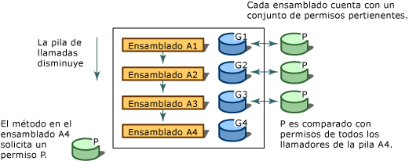

# Seguridad de acceso del códigoCode Access Security
[!INCLUDE[net_security_note](../../../includes/net-security-note-md.md)]  
  
 Los equipos conectados de hoy en día suelen estar expuestos a código procedente de varios orígenes, posiblemente desconocidos.Today's highly connected computer systems are frequently exposed to code originating from various, possibly unknown sources. El código se puede adjuntar al correo electrónico, contenido en documentos o descargar a través de Internet.Code can be attached to email, contained in documents, or downloaded over the Internet. Por desgracia, muchos usuarios de equipos han experimentado personalmente las consecuencias del código móvil malintencionado, como virus y gusanos, que pueden dañar o destruir datos y costar tiempo y dinero.Unfortunately, many computer users have experienced firsthand the effects of malicious mobile code, including viruses and worms, which can damage or destroy data and cost time and money.  
  
 Los mecanismos de seguridad más comunes conceden derechos a los usuarios según sus credenciales de inicio de sesión (normalmente, una contraseña) y limitan los recursos (a menudo, directorios y archivos) a los que puede acceder el usuario.Most common security mechanisms give rights to users based on their logon credentials (usually a password) and restrict resources (often directories and files) that the user is allowed to access. Sin embargo, este enfoque no soluciona algunos problemas: los usuarios obtienen el código de muchos orígenes, algunos de los cuales pueden ser confiables. Además, el código puede contener errores o vulnerabilidades que permitan que lo explote el código malintencionado y el usuario, a veces, no sabe cómo actuará el código.However, this approach fails to address several issues: users obtain code from many sources, some of which might be unreliable; code can contain bugs or vulnerabilities that enable it to be exploited by malicious code; and code sometimes does things that the user does not know it will do. En consecuencia, los equipos pueden resultar dañados y se pueden perder datos privados si un usuario precavido y de confianza ejecuta software malintencionado o que contenga errores.As a result, computer systems can be damaged and private data can be leaked when cautious and trustworthy users run malicious or error-filled software. La mayoría de los mecanismos de seguridad de los sistemas operativos requiere que cada fragmento de código sea de plena confianza para ejecutarse, con la excepción, quizás, de los scripts de una página web.Most operating system security mechanisms require that every piece of code must be completely trusted in order to run, except perhaps for scripts on a Web page. Por lo tanto, sigue siendo necesario un mecanismo de seguridad de amplia aplicación que permita que el código que se origina en un equipo se ejecute con protección en otro sistema, aunque no haya ninguna relación de confianza entre los sistemas.Therefore, there is still a need for a widely applicable security mechanism that allows code originating from one computer system to execute with protection on another system, even when there is no trust relationship between the systems.  
  
 .NET Framework proporciona un mecanismo de seguridad denominado “seguridad de acceso del código” para contribuir a proteger los sistemas informáticos del código móvil malintencionado, permitir que el código de origen desconocido se ejecute con protección y evitar que el código de confianza ponga en riesgo la seguridad, ya sea de manera intencionada o accidental.The .NET Framework provides a security mechanism called code access security to help protect computer systems from malicious mobile code, to allow code from unknown origins to run with protection, and to help prevent trusted code from intentionally or accidentally compromising security. La seguridad de acceso del código proporciona al código varios grados de confianza, dependiendo de su procedencia y de otros aspectos de la identidad del código.Code access security enables code to be trusted to varying degrees depending on where the code originates and on other aspects of the code's identity. La seguridad de acceso del código también exige al código los distintos niveles de confianza, lo que reduce la cantidad de código que debe ser de plena confianza para ejecutarse.Code access security also enforces the varying levels of trust on code, which minimizes the amount of code that must be fully trusted in order to run. Al utilizar la seguridad de acceso del código, se puede reducir la probabilidad de que un código malintencionado o con errores use el código de la forma que no debe.Using code access security can reduce the likelihood that your code will be misused by malicious or error-filled code. Puede reducir su responsabilidad, ya que usted puede especificar el conjunto de operaciones que debe poder realizar el código.It can reduce your liability, because you can specify the set of operations your code should be allowed to perform. La seguridad de acceso del código también puede contribuir a minimizar el daño que puede derivarse de las vulnerabilidades de seguridad en el código.Code access security can also help minimize the damage that can result from security vulnerabilities in your code.  
  
> [!NOTE]
> Se han realizado cambios importantes en la seguridad de acceso al código en .NET Framework 4.Major changes have been made to code access security in the .NET Framework 4. El cambio más notable ha sido la transparencia de [seguridad,](security-transparent-code.md)pero también hay otros cambios significativos que afectan a la seguridad de acceso al código.The most notable change has been [security transparency](security-transparent-code.md), but there are also other significant changes that affect code access security. Para obtener información sobre estos cambios, consulte [Cambios](../security/security-changes.md)de seguridad .For information about these changes, see [Security Changes](../security/security-changes.md).  
  
 La seguridad de acceso del código afecta, principalmente, al código de las bibliotecas y a las aplicaciones de confianza parcial.Code access security primarily affects library code and partially trusted applications. Los desarrolladores de bibliotecas deben proteger sus códigos del acceso no autorizado desde las aplicaciones de confianza parcial.Library developers must protect their code from unauthorized access from partially trusted applications. Las aplicaciones de confianza parcial son aplicaciones que se cargan desde orígenes externos, como Internet.Partially trusted applications are applications that are loaded from external sources such as the Internet. Las aplicaciones que se instalan en el escritorio o en la intranet local se ejecutan con plena confianza.Applications that are installed on your desktop or on the local intranet run in full trust. Las aplicaciones de plena confianza no se ven afectadas por la seguridad de acceso al código a menos que estén marcadas como transparentes para la [seguridad,](security-transparent-code.md)ya que son de plena confianza.Full-trust applications are not affected by code access security unless they are marked as [security-transparent](security-transparent-code.md), because they are fully trusted. La única limitación de las aplicaciones de plena confianza es que las aplicaciones marcadas con el atributo <xref:System.Security.SecurityTransparentAttribute> no pueden llamar al código marcado con el atributo <xref:System.Security.SecurityCriticalAttribute>.The only limitation for full-trust applications is that applications that are marked with the <xref:System.Security.SecurityTransparentAttribute> attribute cannot call code that is marked with the <xref:System.Security.SecurityCriticalAttribute> attribute. Las aplicaciones de confianza parcial se deben ejecutar en un espacio aislado (por ejemplo, en Internet Explorer) para que se pueda aplicar la seguridad de acceso del código.Partially trusted applications must be run in a sandbox (for example, in Internet Explorer) so that code access security can be applied. Si descarga una aplicación de Internet y trata de ejecutarla desde el escritorio, obtendrá un <xref:System.NotSupportedException> con el mensaje: “Se intentó cargar un ensamblado desde una ubicación de red, por lo que el ensamblado habría sido incluido en un espacio aislado de versiones anteriores de .NET Framework.If you download an application from the Internet and try to run it from your desktop, you will get a <xref:System.NotSupportedException> with the message: "An attempt was made to load an assembly from a network location which would have caused the assembly to be sandboxed in previous versions of the .NET Framework. Esta versión de .NET Framework no habilita la directiva CAS de forma predeterminada, por lo que esta carga puede ser peligrosa”.This release of the .NET Framework does not enable CAS policy by default, so this load may be dangerous." Si está seguro de que la aplicación puede ser de confianza, puede habilitar la ejecución como de plena confianza mediante el [ \<elemento de> loadFromRemoteSources](../configure-apps/file-schema/runtime/loadfromremotesources-element.md).If you are sure that the application can be trusted, you can enable it to be run as full trust by using the [\<loadFromRemoteSources> element](../configure-apps/file-schema/runtime/loadfromremotesources-element.md). Para obtener información sobre cómo ejecutar una aplicación en un entorno limitado, vea [Cómo: Ejecutar código](how-to-run-partially-trusted-code-in-a-sandbox.md)de confianza parcial en un espacio aislado .For information about running an application in a sandbox, see [How to: Run Partially Trusted Code in a Sandbox](how-to-run-partially-trusted-code-in-a-sandbox.md).  
  
 Todo el código administrado que tiene como destino el Common Language Runtime se beneficia de la seguridad de acceso del código, aunque ese código no haga ni una sola llamada de seguridad de acceso del código.All managed code that targets the common language runtime receives the benefits of code access security, even if that code does not make a single code access security call. Para obtener más información, vea [Conceptos básicos sobre la seguridad de acceso del código](code-access-security-basics.md).For more information, see [Code Access Security Basics](code-access-security-basics.md).  
  

## Funciones clave de la seguridad de acceso del códigoKey Functions of Code Access Security  
 La seguridad de acceso del código contribuye a limitar el acceso que tiene el código a operaciones y recursos protegidos.Code access security helps limit the access that code has to protected resources and operations. En .NET Framework, la seguridad de acceso del código realiza las funciones siguientes:In the .NET Framework, code access security performs the following functions:  
  
- Define permisos y conjuntos de permisos que representan el derecho de acceso a varios recursos del sistema.Defines permissions and permission sets that represent the right to access various system resources.  
  
- Permite que el código exija que sus llamadores tengan permisos específicos.Enables code to demand that its callers have specific permissions.  
  
- Permite que el código exija que sus llamadores posean una firma digital, por lo que solo los llamadores de una organización o un sitio concretos pueden llamar al código protegido.Enables code to demand that its callers possess a digital signature, thus allowing only callers from a particular organization or site to call the protected code.  
  
- Impone restricciones en el código en tiempo de ejecución mediante la comparación de los permisos concedidos a cada llamador en la pila de llamadas con los permisos que deben poseer.Enforces restrictions on code at run time by comparing the granted permissions of every caller on the call stack to the permissions that callers must have.  
  

## Recorrido de la pila de llamadasWalking the Call Stack  
 Para averiguar si el código tiene autorización para acceder a un recurso o para ejecutar una operación, el sistema de seguridad en tiempo de ejecución recorre la pila de llamadas y compara los permisos concedidos a cada llamador con el permiso que se pide.To determine whether code is authorized to access a resource or perform an operation, the runtime's security system walks the call stack, comparing the granted permissions of each caller to the permission being demanded. Si algún llamador de la pila de llamadas no tiene el permiso solicitado, se iniciará una excepción de seguridad y se rechazará el acceso.If any caller in the call stack does not have the demanded permission, a security exception is thrown and access is refused. El recorrido de la pila está diseñado para evitar los ataques por señuelo, en los que el código de menor confianza llama a código de confianza alta y lo utiliza para realizar acciones no autorizadas.The stack walk is designed to help prevent luring attacks, in which less-trusted code calls highly trusted code and uses it to perform unauthorized actions. La solicitud de permisos a todos los llamadores en tiempo de ejecución afecta al rendimiento, pero es esencial para proteger el código de los ataques por señuelo del código de menor confianza.Demanding permissions of all callers at run time affects performance, but it is essential to help protect code from luring attacks by less-trusted code. Para optimizar el rendimiento, puede hacer que el código realice menos recorridos de la pila. Sin embargo, debe tener la seguridad de que no está exponiendo un punto débil de la seguridad cada vez que lo hace.To optimize performance, you can have your code perform fewer stack walks; however, you must be sure that you do not expose a security weakness whenever you do this.  
  
 La siguiente ilustración muestra el recorrido de la pila que se produce cuando un método del ensamblado A4 solicita que sus llamadores tengan el permiso P.The following illustration shows the stack walk that results when a method in Assembly A4 demands that its callers have permission P.  
  
   
Recorrido de la pila de seguridadSecurity stack walk  
  

## Temas relacionadosRelated Topics  
  
|TítuloTitle|DescripciónDescription|  
|-----------|-----------------|  
|[Conceptos básicos sobre la seguridad de acceso del códigoCode Access Security Basics](code-access-security-basics.md)|Describe la seguridad de acceso del código y sus usos más comunes.Describes code access security and its most common uses.|  
|[Código transparente en seguridad, nivel 2Security-Transparent Code, Level 2](security-transparent-code-level-2.md)|Describe el modelo de transparencia de seguridad en .NET Framework 4.Describes the security transparency model in the .NET Framework 4.|  
|[Utilizar bibliotecas de código que no es de plena confianzaUsing Libraries from Partially Trusted Code](using-libraries-from-partially-trusted-code.md)|Describe cómo habilitar bibliotecas para usarlas con código no administrado y cómo usar las bibliotecas desde el código no administrado.Describes how to enable libraries for use with unmanaged code and how to use libraries from unmanaged code.|  
|[Conceptos clave de seguridadKey Security Concepts](../../standard/security/key-security-concepts.md)|Proporciona información general sobre muchos de los términos y conceptos clave que se usan en el sistema de seguridad de .NET Framework.Provides an overview of many of the key terms and concepts used in the .NET Framework security system.|  
|[Seguridad basada en rolesRole-Based Security](../../standard/security/role-based-security.md)|Describe cómo incorporar la seguridad basada en roles.Describes how to incorporate security based on roles.|  
|[Cryptographic ServicesCryptographic Services](../../standard/security/cryptographic-services.md)|Describe cómo incorporar la criptografía en las aplicaciones.Describes how to incorporate cryptography into your applications.|
