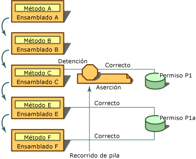

# Using the Assert Method
<xref:System.Security.CodeAccessPermission.Assert%2A> es un método al que se puede llamar en las clases de permiso de acceso a código y en la clase <xref:System.Security.PermissionSet>.  Puede usar **Assert** para habilitar el código \(y los llamadores indirectos\) con el fin de realizar acciones que el código tiene permiso para realizar, pero que puede que sus llamadores no tengan permiso para realizar.  Una aserción o validación de seguridad cambia el proceso normal que realiza el runtime durante una comprobación de seguridad.  Al validar un permiso, se indica al sistema de seguridad que no compruebe los llamadores de su código para el permiso validado.  
  
> [!CAUTION]
>  Use las aserciones con cuidado, ya que crean vulnerabilidades de seguridad y minan el mecanismo de runtime para imponer las restricciones de seguridad.  
  
 Las aserciones son útiles en situaciones en las que una biblioteca llama a código no administrado o realiza una llamada que requiere un permiso que no está claramente relacionado con el uso previsto de la biblioteca.  Por ejemplo, todo el código administrado que llame a código no administrado debe tener **SecurityPermission** con la marca  **UnmanagedCode** especificada.  No concederá este permiso de forma predeterminada al código que no se origine en el equipo local, como es el caso del código que se descarga desde la intranet local.  Por lo tanto, para que el código descargado de la intranet local pueda llamar a una biblioteca que usa código no administrado, la biblioteca debe validar el permiso.  Además, algunas bibliotecas podrían realizar llamadas invisibles para los llamadores y que requieren permisos especiales.  
  
 También puede utilizar aserciones en situaciones en las que el código accede a un recurso de tal forma que queda totalmente oculto para los llamadores.  Por ejemplo, suponga que su biblioteca adquiere información de una base de datos, pero al hacerlo también lee información del registro del equipo.  Dado que los desarrolladores que utilizan la biblioteca no tienen acceso a su código fuente, no tienen forma alguna de saber que el código requiere **RegistryPermission** para poder utilizar su código.  En este caso, si decide que no es razonable o necesario exigir que los llamadores del código tengan permiso para acceder al registro, puede validar el permiso de lectura del registro.  En esta situación es adecuado que la biblioteca valide el permiso para que los llamadores sin **RegistryPermission** puedan usar la biblioteca.  
  
 La aserción afecta al recorrido de pila solo si el permiso validado y un permiso exigido por un llamador indirecto son del mismo tipo y si el permiso exigido es un subconjunto del permiso validado.  Por ejemplo, si valida **FileIOPermission** para leer todos los archivos de la unidad C y se realiza una petición de nivel inferior de **FileIOPermission** para leer los archivos de C:\\Temp, la aserción podría afectar al recorrido de pila; sin embargo, si la petición era de **FileIOPermission** para escribir en la unidad C, la aserción no tendría efecto.  
  
 Para realizar aserciones, el código debe disponer del permiso que usted está validando y el <xref:System.Security.Permissions.SecurityPermission> que representa el derecho a realizar aserciones.  Aunque podría validar un permiso que no se haya concedido al código, la aserción no tendría sentido, ya que la comprobación de seguridad no se podría realizar correctamente antes de que la aserción pudiese lograr que se procesase debidamente.  
  
 La siguiente ilustración muestra lo que sucede cuando se utiliza el método **Assert**.  Supongamos que son ciertas las siguientes declaraciones sobre los ensamblados A, B, C, E y F y los permisos P1 y P1A:  
  
-   P1A representa el derecho a leer archivos .txt de la unidad C.  
  
-   P1 representa el derecho a leer todos los archivos de la unidad C.  
  
-   Tanto P1A como P1 son tipos de **FileIOPermission**  y P1A es un subconjunto de P1.  
  
-   Se ha concedido el permiso P1A a los ensamblados E y F.  
  
-   Se ha concedido el permiso P1 al ensamblado C.  
  
-   No se ha concedido ni el permiso P1 ni el P1A a los ensamblados A y B.  
  
-   El método A está incluido en el ensamblado A, el método B incluido en el ensamblado B, y así sucesivamente.  
  
   
Utilizar Assert  
  
 En este escenario, el método A llama a B, B llama a C, C llama a E y E llama F.  El método C valida el permiso para leer archivos en la unidad C \(permiso P1\) y el método E solicita permiso para leer archivos .txt de la unidad C \(permiso P1A\).  Cuando se detecta la petición en F en tiempo de ejecución, se realiza un recorrido de pila para comprobar los permisos de todos los llamadores de F, empezando por E.  El ensamblado E tiene el permiso P1A, por lo que el recorrido de pila pasa a examinar los permisos de C, donde se descubre la aserción de C.  Dado que el permiso solicitado \(P1A\) es un subconjunto del permiso validado \(P1\), el recorrido de pila se detiene y se supera automáticamente la comprobación de seguridad.  No importa que los ensamblados A y B no dispongan del permiso P1A.  Al validar el permiso P1, el método C garantiza que sus llamadores puedan acceder al recurso protegido por P1, aunque los llamadores no tengan permiso para acceder a ese recurso.  
  
 Si diseña una biblioteca de clases y una clase obtiene acceso a un recurso protegido, debería, en la mayoría de los casos, realizar una petición de seguridad que requiera que los llamadores de la clase dispongan del permiso adecuado.  Si, a continuación, la clase realiza una operación para la que usted sabe que la mayoría de los llamadores no tendrán permiso, y si está dispuesto a asumir la responsabilidad de dejar que estos llamadores llamen al código, puede validar el permiso llamando al método **Assert** en un objeto de permiso que represente la operación que está realizando el código.  Si se utiliza **Assert** de este modo, se permite a llamadores llamar a su código, algo que normalmente no podrían hacer.  Por tanto, si valida un permiso, debe asegurarse de realizar previamente las comprobaciones de seguridad adecuadas para impedir que el componente se utilice incorrectamente.  
  
 Por ejemplo, suponga que su clase de biblioteca de mucha confianza tiene un método que elimina los archivos.  Accede al archivo llamando a una función Win32 no administrada.  Un llamador invoca el método **Delete** de su código, pasando el nombre del archivo que se debe eliminar, C:\\Test.txt.  Dentro del método **Delete**, su código crea un objeto <xref:System.Security.Permissions.FileIOPermission> que representa el acceso de escritura a C:\\Test.txt.  \(Se requiere acceso de escritura para eliminar un archivo\). A continuación, su código invoca una comprobación de seguridad imperativa llamando al método **Demand** del objeto **FileIOPermission**.  Si uno de los llamadores de la pila de llamadas no tiene este permiso, se genera una <xref:System.Security.SecurityException>.  Si no se genera ninguna excepción, sabe que todos los llamadores tienen derecho a acceder a C:\\Test.txt.  Dado que cree que la mayoría de los llamadores no tendrá permiso para acceder a código no administrado, el código creará un objeto <xref:System.Security.Permissions.SecurityPermission> que representa el derecho a llamar a código no administrado y llama al método **Assert** del objeto.  Por último, llama a la función de Win32 no administrada para eliminar C:\\Text.txt y devuelve el control al llamador.  
  
> [!CAUTION]
>  Asegúrese de que su código no utilice aserciones en situaciones en las que su código pueda ser utilizado por otro código para acceder a un recurso que está protegido por el permiso que está validando.  Por ejemplo, en el código que escribe en un archivo cuyo nombre especifica el llamador como un parámetro, no debería validar **FileIOPermission** para escribir en archivos, porque su código quedaría expuesto al mal uso de terceros.  
  
 Si cuando utiliza la sintaxis de seguridad imperativa, llama al método **Assert** en varios permisos en el mismo método, se genera una excepción de seguridad.  En su lugar, debe crear un objeto **PermissionSet**, pasarle los permisos individuales que desee invocar y, a continuación, llamar al método **Assert** en el objeto **PermissionSet**.  Puede llamar al método **Assert** más de una vez si usa la sintaxis de seguridad declarativa.  
  
 En el siguiente ejemplo se muestra la sintaxis declarativa para omitir comprobaciones de seguridad mediante el método **Assert**.  Tenga en cuenta que la sintaxis de **FileIOPermissionAttribute** toma dos valores: una enumeración <xref:System.Security.Permissions.SecurityAction> y la ubicación del archivo o directorio al que se concederá el permiso.  La llamada al método **Assert** hace que las peticiones de acceso a `C:\Log.txt` se realicen correctamente, aunque no se compruebe si los llamadores disponen de permiso de acceso al archivo.  
  
```vb  
Option Explicit  
Option Strict  
  
Imports System  
Imports System.IO  
Imports System.Security.Permissions  
  
Namespace LogUtil  
   Public Class Log  
      Public Sub New()  
  
      End Sub  
  
     <FileIOPermission(SecurityAction.Assert, All := "C:\Log.txt")> Public Sub   
      MakeLog()  
         Dim TextStream As New StreamWriter("C:\Log.txt")  
         TextStream.WriteLine("This  Log was created on {0}", DateTime.Now) '  
         TextStream.Close()  
      End Sub  
   End Class  
End Namespace  
  
```  
  
```csharp  
namespace LogUtil  
{  
   using System;  
   using System.IO;  
   using System.Security.Permissions;  
  
   public class Log  
   {  
      public Log()  
      {      
      }     
      [FileIOPermission(SecurityAction.Assert, All = @"C:\Log.txt")]  
      public void MakeLog()  
      {     
         StreamWriter TextStream = new StreamWriter(@"C:\Log.txt");  
         TextStream.WriteLine("This  Log was created on {0}", DateTime.Now);  
         TextStream.Close();  
      }  
   }  
}   
```  
  
 En los siguientes fragmentos de código se muestra la sintaxis declarativa para omitir comprobaciones de seguridad mediante el método **Assert**.  En este ejemplo, se declara una instancia del objeto **FileIOPermission**.  Se pasa **FileIOPermissionAccess.AllAccess** al constructor para definir el tipo de acceso permitido, seguido de una cadena que describe la ubicación del archivo.  Una vez que se haya definido el objeto **FileIOPermission**, solo tiene que llamar a su método **Assert** para omitir la comprobación de seguridad.  
  
```vb  
Option Explicit  
Option Strict  
Imports System  
Imports System.IO  
Imports System.Security.Permissions  
Namespace LogUtil  
   Public Class Log  
      Public Sub New()  
      End Sub 'New  
  
      Public Sub MakeLog()  
         Dim FilePermission As New FileIOPermission(FileIOPermissionAccess.AllAccess, "C:\Log.txt")  
         FilePermission.Assert()  
         Dim TextStream As New StreamWriter("C:\Log.txt")  
         TextStream.WriteLine("This  Log was created on {0}", DateTime.Now)  
         TextStream.Close()  
      End Sub  
   End Class  
End Namespace  
  
```  
  
```csharp  
namespace LogUtil  
{  
   using System;  
   using System.IO;  
   using System.Security.Permissions;  
  
   public class Log  
   {  
      public Log()  
      {      
      }     
      public void MakeLog()  
      {  
         FileIOPermission FilePermission = new FileIOPermission(FileIOPermissionAccess.AllAccess,@"C:\Log.txt");   
         FilePermission.Assert();  
         StreamWriter TextStream = new StreamWriter(@"C:\Log.txt");  
         TextStream.WriteLine("This  Log was created on {0}", DateTime.Now);  
         TextStream.Close();  
      }  
   }  
}  
```  
  
## Vea también  
 <xref:System.Security.PermissionSet>   
 <xref:System.Security.Permissions.SecurityPermission>   
 <xref:System.Security.Permissions.FileIOPermission>   
 <xref:System.Security.Permissions.SecurityAction>   
 [Atributos](../../../docs/standard/attributes/index.md)   
 [Code Access Security](../../../docs/framework/misc/code-access-security.md)