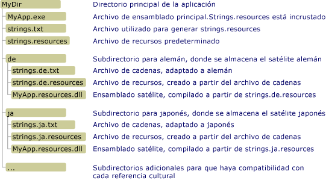

# Crear ensamblados sat&#233;lite para aplicaciones de escritorio
Los archivos de recursos desempeñan un rol central en aplicaciones localizadas.  Permiten una aplicación para mostrar cadenas, imágenes, y otros datos en el propio idioma y la referencia cultural del usuario, y proporcionar datos alternativos si los recursos del propio idioma o referencia cultural del usuario no están disponibles.  .NET Framework utiliza un modelo de concentrador\-y\- radio para buscar y recuperar recursos localizados.  El concentrador es el ensamblado principal que contiene el código ejecutable no traducible y recursos para una referencia cultural única, que se denomina referencia cultural neutra o predeterminada.  La referencia cultural predeterminada es la referencia cultural de reserva de la aplicación; se utiliza cuando no hay recursos disponibles.  Puede usar el atributo de <xref:System.Resources.NeutralResourcesLanguageAttribute> para notificar la referencia cultural de la referencia cultural predeterminada de la aplicación.  Cada radio se conecta a un ensamblado satélite que contiene los recursos de una única referencia cultural localizada pero no contiene ningún código.  Como los ensamblados satélite no forman parte del ensamblado principal, es fácil actualizar o reemplazar los recursos correspondientes a una referencia cultural específica sin reemplazar el ensamblado principal de la aplicación.  
  
> [!NOTE]
>  Los recursos de la referencia cultural predeterminada de una aplicación también pueden almacenarse en un ensamblado satélite.  Para ello, se asigna el atributo de <xref:System.Resources.NeutralResourcesLanguageAttribute> un valor de <xref:System.Resources.UltimateResourceFallbackLocation?displayProperty=fullName>.  
  
## Nombre y ubicación del ensamblado satélite  
 El modelo de concentrador\-y\- radio requiere colocar recursos en ubicaciones específicas para poder fácilmente localizar y utilizar.  Si no compila y no llama a recursos según lo esperado, o si no se colocan en las ubicaciones correctas, Common Language Runtime no encontrará y utilizará los recursos de la referencia cultural predeterminada en su lugar.  Usan el administrador de recursos de .NET Framework, representado por un objeto de <xref:System.Resources.ResourceManager> , automáticamente para tener acceso a recursos localizados.  El administrador de recursos requiere lo siguiente:  
  
-   Un único ensamblado satélite debe incluir todos los recursos para una referencia cultural determinada.  Es decir debe compilar .txt múltiple o archivos .resx en un único archivo .resources binario.  
  
-   Debe haber un subdirectorio independiente en el directorio de aplicaciones para cada referencia cultural localizada que almacene los recursos de esa referencia cultural.  El nombre del subdirectorio debe ser igual que el nombre de referencia cultural.  Como alternativa, puede almacenar los ensamblados satélite en la caché global de ensamblados.  En este caso, el componente de la información de la referencia cultural del nombre seguro del ensamblado debe indicar su referencia cultural. \(Vea la sección de [Instalar ensamblados satélite en la caché global de ensamblados](#SN) más adelante en este tema.\)  
  
    > [!NOTE]
    >  Si la aplicación incluye recursos para subreferencias culturales, coloque cada subreferencia cultural en un subdirectorio independiente bajo el directorio de aplicaciones.  No coloque las subreferencias culturales en subdirectorios bajo el directorio de la referencia cultural principal.  
  
-   El ensamblado satélite debe tener el mismo nombre que la aplicación, y utilizar la extensión de nombre de archivo “.resources.dll”.  Por ejemplo, si una aplicación se denomina Example.exe, el nombre de cada ensamblado satélite debe ser Example.resources.dll.  Observe que el nombre del ensamblado satélite no indica la referencia cultural de los archivos de recursos.  Sin embargo, el ensamblado satélite aparece en un directorio que especifica la referencia cultural.  
  
-   La información sobre la referencia cultural del ensamblado satélite se debe incluir en los metadatos del ensamblado.  Para almacenar el nombre de referencia cultural en los metadatos del ensamblado satélite, se especifica la opción de `/culture` cuando se utiliza [Herramienta Assembly Linker](../../../docs/framework/tools/al-exe-assembly-linker.md) para insertar recursos en el ensamblado satélite.  
  
 En la siguiente ilustración se muestra un ejemplo de los requisitos de ubicación y estructura de directorios para las aplicaciones que no se instalan en la [caché global de ensamblados](../../../docs/framework/app-domains/gac.md).  Los elementos con .txt y extensiones .resources no se incluirán en la aplicación final.  Éstos son los archivos de recursos intermedios que se utilizan para crear los ensamblados de recursos satélite finales.  En este ejemplo, se pueden reemplazar los archivos .resx por los archivos .txt.  Para obtener más información, vea [Empaquetar e implementar recursos](../../../docs/framework/resources/packaging-and-deploying-resources-in-desktop-apps.md).  
  
   
Directorio de ensamblados satélite  
  
## Compilar ensamblados satélite  
 Utiliza [Generador de archivos de recursos \(Resgen.exe\)](../../../docs/framework/tools/resgen-exe-resource-file-generator.md) para compilar los archivos de texto o archivos XML \(.resx\) que contienen recursos en archivos .resources binarios.  Se utiliza [Herramienta Assembly Linker \(Al.exe\)](../../../docs/framework/tools/al-exe-assembly-linker.md) para compilar los archivos .resources en ensamblados satélite.  Al.exe crea un ensamblado a partir de los archivos .resources especificados.  Los ensamblados satélite sólo pueden contener recursos; no pueden contener código ejecutable.  
  
 El siguiente comando de Al.exe crea un ensamblado satélite para la aplicación `Example` del archivo de recursos alemán strings.de.resources.  
  
```  
al /target:lib /embed:strings.de.resources /culture:de /out:Example.resources.dll  
```  
  
 El siguiente comando de Al.exe crea un ensamblado satélite para la aplicación `Example` del archivo strings.de.resources.  La opción de **\/template** hace que el ensamblado satélite herede todos los metadatos del ensamblado a excepción de la información de la referencia cultural del ensamblado principal \(Example.dll\).  
  
```  
al /target:lib /embed:strings.de.resources /culture:de /out:Example.resources.dll /template:Example.dll  
```  
  
 La tabla siguiente se describen las opciones de Al.exe utilizadas en estos comandos con más detalle.  
  
|Opción|Descripción|  
|------------|-----------------|  
|lib de**\/target:**|Especifica que el ensamblado satélite en un archivo de biblioteca \(.dll\).  Dado que un ensamblado satélite no contiene código ejecutable y no es el ensamblado principal de una aplicación, debe guardar los ensamblados satélite como archivos DLL.|  
|**\/embed:**strings.de.resources|Especifica el nombre del archivo de recursos para insertar cuando Al.exe compile el ensamblado.  Puede insertar varios archivos .resources en un ensamblado satélite, pero si se siga el modelo de concentrador\-y\- radio, debe compilar un ensamblado satélite por cada referencia cultural.  Sin embargo, puede crear archivos .resources independientes para cadenas y objetos.|  
|**\/culture:**de|Especifica la referencia cultural del recurso para compilar.  Common Language Runtime utiliza esta información cuando busca los recursos para una referencia cultural especificada.  Si se omite esta opción, Al.exe se compilará el recurso, pero el tiempo de ejecución no lo encontrará cuando lo solicite un usuario.|  
|**\/out:**Example.resources.dll|Especifica el nombre del archivo de salida.  El nombre debe seguir *baseName*estándar que llama .resources.*extension*, donde es el nombre *baseName* del ensamblado principal y de *extension* es una extensión de nombre de archivo válida \(como .dll\).  Observe que el motor en tiempo de ejecución no puede determinar la referencia cultural de un ensamblado satélite basándose en el nombre del archivo de salida; debe utilizar la opción de **\/culture** de especificarlo.|  
|**\/template:**Example.dll|Especifica un ensamblado del que el ensamblado satélite heredan todos los metadatos del ensamblado excepto el campo de la referencia cultural.  Esta opción afecta a los ensamblados satélite sólo si especifica un ensamblado con [nombre seguro](../../../docs/framework/app-domains/strong-named-assemblies.md).|  
  
 Para obtener una lista completa de opciones disponibles con Al.exe, vea [Herramienta Assembly Linker \(Al.exe\)](../../../docs/framework/tools/al-exe-assembly-linker.md).  
  
## Ensamblados satélite: Un ejemplo  
 Lo siguiente es “un ejemplo simple de Hello world” que muestra un cuadro de mensaje que contiene un saludo localizado.  El ejemplo incluye recursos para las referencias culturales inglés \(Estados Unidos\), las francés \(Francia\), y rusas \(Rusia\), y la referencia cultural de reserva es el inglés.  Para crear el ejemplo, haga lo siguiente:  
  
1.  Cree un archivo de recursos denominado Greeting.resx o Greeting.txt para contener el recurso para la referencia cultural predeterminada.  Almacenar una cadena única denominada `HelloString` cuyo valor es “Hello world\!” en este archivo.  
  
2.  Para indicar que el inglés \(en\) es la referencia cultural predeterminada de la aplicación, agregue el siguiente atributo de <xref:System.Resources.NeutralResourcesLanguageAttribute?displayProperty=fullName> al archivo AssemblyInfo de la aplicación o el archivo principal de código fuente que se compile en el ensamblado principal de la aplicación.  
  
     [!code-csharp[Conceptual.Resources.Locating#2](../../../samples/snippets/csharp/VS_Snippets_CLR/conceptual.resources.locating/cs/assemblyinfo.cs#2)]
     [!code-vb[Conceptual.Resources.Locating#2](../../../samples/snippets/visualbasic/VS_Snippets_CLR/conceptual.resources.locating/vb/assemblyinfo.vb#2)]  
  
3.  Agregar compatibilidad con las referencias culturales adicionales \(en\-us, franco\- fr, y ru\- RU\) a la aplicación como sigue:  
  
    -   Para admitir en\-us o la referencia cultural inglés \(Estados Unidos\), cree un archivo de recursos denominado Greeting.en\-US.resx o Greeting.en\-US.txt, y el almacén en una cadena única denominada `HelloString` cuyo valor es “hello el world\!”  
  
    -   Para admitir el franco\- fr o la referencia cultural francés \(Francia\), cree un archivo de recursos denominado Greeting.fr\-FR.resx o Greeting.fr\-FR.txt, y el almacén en una cadena única denominada `HelloString` cuyo valor es “salut tout Le Monde de Salut\!”  
  
    -   Para admitir el ru\- RU o la referencia cultural ruso \(Rusia\), cree un archivo de recursos denominado Greeting.ru\-RU.resx o Greeting.ru\-RU.txt, y el almacén en una cadena única denominada `HelloString` cuyo valor es “Всем Привет\!”  
  
4.  Utilizan [Resgen.exe](../../../docs/framework/tools/resgen-exe-resource-file-generator.md) para compilar cada texto o archivo de recursos XML en un archivo .resources binario.  La salida es un conjunto de archivos con el mismo nombre de archivo raíz que los archivos .resx o de .txt, solo una extensión .resources.  Si crea el ejemplo con Visual Studio, el proceso de compilación se controla automáticamente.  Si no usa Visual Studio, ejecute los comandos siguientes para compilar los archivos .resx en archivos .resources:  
  
    ```  
  
    resgen Greeting.resx  
    resgen Greeting.en-us.resx  
    resgen Greeting.fr-FR.resx  
    resgen Greeting.ru-RU.resx  
  
    ```  
  
     Si los recursos están en archivos de texto en lugar de archivos XML, reemplace la extensión .resx con .txt.  
  
5.  Compile el código fuente siguiente junto con los recursos para la referencia cultural predeterminada en el ensamblado principal de la aplicación:  
  
    > [!IMPORTANT]
    >  Si se utiliza la línea de comandos en lugar de Visual Studio para crear el ejemplo, debe modificar la llamada al constructor de la clase de <xref:System.Resources.ResourceManager> al siguiente: `ResourceManager rm = new ResourceManager("Greetings",``typeof(Example).Assembly);`  
  
     [!code-csharp[Conceptual.Resources.Locating#1](../../../samples/snippets/csharp/VS_Snippets_CLR/conceptual.resources.locating/cs/program.cs#1)]
     [!code-vb[Conceptual.Resources.Locating#1](../../../samples/snippets/visualbasic/VS_Snippets_CLR/conceptual.resources.locating/vb/module1.vb#1)]  
  
     Si la aplicación se denomina Example y compila desde la línea de comandos, el comando del compilador de C\# es:  
  
    ```  
    csc Example.cs /res:Greeting.resources  
    ```  
  
     El comando correspondiente del compilador de Visual Basic es:  
  
    ```  
    vbc Example.vb /res:Greeting.resources  
    ```  
  
6.  Cree un subdirectorio en el directorio de la aplicación principal para cada referencia cultural localizada compatible con la aplicación.  Debe crear en\-us, un franco\- fr, y un subdirectorio ru\- RU.  Visual Studio crea estos subdirectorios automáticamente como parte del proceso de compilación.  
  
7.  Inserte los archivos cultura\- específicos individuales .resources en ensamblados satélite y guárdelo en el directorio apropiado.  El comando de hacerlo para cada archivo .resources es:  
  
    ```  
    al /target:lib /embed:Greeting.culture.resources /culture:culture /out:culture\Example.resources.dll  
    ```  
  
     donde es el nombre *culture* de la referencia cultural cuyos recursos el ensamblado satélite contiene.  Visual Studio controla este proceso automáticamente.  
  
 Entonces podrá ejecutar el ejemplo.  Aleatoriamente creará una de las referencias culturales compatibles la referencia cultural actual y mostrará un saludo localizado.  
  
<a name="SN"></a>   
## Instalar ensamblados satélite en la caché global de ensamblados  
 En lugar de instalar los ensamblados en un subdirectorio local de la aplicación, puede instalarlos en la caché global de ensamblados.  Esto es especialmente útil si tiene las bibliotecas de clases y ensamblados de recursos de biblioteca de clases que se utilizan en varias aplicaciones.  
  
 Instalar los ensamblados en la caché global de ensamblados requiere que tienen nombres seguros.  Los ensamblados con nombre seguro se firman con un par válido de claves \(una pública y una privada\).  Contienen información de versión que el runtime usa para determinar el ensamblado que va a utilizar para satisfacer una solicitud de enlace.  Para obtener más información sobre los nombres seguros y versión, vea [Versión del ensamblado](../../../docs/framework/app-domains/assembly-versioning.md).  Para obtener más información sobre los nombres seguros, vea [Ensamblados Fuerte\- denominadas](../../../docs/framework/app-domains/strong-named-assemblies.md).  
  
 Al desarrollar una aplicación, es poco probable que se tenga acceso al par de claves pública y privada final.  Para instalar un ensamblado satélite en la caché global de ensamblados y garantizar que funciona debidamente, se podrá utilizar una técnica denominada firma retardada.  Cuando se retrasa la firma de un ensamblado, en tiempo de compilación se reserva espacio en el archivo para la firma de nombre seguro.  El se retrasa la firma real hasta más adelante, cuando el par de claves pública y privada final está disponible.  Para obtener más información sobre la firma retardada, vea [Retrasar la firma de un ensamblado](../../../docs/framework/app-domains/delay-sign-assembly.md).  
  
### Obtener la clave pública  
 Para retrasar la firma de un ensamblado, se ha de tener acceso a la clave pública.  Puede obtener la clave pública real de la organización de la compañía que en su momento, o crear una clave pública mediante [Herramienta de nombre seguro \(Sn.exe\)](../../../docs/framework/tools/sn-exe-strong-name-tool.md).  
  
 El comando Sn.exe siguiente crea un par de claves pública y privada de prueba.  La opción de **–k** especifica que Sn.exe debe crear un nuevo par de claves y guardarlo en un archivo denominado TestKeyPair.snk.  
  
```  
sn –k TestKeyPair.snk   
```  
  
 Puede extraer la clave pública del archivo que contiene el par de claves de prueba.  El comando siguiente extrae la clave pública del archivo TestKeyPair.snk y la guarda en el archivo PublicKey.snk:  
  
```  
sn –p TestKeyPair.snk PublicKey.snk  
```  
  
### Retrasar la firma de un ensamblado  
 Después de que obtiene o cree la clave pública, se utiliza [Herramienta Assembly Linker \(Al.exe\)](../../../docs/framework/tools/al-exe-assembly-linker.md) para compilar el ensamblado y especificar la firma retardada.  
  
 El siguiente comando de Al.exe crea un ensamblado satélite fuerte\- denominado para la aplicación StringLibrary de archivo strings.ja.resources:  
  
```  
al /target:lib /embed:strings.ja.resources /culture:ja /out:StringLibrary.resources.dll /delay+ /keyfile:PublicKey.snk  
```  
  
 La opción de **\/delay\+** especifica que la Herramienta Assembly Linker debe retrasar la firma del ensamblado.  La opción de **\/keyfile** especifica el nombre del archivo de clave que contiene la clave pública para retrasar la firma del ensamblado.  
  
### Volver a firmar un ensamblado  
 Antes de implementar la aplicación, debe re\- signo el ensamblado satélite firmado retardado con el par de claves real.  Puede hacerlo mediante Sn.exe.  
  
 El comando Sn.exe siguiente firma StringLibrary.resources.dll con el par de claves almacenado en el archivo RealKeyPair.snk.  La opción de **–R** especifica que un ensamblado firmado anteriormente o retraso firmado debe re\- firmar.  
  
```  
sn –R StringLibrary.resources.dll RealKeyPair.snk   
```  
  
### Instalar un ensamblado satélite en la caché global de ensamblados  
 Cuando el runtime busca los recursos del proceso de reserva de recursos, se buscará en [caché global de ensamblados](../../../docs/framework/app-domains/gac.md) primero. \(Para obtener más información, vea la sección “proceso de reserva de recursos” del tema de [Empaquetar e implementar recursos](../../../docs/framework/resources/packaging-and-deploying-resources-in-desktop-apps.md) .\) En cuanto firma un ensamblado satélite con un nombre seguro, puede instalarse en la caché global de ensamblados mediante [Herramienta caché global de ensamblados \(Gacutil.exe\)](../../../docs/framework/tools/gacutil-exe-gac-tool.md).  
  
 El siguiente comando de Gacutil.exe instala StringLibrary.resources.dll en la caché global de ensamblados:  
  
```  
gacutil /i:StringLibrary.resources.dll  
```  
  
 La opción de **\/i** especifica que Gacutil.exe debe instalar el ensamblado especificado en la caché global de ensamblados.  Después de que el ensamblado satélite está instalado en la caché, los recursos que contiene estado disponible para todas las aplicaciones diseñadas para usar el ensamblado satélite.  
  
### Recursos en la caché global de ensamblados: Un ejemplo  
 El ejemplo siguiente se utiliza un método en una biblioteca de clases de .NET Framework. para extraer y devolver un saludo localizado de un archivo de recursos.  Registra la biblioteca y sus recursos en la caché global de ensamblados.  El ejemplo incluye los recursos para inglés \(Estados Unidos\), francés \(Francia\), ruso \(Rusia\), y referencias culturales inglés.  Inglés es la referencia cultural predeterminada; almacenan los recursos en el ensamblado principal.  El ejemplo retrasa inicialmente signos biblioteca y los ensamblados satélite con una clave pública, entonces re\- signos ellos con un par de claves pública y privada.  Para crear el ejemplo, haga lo siguiente:  
  
1.  Si no usa Visual Studio, utilice el siguiente comando de [Herramienta de nombre seguro \(Sn.exe\)](../../../docs/framework/tools/sn-exe-strong-name-tool.md) de crear un par ResKey.snk denominado de clave pública\/privada:  
  
    ```  
    sn –k ResKey.snk  
    ```  
  
     Si utiliza Visual Studio, utilice la ficha de **Firma** del cuadro de diálogo de **Propiedades** de proyecto para generar el archivo de clave.  
  
2.  Utilice el siguiente comando de [Herramienta de nombre seguro \(Sn.exe\)](../../../docs/framework/tools/sn-exe-strong-name-tool.md) de crear un archivo de clave pública denominado PublicKey.snk:  
  
    ```  
    sn –p ResKey.snk PublicKey.snk  
    ```  
  
3.  Cree un archivo de recursos denominado Strings.resx para contener el recurso para la referencia cultural predeterminada.  Almacenar una cadena única denominada `Greeting` cuyo lo haga lo haga valor es “Cómo se?” en ese archivo.  
  
4.  Para indicar que “en” es la referencia cultural predeterminada de la aplicación, agregue el siguiente atributo de <xref:System.Resources.NeutralResourcesLanguageAttribute?displayProperty=fullName> al archivo AssemblyInfo de la aplicación o el archivo principal de código fuente que se compile en el ensamblado principal de la aplicación:  
  
     [!code-csharp[Conceptual.Resources.Satellites#2](../../../samples/snippets/csharp/VS_Snippets_CLR/conceptual.resources.satellites/cs/stringlibrary.cs#2)]
     [!code-vb[Conceptual.Resources.Satellites#2](../../../samples/snippets/visualbasic/VS_Snippets_CLR/conceptual.resources.satellites/vb/stringlibrary.vb#2)]  
  
5.  Agregar compatibilidad con las referencias culturales adicionales \(en\-us, franco\- fr, y ru\- RU\) de las referencias culturales a la aplicación como sigue:  
  
    -   Para admitir la referencia cultural “en\-us” o de inglés \(Estados Unidos\), cree un archivo de recursos denominado Strings.en\-US.resx o Strings.en\-US.txt, y el almacén en una cadena única denominada `Greeting` cuyo valor es “Hello\!”.  
  
    -   Para admitir el franco\- “fr” o referencia cultural francés \(Francia\), cree un archivo de recursos denominado Strings.fr\-FR.resx o Strings.fr\-FR.txt y almacén en una cadena única denominada `Greeting` cuyo valor es “jour de Bon\!”  
  
    -   Para admitir el “ru\- RU” o la referencia cultural ruso \(Rusia\), cree un archivo de recursos denominado Strings.ru\-RU.resx o Strings.ru\-RU.txt y almacén en una cadena única denominada `Greeting` cuyo valor es “Привет\!”  
  
6.  Utilizan [Resgen.exe](../../../docs/framework/tools/resgen-exe-resource-file-generator.md) para compilar cada texto o archivo de recursos XML en un archivo .resources binario.  La salida es un conjunto de archivos con el mismo nombre de archivo raíz que los archivos .resx o de .txt, solo una extensión .resources.  Si crea el ejemplo con Visual Studio, el proceso de compilación se controla automáticamente.  Si no usa Visual Studio, ejecute el comando siguiente para compilar los archivos .resx en archivos .resources:  
  
    ```  
    resgen filename  
    ```  
  
     donde es la ruta de acceso, el nombre de archivo, y la extensión *filename* opcionales .resx o archivo de texto.  
  
7.  Compile el código fuente siguiente para StringLibrary.vb o StringLibrary.cs junto con los recursos para la referencia cultural predeterminada en una biblioteca firmada retraso StringLibrary.dll denominado ensamblado:  
  
    > [!IMPORTANT]
    >  Si se utiliza la línea de comandos en lugar de Visual Studio para crear el ejemplo, debe modificar la llamada al constructor de la clase de <xref:System.Resources.ResourceManager> a `ResourceManager rm = new ResourceManager("Strings",` `typeof(Example).Assembly);`.  
  
     [!code-csharp[Conceptual.Resources.Satellites#1](../../../samples/snippets/csharp/VS_Snippets_CLR/conceptual.resources.satellites/cs/stringlibrary.cs#1)]
     [!code-vb[Conceptual.Resources.Satellites#1](../../../samples/snippets/visualbasic/VS_Snippets_CLR/conceptual.resources.satellites/vb/stringlibrary.vb#1)]  
  
     El comando del compilador de C\# es:  
  
    ```  
    csc /t:library /resource:Strings.resources /delaysign+ /keyfile:publickey.snk StringLibrary.cs  
    ```  
  
     El comando correspondiente del compilador de Visual Basic es:  
  
    ```  
    vbc /t:library /resource:Strings.resources /delaysign+ /keyfile:publickey.snk StringLibrary.vb  
    ```  
  
8.  Cree un subdirectorio en el directorio de la aplicación principal para cada referencia cultural localizada compatible con la aplicación.  Debe crear en\-us, un franco\- fr, y un subdirectorio ru\- RU.  Visual Studio crea estos subdirectorios automáticamente como parte del proceso de compilación.  Dado que todos los ensamblados satélite tienen el mismo nombre de archivo, los subdirectorios se utilizan para almacenar los ensamblados satélite cultura\- específicos individuales hasta que los firmadas con un par de claves pública y privada.  
  
9. Inserte los archivos cultura\- específicos individuales .resources en ensamblados satélite firmados retraso y guárdelo en el directorio apropiado.  El comando de hacerlo para cada archivo .resources es:  
  
    ```  
    al /target:lib /embed:Strings.culture.resources /culture:culture /out:culture\StringLibrary.resources.dll /delay+ /keyfile:publickey.snk  
    ```  
  
     donde es el nombre *culture* de una referencia cultural.  En este ejemplo, los nombres de referencia cultural son en\-us, franco\-francos, y ru\-RU.  
  
10. Re\- signo StringLibrary.dll mediante [Herramienta de nombre seguro \(Sn.exe\)](../../../docs/framework/tools/sn-exe-strong-name-tool.md) como sigue:  
  
    ```  
    sn –R StringLibrary.dll RealKeyPair.snk  
    ```  
  
11. Re\- signo los ensamblados satélite individuales.  Para ello, utilice [Herramienta de nombre seguro \(Sn.exe\)](../../../docs/framework/tools/sn-exe-strong-name-tool.md) como sigue para cada ensamblado satélite:  
  
    ```  
    sn –R StringLibrary.resources.dll RealKeyPair.snk  
    ```  
  
12. Registre StringLibrary.dll y cada uno de los ensamblados satélite en la caché global de ensamblados mediante el comando siguiente:  
  
    ```  
    gacutil /i filename  
    ```  
  
     donde es el nombre *filename* a registrar.  
  
13. Si utiliza Visual Studio, cree un nuevo proyecto denominado `Example`de **Aplicación de consola** , agregue una referencia a StringLibrary.dll y el código fuente siguiente, a y compílelos.  
  
     [!code-csharp[Conceptual.Resources.Satellites#3](../../../samples/snippets/csharp/VS_Snippets_CLR/conceptual.resources.satellites/cs/example.cs#3)]
     [!code-vb[Conceptual.Resources.Satellites#3](../../../samples/snippets/visualbasic/VS_Snippets_CLR/conceptual.resources.satellites/vb/example.vb#3)]  
  
     Para compilar desde la línea de comandos, utilice el comando siguiente para el compilador de C\#:  
  
    ```  
    csc Example.cs /r:StringLibrary.dll   
    ```  
  
     La línea de comandos del compilador de Visual Basic es:  
  
    ```  
    vbc Example.vb /r:StringLibrary.dll   
    ```  
  
14. Ejecute Example.exe.  
  
## Vea también  
 [Empaquetar e implementar recursos](../../../docs/framework/resources/packaging-and-deploying-resources-in-desktop-apps.md)   
 [Retrasar la firma de un ensamblado](../../../docs/framework/app-domains/delay-sign-assembly.md)   
 [Al.exe \(Assembly Linker\)](../../../docs/framework/tools/al-exe-assembly-linker.md)   
 [Sn.exe \(Strong Name Tool\)](../../../docs/framework/tools/sn-exe-strong-name-tool.md)   
 [Gacutil.exe \(Global Assembly Cache Tool\)](../../../docs/framework/tools/gacutil-exe-gac-tool.md)   
 [Recursos de aplicaciones de escritorio](../../../docs/framework/resources/index.md)