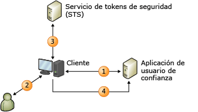

# Modelo de identidad basado en notificacionesClaims-Based Identity Model
Al compilar aplicaciones para notificaciones, la identidad del usuario se representa en la aplicación como un conjunto de notificaciones.When you build claims-aware applications, the user identity is represented in your application as a set of claims. Una notificación podría ser el nombre del usuario, otra podría ser una dirección de correo electrónico.One claim could be the user’s name, another might be an email address. La idea es que se configure un sistema de identidad externo para proporcionar a la aplicación la información que necesita sobre el usuario con cada solicitud realizada, junto con la garantía criptográfica de que los datos de identidad recibidos proceden de una fuente de confianza.The idea is that an external identity system is configured to give your application everything it needs to know about the user with each request she makes, along with cryptographic assurance that the identity data you receive comes from a trusted source.  
  
 Con este modelo, el inicio de sesión único es mucho más fácil de lograr y la aplicación ya no es responsable de las siguientes acciones:Under this model, single sign-on is much easier to achieve, and your application is no longer responsible for the following:  
  
- Autenticar usuarios.Authenticating users.  
  
- Almacenar cuentas de usuario y contraseñas.Storing user accounts and passwords.  
  
- Llamar a directorios de empresa para buscar datos de identidad de usuario.Calling to enterprise directories to look up user identity details.  
  
- Integrarse con sistemas de identidad de otras plataformas o empresas.Integrating with identity systems from other platforms or companies.  
  
 De acuerdo con este modelo, la aplicación toma decisiones relacionadas con la identidad en función de las notificaciones proporcionadas por el sistema que autenticó al usuario.Under this model, your application makes identity-related decisions based on claims supplied by the system that authenticated your user. Esto puede ser desde la simple personalización de la aplicación con el nombre del usuario a la autorización del usuario para obtener acceso a características y recursos de más valor en la aplicación.This could be anything from simple application personalization with the user’s first name, to authorizing the user to access higher valued features and resources in your application.  
  
 En este tema se proporciona la información siguiente:This topic provides the following information:  
  
- [Introducción a la identidad basada en notificacionesIntroduction to Claims-Based Identity](../../../docs/framework/security/claims-based-identity-model.md#BKMK_1)  
  
- [Escenario básico para un modelo de identidad basado en notificacionesBasic Scenario for a Claims-Based Identity Model](../../../docs/framework/security/claims-based-identity-model.md#BKMK_2)  
  
   
## Introducción a la identidad basada en notificacionesIntroduction to Claims-Based Identity  
 La terminología y los conceptos siguientes pueden ayudar a entender esta nueva arquitectura de identidad.The following terminology and concepts can help you understand this new architecture for identity.  
  
### identidadIdentity  
 En las descripciones del modelo de programación de Windows Identity Foundation (WIF), se usa el término "identidad" para representar un conjunto de atributos que describen a un usuario o a alguna otra entidad de un sistema que se quiere proteger.For the purposes of describing the programming model in Windows Identity Foundation (WIF), we will use the term "identity" to represent a set of attributes that describe a user or some other entity in a system that you want to secure.  
  
### NotificaciónClaim  
 Piense en una notificación como un fragmento de información de identidad, como el nombre, dirección de correo electrónico, edad, la pertenencia al rol ventas.Think of a claim as a piece of identity information such as name, email address, age, membership in the Sales role. Cuantas más notificaciones reciba la aplicación, más información se tendrá del usuario.The more claims your application receives, the more you’ll know about your user. Puede que se pregunte por qué se les denomina "notificaciones" en lugar de "atributos", que es el término que se usa habitualmente para describir directorios de empresa.You may be wondering why these are called "claims," rather than "attributes," as is commonly used in describing enterprise directories. El motivo está relacionado con el método de entrega.The reason has to do with the delivery method. En este modelo, la aplicación no busca atributos de usuario en un directorio.In this model, your application doesn’t look up user attributes in a directory. En su lugar, el usuario envía notificaciones a la aplicación que, a su vez, las examina.Instead, the user delivers claims to your application, and your application examines them. Cada notificación la realiza un emisor y se confía en la notificación en la misma medida en que se confía en el emisor.Each claim is made by an issuer, and you trust the claim only as much as you trust the issuer. Por ejemplo, se confía más en una notificación realizada por el controlador de dominio de su empresa que en otra realizada por el propio usuario.For example, you trust a claim made by your company’s domain controller more than you trust a claim made by the user herself. WIF representa las notificaciones con un tipo <xref:System.Security.Claims.Claim>, que tiene una propiedad <xref:System.Security.Claims.Claim.Issuer%2A> que permite averiguar quién emitió la notificación.WIF represents claims with a <xref:System.Security.Claims.Claim> type, which has an <xref:System.Security.Claims.Claim.Issuer%2A> property that allows you to find out who issued the claim.  
  
### Token de seguridadSecurity Token  
 El usuario envía un conjunto de notificaciones a la aplicación junto con una solicitud.The user delivers a set of claims to your application along with a request. En un servicio Web, estas notificaciones se incluyen en el encabezado de seguridad de la envoltura SOAP.In a Web service, these claims are carried in the security header of the SOAP envelope. En una aplicación web basada en el explorador, las notificaciones llegan a través de HTTP POST desde el explorador del usuario y pueden almacenarse en caché posteriormente en una cookie para sesiones futuras.In a browser-based Web application, the claims arrive through an HTTP POST from the user’s browser, and may later be cached in a cookie if a session is desired. Independientemente de cómo lleguen las notificaciones, estas deben serializarse y para ello se usan los tokens de seguridad.Regardless of how these claims arrive, they must be serialized, which is where security tokens come in. Un token de seguridad es un conjunto serializado de notificaciones firmadas digitalmente por la autoridad emisora.A security token is a serialized set of claims that is digitally signed by the issuing authority. La signatura es importante: garantiza que el usuario no se limitó a realizar una serie de notificaciones y enviarlas.The signature is important: it gives you assurance that the user didn’t just make up a bunch of claims and send them to you. En situaciones de escasa seguridad donde la criptografía no es necesaria o no se desea aplicarla, pueden usarse tokens sin firma, pero ese escenario no se describe en este tema.In low security situations where cryptography isn’t necessary or desired, you can use unsigned tokens, but that scenario is not described in this topic.  
  
 Una de las características básicas de WIF es la capacidad de crear y leer tokens de seguridad.One of the core features in WIF is the ability to create and read security tokens. WIF y .NET Framework controlan todo el trabajo criptográfico y presentan la aplicación con un conjunto de notificaciones que se pueden leer.WIF and the .NET Framework handle all of the cryptographic work, and present your application with a set of claims that you can read.  
  
### Entidad emisoraIssuing Authority  
 Hay muchos tipos diferentes de entidades emisoras, desde controladores de dominio que emiten vales Kerberos a entidades de certificación que emiten certificados X.509, pero el tipo concreto de entidad que se trata en este tema emite tokens de seguridad que contienen notificaciones.There are lots of different types of issuing authorities, from domain controllers that issue Kerberos tickets, to certification authorities that issue X.509 certificates, but the specific type of authority discussed in this topic issues security tokens that contain claims. Esta entidad emisora es una aplicación web o un servicio Web que sabe cómo emitir tokens de seguridad.This issuing authority is a Web application or Web service that knows how to issue security tokens. Debe tener suficiente información para poder emitir las notificaciones adecuadas de acuerdo con el usuario de confianza de destino y el usuario que realiza la solicitud. Además, puede que tenga que interactuar con almacenes de usuario para buscar notificaciones y autenticar a los propios usuarios.It must have enough knowledge to be able to issue the proper claims given the target relying party and the user making the request, and might be responsible for interacting with user stores to look up claims and authenticate the users themselves.  
  
 Independientemente de la entidad emisora elegida, esta tiene un papel fundamental en la solución de identidad.Whatever issuing authority you choose, it plays a central role in your identity solution. Cuando se factoriza la autenticación fuera de la aplicación basándose en las notificaciones, se cede la responsabilidad a dicha entidad y se le pide que autentique a los usuarios en su nombre.When you factor authentication out of your application by relying on claims, you’re passing responsibility to that authority and asking it to authenticate users on your behalf.  
  
### Servicio de tokens de seguridad (STS)Security Token Service (STS)  
 Un servicio de token de seguridad (STS) es el componente de servicio que compila, firma y emite tokens de seguridad según los protocolos WS-Trust y WS-Federation.A security token service (STS) is the service component that builds, signs, and issues security tokens according to the WS-Trust and WS-Federation protocols. Se invierte mucho trabajo en la implementación de estos protocolos, pero WIF lo realiza automáticamente, lo que permite que un usuario sin experiencia en los protocolos ponga en marcha un STS sin apenas esfuerzo.There’s a lot of work that goes into implementing these protocols, but WIF does all of this work for you, making it feasible for someone who isn’t an expert in the protocols to get an STS up and running with very little effort. Se puede usar un STS precompilado como [Servicios de federación de Active Directory® (AD FS) 2.0](https://go.microsoft.com/fwlink/?LinkID=247516), un STS en la nube como [Windows Azure Access Control Service (ACS)](https://go.microsoft.com/fwlink/?LinkID=247517) o, si quiere emitir tokens personalizados o proporcionar autenticación o autorización personalizadas, puede compilar su propio STS personalizado mediante WIF.You can use a pre-built STS such as [Active Directory® Federation Services (AD FS) 2.0](https://go.microsoft.com/fwlink/?LinkID=247516), a cloud STS such as a [Windows Azure Access Control Service (ACS)](https://go.microsoft.com/fwlink/?LinkID=247517), or, if you want to issue custom tokens or provide custom authentication or authorization, you can build your own custom STS using WIF. WIF facilita la compilación de su propio STS.WIF makes it easy to build your own STS.  
  
### Aplicación de usuario de confianzaRelying Party Application  
 Cuando se compila una aplicación basada en las notificaciones, se está compilando una aplicación de usuario de confianza (RP).When you build an application that relies on claims, you are building a relying party (RP) application. Entre los sinónimos de RP se incluyen "aplicación para notificaciones" y "aplicación basada en notificaciones".Synonyms for an RP include "claims-aware application" and "claims-based application". Tanto las aplicaciones web como los servicios Web pueden ser de este tipo.Web applications and Web services can both be RPs. Una aplicación de usuario de confianza usa los tokens emitidos por un STS y extrae las notificaciones de los tokens para usarlas en tareas relacionadas con la identidad.A RP application consumes the tokens issued by a STS and extracts the claims from tokens to use them for identity related tasks. WIF ofrece funcionalidades para ayudar a compilar aplicaciones de usuario de confianza.WIF offers functionalities to help you build RP applications.  
  
### EstándaresStandards  
 Para que haya interoperabilidad, en el escenario anterior se usan varios estándares WS-\*.In order to make all of this interoperable, several WS-\* standards are used in the previous scenario. La directiva se recupera usando WS-MetadataExchange, mientras que la propia directiva se estructura según la especificación WS-Policy.Policy is retrieved using WS-MetadataExchange, and the policy itself is structured according to the WS-Policy specification. El STS expone los extremos que implementan la especificación WS-Trust, que describe cómo solicitar y recibir tokens de seguridad.The STS exposes endpoints that implement the WS-Trust specification, which describes how to request and receive security tokens. En la actualidad, la mayoría de los STS emiten tokens con lenguaje de marcado de aserción de seguridad (SAML) como formato.Most STSs today issue tokens formatted with Security Assertion Markup Langauge (SAML). El lenguaje SAML es un vocabulario XML reconocido del sector que se puede usar para representar las notificaciones de forma interoperable.SAML is an industry-recognized XML vocabulary that can be used to represent claims in an interoperable way. Asimismo, en una situación multiplataforma, este permite comunicarse con un STS o una plataforma completamente distinta y lograr un inicio de sesión único en todas las aplicaciones, independientemente de la plataforma.Or, in a multi-platform situation, this allows you to communicate with an STS on an entirely different platform and achieve single sign-on across all of your applications, regardless of platform.  
  
### Aplicaciones basadas en el exploradorBrowser-Based Applications  
 Los clientes inteligentes no son los únicos que pueden usar el modelo de identidad basado en notificaciones.Smart clients aren’t the only ones who can use the claims-based identity model. Las aplicaciones basadas en el explorador (también conocidas como clientes pasivos) también pueden usarlo.Browser-based applications (also referred to as passive clients) can use it as well. En el escenario siguiente se describe su funcionamiento.The following scenario describes how this works.  
  
 En primer lugar, el usuario señala a un explorador en una aplicación web para notificaciones (la aplicación de usuario de confianza).First, the user points a browser at a claims-aware Web application (the relying party application). La aplicación web redirige al explorador al STS de modo que el usuario pueda autenticarse.The Web application redirects the browser to the STS so the user can be authenticated. El STS se hospeda en una aplicación web simple que lee la solicitud entrante, autentica al usuario mediante mecanismos HTTP estándar y, a continuación, crea un token de SAML y responde con un fragmento de código JavaScript que hace que el explorador inicie un método HTTP POST, que vuelve a enviar el token de SAML a la aplicación de usuario de confianza.The STS is hosted in a simple web application that reads the incoming request, authenticates the user using standard HTTP mechanisms, and then creates a SAML token and replies with a piece of JavaScript code that causes the browser to initiate an HTTP POST that sends the SAML token back to the RP. El cuerpo de este POST contiene las notificaciones solicitadas por la aplicación de usuario de confianza.The body of this POST contains the claims that the RP requested. En este punto, la aplicación de usuario de confianza suele empaquetar las notificaciones en una cookie de modo que no haya que redirigir al usuario para cada solicitud.At this point, it is common for the RP to package the claims into a cookie so that the user doesn’t have to be redirected for each request.  
  
   
## Escenario básico para un modelo de identidad basado en notificacionesBasic Scenario for a Claims-Based Identity Model  
 A continuación se muestra un ejemplo de sistema basado en notificaciones.The following is an example of a claims-based system.  
  
   
  
 En este diagrama se muestra un sitio web (la aplicación de usuario de confianza, RP) que se ha configurado para usar WIF para la autenticación y un cliente, un explorador web, que desea usar ese sitio.This diagram shows a Web site (the relying party application, RP) that has been configured to use WIF for authentication and a client, a web browser, that wants to use that site.  
  
1. Cuando un usuario no autenticado solicita una página, el explorador se redirige a las páginas de identidades (IdP) del proveedor.When an unauthenticated user requests a page, their browser is redirected to the identity provider (IdP) pages.  
  
2. El proveedor de identidades requiere que el usuario presentar sus credenciales, como el nombre de usuario/contraseña o la autenticación Kerberos.The IdP requires the user to present their credentials, such as username/password or Kerberos authentication.  
  
3. Los problemas de IdP un token que se devuelve al explorador.The IdP issues a token back to that is returned to the browser.  
  
4. A continuación, el explorador se redirige a la página solicitada originalmente, donde WIF determina si el token cumple los requisitos para tener acceso a la misma.The browser is now redirected back to the originally requested page where WIF determines if the token satisfies the requirements to access the page. En ese caso, se emite una cookie para establecer una sesión de modo que la autenticación solo tenga que realizarse una vez y el control se pase a la aplicación.If so a cookie is issued to establish a session so the authentication only needs to occur once, and control is passed to the application.
