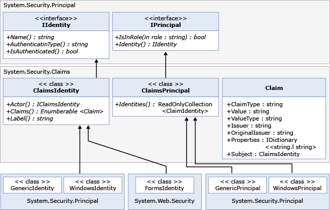

# <a name="wif-claims-programming-model"></a>Modelo de programación de notificaciones de WIF
Los desarrolladores de ASP.NET y de Windows Communication Foundation (WCF) suelen usar las interfaces IIdentity e IPrincipal para trabajar con la información de identidad del usuario. En .NET 4.5, Windows Identity Foundation (WIF) se ha integrado de tal manera que las notificaciones ahora siempre están presentes para cualquier entidad de seguridad, como se muestra en el diagrama siguiente:

 

 En .NET 4.5, System.Security.Claims contiene las nuevas clases ClaimsPrincipal y ClaimsIdentity (vea el diagrama anterior). Todas las entidades de seguridad de .NET ahora se derivan de ClaimsPrincipal. Todas las clases de identidad integradas, como FormsIdentity para ASP.NET y WindowsIdentity, ahora se derivan de ClaimsIdentity. De forma similar, todas las clases de entidad de seguridad integradas, como GenericPrincipal y WindowsPrincipal, se derivan de ClaimsPrincipal.

 Una notificación se representa con la clase <xref:System.Security.Claims.Claim>. Esta clase tiene las siguientes propiedades importantes:

- <xref:System.Security.Claims.Claim.Type%2A> representa el tipo de notificación. Suele ser un identificador URI. Por ejemplo, la notificación de la dirección de correo electrónico se representa como `http://schemas.microsoft.com/ws/2008/06/identity/claims/email`.

- <xref:System.Security.Claims.Claim.Value%2A> contiene el valor de la notificación y se representa como una cadena. Por ejemplo, la dirección de correo electrónico puede representarse como "someone@contoso.com".

- <xref:System.Security.Claims.Claim.ValueType%2A> representa el tipo del valor de la notificación. Suele ser un identificador URI. Por ejemplo, el tipo de cadena se representa como `http://www.w3.org/2001/XMLSchema#string`. El tipo de valor debe ser QName de acuerdo con el esquema XML. El valor debe tener el formato `namespace#format` para que WIF pueda emitir un valor QName válido. Si el espacio de nombres no está bien definido, el XML generado probablemente no se podrá validar con un esquema, porque no habrá ningún archivo XSD publicado para ese espacio de nombres. El tipo de valor predeterminado es `http://www.w3.org/2001/XMLSchema#string`. Consulte [ http://www.w3.org/2001/XMLSchema ](https://go.microsoft.com/fwlink/?LinkId=209155) para tipos de valor conocido que puede utilizar sin ningún riesgo.

- <xref:System.Security.Claims.Claim.Issuer%2A> es el identificador del servicio de token de seguridad (STS) que emitió la notificación. Se puede representar como una dirección URL del STS o como un nombre que represente el STS, como `https://sts1.contoso.com/sts`.

- <xref:System.Security.Claims.Claim.OriginalIssuer%2A> es el identificador del STS que emitió originalmente la notificación, independientemente de la cantidad de STS que haya en la cadena. Esto se representa como <xref:System.Security.Claims.Claim.Issuer%2A>.

- <xref:System.Security.Claims.Claim.Subject%2A> es el asunto cuya identidad se está examinando. Contiene una <xref:System.Security.Claims.ClaimsIdentity>.

- <xref:System.Security.Claims.Claim.Properties%2A> es un diccionario que permite al desarrollador proporcionar datos específicos de la aplicación para transferirlos en la conexión junto con las demás propiedades. Se puede usar para la validación personalizada.

## <a name="identity-delegation"></a>Delegación de identidad
Una propiedad importante de <xref:System.Security.Claims.ClaimsIdentity> es <xref:System.Security.Claims.ClaimsIdentity.Actor%2A>. Esta propiedad permite la delegación de credenciales en un sistema de varios niveles en el que un nivel intermedio actúa como cliente para realizar solicitudes a un servicio back-end.

### <a name="accessing-claims-through-threadcurrentprincipal"></a>Acceso a las notificaciones a través de Thread.CurrentPrincipal
Para obtener acceso al conjunto de notificaciones del usuario actual en una aplicación de RP, use `Thread.CurrentPrincipal`.

En el siguiente ejemplo de código se muestra el uso de este método para obtener una System.Security.Claims.ClaimsIdentity:

```csharp
ClaimsPrincipal claimsPrincipal = Thread.CurrentPrincipal as ClaimsPrincipal;
```

Para obtener más información, consulta <xref:System.Security.Claims>.

### <a name="role-claim-type"></a>Tipo de notificación de rol
Parte de la configuración de la aplicación de RP consiste en determinar cuál debe ser el tipo de notificación de rol. System.Security.Claims.ClaimsPrincipal.IsInRole(System.String) usa este tipo de notificación. El tipo de notificación predeterminado es `http://schemas.microsoft.com/ws/2008/06/identity/claims/role`.

### <a name="claims-extracted-by-windows-identity-foundation-from-different-token-types"></a>Notificaciones extraídas por Windows Identity Foundation de distintos tipos de token
WIF admite de forma predeterminada varias combinaciones de mecanismos de autenticación. En la tabla siguiente se muestran las notificaciones que WIF extrae de los distintos tipos de token.

|Tipo de token|Notificación generada|Mapa al token de acceso de Windows|
|-|-|-|
|SAML 1.1|1.  Todas las notificaciones de System.IdentityModel.SecurityTokenService.GetOutputClaimsIdentity(System.Security.Claims.ClaimsPrincipal,System.IdentityModel.Protocols.WSTrust.RequestSecurityToken,System.IdentityModel.Scope).<br />2.  La notificación `http://schemas.microsoft.com/ws/2008/06/identity/claims/confirmationkey` que contiene la serialización XML de la clave de confirmación, si el token contiene un token de prueba.<br />3.  La notificación `http://schemas.microsoft.com/ws/2008/06/identity/claims/samlissuername` del elemento Issuer.<br />4.  Notificaciones AuthenticationMethod y AuthenticationInstant, si el token contiene una instrucción de autenticación.|Además de las notificaciones que aparecen en "SAML 1.1", excepto las notificaciones de tipo `http://schemas.xmlsoap.org/ws/2005/05/identity/claims/name`, se agregarán notificaciones relacionadas con la autenticación de Windows y la identidad se representará mediante WindowsClaimsIdentity.|
|SAML 2.0|Igual que "SAML 1.1".|Igual que "SAML 1.1 Asignado a la cuenta de Windows".|
|X509|1.  Notificaciones con el nombre distintivo del certificado X500, emailName, dnsName, SimpleName, UpnName, UrlName, thumbprint, RsaKey (este se puede extraer de la propiedad X509Certificate2.PublicKey.Key mediante el método RSACryptoServiceProvider.ExportParameters), DsaKey (este se puede extraer de la propiedad X509Certificate2.PublicKey.Key mediante el método DSACryptoServiceProvider.ExportParameters), propiedades SerialNumber del certificado X509.<br />2.  Notificación AuthenticationMethod con el valor `http://schemas.microsoft.com/ws/2008/06/identity/authenticationmethod/x509`. Notificación AuthenticationInstant con el valor de la hora a la que se validó el certificado en formato XmlSchema DateTime.|1.  Usa el nombre de dominio completo de la cuenta de Windows como valor de la notificación `http://schemas.xmlsoap.org/ws/2005/05/identity/claims/name`. .<br />2.  Notificaciones del certificado X509 no asignadas a Windows y notificaciones de la cuenta de Windows obtenidas mediante la asignación del certificado a Windows.|
|UPN|1.  Las notificaciones son similares a las notificaciones de la sección de autenticación de Windows.<br />2.  Notificación AuthenticationMethod con el valor `http://schemas.microsoft.com/ws/2008/06/identity/authenticationmethod/password`. Notificación AuthenticationInstant con el valor de la hora a la que se validó la contraseña en formato XmlSchema DateTime.||
|Windows (Kerberos o NTLM)|1.  Notificaciones generadas a partir del token de acceso. Por ejemplo: PrimarySID, DenyOnlyPrimarySID, PrimaryGroupSID, DenyOnlyPrimaryGroupSID, GroupSID, DenyOnlySID y Name.<br />2.  AuthenticationMethod con el valor `http://schemas.microsoft.com/ws/2008/06/identity/authenticationmethod/windows`. AuthenticationInstant con el valor de la hora a la que se creó el token de acceso a Windows con el formato XMLSchema DateTime.||
|Par de claves RSA|1.  Notificación `http://schemas.xmlsoap.org/ws/2005/05/identity/claims/rsa` con el valor de RSAKeyValue.<br />2.  Notificación AuthenticationMethod con el valor `http://schemas.microsoft.com/ws/2008/06/identity/authenticationmethod/signature`. Notificación AuthenticationInstant con el valor de la hora a la que se autenticó la clave RSA (es decir, la hora a la que se comprobó la firma) con el formato XMLSchema DateTime.||

|Tipo de autenticación|URI que se emite en la notificación "AuthenticationMethod"|
|-|-|
|Contraseña|`urn:oasis:names:tc:SAML:1.0:am:password`|
|Kerberos|`urn:ietf:rfc:1510`|
|SecureRemotePassword|`urn:ietf:rfc:2945`|
|TLSClient|`urn:ietf:rfc:2246`|
|X509|`urn:oasis:names:tc:SAML:1.0:am:X509-PKI`|
|PGP|`urn:oasis:names:tc:SAML:1.0:am:PGP`|
|Spki|`urn:oasis:names:tc:SAML:1.0:am:SPKI`|
|XmlDSig|`urn:ietf:rfc:3075`|
|Sin especificar|`urn:oasis:names:tc:SAML:1.0:am:unspecified`|