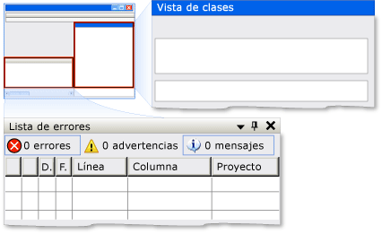

# Implementar el patrón de control Dock de UI Automation
> [!NOTE]
> Esta documentación está dirigida a los desarrolladores de .NET Framework que quieran usar las clases [!INCLUDE[TLA2#tla_uiautomation](../../../includes/tla2sharptla-uiautomation-md.md)] administradas definidas en el espacio de nombres <xref:System.Windows.Automation>. Para ver la información más reciente acerca de [!INCLUDE[TLA2#tla_uiautomation](../../../includes/tla2sharptla-uiautomation-md.md)], consulte [Windows Automation API: automatización de la interfaz de usuario](/windows/win32/winauto/entry-uiauto-win32).  
  
 En este tema se presentan las directrices y convenciones para implementar <xref:System.Windows.Automation.Provider.IDockProvider>y se incluye información sobre propiedades. Al final del tema se ofrecen vínculos a referencias adicionales.  
  
 El patrón de control <xref:System.Windows.Automation.DockPattern> se utiliza para exponer las propiedades de acoplamiento de un control dentro de un contenedor de acoplamiento. Un contenedor de acoplamiento es un control que permite organizar elementos secundarios horizontal y verticalmente, relacionados entre sí. Para obtener ejemplos de controles que implementan este patrón de control, vea [Control Pattern Mapping for UI Automation Clients](control-pattern-mapping-for-ui-automation-clients.md).  
  
   
Ejemplo de acoplamiento de Visual Studio donde la ventana "Vista de clases" es DockPosition.Right y la ventana "Lista de errores" es DockPosition.Bottom  
  

## Directrices y convenciones de implementación  
 Al implementar el patrón de control Dock, tenga en cuenta las siguientes directrices y convenciones:  
  
- <xref:System.Windows.Automation.Provider.IDockProvider> no expone propiedades del contenedor de acoplamiento ni propiedades de controles que estén acoplados adyacentes al control actual dentro del contenedor de acoplamiento.  
  
- Los controles se acoplan de forma relativa entre ellos, según su valor actual de orden Z; cuanto mayor es su ubicación de orden Z, más lejos se colocan del borde especificado del contenedor de acoplamiento.  
  
- Si se cambia el tamaño del contenedor de acoplamiento, los controles acoplados dentro del contenedor cambiarán de posición y se alinearán con el mismo borde en el que estaban originalmente acoplados. Los controles acoplados también cambiarán de tamaño para rellenar el espacio dentro del contenedor según el comportamiento de acoplamiento de sus elementos <xref:System.Windows.Automation.DockPosition>. Por ejemplo, si se especifica <xref:System.Windows.Automation.DockPosition.Top> , los lados izquierdo y derecho del control se expandirán para rellenar el espacio disponible. Si se especifica <xref:System.Windows.Automation.DockPosition.Fill> , los cuatro lados del control se expandirán para rellenar el espacio disponible.  
  
- En un sistema de varios monitores, los controles se deben acoplar en el lado izquierdo o derecho del monitor actual. Si no es posible, deben acoplarse en el lado izquierdo del monitor que se encuentre más a la izquierda o en el lado derecho del monitor que se encuentre más a la derecha.  
  

## Miembros requeridos para IDockProvider  
 Se requieren los métodos y propiedades siguientes para implementar la interfaz de IDockProvider.  
  
|Miembros requeridos|Tipo de miembro|Notas|  
|----------------------|-----------------|-----------|  
|<xref:System.Windows.Automation.Provider.IDockProvider.DockPosition%2A>|Propiedad.|None|  
|<xref:System.Windows.Automation.Provider.IDockProvider.SetDockPosition%2A>|Método|None|  
  
 Este patrón de control no tiene eventos asociados.  
  

## Excepciones  
 Los proveedores deben producir las siguientes excepciones.  
  
|Tipo de excepción|Condición|  
|--------------------|---------------|  
|<xref:System.InvalidOperationException>|<xref:System.Windows.Automation.Provider.IDockProvider.SetDockPosition%2A>   : Cuando un control no puede ejecutar el estilo de acoplamiento solicitado.|  
  
## Consulte también

- [Información general acerca de los patrones de control de UI Automation](ui-automation-control-patterns-overview.md)
- [Patrones de control compatibles en un proveedor de UI Automation](support-control-patterns-in-a-ui-automation-provider.md)
- [Patrones de controles de UI Automation para clientes](ui-automation-control-patterns-for-clients.md)
- [Información general sobre el árbol de la UI Automation](ui-automation-tree-overview.md)
- [Utilizar el almacenamiento en caché en la UI Automation](use-caching-in-ui-automation.md)
