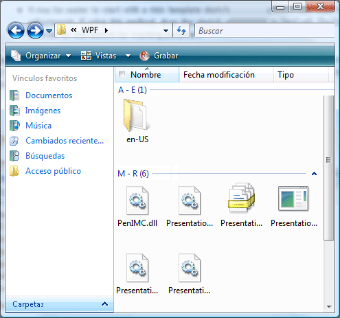

# Implementar el patrón de control Grid de UI Automation

> [!NOTE]
> Esta documentación está dirigida a los desarrolladores de .NET Framework que quieran usar las clases [!INCLUDE[TLA2#tla_uiautomation](../../../includes/tla2sharptla-uiautomation-md.md)] administradas definidas en el espacio de nombres <xref:System.Windows.Automation>. Para ver la información más reciente acerca de [!INCLUDE[TLA2#tla_uiautomation](../../../includes/tla2sharptla-uiautomation-md.md)], consulte [Windows Automation API: automatización de la interfaz de usuario](/windows/win32/winauto/entry-uiauto-win32).  
  
 En este tema se presentan las directrices y convenciones para implementar <xref:System.Windows.Automation.Provider.IGridProvider>, incluida la información sobre propiedades, métodos y eventos. Al final de la información general se proporcionan vínculos a referencias adicionales.  
  
 El patrón de control <xref:System.Windows.Automation.GridPattern> se usa para admitir controles que actúen como contenedores para una colección de elementos secundarios. Los elementos secundarios de este elemento deben implementar <xref:System.Windows.Automation.Provider.IGridItemProvider> y organizarse en un sistema de coordenadas lógico bidimensional que se pueda recorrer por filas y columnas. Para obtener ejemplos de controles que implementan este patrón de control, vea [Control Pattern Mapping for UI Automation Clients](control-pattern-mapping-for-ui-automation-clients.md).  
  

## Directrices y convenciones de implementación  

 Al implementar el patrón de control Grid, tenga en cuenta las siguientes directrices y convenciones:  
  
- Las coordenadas de la cuadrícula son de base cero, donde la celda superior izquierda (o la superior derecha, según la configuración regional) tiene las coordenadas (0, 0).  
  
- Si una celda está vacía, todavía debe devolverse un elemento de Automatización de la interfaz de usuario para admitir la propiedad <xref:System.Windows.Automation.Provider.IGridItemProvider.ContainingGrid%2A> en esa celda. Esto es posible si el diseño de elementos secundarios de la cuadrícula es similar a una matriz irregular (consulte el ejemplo siguiente).  
  
   
Ejemplo de un control Grid con coordenadas vacías  
  
- Sigue siendo necesaria una cuadrícula con un elemento único para implementar <xref:System.Windows.Automation.Provider.IGridProvider> si lógicamente se considera una cuadrícula. El número de elementos secundarios de la cuadrícula es irrelevante.  
  
- Las filas y columnas ocultas, según la implementación del proveedor, se pueden cargar en el árbol de [!INCLUDE[TLA2#tla_uiautomation](../../../includes/tla2sharptla-uiautomation-md.md)] y, por tanto, se reflejarán en las propiedades <xref:System.Windows.Automation.GridPattern.GridPatternInformation.RowCount%2A> y <xref:System.Windows.Automation.GridPattern.GridPatternInformation.ColumnCount%2A> . Si las filas y columnas ocultas todavía no se han cargado, no deben contarse.  
  
- <xref:System.Windows.Automation.Provider.IGridProvider> no permite la manipulación activa de una cuadrícula; <xref:System.Windows.Automation.Provider.ITransformProvider> debe implementarse para habilitar esta funcionalidad.  
  
- Use un elemento <xref:System.Windows.Automation.StructureChangedEventHandler> para permanecer a la escucha de cambios estructurales o de diseño en la cuadrícula, como por ejemplo, celdas que se hayan agregado, quitado o combinado.  
  
- Use un elemento <xref:System.Windows.Automation.AutomationFocusChangedEventHandler> para realizar un seguimiento del recorrido a través de los elementos o las celdas de una cuadrícula.  
  

## Miembros requeridos para IGridProvider  

 Se requieren los métodos y propiedades siguientes para implementar la interfaz de IGridProvider.  
  
|Miembros requeridos|Tipo|Notas|  
|----------------------|----------|-----------|  
|<xref:System.Windows.Automation.Provider.IGridProvider.RowCount%2A>|Propiedad|None|  
|<xref:System.Windows.Automation.Provider.IGridProvider.ColumnCount%2A>|Propiedad|None|  
|<xref:System.Windows.Automation.Provider.IGridProvider.GetItem%2A>|Método|None|  
  
 Este patrón de control no tiene eventos asociados.  
  

## Excepciones  

 Los proveedores deben producir las siguientes excepciones.  
  
|Tipo de excepción|Condición|  
|--------------------|---------------|  
|<xref:System.ArgumentOutOfRangeException>|<xref:System.Windows.Automation.Provider.IGridProvider.GetItem%2A>   : Si la coordenada de la fila solicitada es mayor que <xref:System.Windows.Automation.Provider.IGridProvider.RowCount%2A> o la coordenada de columna es mayor que <xref:System.Windows.Automation.Provider.IGridProvider.ColumnCount%2A> .|  
|<xref:System.ArgumentOutOfRangeException>|<xref:System.Windows.Automation.Provider.IGridProvider.GetItem%2A>   : Si alguna de las coordenadas de columna o fila solicitada es menor que cero.|  
  
## Vea también

- [Información general acerca de los patrones de control de UI Automation](ui-automation-control-patterns-overview.md)
- [Patrones de control compatibles en un proveedor de UI Automation](support-control-patterns-in-a-ui-automation-provider.md)
- [Patrones de controles de UI Automation para clientes](ui-automation-control-patterns-for-clients.md)
- [Implementar el patrón de control GridItem de UI Automation](implementing-the-ui-automation-griditem-control-pattern.md)
- [Información general sobre el árbol de la UI Automation](ui-automation-tree-overview.md)
- [Utilizar el almacenamiento en caché en la UI Automation](use-caching-in-ui-automation.md)
