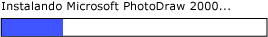

# Implementar el patrón de control RangeValue de UI Automation
> [!NOTE]
> Esta documentación está dirigida a los desarrolladores de .NET Framework que quieran usar las clases [!INCLUDE[TLA2#tla_uiautomation](../../../includes/tla2sharptla-uiautomation-md.md)] administradas definidas en el espacio de nombres <xref:System.Windows.Automation>. Para ver la información más reciente acerca de [!INCLUDE[TLA2#tla_uiautomation](../../../includes/tla2sharptla-uiautomation-md.md)], consulte [Windows Automation API: automatización de la interfaz de usuario](/windows/win32/winauto/entry-uiauto-win32).  
  
 En este tema se presentan las directrices y convenciones para implementar <xref:System.Windows.Automation.Provider.IRangeValueProvider>, incluida la información sobre eventos y propiedades. Al final del tema se ofrecen vínculos a referencias adicionales.  
  
 El patrón de control <xref:System.Windows.Automation.RangeValuePattern> se utiliza para admitir controles que se pueden establecer en un valor dentro de un intervalo. Para obtener ejemplos de controles que implementan este patrón de control, vea [Control Pattern Mapping for UI Automation Clients](control-pattern-mapping-for-ui-automation-clients.md).  
  

## Directrices y convenciones de implementación  
 Al implementar el patrón de control Range Value, tenga en cuenta las siguientes directrices y convenciones:  
  
- Los controles permiten la recalibración de sus propiedades compatibles según las preferencias de usuario o la configuración regional. Un ejemplo de esto es un control de termómetro que puede establecerse para mostrar la temperatura en grados Fahrenheit o Celsius.  
  
- Los controles que tienen valores de intervalo ambiguos, como las barras de progreso o los controles deslizantes, deben tener dichos valores normalizados.  
  
   
Ejemplo de una barra de progreso donde el valor es de tipo entero y los valores de propiedad mínimo y máximo se normalizan en 0 y 100, respectivamente  
  

## Miembros requeridos para IRangeValueProvider  
  
|Miembro requerido|Tipo de miembro|Notas|  
|---------------------|-----------------|-----------|  
|<xref:System.Windows.Automation.RangeValuePattern.IsReadOnlyProperty>|Propiedad|None|  
|<xref:System.Windows.Automation.RangeValuePattern.ValueProperty>|Propiedad|None|  
|<xref:System.Windows.Automation.RangeValuePattern.LargeChangeProperty>|Propiedad|None|  
|<xref:System.Windows.Automation.RangeValuePattern.SmallChangeProperty>|Propiedad|None|  
|<xref:System.Windows.Automation.RangeValuePattern.MaximumProperty>|Propiedad|None|  
|<xref:System.Windows.Automation.RangeValuePattern.MinimumProperty>|Propiedad|None|  
|<xref:System.Windows.Automation.RangeValuePattern.SetValue%2A>|Métodos|None|  
  
 Este patrón de control no tiene eventos asociados.  
  

## Excepciones  
 Los proveedores deben producir las siguientes excepciones.  
  
|Tipo de excepción|Condición|  
|--------------------|---------------|  
|<xref:System.ArgumentOutOfRangeException>|Se llama a<xref:System.Windows.Automation.RangeValuePattern.SetValue%2A> con un valor que es mayor que <xref:System.Windows.Automation.RangeValuePattern.MaximumProperty> o menor que <xref:System.Windows.Automation.RangeValuePattern.MinimumProperty>.|  
  
## Consulte también

- [UI Automation Control Patterns Overview](ui-automation-control-patterns-overview.md)
- [Patrones de control compatibles en un proveedor de UI Automation](support-control-patterns-in-a-ui-automation-provider.md)
- [Patrones de controles de UI Automation para clientes](ui-automation-control-patterns-for-clients.md)
- [UI Automation Tree Overview](ui-automation-tree-overview.md)
- [Utilizar el almacenamiento en caché en la UI Automation](use-caching-in-ui-automation.md)
