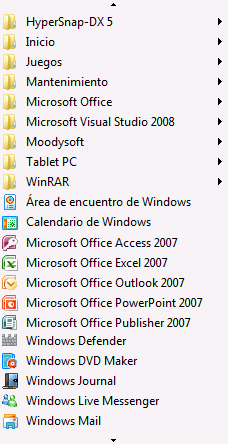

# Implementación del patrón de control Scroll de UI AutomationImplementing the UI Automation Scroll Control Pattern

> [!NOTE]
> Esta documentación está dirigida a los desarrolladores de .NET Framework que quieran usar las clases [!INCLUDE[TLA2#tla_uiautomation](../../../includes/tla2sharptla-uiautomation-md.md)] administradas definidas en el espacio de nombres <xref:System.Windows.Automation>.This documentation is intended for .NET Framework developers who want to use the managed [!INCLUDE[TLA2#tla_uiautomation](../../../includes/tla2sharptla-uiautomation-md.md)] classes defined in the <xref:System.Windows.Automation> namespace. Para ver la información más reciente acerca de [!INCLUDE[TLA2#tla_uiautomation](../../../includes/tla2sharptla-uiautomation-md.md)], consulte [Windows Automation API: automatización de la interfaz de usuario](/windows/win32/winauto/entry-uiauto-win32).For the latest information about [!INCLUDE[TLA2#tla_uiautomation](../../../includes/tla2sharptla-uiautomation-md.md)], see [Windows Automation API: UI Automation](/windows/win32/winauto/entry-uiauto-win32).  
  
 En este tema se presentan las directrices y convenciones para implementar <xref:System.Windows.Automation.Provider.IScrollProvider>, incluida la información sobre eventos y propiedades.This topic introduces guidelines and conventions for implementing <xref:System.Windows.Automation.Provider.IScrollProvider>, including information about events and properties. Al final del tema se ofrecen vínculos a referencias adicionales.Links to additional references are listed at the end of the topic.  
  
 El patrón de control <xref:System.Windows.Automation.ScrollPattern> se usa para admitir un control que actúe como contenedor desplazable para una colección de objetos secundarios.The <xref:System.Windows.Automation.ScrollPattern> control pattern is used to support a control that acts as a scrollable container for a collection of child objects. No se requiere el control para el uso de barras de desplazamiento para admitir la funcionalidad de desplazamiento, aunque lo hace habitualmente.The control is not required to use scrollbars to support the scrolling functionality, although it commonly does.  
  
   
Ejemplo de un control de desplazamiento que no use barras de desplazamientoExample of a Scrolling Control that Does Not Use Scrollbars  
  
 Para obtener ejemplos de controles que implementan este control, vea [Control Pattern Mapping for UI Automation Clients](control-pattern-mapping-for-ui-automation-clients.md).For examples of controls that implement this control, see [Control Pattern Mapping for UI Automation Clients](control-pattern-mapping-for-ui-automation-clients.md).  
  

## Directrices y convenciones de implementaciónImplementation Guidelines and Conventions  

 Al implementar el patrón de control Scroll, tenga en cuenta las siguientes directrices y convenciones:When implementing the Scroll control pattern, note the following guidelines and conventions:  
  
- Los elementos secundarios de este control deben implementar <xref:System.Windows.Automation.Provider.IScrollItemProvider>.The children of this control must implement <xref:System.Windows.Automation.Provider.IScrollItemProvider>.  
  
- Las barras de desplazamiento de un control de contenedor no admiten el patrón de control <xref:System.Windows.Automation.ScrollPattern> .The scrollbars of a container control do not support the <xref:System.Windows.Automation.ScrollPattern> control pattern. Deben admitir el patrón de control <xref:System.Windows.Automation.RangeValuePattern> en su lugar.They must support the <xref:System.Windows.Automation.RangeValuePattern> control pattern instead.  
  
- Cuando el desplazamiento se mide en porcentajes, todos los valores o cantidades relacionadas con la graduación del desplazamiento deben normalizarse a un intervalo de 0 a 100.When scrolling is measured in percentages, all values or amounts related to scroll graduation must be normalized to a range of 0 to 100.  
  
- Las propiedades<xref:System.Windows.Automation.ScrollPatternIdentifiers.HorizontallyScrollableProperty> y <xref:System.Windows.Automation.ScrollPatternIdentifiers.VerticallyScrollableProperty> son independientes de la propiedad <xref:System.Windows.Automation.AutomationElement.IsEnabledProperty>.<xref:System.Windows.Automation.ScrollPatternIdentifiers.HorizontallyScrollableProperty> and <xref:System.Windows.Automation.ScrollPatternIdentifiers.VerticallyScrollableProperty> are independent of the <xref:System.Windows.Automation.AutomationElement.IsEnabledProperty>.  
  
- Si <xref:System.Windows.Automation.ScrollPatternIdentifiers.HorizontallyScrollableProperty> = `false` , <xref:System.Windows.Automation.ScrollPatternIdentifiers.HorizontalViewSizeProperty> debe establecerse en el 100 % y <xref:System.Windows.Automation.ScrollPatternIdentifiers.HorizontalScrollPercentProperty> debe establecerse en <xref:System.Windows.Automation.ScrollPatternIdentifiers.NoScroll>.If <xref:System.Windows.Automation.ScrollPatternIdentifiers.HorizontallyScrollableProperty> = `false` then <xref:System.Windows.Automation.ScrollPatternIdentifiers.HorizontalViewSizeProperty> should be set to 100% and <xref:System.Windows.Automation.ScrollPatternIdentifiers.HorizontalScrollPercentProperty> should be set to <xref:System.Windows.Automation.ScrollPatternIdentifiers.NoScroll>. De igual modo, si <xref:System.Windows.Automation.ScrollPatternIdentifiers.VerticallyScrollableProperty> = `false` , <xref:System.Windows.Automation.ScrollPatternIdentifiers.VerticalViewSizeProperty> debe establecerse en el 100 por ciento y <xref:System.Windows.Automation.ScrollPatternIdentifiers.VerticalScrollPercentProperty> debe establecerse en <xref:System.Windows.Automation.ScrollPatternIdentifiers.NoScroll>.Likewise, if <xref:System.Windows.Automation.ScrollPatternIdentifiers.VerticallyScrollableProperty> = `false` then <xref:System.Windows.Automation.ScrollPatternIdentifiers.VerticalViewSizeProperty> should be set to 100 percent and <xref:System.Windows.Automation.ScrollPatternIdentifiers.VerticalScrollPercentProperty> should be set to <xref:System.Windows.Automation.ScrollPatternIdentifiers.NoScroll>. Esto permite que un cliente de la automatización de la interfaz de usuario use estos valores de propiedad del método <xref:System.Windows.Automation.ScrollPattern.SetScrollPercent%2A> a la vez que se evita una [condición de carrera](https://support.microsoft.com/default.aspx?scid=kb;en-us;317723) si se activa una dirección que al cliente no le interesa para desplazamiento.This allows a UI Automation client to use these property values within the <xref:System.Windows.Automation.ScrollPattern.SetScrollPercent%2A> method while avoiding a [race condition](https://support.microsoft.com/default.aspx?scid=kb;en-us;317723) if a direction the client is not interested in scrolling becomes activated.  
  
- <xref:System.Windows.Automation.Provider.IScrollProvider.HorizontalScrollPercent%2A> es específica de la configuración regional.<xref:System.Windows.Automation.Provider.IScrollProvider.HorizontalScrollPercent%2A> is locale-specific. La configuración de HorizontalScrollPercent = 100,0 debe establecer la ubicación de desplazamiento del control en el equivalente de su posición que se encuentra situada más a la derecha para idiomas como el inglés que se leen de izquierda a derecha.Setting HorizontalScrollPercent = 100.0 must set the scrolling location of the control to the equivalent of its rightmost position for languages such as English that read left to right. Otra alternativa, para idiomas como el árabe que se leen de derecha a izquierda, la configuración de HorizontalScrollPercent = 100,0 debe establecer la ubicación de desplazamiento a la posición que se encuentra más a la izquierda.Alternately, for languages such as Arabic that read right to left, setting HorizontalScrollPercent = 100.0 must set the scroll location to the leftmost position.  
  

## Miembros requeridos para IScrollProviderRequired Members for IScrollProvider  

 Para implementar <xref:System.Windows.Automation.Provider.IScrollProvider>, se requieren las siguientes propiedades y métodos.The following properties and methods are required for implementing <xref:System.Windows.Automation.Provider.IScrollProvider>.  
  
|Miembro requeridoRequired member|Tipo de miembroMember type|NotasNotes|  
|---------------------|-----------------|-----------|  
|<xref:System.Windows.Automation.Provider.IScrollProvider.HorizontalScrollPercent%2A>|PropiedadProperty|NoneNone|  
|<xref:System.Windows.Automation.Provider.IScrollProvider.VerticalScrollPercent%2A>|PropiedadProperty|NoneNone|  
|<xref:System.Windows.Automation.Provider.IScrollProvider.HorizontalViewSize%2A>|PropiedadProperty|NoneNone|  
|<xref:System.Windows.Automation.Provider.IScrollProvider.VerticalViewSize%2A>|PropiedadProperty|NoneNone|  
|<xref:System.Windows.Automation.Provider.IScrollProvider.HorizontallyScrollable%2A>|PropiedadProperty|NoneNone|  
|<xref:System.Windows.Automation.Provider.IScrollProvider.VerticallyScrollable%2A>|PropiedadProperty|NoneNone|  
|<xref:System.Windows.Automation.Provider.IScrollProvider.Scroll%2A>|MétodoMethod|NoneNone|  
|<xref:System.Windows.Automation.Provider.IScrollProvider.SetScrollPercent%2A>|MétodoMethod|NoneNone|  
  
 Este patrón de control no tiene eventos asociados.This control pattern has no associated events.  
  

## ExcepcionesExceptions  

 Los proveedores deben producir las siguientes excepciones.Providers must throw the following exceptions.  
  
|Tipo de excepciónException Type|CondiciónCondition|  
|--------------------|---------------|  
|<xref:System.ArgumentException>|<xref:System.Windows.Automation.Provider.IScrollProvider.Scroll%2A> genera esta excepción si un control admite valores <xref:System.Windows.Automation.ScrollAmount.SmallIncrement> exclusivamente para el desplazamiento horizontal o vertical, pero se pasa un valor <xref:System.Windows.Automation.ScrollAmount.LargeIncrement> .<xref:System.Windows.Automation.Provider.IScrollProvider.Scroll%2A> throws this exception if a control supports <xref:System.Windows.Automation.ScrollAmount.SmallIncrement> values exclusively for horizontal or vertical scrolling, but a <xref:System.Windows.Automation.ScrollAmount.LargeIncrement> value is passed in.|  
|<xref:System.ArgumentException>|<xref:System.Windows.Automation.Provider.IScrollProvider.SetScrollPercent%2A> genera esta excepción cuando se pasa un valor que no se puede convertir a un tipo double.<xref:System.Windows.Automation.Provider.IScrollProvider.SetScrollPercent%2A> throws this exception when a value that cannot be converted to a double is passed in.|  
|<xref:System.ArgumentOutOfRangeException>|<xref:System.Windows.Automation.Provider.IScrollProvider.SetScrollPercent%2A> genera esta excepción cuando se pasa un valor superior a 100 o menor de 0 (excepto -1, que equivale a <xref:System.Windows.Automation.ScrollPatternIdentifiers.NoScroll>).<xref:System.Windows.Automation.Provider.IScrollProvider.SetScrollPercent%2A> throws this exception when a value greater than 100 or less than 0 is passed in (except -1 which is equivalent to <xref:System.Windows.Automation.ScrollPatternIdentifiers.NoScroll>).|  
|<xref:System.InvalidOperationException>|Tanto <xref:System.Windows.Automation.Provider.IScrollProvider.Scroll%2A> como <xref:System.Windows.Automation.Provider.IScrollProvider.SetScrollPercent%2A> generan esta excepción cuando se intenta un desplazamiento en una dirección no admitida.Both <xref:System.Windows.Automation.Provider.IScrollProvider.Scroll%2A> and <xref:System.Windows.Automation.Provider.IScrollProvider.SetScrollPercent%2A> throw this exception when an attempt is made to scroll in an unsupported direction.|  
  
## Vea tambiénSee also

- [Información general acerca de los patrones de control de UI AutomationUI Automation Control Patterns Overview](ui-automation-control-patterns-overview.md)
- [Patrones de control compatibles en un proveedor de UI AutomationSupport Control Patterns in a UI Automation Provider](support-control-patterns-in-a-ui-automation-provider.md)
- [Patrones de controles de UI Automation para clientesUI Automation Control Patterns for Clients](ui-automation-control-patterns-for-clients.md)
- [Información general sobre el árbol de la UI AutomationUI Automation Tree Overview](ui-automation-tree-overview.md)
- [Utilizar el almacenamiento en caché en la UI AutomationUse Caching in UI Automation](use-caching-in-ui-automation.md)
