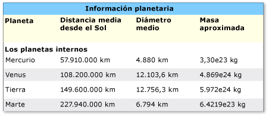
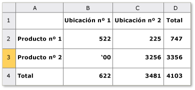

# Implementar el patrón de control Table de UI Automation
> [!NOTE]
> Esta documentación está dirigida a los desarrolladores de .NET Framework que quieran usar las clases [!INCLUDE[TLA2#tla_uiautomation](../../../includes/tla2sharptla-uiautomation-md.md)] administradas definidas en el espacio de nombres <xref:System.Windows.Automation>. Para ver la información más reciente acerca de [!INCLUDE[TLA2#tla_uiautomation](../../../includes/tla2sharptla-uiautomation-md.md)], consulte [Windows Automation API: automatización de la interfaz de usuario](/windows/win32/winauto/entry-uiauto-win32).  
  
 En este tema se presentan las directrices y convenciones para implementar <xref:System.Windows.Automation.Provider.ITableProvider>, incluida la información sobre propiedades, métodos y eventos. Al final de la información general se proporcionan vínculos a referencias adicionales.  
  
 El patrón de control <xref:System.Windows.Automation.TablePattern> se usa para admitir controles que actúen como contenedores para una colección de elementos secundarios. Los elementos secundarios de este elemento deben implementar <xref:System.Windows.Automation.Provider.ITableItemProvider> y organizarse en un sistema de coordenadas lógico bidimensional que se pueda recorrer por filas y columnas. Este patrón de control es análogo a <xref:System.Windows.Automation.Provider.IGridProvider>, con la diferencia de que cualquier control que implemente <xref:System.Windows.Automation.Provider.ITableProvider> también debe exponer una relación de encabezado de columna o fila para cada elemento secundario. Para obtener ejemplos de controles que implementan este patrón de control, vea [Control Pattern Mapping for UI Automation Clients](control-pattern-mapping-for-ui-automation-clients.md).  
  

## Directrices y convenciones de implementación  
 Al implementar el patrón de control Table, tenga en cuenta las siguientes directrices y convenciones:  
  
- El acceso al contenido de celdas individuales se realiza a través de un sistema de coordenadas lógico bidimensional o la matriz ofrecida por la implementación simultánea necesaria de <xref:System.Windows.Automation.Provider.IGridProvider>.  
  
- Un encabezado de columna o fila puede estar dentro de un objeto de tabla o ser un objeto de encabezado independiente asociado a un objeto de tabla.  
  
- Los encabezados de fila y columna pueden incluir tanto un encabezado principal como cualquier encabezado auxiliar.  
  
> [!NOTE]
> Este concepto se hace evidente en una hoja de cálculo de Microsoft Excel donde un usuario ha definido una columna "Nombre". Esta columna tiene ahora dos encabezados: el encabezado "Nombre" definido por el usuario y la designación alfanumérica para esa columna asignada por la aplicación.  
  
- Consulte [Implementación del patrón](implementing-the-ui-automation-grid-control-pattern.md) de control de cuadrícula de automatización de la interfaz de usuario para obtener la funcionalidad de cuadrícula relacionada.  
  
   
Ejemplo de una tabla con encabezados de columna compleja  
  
   
Ejemplo de una tabla con propiedad RowOrColumnMajor ambigua  
  

## Miembros requeridos para ITableProvider  
 Se requieren los siguientes métodos y propiedades para la interfaz de ITableProvider.  
  
|Miembros requeridos|Tipo de miembro|Notas|  
|----------------------|-----------------|-----------|  
|<xref:System.Windows.Automation.Provider.ITableProvider.RowOrColumnMajor%2A>|Propiedad|None|  
|<xref:System.Windows.Automation.Provider.ITableProvider.GetColumnHeaders%2A>|Método|None|  
|<xref:System.Windows.Automation.Provider.ITableProvider.GetRowHeaders%2A>|Método|None|  
  
 Este patrón de control no tiene eventos asociados.  
  

## Excepciones  
 Este patrón de control no tiene excepciones asociadas.  
  
## Consulte también

- [UI Automation Control Patterns Overview](ui-automation-control-patterns-overview.md)
- [Patrones de control compatibles en un proveedor de UI Automation](support-control-patterns-in-a-ui-automation-provider.md)
- [Patrones de controles de UI Automation para clientes](ui-automation-control-patterns-for-clients.md)
- [Implementar el patrón de control TableItem de UI Automation](implementing-the-ui-automation-tableitem-control-pattern.md)
- [Implementar el patrón de control Grid de UI Automation](implementing-the-ui-automation-grid-control-pattern.md)
- [UI Automation Tree Overview](ui-automation-tree-overview.md)
- [Utilizar el almacenamiento en caché en la UI Automation](use-caching-in-ui-automation.md)
