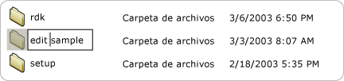
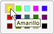

# Implementar el patrón de control Value de UI Automation
> [!NOTE]
> Esta documentación está dirigida a los desarrolladores de .NET Framework que quieran usar las clases [!INCLUDE[TLA2#tla_uiautomation](../../../includes/tla2sharptla-uiautomation-md.md)] administradas definidas en el espacio de nombres <xref:System.Windows.Automation>. Para ver la información más reciente acerca de [!INCLUDE[TLA2#tla_uiautomation](../../../includes/tla2sharptla-uiautomation-md.md)], consulte [Windows Automation API: automatización de la interfaz de usuario](/windows/win32/winauto/entry-uiauto-win32).  
  
 En este tema se presentan las directrices y convenciones para implementar <xref:System.Windows.Automation.Provider.IValueProvider>y se incluye información sobre eventos y propiedades. Al final del tema se ofrecen vínculos a referencias adicionales.  
  
 El patrón de control <xref:System.Windows.Automation.ValuePattern> se utiliza para admitir controles que tienen un valor intrínseco que no abarca un intervalo y que se puede representar como una cadena. Esta cadena puede ser editable, dependiendo del control y su configuración. Para obtener ejemplos de controles que implementan este patrón, vea [Control Pattern Mapping for UI Automation Clients](control-pattern-mapping-for-ui-automation-clients.md).  
  

## Directrices y convenciones de implementación  
 Al implementar el patrón de control Value, tenga en cuenta las siguientes directrices y convenciones:  
  
- Los controles como <xref:System.Windows.Automation.ControlType.ListItem> y <xref:System.Windows.Automation.ControlType.TreeItem> deben admitir <xref:System.Windows.Automation.ValuePattern> si el valor de cualquiera de los elementos es modificable, sin tener en cuenta el modo de edición actual del control. El control primario también debe admitir <xref:System.Windows.Automation.ValuePattern> si los elementos secundarios son modificables.  
  
   
Ejemplo de un elemento de lista modificable  
  
- Los controles de edición de línea única admiten el acceso mediante programación a su contenido a través de la implementación de <xref:System.Windows.Automation.Provider.IValueProvider>. Sin embargo, los controles de edición multilínea no implementan <xref:System.Windows.Automation.Provider.IValueProvider>; en su lugar, proporcionan acceso a su contenido mediante la implementación de <xref:System.Windows.Automation.Provider.ITextProvider>.  
  
- Para recuperar el contenido textual de un control de edición de multilínea, el control debe implementar <xref:System.Windows.Automation.Provider.ITextProvider>. Sin embargo, <xref:System.Windows.Automation.Provider.ITextProvider> no admite establecer el valor de un control.  
  
- <xref:System.Windows.Automation.Provider.IValueProvider> no admite la recuperación de la información de formato ni los valores de subcadenas. Implemente <xref:System.Windows.Automation.Provider.ITextProvider> en estos escenarios.  
  
- <xref:System.Windows.Automation.Provider.IValueProvider>debe implementarse mediante controles, como el control de selección del **selector de colores** de Microsoft Word (se muestra a continuación), que admite la asignación de cadenas entre un valor de color (por ejemplo, "Yellow") y una estructura RGB interna equivalente.  
  
   
Ejemplo de asignación de cadena de muestrario de colores  
  
- Un control debe tener el valor de su <xref:System.Windows.Automation.AutomationElement.IsEnabledProperty> establecido en `true` y el valor de <xref:System.Windows.Automation.ValuePattern.IsReadOnlyProperty> establecido en `false` antes de permitir una llamada a <xref:System.Windows.Automation.Provider.IValueProvider.SetValue%2A>.  
  

## Miembros requeridos para IValueProvider  
 Para implementar <xref:System.Windows.Automation.Provider.IValueProvider>, se requieren las siguientes propiedades y métodos.  
  
|Miembros requeridos|Tipo de miembro|Notas|  
|----------------------|-----------------|-----------|  
|<xref:System.Windows.Automation.ValuePattern.IsReadOnlyProperty>|Propiedad|None|  
|<xref:System.Windows.Automation.ValuePattern.ValueProperty>|Propiedad|None|  
|<xref:System.Windows.Automation.ValuePattern.SetValue%2A>|Método|None|  
  

## Excepciones  
 Los proveedores deben producir las siguientes excepciones.  
  
|Tipo de excepción|Condición|  
|--------------------|---------------|  
|<xref:System.InvalidOperationException>|<xref:System.Windows.Automation.ValuePattern.SetValue%2A>   : Si la información específica de la configuración regional se pasa a un control en un formato incorrecto, como una fecha con formato incorrecto.|  
|<xref:System.ArgumentException>|<xref:System.Windows.Automation.ValuePattern.SetValue%2A>   : Si no se puede convertir un nuevo valor de una cadena a un formato que el control reconozca.|  
|<xref:System.Windows.Automation.ElementNotEnabledException>|<xref:System.Windows.Automation.ValuePattern.SetValue%2A>   : Cuando se realiza un intento de manipular un control que no está habilitado.|  
  
## Vea también

- [Información general acerca de los patrones de control de UI Automation](ui-automation-control-patterns-overview.md)
- [Patrones de control compatibles en un proveedor de UI Automation](support-control-patterns-in-a-ui-automation-provider.md)
- [Patrones de controles de UI Automation para clientes](ui-automation-control-patterns-for-clients.md)
- [ValuePattern insertar ejemplo de texto](https://github.com/Microsoft/WPF-Samples/tree/master/Accessibility/InsertText)
- [Información general sobre el árbol de la UI Automation](ui-automation-tree-overview.md)
- [Utilizar el almacenamiento en caché en la UI Automation](use-caching-in-ui-automation.md)
