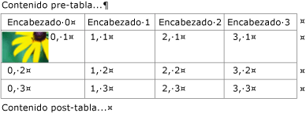
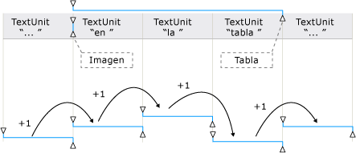
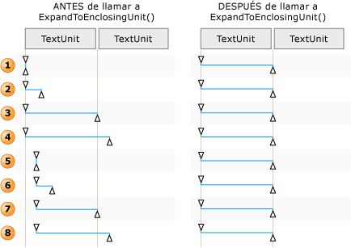

# Información general sobre TextPattern y objetos incrustados
> [!NOTE]
> Esta documentación está dirigida a los desarrolladores de .NET Framework que quieran usar las clases [!INCLUDE[TLA2#tla_uiautomation](../../../includes/tla2sharptla-uiautomation-md.md)] administradas definidas en el espacio de nombres <xref:System.Windows.Automation>. Para ver la información más reciente acerca de [!INCLUDE[TLA2#tla_uiautomation](../../../includes/tla2sharptla-uiautomation-md.md)], consulte [Windows Automation API: automatización de la interfaz de usuario](/windows/win32/winauto/entry-uiauto-win32).  
  
 Esta introducción describe cómo [!INCLUDE[TLA#tla_uiautomation](../../../includes/tlasharptla-uiautomation-md.md)] expone objetos incrustados o elementos secundarios en un contenedor o documento de texto.  
  
 En [!INCLUDE[TLA2#tla_uiautomation](../../../includes/tla2sharptla-uiautomation-md.md)] un objeto incrustado es cualquier elemento que tenga límites no textuales; por ejemplo, una imagen, un hipervínculo, una tabla o un tipo de documento, como una hoja de cálculo de Microsoft Excel o un archivo de Microsoft Windows Media. Esto difiere de la definición estándar, según la cual se crea un elemento en una aplicación y se incrusta o vincula en otra. Si el objeto se puede editar en la aplicación original, es irrelevante en el contexto de [!INCLUDE[TLA2#tla_uiautomation](../../../includes/tla2sharptla-uiautomation-md.md)].  
  

## Objetos incrustados y el árbol de automatización de la interfaz de usuario  
 Los objetos incrustados se tratan como elementos individuales en la vista de control del árbol de [!INCLUDE[TLA2#tla_uiautomation](../../../includes/tla2sharptla-uiautomation-md.md)] . Se exponen como elementos secundarios del contenedor de texto para que resulten accesibles con el mismo modelo que otros controles en [!INCLUDE[TLA2#tla_uiautomation](../../../includes/tla2sharptla-uiautomation-md.md)].  
  
   
Ejemplo de un contenedor de texto con objetos incrustados de tabla, imagen e hipervínculo  
  
   
Ejemplo de la vista de contenido de una parte del contenedor de texto anterior  
  

## Exponer objetos incrustados con TextPattern y TextPatternRange  
 Si se usan de forma conjunta, la clase de patrón de control de <xref:System.Windows.Automation.TextPattern> y la clase <xref:System.Windows.Automation.Text.TextPatternRange> exponen métodos y propiedades que facilitan la navegación y la consulta de los objetos incrustados.  
  
 El contenido textual (o texto interno) de un contenedor de texto y un objeto incrustado, como un hipervínculo o una celda de tabla, se expone como una secuencia de texto continua única en las vistas de control y contenido del árbol de [!INCLUDE[TLA2#tla_uiautomation](../../../includes/tla2sharptla-uiautomation-md.md)] . Los límites del objeto se ignoran. Si un cliente de Automatización de la interfaz de usuario recupera el texto con el objetivo de realizar alguna declaración, interpretarlo o analizarlo de alguna manera, el intervalo de texto se debe comprobar en los casos especiales (por ejemplo, una tabla con contenido textual u otros objetos incrustados). Para ello, puede llamar a <xref:System.Windows.Automation.Text.TextPatternRange.GetChildren%2A> para obtener un <xref:System.Windows.Automation.AutomationElement> para cada objeto incrustado y, a continuación, llamar a <xref:System.Windows.Automation.TextPattern.RangeFromChild%2A> para obtener un intervalo de texto para cada elemento. Esto se realiza recursivamente hasta que se recupera todo el contenido textual.  
  
   
Ejemplo de una secuencia de texto con objetos incrustados y sus intervalos  
  
 Cuando es necesario atravesar el contenido de un intervalo de texto, se realizan en segundo plano una serie de pasos para que el método <xref:System.Windows.Automation.Text.TextPatternRange.Move%2A> pueda ejecutarse correctamente.  
  
1. El intervalo de texto se normaliza, es decir, se contrae, en un intervalo degenerado en el extremo <xref:System.Windows.Automation.Text.TextPatternRangeEndpoint.Start> , y el extremo <xref:System.Windows.Automation.Text.TextPatternRangeEndpoint.End> queda superfluo. Este paso es necesario para eliminar la ambigüedad en situaciones donde un intervalo de texto abarca <xref:System.Windows.Automation.Text.TextUnit> límites: por ejemplo, `{The URL https://www.microsoft.com is embedded in text` "{" y "}" son los extremos del intervalo de texto.  
  
2. El intervalo resultante se mueve hacia atrás en <xref:System.Windows.Automation.TextPattern.DocumentRange%2A> , al principio del límite <xref:System.Windows.Automation.Text.TextUnit> solicitado.  
  
3. El intervalo resultante se mueve hacia delante o hacia atrás en <xref:System.Windows.Automation.TextPattern.DocumentRange%2A> , en función del número solicitado de límites <xref:System.Windows.Automation.Text.TextUnit> .  
  
4. A continuación, el intervalo se expande desde un estado de intervalo degenerado moviendo el extremo <xref:System.Windows.Automation.Text.TextPatternRangeEndpoint.End> en función de un límite <xref:System.Windows.Automation.Text.TextUnit> solicitado.  
  
   
Ejemplos de cómo se ajusta un intervalo de texto para Move() y ExpandToEnclosingUnit()  
  

## Escenarios comunes  
 Las secciones siguientes muestran ejemplos de los escenarios más comunes que incluyen objetos incrustados.  
  
 Leyenda para los ejemplos que se muestran:  
  
 { = <xref:System.Windows.Automation.Text.TextPatternRangeEndpoint.Start>  
  
 } = <xref:System.Windows.Automation.Text.TextPatternRangeEndpoint.End>  
  
### Hyperlink  

**Ejemplo 1: intervalo de texto que contiene un hipervínculo de texto incrustado**
  
`{The URL https://www.microsoft.com is embedded in text}.`
  
|Método al que se llama|Resultado|  
|-------------------|------------|  
|<xref:System.Windows.Automation.Text.TextPatternRange.GetText%2A>|Devuelve la cadena `The URL https://www.microsoft.com is embedded in text`.|  
|<xref:System.Windows.Automation.Text.TextPatternRange.GetEnclosingElement%2A>|Devuelve el elemento <xref:System.Windows.Automation.AutomationElement> más interno que incluye el intervalo de texto (en este caso, el elemento <xref:System.Windows.Automation.AutomationElement> que representa al propio proveedor de texto).|  
|<xref:System.Windows.Automation.Text.TextPatternRange.GetChildren%2A>|Devuelve un elemento <xref:System.Windows.Automation.AutomationElement> que representa el control de hipervínculo.|  
|<xref:System.Windows.Automation.TextPattern.RangeFromChild%2A> , donde <xref:System.Windows.Automation.AutomationElement> es el objeto que ha devuelto el método `GetChildren` anterior.|Devuelve el intervalo que representa `https://www.microsoft.com` .|  
  
 **Ejemplo 2: intervalo de texto que se extiende parcialmente por un hipervínculo de texto incrustado**  
  
 La dirección URL `https://{[www]}` está incrustada en el texto.  
  
|Método al que se llama|Resultado|  
|-------------------|------------|  
|<xref:System.Windows.Automation.Text.TextPatternRange.GetText%2A>|Devuelve la cadena "www".|  
|<xref:System.Windows.Automation.Text.TextPatternRange.GetEnclosingElement%2A>|Devuelve el elemento <xref:System.Windows.Automation.AutomationElement> más interno que incluye el intervalo de texto (en este caso, el control de hipervínculo).|  
|<xref:System.Windows.Automation.Text.TextPatternRange.GetChildren%2A>|Devuelve `null` , ya que el intervalo de texto no se extiende por toda la cadena de dirección URL.|  
  
**Ejemplo 3: intervalo de texto que se extiende parcialmente por el contenido de un contenedor de texto. El contenedor de texto tiene un hipervínculo de texto incrustado que no forma parte del intervalo de texto.**  
  
`{The URL} [https://www.microsoft.com](https://www.microsoft.com) is embedded in text.`
  
|Método al que se llama|Resultado|  
|-------------------|------------|  
|<xref:System.Windows.Automation.Text.TextPatternRange.GetText%2A>|Devuelve la cadena "La dirección URL".|  
|<xref:System.Windows.Automation.Text.TextPatternRange.GetEnclosingElement%2A>|Devuelve el elemento <xref:System.Windows.Automation.AutomationElement> más interno que incluye el intervalo de texto (en este caso, el elemento <xref:System.Windows.Automation.AutomationElement> que representa al propio proveedor de texto).|  
|<xref:System.Windows.Automation.Text.TextPatternRange.Move%2A> con parámetros de (TextUnit.Word, 1).|Mueve el intervalo de texto a "http", ya que el texto del hipervínculo se compone de palabras individuales. En este caso, el hipervínculo no se considera un único objeto.   La dirección URL {[http]} está incrustada en el texto.|  
  

### Imagen  
 **Ejemplo 1: intervalo de texto que contiene una imagen incrustada**  
  
 {El ejemplo de imagen  de imagen está incrustado en el texto}.  
  
|Método al que se llama|Resultado|  
|-------------------|------------|  
|<xref:System.Windows.Automation.Text.TextPatternRange.GetText%2A>|Devuelve la cadena "La está incrustada en el texto". No se puede esperar que se incluya en la secuencia de texto el texto alternativo asociado con la imagen.|  
|<xref:System.Windows.Automation.Text.TextPatternRange.GetEnclosingElement%2A>|Devuelve el elemento <xref:System.Windows.Automation.AutomationElement> más interno que incluye el intervalo de texto (en este caso, el elemento <xref:System.Windows.Automation.AutomationElement> que representa al propio proveedor de texto).|  
|<xref:System.Windows.Automation.Text.TextPatternRange.GetChildren%2A>|Devuelve un elemento <xref:System.Windows.Automation.AutomationElement> que representa el control de imagen.|  
|<xref:System.Windows.Automation.TextPattern.RangeFromChild%2A> , donde <xref:System.Windows.Automation.AutomationElement> es el objeto que ha devuelto el método <xref:System.Windows.Automation.Text.TextPatternRange.GetChildren%2A> anterior.|Devuelve el intervalo degenerado que representa "".|  
  
 **Ejemplo 2: intervalo de texto que se extiende parcialmente por el contenido de un contenedor de texto. El contenedor de texto tiene una imagen incrustada que no forma parte del intervalo de texto.**  
  
 {La imagen} El  se incrusta en el texto.  
  
|Método al que se llama|Resultado|  
|-------------------|------------|  
|<xref:System.Windows.Automation.Text.TextPatternRange.GetText%2A>|Devuelve la cadena "La imagen".|  
|<xref:System.Windows.Automation.Text.TextPatternRange.GetEnclosingElement%2A>|Devuelve el elemento <xref:System.Windows.Automation.AutomationElement> más interno que incluye el intervalo de texto (en este caso, el elemento <xref:System.Windows.Automation.AutomationElement> que representa al propio proveedor de texto).|  
|<xref:System.Windows.Automation.Text.TextPatternRange.Move%2A> con parámetros de (TextUnit.Word, 1).|Mueve el intervalo de texto a "está". Dado que solo se consideran parte de la secuencia de texto los objetos incrustados basados en texto, la imagen de este ejemplo no afecta a Move ni al valor que devuelve (en este caso, 1).|  
  

### Tabla  
  
### Tabla que se ha usado en los ejemplos:  
  
|Celda con imagen|Celda con texto|  
|---------------------|--------------------|  
||X|  
||Y|  
|   Imagen para Z|Z|  
  
 **Ejemplo 1: obtener el contenedor de texto del contenido de una celda.**  
  
|Método al que se llama|Resultado|  
|-------------------|------------|  
|<xref:System.Windows.Automation.GridPattern.GetItem%2A> con parámetros (0,0)|Devuelve el elemento <xref:System.Windows.Automation.AutomationElement> que representa el contenido de la celda de tabla (en este caso, el elemento es un control de texto).|  
|<xref:System.Windows.Automation.TextPattern.RangeFromChild%2A> , donde <xref:System.Windows.Automation.AutomationElement> es el objeto que ha devuelto el método `GetItem` anterior.|Devuelve el intervalo que abarca el ejemplo de de imagen.|  
|<xref:System.Windows.Automation.Text.TextPatternRange.GetEnclosingElement%2A> para el objeto que ha devuelto el método `RangeFromChild` anterior.|Devuelve el elemento <xref:System.Windows.Automation.AutomationElement> que representa la celda de tabla (en este caso, el elemento es un control de texto que admite TableItemPattern).|  
|<xref:System.Windows.Automation.Text.TextPatternRange.GetEnclosingElement%2A> para el objeto que ha devuelto el método `GetEnclosingElement` anterior.|Devuelve el elemento <xref:System.Windows.Automation.AutomationElement> que representa la tabla.|  
|<xref:System.Windows.Automation.Text.TextPatternRange.GetEnclosingElement%2A> para el objeto que ha devuelto el método `GetEnclosingElement` anterior.|Devuelve el elemento <xref:System.Windows.Automation.AutomationElement> que representa al propio proveedor de texto.|  
  
 **Ejemplo 2: obtener el contenido de texto de una celda.**  
  
|Método al que se llama|Resultado|  
|-------------------|------------|  
|<xref:System.Windows.Automation.GridPattern.GetItem%2A> con parámetros de (1,1).|Devuelve el elemento <xref:System.Windows.Automation.AutomationElement> que representa el contenido de la celda de tabla (en este caso, el elemento es un control de texto).|  
|<xref:System.Windows.Automation.TextPattern.RangeFromChild%2A> , donde <xref:System.Windows.Automation.AutomationElement> es el objeto que ha devuelto el método `GetItem` anterior.|Devuelve "Y".|  
  
## Consulta también

- <xref:System.Windows.Automation.TextPattern>
- <xref:System.Windows.Automation.Text.TextPatternRange>
- <xref:System.Windows.Automation.Provider.ITextProvider>
- <xref:System.Windows.Automation.Provider.ITextRangeProvider>
- [Acceso a objetos incrustados mediante la UI Automation](access-embedded-objects-using-ui-automation.md)
- [Exponer el contenido de una tabla mediante UI Automation](expose-the-content-of-a-table-using-ui-automation.md)
- [Recorrer texto mediante usando UI Automation](traverse-text-using-ui-automation.md)
- [Ejemplo de búsqueda y selección de TextPattern](https://github.com/Microsoft/WPF-Samples/tree/master/Accessibility/FindText)
