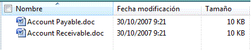

# Compatibilidad de UI Automation para el tipo de control DataGridUI Automation Support for the DataGrid Control Type

> [!NOTE]
> Esta documentación está dirigida a los desarrolladores de .NET Framework que quieran usar las clases [!INCLUDE[TLA2#tla_uiautomation](../../../includes/tla2sharptla-uiautomation-md.md)] administradas definidas en el espacio de nombres <xref:System.Windows.Automation>.This documentation is intended for .NET Framework developers who want to use the managed [!INCLUDE[TLA2#tla_uiautomation](../../../includes/tla2sharptla-uiautomation-md.md)] classes defined in the <xref:System.Windows.Automation> namespace. Para ver la información más reciente acerca de [!INCLUDE[TLA2#tla_uiautomation](../../../includes/tla2sharptla-uiautomation-md.md)], consulte [Windows Automation API: automatización de la interfaz de usuario](/windows/win32/winauto/entry-uiauto-win32).For the latest information about [!INCLUDE[TLA2#tla_uiautomation](../../../includes/tla2sharptla-uiautomation-md.md)], see [Windows Automation API: UI Automation](/windows/win32/winauto/entry-uiauto-win32).  
  
 En este tema se ofrece información sobre la compatibilidad de [!INCLUDE[TLA#tla_uiautomation](../../../includes/tlasharptla-uiautomation-md.md)] con el tipo de control DataGrid.This topic provides information about [!INCLUDE[TLA#tla_uiautomation](../../../includes/tlasharptla-uiautomation-md.md)] support for the DataGrid control type. En [!INCLUDE[TLA2#tla_uiautomation](../../../includes/tla2sharptla-uiautomation-md.md)], un tipo de control es un conjunto de condiciones que un control debe cumplir para poder usar la propiedad `ControlType` .In [!INCLUDE[TLA2#tla_uiautomation](../../../includes/tla2sharptla-uiautomation-md.md)], a control type is a set of conditions that a control must meet in order to use the `ControlType` property. En las condiciones se incluyen instrucciones específicas para la estructura de árbol de [!INCLUDE[TLA2#tla_uiautomation](../../../includes/tla2sharptla-uiautomation-md.md)] , los patrones de control y los valores de propiedad de [!INCLUDE[TLA2#tla_uiautomation](../../../includes/tla2sharptla-uiautomation-md.md)] .The conditions include specific guidelines for [!INCLUDE[TLA2#tla_uiautomation](../../../includes/tla2sharptla-uiautomation-md.md)] tree structure, [!INCLUDE[TLA2#tla_uiautomation](../../../includes/tla2sharptla-uiautomation-md.md)] property values and control patterns.  
  
 El tipo de control DataGrid permite a un usuario trabajar fácilmente con elementos que contienen metadatos representados en columnas.The DataGrid control type lets a user easily work with items that contain metadata represented in columns. Los controles de cuadrícula de datos tienen filas de elementos y columnas de información sobre esos elementos.Data grid controls have rows of items and columns of information about those items. Un control List View en Microsoft Vista Explorer es un ejemplo que admite el tipo de control DataGrid.A List View control in Microsoft Vista Explorer is an example that supports the DataGrid control type.  
  
 En las secciones siguientes se definen la estructura del árbol de [!INCLUDE[TLA2#tla_uiautomation](../../../includes/tla2sharptla-uiautomation-md.md)] , las propiedades, los patrones de control y los eventos necesarios para el tipo de control DataGrid.The following sections define the required [!INCLUDE[TLA2#tla_uiautomation](../../../includes/tla2sharptla-uiautomation-md.md)] tree structure, properties, control patterns, and events for the DataGrid control type. Los [!INCLUDE[TLA2#tla_uiautomation](../../../includes/tla2sharptla-uiautomation-md.md)] requisitos de se aplican a todos los controles de cuadrícula de datos, ya sean [!INCLUDE[TLA#tla_winclient](../../../includes/tlasharptla-winclient-md.md)] , Win32 o Windows Forms.The [!INCLUDE[TLA2#tla_uiautomation](../../../includes/tla2sharptla-uiautomation-md.md)] requirements apply to all data grid controls, whether [!INCLUDE[TLA#tla_winclient](../../../includes/tlasharptla-winclient-md.md)], Win32, or Windows Forms.  
  
## Estructura de árbol de Automatización de la interfaz de usuario necesariaRequired UI Automation Tree Structure  

 En la tabla siguiente se detallan la vista de control y la vista de contenido del árbol [!INCLUDE[TLA2#tla_uiautomation](../../../includes/tla2sharptla-uiautomation-md.md)] que pertenece a los controles de cuadrícula de datos y se describe lo que puede incluirse en cada vista.The following table depicts the control view and the content view of the [!INCLUDE[TLA2#tla_uiautomation](../../../includes/tla2sharptla-uiautomation-md.md)] tree that pertains to data grid controls and describes what can be contained in each view. Para más información sobre el árbol de [!INCLUDE[TLA2#tla_uiautomation](../../../includes/tla2sharptla-uiautomation-md.md)] , vea [UI Automation Tree Overview](ui-automation-tree-overview.md).For more information about the [!INCLUDE[TLA2#tla_uiautomation](../../../includes/tla2sharptla-uiautomation-md.md)] tree, see [UI Automation Tree Overview](ui-automation-tree-overview.md).  
  
|Árbol de[!INCLUDE[TLA2#tla_uiautomation](../../../includes/tla2sharptla-uiautomation-md.md)] : vista de control[!INCLUDE[TLA2#tla_uiautomation](../../../includes/tla2sharptla-uiautomation-md.md)] Tree - Control View|Árbol de[!INCLUDE[TLA2#tla_uiautomation](../../../includes/tla2sharptla-uiautomation-md.md)] : vista de contenido[!INCLUDE[TLA2#tla_uiautomation](../../../includes/tla2sharptla-uiautomation-md.md)] Tree - Content View|  
|------------------------------------------------------------------------------------------------|------------------------------------------------------------------------------------------------|  
|DataGridDataGrid   <ul><li>Header (0, 1 o 2)Header (0, 1, or 2)   <ul><li>HeaderItem (número de columnas o filas)HeaderItem (number of columns or rows)</li></ul></li><li>DataItem (0 o más; se puede estructurar en jerarquía)DataItem (0 or more; can be structured in hierarchy)</li></ul>|DataGridDataGrid   -DataItem (0 o más; se puede estructurar en la jerarquía)-   DataItem (0 or more; can be structured in hierarchy)|  
  

## Propiedades de Automatización de la interfaz de usuario necesariasRequired UI Automation Properties  

 En la tabla siguiente se muestran las propiedades que tienen un valor o una definición que es especialmente relevante para los controles de cuadrícula de datos.The following table lists the properties whose value or definition is especially relevant to data grid controls. Para obtener más información sobre [!INCLUDE[TLA2#tla_uiautomation](../../../includes/tla2sharptla-uiautomation-md.md)] las propiedades, vea [UI Automation Properties for clients](ui-automation-properties-for-clients.md).For more information on [!INCLUDE[TLA2#tla_uiautomation](../../../includes/tla2sharptla-uiautomation-md.md)] properties, see [UI Automation Properties for Clients](ui-automation-properties-for-clients.md).  
  
|PropiedadProperty|ValorValue|NotasNotes|  
|--------------|-----------|-----------|  
|<xref:System.Windows.Automation.AutomationElementIdentifiers.AutomationIdProperty>|Vea las notas.See notes.|El valor de esta propiedad debe ser único en todos los controles de una aplicación.The value of this property needs to be unique across all controls in an application.|  
|<xref:System.Windows.Automation.AutomationElementIdentifiers.BoundingRectangleProperty>|Vea las notas.See notes.|El rectángulo exterior que contiene el control completo.The outermost rectangle that contains the whole control.|  
|<xref:System.Windows.Automation.AutomationElementIdentifiers.ClickablePointProperty>|Vea las notas.See notes.|Se admite si hay un rectángulo delimitador.Supported if there is a bounding rectangle. Si no todos los puntos que se encuentran dentro del rectángulo delimitador son seleccionables, y realiza pruebas de aciertos especializadas, invalide y ofrezca un punto en el que hacer clic.If not every point within the bounding rectangle is clickable, and you perform specialized hit testing, then override and provide a clickable point.|  
|<xref:System.Windows.Automation.AutomationElementIdentifiers.ControlTypeProperty>|DataGridDataGrid|Este valor es el mismo para todos los marcos de trabajo de la interfaz de usuario.This value is the same for all UI frameworks.|  
|<xref:System.Windows.Automation.AutomationElementIdentifiers.IsContentElementProperty>|TrueTrue|El valor de esta propiedad siempre debe ser True.The value of this property must always be True. Esto significa que el control de cuadrícula de datos siempre debe estar en la vista de contenido del árbol de [!INCLUDE[TLA2#tla_uiautomation](../../../includes/tla2sharptla-uiautomation-md.md)] .This means that the data grid control must always be in the content view of the [!INCLUDE[TLA2#tla_uiautomation](../../../includes/tla2sharptla-uiautomation-md.md)] tree.|  
|<xref:System.Windows.Automation.AutomationElementIdentifiers.IsControlElementProperty>|TrueTrue|El valor de esta propiedad siempre debe ser True.The value of this property must always be True. Esto significa que el control de cuadrícula de datos siempre debe estar en la vista de control del árbol de [!INCLUDE[TLA2#tla_uiautomation](../../../includes/tla2sharptla-uiautomation-md.md)] .This means that the data grid control must always be in the control view of the [!INCLUDE[TLA2#tla_uiautomation](../../../includes/tla2sharptla-uiautomation-md.md)] tree.|  
|<xref:System.Windows.Automation.AutomationElementIdentifiers.IsKeyboardFocusableProperty>|Vea las notas.See notes.|Si el control puede recibir el foco del teclado, debe admitir esta propiedad.If the control can receive keyboard focus, it must support this property.|  
|<xref:System.Windows.Automation.AutomationElementIdentifiers.LabeledByProperty>|Vea las notas.See notes.|Si hay una etiqueta de texto estático, esta propiedad debe exponer una referencia a ese control.If there is a static text label then this property must expose a reference to that control.|  
|<xref:System.Windows.Automation.AutomationElementIdentifiers.LocalizedControlTypeProperty>|"cuadrícula de datos""data grid"|Cadena localizada que corresponde al tipo de control DataGrid.Localized string corresponding to the DataGrid control type.|  
|<xref:System.Windows.Automation.AutomationElementIdentifiers.NameProperty>|Vea las notas.See notes.|El control de cuadrícula de datos normalmente obtiene el valor de su propiedad `Name` de una etiqueta de texto estático.The data grid control typically gets the value for its `Name` property from a static text label. Si no hay una etiqueta de texto estático, un desarrollador de aplicaciones debe asignar un valor a la propiedad `Name` .If there is not a static text label an application developer must assign a value to for the `Name` property. El valor de la propiedad `Name` nunca debe ser el contenido textual del control de edición.The value of the `Name` property must never be the textual contents of the edit control.|  
  
## Patrones de control de Automatización de la interfaz de usuario necesariosRequired UI Automation Control Patterns  

 En la tabla siguiente se muestran los patrones de control de necesarios para que todos los controles de cuadrícula de datos los admitan.The following table lists the control patterns required to be supported by all data grid controls. Para más información sobre los patrones de control, vea [UI Automation Control Patterns Overview](ui-automation-control-patterns-overview.md).For more information about control patterns, see [UI Automation Control Patterns Overview](ui-automation-control-patterns-overview.md).  
  
|Patrón de controlControl Pattern|Soporte técnicoSupport|NotasNotes|  
|---------------------|-------------|-----------|  
|<xref:System.Windows.Automation.Provider.IGridProvider>|SíYes|El propio control de cuadrícula de datos siempre admite el patrón de control Grid porque los elementos que contiene incluyen metadatos que se presentan en una cuadrícula.The data grid control itself always supports the Grid control pattern because the items that it contains metadata that is laid out in a grid.|  
|<xref:System.Windows.Automation.Provider.IScrollProvider>|DependeDepends|La capacidad de desplazar la cuadrícula de datos depende del contenido y de si las barras de desplazamiento están presentes.The ability to scroll the data grid depends on content and whether scroll bars are present.|  
|<xref:System.Windows.Automation.Provider.ISelectionProvider>|DependeDepends|La capacidad de seleccionar la cuadrícula de datos depende del contenido.The ability to select the data grid depends on content.|  
|<xref:System.Windows.Automation.Provider.ITableProvider>|YesYes|El control de cuadrícula de datos siempre tiene un encabezado dentro de su subárbol, por lo que se debe admitir el patrón de control Table.The data grid control always has a header within its subtree so the Table control pattern must be supported.|  
  
 Los elementos de datos dentro de los contenedores de la cuadrícula de datos admitirán como mínimo:Data items within the data grid containers will support at a minimum:  
  
- El patrón de control Selection Item (si la cuadrícula de datos es seleccionable)Selection Item control pattern (if the data grid is selectable)  
  
- El patrón de control Scroll Item (si la cuadrícula de datos es desplazable)Scroll Item control pattern (if the data grid is scrollable)  
  
- El patrón de control Table ItemGrid Item control pattern  
  
- Table Item (patrón de control)Table Item control pattern  
  

## Eventos de Automatización de la interfaz de usuario necesariosRequired UI Automation Events  

 En la siguiente tabla se muestran los eventos de [!INCLUDE[TLA2#tla_uiautomation](../../../includes/tla2sharptla-uiautomation-md.md)] que deben admitir todos los controles de cuadrícula de datos.The following table lists the [!INCLUDE[TLA2#tla_uiautomation](../../../includes/tla2sharptla-uiautomation-md.md)] events required to be supported by all data grid controls. Para más información sobre eventos, vea [UI Automation Events Overview](ui-automation-events-overview.md).For more information about events, see [UI Automation Events Overview](ui-automation-events-overview.md).  
  
|o[!INCLUDE[TLA2#tla_uiautomation](../../../includes/tla2sharptla-uiautomation-md.md)][!INCLUDE[TLA2#tla_uiautomation](../../../includes/tla2sharptla-uiautomation-md.md)] Event|Soporte técnicoSupport|NotasNotes|  
|---------------------------------------------------------------------------------|-------------|-----------|  
|<xref:System.Windows.Automation.AutomationElementIdentifiers.AutomationFocusChangedEvent>|ObligatorioRequired|NoneNone|  
|Evento cambiado por propiedad<xref:System.Windows.Automation.AutomationElementIdentifiers.BoundingRectangleProperty> .<xref:System.Windows.Automation.AutomationElementIdentifiers.BoundingRectangleProperty> property-changed event.|RequeridoRequired|NoneNone|  
|Evento cambiado por propiedad<xref:System.Windows.Automation.AutomationElementIdentifiers.IsEnabledProperty> .<xref:System.Windows.Automation.AutomationElementIdentifiers.IsEnabledProperty> property-changed event.|RequeridoRequired|NoneNone|  
|Evento cambiado por propiedad<xref:System.Windows.Automation.AutomationElementIdentifiers.IsOffscreenProperty> .<xref:System.Windows.Automation.AutomationElementIdentifiers.IsOffscreenProperty> property-changed event.|RequeridoRequired|NoneNone|  
|<xref:System.Windows.Automation.AutomationElementIdentifiers.LayoutInvalidatedEvent>|DependeDepends|NoneNone|  
|<xref:System.Windows.Automation.AutomationElementIdentifiers.StructureChangedEvent>|ObligatorioRequired|NoneNone|  
|Evento cambiado por propiedad<xref:System.Windows.Automation.MultipleViewPatternIdentifiers.CurrentViewProperty> .<xref:System.Windows.Automation.MultipleViewPatternIdentifiers.CurrentViewProperty> property-changed event.|DependeDepends|NoneNone|  
|Evento cambiado por propiedad<xref:System.Windows.Automation.ScrollPatternIdentifiers.HorizontallyScrollableProperty> .<xref:System.Windows.Automation.ScrollPatternIdentifiers.HorizontallyScrollableProperty> property-changed event.|DependeDepends|Si el control admite el patrón Scroll, debe admitir este evento.If the control supports the Scroll pattern, it must support this event.|  
|Evento cambiado por propiedad<xref:System.Windows.Automation.ScrollPatternIdentifiers.HorizontalScrollPercentProperty> .<xref:System.Windows.Automation.ScrollPatternIdentifiers.HorizontalScrollPercentProperty> property-changed event.|DependeDepends|Si el control admite el patrón Scroll, debe admitir este evento.If the control supports the Scroll pattern, it must support this event.|  
|Evento cambiado por propiedad<xref:System.Windows.Automation.ScrollPatternIdentifiers.HorizontalViewSizeProperty> .<xref:System.Windows.Automation.ScrollPatternIdentifiers.HorizontalViewSizeProperty> property-changed event.|DependeDepends|Si el control admite el patrón Scroll, debe admitir este evento.If the control supports the Scroll pattern, it must support this event.|  
|Evento cambiado por propiedad<xref:System.Windows.Automation.ScrollPatternIdentifiers.VerticalScrollPercentProperty> .<xref:System.Windows.Automation.ScrollPatternIdentifiers.VerticalScrollPercentProperty> property-changed event.|DependeDepends|Si el control admite el patrón Scroll, debe admitir este evento.If the control supports the Scroll pattern, it must support this event.|  
|Evento cambiado por propiedad<xref:System.Windows.Automation.ScrollPatternIdentifiers.VerticallyScrollableProperty> .<xref:System.Windows.Automation.ScrollPatternIdentifiers.VerticallyScrollableProperty> property-changed event.|DependeDepends|Si el control admite el patrón Scroll, debe admitir este evento.If the control supports the Scroll pattern, it must support this event.|  
|Evento cambiado por propiedad<xref:System.Windows.Automation.ScrollPatternIdentifiers.VerticalViewSizeProperty> .<xref:System.Windows.Automation.ScrollPatternIdentifiers.VerticalViewSizeProperty> property-changed event.|DependeDepends|Si el control admite el patrón Scroll, debe admitir este evento.If the control supports the Scroll pattern, it must support this event.|  
|<xref:System.Windows.Automation.SelectionPatternIdentifiers.InvalidatedEvent>|RequeridoRequired|NoneNone|  
  
## Ejemplo de tipo de control Date GridDate Grid Control Type Example  

 En la imagen siguiente se muestra un control List View que implementa el tipo de control DataGrid.The following image illustrates a List View control that implements the DataGrid control type.  
  
   
  
 Las vistas de control y de contenido del árbol de [!INCLUDE[TLA2#tla_uiautomation](../../../includes/tla2sharptla-uiautomation-md.md)] que pertenece al control List View se muestran a continuación.The control view and the content view of the [!INCLUDE[TLA2#tla_uiautomation](../../../includes/tla2sharptla-uiautomation-md.md)] tree that pertains to the List View control is displayed below. Los patrones de control de cada elemento de automatización se muestran entre paréntesis.The control patterns for each automation element are shown in parentheses.  
  
|Árbol de[!INCLUDE[TLA2#tla_uiautomation](../../../includes/tla2sharptla-uiautomation-md.md)] : vista de control[!INCLUDE[TLA2#tla_uiautomation](../../../includes/tla2sharptla-uiautomation-md.md)] Tree - Control View|Árbol de[!INCLUDE[TLA2#tla_uiautomation](../../../includes/tla2sharptla-uiautomation-md.md)] : vista de contenido[!INCLUDE[TLA2#tla_uiautomation](../../../includes/tla2sharptla-uiautomation-md.md)] Tree - Content View|  
|------------------------------------------------------------------------------------------------|------------------------------------------------------------------------------------------------|  
|<ul><li>DataGrid (Table, Grid, Selection)DataGrid (Table, Grid, Selection)</li><li>EncabezadoHeader   <ul><li>HeaderItem "Name" (Invoke)HeaderItem "Name" (Invoke)</li><li>HeaderItem "Date Modified" (Invoke)HeaderItem "Date Modified" (Invoke)</li><li>HeaderItem "Size" (Invoke)HeaderItem "Size" (Invoke)</li></ul></li><li>Grupo "Contoso" (TableItem, GridItem, SelectionItem, Table \*, Grid \* )Group "Contoso" (TableItem, GridItem, SelectionItem, Table\*, Grid\*)   <ul><li>DataItem "accounts Receivable.doc" (SelectionItem, Invoke, TableItem \* , GridItem \* )DataItem "Accounts Receivable.doc" (SelectionItem, Invoke, TableItem\*, GridItem\*)</li><li>DataItem "accounts Payable.doc" (SelectionItem, Invoke, TableItem \* , GridItem \* )DataItem "Accounts Payable.doc" (SelectionItem, Invoke, TableItem\*, GridItem\*)</li></ul></li></ul>|<ul><li>DataGrid (Table, Grid, Selection)DataGrid (Table, Grid, Selection)</li><li>Grupo "Contoso" (TableItem, GridItem, SelectionItem, Table \*, Grid \* )Group "Contoso" (TableItem, GridItem, SelectionItem, Table\*, Grid\*)   <ul><li>DataItem "accounts Receivable.doc" (SelectionItem, Invoke, TableItem \* , GridItem \* )DataItem "Accounts Receivable.doc" (SelectionItem, Invoke, TableItem\*, GridItem\*)</li><li>DataItem "accounts Payable.doc" (SelectionItem, Invoke, TableItem \* , GridItem \* )DataItem "Accounts Payable.doc" (SelectionItem, Invoke, TableItem\*, GridItem\*)</li></ul></li></ul>|  
  
 \* En el ejemplo anterior se muestra un control DataGrid que contiene varios niveles de controles.\* The previous example shows a DataGrid that contains multiple levels of controls. El control Group ("Contoso") contiene dos controles DataItem ("Accounts Receivable.doc" y "Accounts Payable.doc").The Group ("Contoso") control contains two DataItem controls ("Accounts Receivable.doc" and "Accounts Payable.doc"). Un par de controles DataGrid/GridItem es independiente de un par en otro nivel.A DataGrid/GridItem pair is independent of a pair at another level. Los controles DataItem de un elemento Group también se pueden exponer como un tipo de control ListItem, lo que permite que se presenten más claramente como objetos seleccionables, en lugar de como elementos de datos simples.The DataItem controls under a Group can also be exposed as a ListItem control type, enabling them to be presented more clearly as selectable objects, rather than as simple data elements. En este ejemplo no se incluyen los subelementos de los elementos de datos agrupados.This example does not include the sub-elements of the grouped data items.  
  
## Vea tambiénSee also

- <xref:System.Windows.Automation.ControlType.DataGrid>
- [Información general sobre tipos de control de UI AutomationUI Automation Control Types Overview](ui-automation-control-types-overview.md)
- [Información general sobre UI AutomationUI Automation Overview](ui-automation-overview.md)
