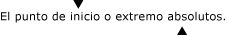

# Información general sobre el modelo de texto de UI AutomationUI Automation TextPattern Overview

> [!NOTE]
> Esta documentación está dirigida a los desarrolladores de .NET Framework que quieran usar las clases [!INCLUDE[TLA2#tla_uiautomation](../../../includes/tla2sharptla-uiautomation-md.md)] administradas definidas en el espacio de nombres <xref:System.Windows.Automation>.This documentation is intended for .NET Framework developers who want to use the managed [!INCLUDE[TLA2#tla_uiautomation](../../../includes/tla2sharptla-uiautomation-md.md)] classes defined in the <xref:System.Windows.Automation> namespace. Para ver la información más reciente acerca de [!INCLUDE[TLA2#tla_uiautomation](../../../includes/tla2sharptla-uiautomation-md.md)], consulte [Windows Automation API: automatización de la interfaz de usuario](/windows/win32/winauto/entry-uiauto-win32).For the latest information about [!INCLUDE[TLA2#tla_uiautomation](../../../includes/tla2sharptla-uiautomation-md.md)], see [Windows Automation API: UI Automation](/windows/win32/winauto/entry-uiauto-win32).

Esta información general describe cómo usar [!INCLUDE[TLA#tla_uiautomation](../../../includes/tlasharptla-uiautomation-md.md)] para exponer el contenido textual, incluidos los atributos de estilo y formato, de los controles de texto en plataformas compatibles con [!INCLUDE[TLA2#tla_uiautomation](../../../includes/tla2sharptla-uiautomation-md.md)].This overview describes how to use [!INCLUDE[TLA#tla_uiautomation](../../../includes/tlasharptla-uiautomation-md.md)] to expose the textual content, including format and style attributes, of text controls in [!INCLUDE[TLA2#tla_uiautomation](../../../includes/tla2sharptla-uiautomation-md.md)]-supported platforms. Estos controles incluyen, entre otros, el marco de Microsoft .NET y, <xref:System.Windows.Controls.TextBox> así <xref:System.Windows.Controls.RichTextBox> como sus equivalentes de Win32.These controls include, but are not limited to, the Microsoft .NET Framework <xref:System.Windows.Controls.TextBox> and <xref:System.Windows.Controls.RichTextBox> as well as their Win32 equivalents.

Exponer el contenido textual de un control se logra mediante el uso del patrón de control <xref:System.Windows.Automation.TextPattern> , que representa el contenido de un contenedor de texto como una secuencia de texto.Exposing the textual content of a control is accomplished through the use of the <xref:System.Windows.Automation.TextPattern> control pattern, which represents the contents of a text container as a text stream. A su vez, <xref:System.Windows.Automation.TextPattern> requiere el soporte de la clase <xref:System.Windows.Automation.Text.TextPatternRange> para exponer atributos de formato y estilo.In turn, <xref:System.Windows.Automation.TextPattern> requires the support of the <xref:System.Windows.Automation.Text.TextPatternRange> class to expose format and style attributes. <xref:System.Windows.Automation.Text.TextPatternRange> da soporte a <xref:System.Windows.Automation.TextPattern> mediante la representación de intervalos de texto contiguos, múltiples o no contiguos en un contenedor de texto con una colección de extremos <xref:System.Windows.Automation.Text.TextPatternRangeEndpoint.Start> y <xref:System.Windows.Automation.Text.TextPatternRangeEndpoint.End> .<xref:System.Windows.Automation.Text.TextPatternRange> supports <xref:System.Windows.Automation.TextPattern> by representing contiguous or multiple, disjoint text spans in a text container with a collection of <xref:System.Windows.Automation.Text.TextPatternRangeEndpoint.Start> and <xref:System.Windows.Automation.Text.TextPatternRangeEndpoint.End> endpoints. <xref:System.Windows.Automation.Text.TextPatternRange> admite la funcionalidad como selección, comparación, recuperación y exploración transversal.<xref:System.Windows.Automation.Text.TextPatternRange> supports functionality such as selection, comparison, retrieval and traversal.

> [!NOTE]
> Las clase <xref:System.Windows.Automation.TextPattern> no proporcionan un medio para insertar o modificar texto.The <xref:System.Windows.Automation.TextPattern> classes do not provide a means to insert or modify text. Sin embargo, dependiendo del control, esto puede realizarse mediante [!INCLUDE[TLA2#tla_uiautomation](../../../includes/tla2sharptla-uiautomation-md.md)] <xref:System.Windows.Automation.ValuePattern> o a través de la entrada de teclado directa.However, depending on the control, this may be accomplished by the [!INCLUDE[TLA2#tla_uiautomation](../../../includes/tla2sharptla-uiautomation-md.md)] <xref:System.Windows.Automation.ValuePattern> or through direct keyboard input. Vea [TextPattern Insert Text Sample](https://github.com/Microsoft/WPF-Samples/tree/master/Accessibility/InsertText) para obtener un ejemplo.See the [TextPattern Insert Text Sample](https://github.com/Microsoft/WPF-Samples/tree/master/Accessibility/InsertText) for an example.

La funcionalidad descrita en este artículo es vital para los proveedores de tecnología de asistencia y sus usuarios finales.The functionality described in this overview is vital to assistive technology vendors and their end users. Las tecnologías de asistencia pueden usar [!INCLUDE[TLA2#tla_uiautomation](../../../includes/tla2sharptla-uiautomation-md.md)] para recopilar información de formato de texto para el usuario y proporcionar navegación y selección de texto mediante programación por <xref:System.Windows.Automation.Text.TextUnit> (carácter, palabra, línea o párrafo).Assistive technologies can use [!INCLUDE[TLA2#tla_uiautomation](../../../includes/tla2sharptla-uiautomation-md.md)] to gather complete text formatting information for the user and provide programmatic navigation and selection of text by <xref:System.Windows.Automation.Text.TextUnit> (character, word, line, or paragraph).

## TextPattern de automatización de la interfaz de usuario versus Text Services Framework (TSF)UI Automation TextPattern vs. Text Services Framework

Text Services Framework (TSF) es un marco de trabajo del sistema simple y escalable que habilita los servicios de lenguaje natural y la entrada de texto avanzada en el escritorio y en las aplicaciones.Text Services Framework (TSF) is a simple and scalable system framework that enables natural language services and advanced text input on the desktop and within applications. Además de proporcionar interfaces para aplicaciones para exponer su almacén de texto, también admite metadatos para ese almacén de texto.In addition to providing interfaces for applications to expose their text store it also supports metadata for that text store.

Sin embargo, TSF se diseñó para aplicaciones que necesitan insertar entradas en escenarios de contexto, mientras que <xref:System.Windows.Automation.TextPattern> es una solución de solo lectura (con la solución limitada indicada anteriormente) pensada para proporcionar acceso optimizado a un almacén de texto para los lectores de pantalla y los dispositivos Braille.However, TSF was designed for applications that need to inject input into context-aware scenarios whereas <xref:System.Windows.Automation.TextPattern> is a read-only solution (with the limited workaround noted above) meant to provide optimized access to a text store for screen-readers and Braille devices.

En Resumen, las tecnologías accesibles que requieren acceso de solo lectura a un almacén de texto pueden usar <xref:System.Windows.Automation.TextPattern> , pero necesitarán la funcionalidad más compleja de TSF para la entrada compatible con el contexto.In short, accessible technologies that require read-only access to a text store can use <xref:System.Windows.Automation.TextPattern>, but will need the more complex functionality of TSF for context-aware input.

## Tipos de controlesControl Types

### TextoText

El control de texto (Text) es el elemento básico que representa un fragmento de texto en la pantalla.The Text control is the basic element representing a piece of text on the screen.

Un control de texto independiente puede usarse como una etiqueta o texto estático en un formulario.A standalone text control can be used as a label or static text on a form. Los controles de texto también pueden estar dentro de la estructura de un <xref:System.Windows.Automation.ControlType.ListItem>, <xref:System.Windows.Automation.ControlType.TreeItem> o <xref:System.Windows.Automation.ControlType.DataItem>.Text controls can also be contained within the structure of a <xref:System.Windows.Automation.ControlType.ListItem>, <xref:System.Windows.Automation.ControlType.TreeItem> or <xref:System.Windows.Automation.ControlType.DataItem>.

> [!NOTE]
> Es posible que los controles de texto no aparezcan en la vista de contenido del árbol de [!INCLUDE[TLA2#tla_uiautomation](../../../includes/tla2sharptla-uiautomation-md.md)] (consulte [UI Automation Tree Overview](ui-automation-tree-overview.md)).Text controls might not appear in the content view of the [!INCLUDE[TLA2#tla_uiautomation](../../../includes/tla2sharptla-uiautomation-md.md)] tree (see [UI Automation Tree Overview](ui-automation-tree-overview.md)). Esto se debe a que los controles de texto se muestran a menudo a través de la propiedad Name de otro control.This is because text controls are often displayed through the Name property of another control. Por ejemplo, el texto que se usa para etiquetar un control de edición (Edit) se expone a través de la propiedad Name del control de edición.For instance, the text that is used to label an Edit control is exposed through the Name property of the Edit control. Dado que el control de edición que se encuentra en la vista de contenido del árbol de [!INCLUDE[TLA2#tla_uiautomation](../../../includes/tla2sharptla-uiautomation-md.md)] , no es necesario que el elemento de texto esté en esa vista del árbol de [!INCLUDE[TLA2#tla_uiautomation](../../../includes/tla2sharptla-uiautomation-md.md)] .Because the Edit control is in the content view of the [!INCLUDE[TLA2#tla_uiautomation](../../../includes/tla2sharptla-uiautomation-md.md)] tree, it is not necessary for the text element itself to be in that view of the [!INCLUDE[TLA2#tla_uiautomation](../../../includes/tla2sharptla-uiautomation-md.md)] tree. El único texto que se muestra en la vista de contenido es el texto que no es información redundante.The only text that shows up in the content view is text that is not redundant information. Esto permite a las tecnologías de asistencia filtrar rápidamente solo los fragmentos de información que necesitan los usuarios.This enables any assistive technology to quickly filter only on the pieces of information that their users need.

### EditarEdit

Los controles de edición (Edit) permiten al usuario ver y editar una sola línea de texto.Edit controls enable a user to view and edit a single line of text.

> [!NOTE]
> La única línea de texto puede encapsularse en ciertos escenarios de diseño.The single line of text may wrap in certain layout scenarios.

### DocumentoDocument

Los controles de documento permiten a un usuario navegar y obtener información de varias páginas de texto.Document controls let a user navigate and obtain information from multiple pages of text.

## API de cliente de TextPatternTextPattern Client APIs

|||
|-|-|
|`System.Windows.Automation.TextPattern Class`|Es el punto de entrada para el modelo de texto de [!INCLUDE[TLA#tla_uiautomation](../../../includes/tlasharptla-uiautomation-md.md)] .The entry point for the [!INCLUDE[TLA#tla_uiautomation](../../../includes/tlasharptla-uiautomation-md.md)] text model.   Esta clase también contiene las dos escuchas de eventos de <xref:System.Windows.Automation.TextPattern> , <xref:System.Windows.Automation.TextPattern.TextSelectionChangedEvent> y <xref:System.Windows.Automation.TextPattern.TextChangedEvent>.This class also contains the two <xref:System.Windows.Automation.TextPattern> event listeners, <xref:System.Windows.Automation.TextPattern.TextSelectionChangedEvent> and <xref:System.Windows.Automation.TextPattern.TextChangedEvent>.|
|`System.Windows.Automation.Text.TextPatternRange Class`|Es la representación de un intervalo de texto dentro de un contenedor de texto que admite <xref:System.Windows.Automation.TextPattern>.The representation of a span of text within a text container that supports <xref:System.Windows.Automation.TextPattern>.   Los clientes de automatización de la interfaz de usuario debe tener cuidado con la validez actual de un intervalo de texto creado con <xref:System.Windows.Automation.Text.TextPatternRange>.UI Automation clients should be careful about the current validity of a text range created using <xref:System.Windows.Automation.Text.TextPatternRange>. Si el texto original del control de texto se reemplaza totalmente por el nuevo texto, el intervalo de texto actual deja de ser válido.If the original text in the text control is completely replaced by new text, the current text range becomes invalid. Sin embargo, puede que el intervalo de texto aún tenga alguna viabilidad si únicamente se cambia una parte del texto original y el control de texto subyacente está administrando su “puntero” de texto con delimitadores (o extremos) en lugar de con la posición de carácter absoluto.However, the text range may still have some viability if only part of the original text is changed and the underlying text control is managing its text "pointer" with anchors (or endpoints) rather than with absolute character positioning.   Los clientes pueden realizar escuchas de un <xref:System.Windows.Automation.TextPattern.TextChangedEvent> para recibir notificaciones de los cambios realizados en el contenido textual con el que trabajan.Clients can listen for a <xref:System.Windows.Automation.TextPattern.TextChangedEvent> for notification of any changes to the textual content they are working with.|
|`System.Windows.Automation.AutomationTextAttribute Class`|Se usa para identificar los atributos de formato de un intervalo de texto.Used to identify the formatting attributes of a text range.|

## API del proveedor TextPatternTextPattern Provider APIs

Los controles o elementos de interfaz de usuario que admiten <xref:System.Windows.Automation.TextPattern> al implementar las interfaces <xref:System.Windows.Automation.Provider.ITextProvider> y <xref:System.Windows.Automation.Provider.ITextRangeProvider> , ya sea de forma nativa o mediante los proxy de [!INCLUDE[TLA#tla_uiautomation](../../../includes/tlasharptla-uiautomation-md.md)] , son capaces de exponer información detallada de atributos sobre cualquier texto que contengan, además de proporcionar sólidas funcionalidades de navegación.UI elements or controls that support <xref:System.Windows.Automation.TextPattern> by implementing the <xref:System.Windows.Automation.Provider.ITextProvider> and <xref:System.Windows.Automation.Provider.ITextRangeProvider> interfaces, either natively or through [!INCLUDE[TLA#tla_uiautomation](../../../includes/tlasharptla-uiautomation-md.md)] proxies, are capable of exposing detailed attribute information for any text they contain in addition to providing robust navigational capabilities.

Un proveedor de <xref:System.Windows.Automation.TextPattern> no tiene que admitir todos los atributos de texto si el control no es compatible con algún atributo concreto.A <xref:System.Windows.Automation.TextPattern> provider does not have to support all text attributes if the control lacks support for any particular attributes.

Un proveedor de <xref:System.Windows.Automation.TextPattern> debe admitir las funciones <xref:System.Windows.Automation.TextPattern.GetSelection%2A> y <xref:System.Windows.Automation.Text.TextPatternRange.Select%2A> si el control admite la selección de texto o la ubicación del cursor de texto (o símbolo de inserción) dentro del área de texto.A <xref:System.Windows.Automation.TextPattern> provider must support the <xref:System.Windows.Automation.TextPattern.GetSelection%2A> and <xref:System.Windows.Automation.Text.TextPatternRange.Select%2A> functions if the control supports text selection or placement of the text cursor (or system caret) within the text area. Si el control no admite esta funcionalidad, entonces no es necesario que admita ninguno de estos métodos.If the control does not support this functionality then it does not need to support either of these methods. Sin embargo, el control debe implementar la propiedad <xref:System.Windows.Automation.Provider.ITextProvider.SupportedTextSelection%2A> a fin de exponer el tipo de selección de texto que admite.However, the control must expose the type of text selection it supports by implementing the <xref:System.Windows.Automation.Provider.ITextProvider.SupportedTextSelection%2A> property.

Un proveedor de <xref:System.Windows.Automation.TextPattern> siempre debe admitir las constantes <xref:System.Windows.Automation.Text.TextUnit> y <xref:System.Windows.Automation.Text.TextUnit.Character> de <xref:System.Windows.Automation.Text.TextUnit.Document> , así como cualquier otras constantes de <xref:System.Windows.Automation.Text.TextUnit> que es capaz de admitir.A <xref:System.Windows.Automation.TextPattern> provider must always support the <xref:System.Windows.Automation.Text.TextUnit> constants <xref:System.Windows.Automation.Text.TextUnit.Character> and <xref:System.Windows.Automation.Text.TextUnit.Document> as well as any other <xref:System.Windows.Automation.Text.TextUnit> constants it is capable of supporting.

> [!NOTE]
> El proveedor puede omitir la compatibilidad para un determinado <xref:System.Windows.Automation.Text.TextUnit> si se aplaza al siguiente mayor <xref:System.Windows.Automation.Text.TextUnit> compatible en el orden siguiente: <xref:System.Windows.Automation.Text.TextUnit.Character>, <xref:System.Windows.Automation.Text.TextUnit.Format>, <xref:System.Windows.Automation.Text.TextUnit.Word>, <xref:System.Windows.Automation.Text.TextUnit.Line>, <xref:System.Windows.Automation.Text.TextUnit.Paragraph>, <xref:System.Windows.Automation.Text.TextUnit.Page>y <xref:System.Windows.Automation.Text.TextUnit.Document>.The provider may skip support for a specific <xref:System.Windows.Automation.Text.TextUnit> by deferring to the next largest <xref:System.Windows.Automation.Text.TextUnit> supported in the following order: <xref:System.Windows.Automation.Text.TextUnit.Character>, <xref:System.Windows.Automation.Text.TextUnit.Format>, <xref:System.Windows.Automation.Text.TextUnit.Word>, <xref:System.Windows.Automation.Text.TextUnit.Line>, <xref:System.Windows.Automation.Text.TextUnit.Paragraph>, <xref:System.Windows.Automation.Text.TextUnit.Page>, and <xref:System.Windows.Automation.Text.TextUnit.Document>.

|||
|-|-|
|`ITextProvider Interface`|Expone métodos, propiedades y los atributos que admiten <xref:System.Windows.Automation.TextPattern> en las aplicaciones cliente (consulte <xref:System.Windows.Automation.Provider.ITextProvider>).Exposes methods, properties and attributes that support <xref:System.Windows.Automation.TextPattern> in client applications (see <xref:System.Windows.Automation.Provider.ITextProvider>).|
|`ITextRangeProvider Interface`|Representa un intervalo de texto en un proveedor de texto (consulte <xref:System.Windows.Automation.Provider.ITextRangeProvider>).Represents a span of text in a text provider (see <xref:System.Windows.Automation.Provider.ITextRangeProvider>).|
|`System.Windows.Automation.TextPatternIdentifiers Class`|Contiene valores que se usan como identificadores para los proveedores de texto (consulte <xref:System.Windows.Automation.TextPatternIdentifiers>).Contains values that are used as identifiers for text providers (see <xref:System.Windows.Automation.TextPatternIdentifiers>).|

## SeguridadSecurity

Las clase [!INCLUDE[TLA2#tla_uiautomation](../../../includes/tla2sharptla-uiautomation-md.md)] se diseñó teniendo en cuenta la seguridad (consulte [UI Automation Security Overview](ui-automation-security-overview.md)).The [!INCLUDE[TLA2#tla_uiautomation](../../../includes/tla2sharptla-uiautomation-md.md)] architecture was designed with security in mind (see [UI Automation Security Overview](ui-automation-security-overview.md)). Sin embargo, las clases TextPattern descritas en este artículo requieren algunas consideraciones de seguridad específicas.However, the TextPattern classes described in this overview require some specific security considerations.

- Los proveedores de texto de[!INCLUDE[TLA#tla_uiautomation](../../../includes/tlasharptla-uiautomation-md.md)] proporcionan interfaces de solo lectura y no proporcionan la capacidad de cambiar el texto existente en un control.[!INCLUDE[TLA#tla_uiautomation](../../../includes/tlasharptla-uiautomation-md.md)] text providers supply read-only interfaces and do not provide the ability to change the existing text in a control.

- Los clientes de la automatización de la interfaz de usuario solo pueden usar [!INCLUDE[TLA#tla_uiautomation](../../../includes/tlasharptla-uiautomation-md.md)] si son de plena "confianza".UI Automation clients can only use [!INCLUDE[TLA#tla_uiautomation](../../../includes/tlasharptla-uiautomation-md.md)] if they are fully "trusted". Un ejemplo de esto sería el escritorio de inicio de sesión protegido, donde tan solo pueden ejecutarse aplicaciones conocidas y de confianza.An example of this would be the protected Logon Desktop, where only known and trusted applications can run.

- Los desarrolladores de proveedores de automatización de la interfaz de usuario deben tener en cuenta que toda la información que elijan exponer en sus controles a través de [!INCLUDE[TLA#tla_uiautomation](../../../includes/tlasharptla-uiautomation-md.md)] es básicamente pública y totalmente accesible por otro código.Developers of UI Automation providers should be aware that all information they choose to expose in their controls through [!INCLUDE[TLA#tla_uiautomation](../../../includes/tlasharptla-uiautomation-md.md)] is essentially public and fully accessible by other code. [!INCLUDE[TLA#tla_uiautomation](../../../includes/tlasharptla-uiautomation-md.md)] no realiza ningún esfuerzo para determinar la confiabilidad de cualquier cliente de automatización de la interfaz de usuario y, por tanto, el proveedor de automatización de la interfaz de usuario no debe exponer información textual confidencial o contenido protegido (por ejemplo, los campos de contraseña).makes no effort to determine the trustworthiness of any UI Automation client and therefore the UI Automation provider should not expose protected content or sensitive textual information (such as password fields).

- Uno de los cambios más importantes en la seguridad de Windows Vista se denomina ampliamente "entrada segura", que abarca tecnologías como cuentas de usuario con privilegios mínimos (o limitados) y aislamiento de nivel de privilegios de interfaz de usuario (UIPI).One of the most significant changes in security for Windows Vista is broadly referred to as "Secure Input" which encompasses technologies such as Least-privileged (or Limited) User Accounts (LUA) and UI Privilege Level Isolation (UIPI).

  - UIPI evita que un programa controle o supervise otro programa “con más privilegios”, lo que impide los ataques de mensajes de ventanas entre procesos que suplantan la entrada de los usuarios.UIPI prevents one program from controlling and/or monitoring another more "privileged" program, preventing cross-process window message attacks that spoof user input.

  - LUA establece límites en los privilegios de las aplicaciones ejecutadas por los usuarios del grupo Administradores.LUA sets limits on the privileges of applications being run by users in the Administrators group. Las aplicaciones no tienen necesariamente privilegios de administrador, sino que en su lugar se ejecutarán con los privilegios mínimos necesarios.Applications won't necessarily have administrator privileges, but will instead run with the least privileges necessary. Como consecuencia, puede haber algunas restricciones que se apliquen en escenarios LUA.As a consequence, there may be some restrictions enforced in LUA scenarios. En particular, el truncamiento de cadenas (incluidas cadenas TextPattern), donde puede ser necesario limitar el tamaño de las cadenas que se recuperan desde las aplicaciones de nivel de administrador, de modo que no se vean obligadas a asignar memoria hasta el punto de deshabilitar la aplicación.Most notably string truncation (including TextPattern strings), where it may be necessary to limit the size of strings being retrieved from administrator-level applications so they aren't forced to allocate memory to the point of disabling the application.

## RendimientoPerformance

Dado la mayor parte de la funcionalidad de TextPattern se basa en las llamadas entre procesos, no proporciona un mecanismo de almacenamiento en caché para mejorar el rendimiento al procesar el contenido.Because TextPattern relies on cross-process calls for most of its functionality, it does not provide a caching mechanism to improve performance when processing content. Esto es diferente a otros patrones de control de la [!INCLUDE[TLA#tla_uiautomation](../../../includes/tlasharptla-uiautomation-md.md)] a los que se puede tener acceso mediante los métodos <xref:System.Windows.Automation.AutomationElement.GetCachedPattern%2A> o <xref:System.Windows.Automation.AutomationElement.TryGetCachedPattern%2A> .This is unlike other control patterns in [!INCLUDE[TLA#tla_uiautomation](../../../includes/tlasharptla-uiautomation-md.md)] that can be accessed using the <xref:System.Windows.Automation.AutomationElement.GetCachedPattern%2A> or <xref:System.Windows.Automation.AutomationElement.TryGetCachedPattern%2A> methods.

Una táctica para mejorar el rendimiento es asegurarse de que los clientes de automatización de la interfaz de usuario intentan recuperar bloques de texto de tamaño moderado con <xref:System.Windows.Automation.Text.TextPatternRange.GetText%2A>.One tactic for improving performance is by making sure UI Automation clients attempt to retrieve moderately-sized blocks of text using <xref:System.Windows.Automation.Text.TextPatternRange.GetText%2A>. Por ejemplo, las llamadas a GetText(1) incurrirán en varios resultados entre procesos para cada carácter, mientras que una llamada a GetText (-1) incurrirá en un solo resultado entre procesos, pero puede tener una latencia elevada según el tamaño del proveedor de texto.For example, GetText(1) calls will incur cross-process hits for each character whereas one GetText(-1) call will incur one cross-process hit, but can have high latency depending on the size of the text provider.

## Terminología de TextPatternTextPattern Terminology

**Atribui****Attribute**\
Es una característica de formato de un intervalo de texto (por ejemplo, <xref:System.Windows.Automation.TextPattern.IsItalicAttribute> o <xref:System.Windows.Automation.TextPattern.FontNameAttribute>).A formatting characteristic of a text range (for example, <xref:System.Windows.Automation.TextPattern.IsItalicAttribute> or <xref:System.Windows.Automation.TextPattern.FontNameAttribute>).

**Intervalo degenerado****Degenerate Range**\
Un intervalo degenerado es un intervalo de texto vacío o con cero caracteres.A degenerate range is an empty or zero-character text range. Para los fines del patrón de control TextPattern, el punto de inserción de texto (o símbolo de inserción) se considera un intervalo degenerado.For the purposes of the TextPattern control pattern, the text insertion point (or system caret) is considered a degenerate range. Si no hay texto seleccionado, <xref:System.Windows.Automation.TextPattern.GetSelection%2A> devolverá un intervalo degenerado en el punto de inserción de texto y <xref:System.Windows.Automation.TextPattern.RangeFromPoint%2A> devolverá un intervalo degenerado como extremo inicial.If no text is selected, <xref:System.Windows.Automation.TextPattern.GetSelection%2A> would return a degenerate range at the text insertion point and <xref:System.Windows.Automation.TextPattern.RangeFromPoint%2A> would return a degenerate range as its starting endpoint. <xref:System.Windows.Automation.TextPattern.RangeFromChild%2A> y <xref:System.Windows.Automation.TextPattern.GetVisibleRanges%2A> pueden devolver intervalos degenerados cuando el proveedor de texto no encuentra ningún intervalo de texto que coincida con la condición especificada.<xref:System.Windows.Automation.TextPattern.RangeFromChild%2A> and <xref:System.Windows.Automation.TextPattern.GetVisibleRanges%2A> may return degenerate ranges when the text provider cannot find any text ranges that match the given condition. Este intervalo degenerado puede usarse como extremo inicial dentro del proveedor de texto.This degenerate range can be used as a starting endpoint within the text provider. <xref:System.Windows.Automation.Text.TextPatternRange.FindText%2A>y <xref:System.Windows.Automation.Text.TextPatternRange.FindAttribute%2A> devuelven una referencia nula ( `Nothing` en Microsoft Visual Basic .net) para evitar la confusión con un intervalo descubierto en lugar de un intervalo degenerado.<xref:System.Windows.Automation.Text.TextPatternRange.FindText%2A> and <xref:System.Windows.Automation.Text.TextPatternRange.FindAttribute%2A> return a null reference (`Nothing` in Microsoft Visual Basic .NET) to avoid confusion with a discovered range versus a degenerate range.

**Objeto incrustado****Embedded Object**\
Hay dos tipos de objetos incrustados en el modelo de texto de [!INCLUDE[TLA2#tla_uiautomation](../../../includes/tla2sharptla-uiautomation-md.md)]There are two types of embedded objects in the [!INCLUDE[TLA2#tla_uiautomation](../../../includes/tla2sharptla-uiautomation-md.md)] text model. que están formados por elementos de contenido basado en texto, como hipervínculos o tablas, y elementos de control, como imágenes y botones.They consist of text-based content elements such as hyperlinks or tables, and control elements such as images and buttons. Para información detallada, vea [Access Embedded Objects Using UI Automation](access-embedded-objects-using-ui-automation.md).For more detailed information, see [Access Embedded Objects Using UI Automation](access-embedded-objects-using-ui-automation.md).

**Finales****Endpoint**\
Es el punto <xref:System.Windows.Automation.Text.TextPatternRangeEndpoint.Start> o <xref:System.Windows.Automation.Text.TextPatternRangeEndpoint.End> absoluto de un intervalo de texto dentro de un contenedor de texto.The absolute <xref:System.Windows.Automation.Text.TextPatternRangeEndpoint.Start> or <xref:System.Windows.Automation.Text.TextPatternRangeEndpoint.End> point of a text range within a text container.

En el siguiente ejemplo se muestra un conjunto de puntos de inicio y final.The following illustrates a set of start and end points.

**TextRange****TextRange**\
Es una representación de un intervalo de texto, con puntos de inicio y final, en un contenedor de texto que incluye todos los atributos y la funcionalidad asociados.A representation of a span of text, with start and end points, in a text container including all associated attributes and functionality.

<xref:System.Windows.Automation.Text.TextUnit>\
Unidad predefinida de texto (carácter, palabra, línea o párrafo) usada para navegar por los segmentos lógicos de un intervalo de texto.A pre-defined unit of text (character, word, line, or paragraph) used for navigating through logical segments of a text range.

## Consulte tambiénSee also

- [Patrones de controles de UI Automation para clientesUI Automation Control Patterns for Clients](ui-automation-control-patterns-for-clients.md)
- [Información general acerca de los patrones de control de UI AutomationUI Automation Control Patterns Overview](ui-automation-control-patterns-overview.md)
- [Información general sobre el árbol de la UI AutomationUI Automation Tree Overview](ui-automation-tree-overview.md)
- [Utilizar el almacenamiento en caché en la UI AutomationUse Caching in UI Automation](use-caching-in-ui-automation.md)
- [Patrones de control compatibles en un proveedor de UI AutomationSupport Control Patterns in a UI Automation Provider](support-control-patterns-in-a-ui-automation-provider.md)
- [Asignación de patrones de controles para clientes de UI AutomationControl Pattern Mapping for UI Automation Clients](control-pattern-mapping-for-ui-automation-clients.md)
- [Text Services Framework (TSF)Text Services Framework](/windows/desktop/api/_tsf/)
