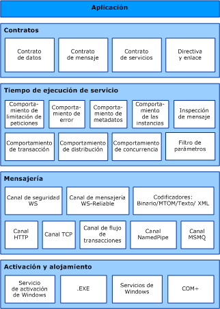

# Arquitectura de Windows Communication FoundationWindows Communication Foundation Architecture
El gráfico siguiente muestra las capas principales de la arquitectura [!INCLUDE[indigo1](../../../includes/indigo1-md.md)].The following graphic illustrates the major layers of the [!INCLUDE[indigo1](../../../includes/indigo1-md.md)] architecture.  
  
## Arquitectura de WCFWCF Architecture  
   
  
### Contratos y descripcionesContracts and Descriptions  
 Los contratos definen varios aspectos del sistema de mensajes.Contracts define various aspects of the message system. El contrato de datos describe cada parámetro que constituye cada mensaje que un servicio puede crear o utilizar.The data contract describes every parameter that makes up every message that a service can create or consume. Los documentos de Lenguaje de definición de esquemas XML (XSD) definen los parámetros de mensaje, permitiendo a cualquier sistema que entienda XML procesar los documentos.The message parameters are defined by XML Schema definition language (XSD) documents, enabling any system that understands XML to process the documents. El contrato del mensaje define partes específicas del mensaje utilizando los protocolos SOAP y permite el control más fino sobre las partes del mensaje, cuando la interoperabilidad exige tal precisión.The message contract defines specific message parts using SOAP protocols, and allows finer-grained control over parts of the message, when interoperability demands such precision. El contrato de servicios especifica las firmas de método actuales del servicio y se distribuye como una interfaz en uno de los lenguajes de programación compatibles, como Visual Basic o Visual C#.The service contract specifies the actual method signatures of the service, and is distributed as an interface in one of the supported programming languages, such as Visual Basic or Visual C#.  
  
 Las directivas y enlaces estipulan las condiciones exigidas para comunicarse con un servicio.Policies and bindings stipulate the conditions required to communicate with a service.  Por ejemplo, el enlace debe especificar (como mínimo) el transporte utilizado (por ejemplo, HTTP o TCP) y una codificación.For example, the binding must (at a minimum) specify the transport used (for example, HTTP or TCP), and an encoding. Las directivas incluyen los requisitos de seguridad y otras condiciones que se deben cumplir para comunicarse con un servicio.Policies include security requirements and other conditions that must be met to communicate with a service.  
  
### Tiempo de ejecución de servicioService Runtime  
 La capa del tiempo de ejecución del servicio contiene los comportamientos que solo se producen durante la operación actual del servicio, es decir, los comportamientos en tiempo de ejecución del servicio.The service runtime layer contains the behaviors that occur only during the actual operation of the service, that is, the runtime behaviors of the service. La limitación de peticiones controla cuántos mensajes se procesan que puede variar si la demanda para el servicio crece a un límite preestablecido.Throttling controls how many messages are processed, which can be varied if the demand for the service grows to a preset limit. Un comportamiento de error especifica lo que sucede cuando se produce un error interno en el servicio, por ejemplo, controlando qué información se comunica al cliente.An error behavior specifies what occurs when an internal error occurs on the service, for example, by controlling what information is communicated to the client. (Demasiada información puede dar ventaja a un usuario malintencionado para organizar un ataque.) El comportamiento de los metadatos rige cómo y si los metadatos se ponen a disposición del mundo externo.(Too much information can give a malicious user an advantage in mounting an attack.) Metadata behavior governs how and whether metadata is made available to the outside world. El comportamiento de la instancia especifica cuántas instancias del servicio se pueden ejecutar (por ejemplo, un singleton especifica solo una instancia para procesar todos los mensajes).Instance behavior specifies how many instances of the service can be run (for example, a singleton specifies only one instance to process all messages). El comportamiento de la transacción habilita la recuperación de operaciones de transacción si se produce un error.Transaction behavior enables the rollback of transacted operations if a failure occurs. El comportamiento de la expedición es el control de cómo la infraestructura [!INCLUDE[indigo2](../../../includes/indigo2-md.md)] procesa un mensaje.Dispatch behavior is the control of how a message is processed by the [!INCLUDE[indigo2](../../../includes/indigo2-md.md)] infrastructure.  
  
 La extensibilidad habilita la personalización de procesos en tiempo de ejecución.Extensibility enables customization of runtime processes. Por ejemplo, la inspección del mensaje es la facilidad para inspeccionar partes de un mensaje y la filtración de parámetros permite que se realicen acciones preestablecidas basándose en filtros que actúan en encabezados del mensaje.For example, message inspection is the facility to inspect parts of a message, and parameter filtering enables preset actions to occur based on filters acting on message headers.  
  
### MensajeríaMessaging  
 La capa de mensajería se compone de *canales*.The messaging layer is composed of *channels*. Un canal es un componente que procesa un mensaje de alguna manera, por ejemplo, autenticando un mensaje.A channel is a component that processes a message in some way, for example, by authenticating a message. Un conjunto de canales es también conocido como un *pila del canal*.A set of channels is also known as a *channel stack*. Los canales funcionan en los mensajes y encabezados del mensaje.Channels operate on messages and message headers. Esto es diferente de la capa en tiempo de ejecución del servicio, que se ocupa principalmente de procesar el contenido de los cuerpos de los mensajes.This is different from the service runtime layer, which is primarily concerned about processing the contents of message bodies.  
  
 Hay dos tipos de canales: canales de transporte y canales de protocolo.There are two types of channels: transport channels and protocol channels.  
  
 Los canales de transporte leen y escriben mensajes de la red (o algún otro punto de la comunicación con el mundo externo).Transport channels read and write messages from the network (or some other communication point with the outside world). Algunos transportes utilizan un codificador para convertir los mensajes (que se representan como conjuntos de información XMLs) hacia y desde la representación de la secuencia de bytes utilizada por la red.Some transports use an encoder to convert messages (which are represented as XML Infosets) to and from the byte stream representation used by the network. Son ejemplos de transportes HTTP, canalizaciones con nombre, TCP y MSMQ.Examples of transports are HTTP, named pipes, TCP, and MSMQ. Son ejemplos de codificaciones XML y binario optimizado.Examples of encodings are XML and optimized binary.  
  
 Los canales de protocolo implementan protocolos de procesamiento de mensajes, a menudo leyendo o escribiendo encabezados adicionales en el mensaje.Protocol channels implement message processing protocols, often by reading or writing additional headers to the message. Los ejemplos de tales protocolos incluyen WS-Security y WS-Reliability.Examples of such protocols include WS-Security and WS-Reliability.  
  
 La capa de la mensajería muestra los posibles formatos y patrones de intercambio de los datos.The messaging layer illustrates the possible formats and exchange patterns of the data. WS-Security es una implementación de la especificación WS-Security que habilita la seguridad en la capa del mensaje.WS-Security is an implementation of the WS-Security specification enabling security at the message layer. El canal de mensajería WS-Reliable habilita la garantía de entrega del mensaje.The WS-Reliable Messaging channel enables the guarantee of message delivery. Los codificadores presentan una variedad de codificaciones que se pueden utilizar para satisfacer las necesidades del mensaje.The encoders present a variety of encodings that can be used to suit the needs of the message. El canal HTTP especifica que el Protocolo de transporte de hipertexto se utiliza para la entrega del mensaje.The HTTP channel specifies that the HyperText Transport Protocol is used for message delivery. El canal TCP especifica de manera similar el protocolo TCP.The TCP channel similarly specifies the TCP protocol. El canal de flujo de transacciones rige los patrones de mensajes de transacción.The Transaction Flow channel governs transacted message patterns. El canal de la canalización con nombre habilita la comunicación entre procesos.The Named Pipe channel enables interprocess communication. El canal de MSMQ habilita la interoperación con aplicaciones MSMQ.The MSMQ channel enables interoperation with MSMQ applications.  
  
### Alojamiento y activaciónHosting and Activation  
 En su forma final, un servicio es un programa.In its final form, a service is a program. Como otros programas, un servicio se debe ejecutar en un ejecutable.Like other programs, a service must be run in an executable. Esto se conoce como un *hospeda a sí mismo* servicio.This is known as a *self-hosted* service.  
  
 También pueden ser servicios *hospedado*, o ejecutar en un ejecutable administrado por un agente externo, como IIS o servicio de activación de Windows (WAS).Services can also be *hosted*, or run in an executable managed by an external agent, such as IIS or Windows Activation Service (WAS). WAS permite activar automáticamente aplicaciones [!INCLUDE[indigo2](../../../includes/indigo2-md.md)] cuando se implementan en un equipo que ejecuta WAS.WAS enables [!INCLUDE[indigo2](../../../includes/indigo2-md.md)] applications to be activated automatically when deployed on a computer running WAS. Los servicios también se pueden ejecutar manualmente como ejecutables (archivos .exe).Services can also be manually run as executables (.exe files). Un servicio también se puede ejecutar automáticamente como un servicio de Windows.A service can also be run automatically as a Windows service. Los componentes COM+ también se pueden hospedar como servicios [!INCLUDE[indigo2](../../../includes/indigo2-md.md)].COM+ components can also be hosted as [!INCLUDE[indigo2](../../../includes/indigo2-md.md)] services.  
  
## Vea tambiénSee Also  
 [¿Qué es Windows Communication Foundation?What Is Windows Communication Foundation](../../../docs/framework/wcf/whats-wcf.md)  
 [Conceptos básicos de Windows Communication FoundationFundamental Windows Communication Foundation Concepts](../../../docs/framework/wcf/fundamental-concepts.md)
