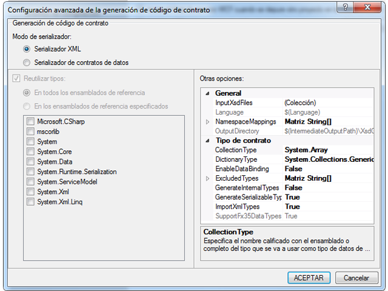

# <a name="contract-first-tool"></a><span data-ttu-id="596b9-102">Herramienta de contrato primero</span><span class="sxs-lookup"><span data-stu-id="596b9-102">Contract-First Tool</span></span>
<span data-ttu-id="596b9-103">Los contratos de servicio deben crearse a menudo desde servicios existentes.</span><span class="sxs-lookup"><span data-stu-id="596b9-103">Service contracts often need to be created from existing services.</span></span> <span data-ttu-id="596b9-104">En [!INCLUDE[net_v45](../../../includes/net-v45-md.md)], las clases de contrato de datos se pueden crear automáticamente a partir de servicios existentes mediante la herramienta de contrato primero.</span><span class="sxs-lookup"><span data-stu-id="596b9-104">In [!INCLUDE[net_v45](../../../includes/net-v45-md.md)], data contract classes can be created automatically from existing services using the contract-first tool.</span></span> <span data-ttu-id="596b9-105">Para usar la herramienta de contrato primero, el archivo de definición de esquema XML (XSD) se debe descargar localmente; la herramienta no puede importar contratos de datos remotos a través de HTTP.</span><span class="sxs-lookup"><span data-stu-id="596b9-105">To use the contract-first tool, the XML schema definition file (XSD) must be downloaded locally; the tool cannot import remote data contracts via HTTP.</span></span>  
  
 <span data-ttu-id="596b9-106">La herramienta de contrato primero está integrada en [!INCLUDE[vs_current_long](../../../includes/vs-current-long-md.md)] como una tarea de compilación.</span><span class="sxs-lookup"><span data-stu-id="596b9-106">The contract-first tool is integrated into [!INCLUDE[vs_current_long](../../../includes/vs-current-long-md.md)] as a build task.</span></span> <span data-ttu-id="596b9-107">Los archivos de código generados por la tarea de compilación se crean cada vez que se compila el proyecto, de modo que el proyecto pueda adoptar fácilmente los cambios en el contrato de servicio subyacente.</span><span class="sxs-lookup"><span data-stu-id="596b9-107">The code files generated by the build task are created every time the project is built, so that the project can easily adopt changes in the underlying service contract.</span></span>  
  
 <span data-ttu-id="596b9-108">Entre los tipos de esquema que la herramienta de contrato primero puede importar se incluyen los siguientes:</span><span class="sxs-lookup"><span data-stu-id="596b9-108">Schema types that the contract-first tool can import include the following:</span></span>  
  
```xml  
<xsd:complexType>  
<xsd:simpleType>  
```  
  
 <span data-ttu-id="596b9-109">No se generarán tipos simples si son primitivos como `Int16` o `String`; no se generarán tipos complejos si son de tipo `Collection`.</span><span class="sxs-lookup"><span data-stu-id="596b9-109">Simple types will not be generated if they are primitives such as `Int16` or `String`; complex types will not be generated if they are of type `Collection`.</span></span> <span data-ttu-id="596b9-110">Los tipos tampoco se generarán si forman parte de otro `xsd:complexType`.</span><span class="sxs-lookup"><span data-stu-id="596b9-110">Types will also not be generated if they are part of another `xsd:complexType`.</span></span> <span data-ttu-id="596b9-111">En todos estos casos, se hará referencia a tipos existentes en el proyecto.</span><span class="sxs-lookup"><span data-stu-id="596b9-111">In all these cases, the types will be referenced to existing types in the project instead.</span></span>  
  
## <a name="adding-a-data-contract-to-a-project"></a><span data-ttu-id="596b9-112">Agregar un contrato de datos a un proyecto</span><span class="sxs-lookup"><span data-stu-id="596b9-112">Adding a data contract to a project</span></span>  
 <span data-ttu-id="596b9-113">Antes de poder usar la herramienta de contrato primero, el contrato de servicio (XSD) se debe agregar al proyecto.</span><span class="sxs-lookup"><span data-stu-id="596b9-113">Before the contract-first tool can be used, the service contract (XSD) must be added to the project.</span></span> <span data-ttu-id="596b9-114">En esta información general, se usará el contrato siguiente para mostrar las funciones de contrato primero.</span><span class="sxs-lookup"><span data-stu-id="596b9-114">For the purposes of this overview, the following contract will be used to illustrate contract-first functions.</span></span> <span data-ttu-id="596b9-115">Esta definición de servicio es un pequeño subconjunto del contrato de servicio usado por la API de búsqueda de Bing.</span><span class="sxs-lookup"><span data-stu-id="596b9-115">This service definition is a small subset of the service contract used by Bing’s search API.</span></span>  
  
```xml  
<?xml version="1.0" encoding="utf-8"?>  
<xs:schema id="ServiceSchema"  
    targetNamespace="http://tempuri.org/ServiceSchema.xsd"  
    elementFormDefault="qualified"  
    xmlns="http://tempuri.org/ServiceSchema.xsd"  
    xmlns:mstns="http://tempuri.org/ServiceSchema.xsd"  
    xmlns:xs="http://www.w3.org/2001/XMLSchema"  
>  
  <xs:complexType name="SearchRequest">  
    <xs:sequence>  
      <xs:element minOccurs="0" maxOccurs="1" name="Version" type="xs:string" default="2.2" />  
      <xs:element minOccurs="0" maxOccurs="1" name="Market" type="xs:string" />  
      <xs:element minOccurs="0" maxOccurs="1" name="UILanguage" type="xs:string" />  
      <xs:element minOccurs="1" maxOccurs="1" name="Query" type="xs:string" />  
      <xs:element minOccurs="1" maxOccurs="1" name="AppId" type="xs:string" />  
      <xs:element minOccurs="0" maxOccurs="1" name="Latitude" type="xs:double" />  
      <xs:element minOccurs="0" maxOccurs="1" name="Longitude" type="xs:double" />  
      <xs:element minOccurs="0" maxOccurs="1" name="Radius" type="xs:double" />  
    </xs:sequence>  
  </xs:complexType>  
  <xs:simpleType name="WebSearchOption">  
    <xs:restriction base="xs:string">  
      <xs:enumeration value="DisableHostCollapsing" />  
      <xs:enumeration value="DisableQueryAlterations" />  
    </xs:restriction>  
  </xs:simpleType>  
</xs:schema>  
```  
  
 <span data-ttu-id="596b9-116">Para agregar el contrato de servicio anterior para el proyecto, haga clic en el proyecto y seleccione **Agregar nuevo...** .</span><span class="sxs-lookup"><span data-stu-id="596b9-116">To add the above service contract to the project, right-click the project and select **Add New…**.</span></span> <span data-ttu-id="596b9-117">Seleccione Definición de esquema en el panel WCF del cuadro de diálogo Plantillas y asigne al nuevo archivo el nombre SampleContract.xsd.</span><span class="sxs-lookup"><span data-stu-id="596b9-117">Select Schema Definition from the WCF pane of the Templates dialog, and name the new file SampleContract.xsd.</span></span> <span data-ttu-id="596b9-118">Copie y pegue el código anterior en la vista de código del nuevo archivo.</span><span class="sxs-lookup"><span data-stu-id="596b9-118">Copy and paste the above code into the code view of the new file.</span></span>  
  
## <a name="configuring-contract-first-options"></a><span data-ttu-id="596b9-119">Configurar opciones de contrato primero</span><span class="sxs-lookup"><span data-stu-id="596b9-119">Configuring contract-first options</span></span>  
 <span data-ttu-id="596b9-120">Las opciones de contrato primero se pueden configurar en el menú Propiedades de un proyecto de [!INCLUDE[indigo2](../../../includes/indigo2-md.md)].</span><span class="sxs-lookup"><span data-stu-id="596b9-120">Contract-first options can be configured in the Properties menu of a [!INCLUDE[indigo2](../../../includes/indigo2-md.md)] project.</span></span> <span data-ttu-id="596b9-121">Para habilitar el desarrollo de contrato primero, active el **habilitar XSD como lenguaje de definición de tipo** casilla de verificación en la página WCF de la ventana de propiedades del proyecto.</span><span class="sxs-lookup"><span data-stu-id="596b9-121">To enable contract-first development, select the **Enable XSD as Type Definition Language** check box in the WCF page of the project properties window.</span></span>  
  
 <span data-ttu-id="596b9-122"></span><span class="sxs-lookup"><span data-stu-id="596b9-122"></span></span>  
  
 <span data-ttu-id="596b9-123">Para configurar propiedades avanzadas, haga clic en el botón Avanzadas.</span><span class="sxs-lookup"><span data-stu-id="596b9-123">To configure advanced properties, click the Advanced button.</span></span>  
  
 <span data-ttu-id="596b9-124"></span><span class="sxs-lookup"><span data-stu-id="596b9-124"></span></span>  
  
 <span data-ttu-id="596b9-125">Se pueden configurar las opciones avanzadas siguientes para la generación de código desde contratos.</span><span class="sxs-lookup"><span data-stu-id="596b9-125">The following advanced settings can be configured for code generation from contracts.</span></span> <span data-ttu-id="596b9-126">Los valores solo se pueden configurar para todos los archivos del proyecto; no se pueden configurar para archivos individuales en este momento.</span><span class="sxs-lookup"><span data-stu-id="596b9-126">Settings can only be configured for all of the files in the project; settings cannot be configured for individual files at this time.</span></span>  
  
-   <span data-ttu-id="596b9-127">**Modo de serializador**: este valor determina qué serializador se usa para leer archivos de contrato de servicio.</span><span class="sxs-lookup"><span data-stu-id="596b9-127">**Serializer Mode**: This setting determines which serializer is used for reading service contract files.</span></span> <span data-ttu-id="596b9-128">Cuando **serializador XML** está activada, el **tipos de colección** y **volver a usar tipos** opciones están deshabilitadas.</span><span class="sxs-lookup"><span data-stu-id="596b9-128">When **XML Serializer** is selected, the **Collection Types** and **Reuse Types** options are disabled.</span></span> <span data-ttu-id="596b9-129">Estas opciones solo se aplican a la **serializador de contratos de datos**.</span><span class="sxs-lookup"><span data-stu-id="596b9-129">These options only apply to the **Data Contract Serializer**.</span></span>  
  
-   <span data-ttu-id="596b9-130">**Volver a usar tipos**: esta opción especifica qué bibliotecas se usan para reutilizar tipos.</span><span class="sxs-lookup"><span data-stu-id="596b9-130">**Reuse Types**: This setting specifies which libraries are used for type reuse.</span></span> <span data-ttu-id="596b9-131">Esta configuración solo se aplica si **modo de serializador** está establecido en **serializador de contratos de datos**.</span><span class="sxs-lookup"><span data-stu-id="596b9-131">This setting only applies if **Serializer Mode** is set to **Data Contract Serializer**.</span></span>  
  
-   <span data-ttu-id="596b9-132">**Tipo de colección**: este valor especifica el tipo completo o calificado con el ensamblado que se usará para el tipo de datos de la colección.</span><span class="sxs-lookup"><span data-stu-id="596b9-132">**Collection Type**: This setting specifies the fully-qualified or assembly-qualified type to be used for the collection data type.</span></span> <span data-ttu-id="596b9-133">Esta configuración solo se aplica si **modo de serializador** está establecido en **serializador de contratos de datos**.</span><span class="sxs-lookup"><span data-stu-id="596b9-133">This setting only applies if **Serializer Mode** is set to **Data Contract Serializer**.</span></span>  
  
-   <span data-ttu-id="596b9-134">**Tipo de diccionario**: este valor especifica el tipo completo o calificado con el ensamblado que se usará para el tipo de datos de diccionario.</span><span class="sxs-lookup"><span data-stu-id="596b9-134">**Dictionary Type**: This setting specifies the fully-qualified or assembly-qualified type to be used for the dictionary data type.</span></span>  
  
-   <span data-ttu-id="596b9-135">**EnableDataBinding**: esta configuración especifica si se debe implementar la <xref:System.ComponentModel.INotifyPropertyChanged> interfaz en todos los tipos de datos para implementar el enlace de datos.</span><span class="sxs-lookup"><span data-stu-id="596b9-135">**EnableDataBinding**: This setting specifies whether to implement the <xref:System.ComponentModel.INotifyPropertyChanged> interface on all data types to implement data binding.</span></span>  
  
-   <span data-ttu-id="596b9-136">**ExcludedTypes**: esta configuración especifica la lista de tipos completo o calificado con el ensamblado que desea excluir de los ensamblados que se hace referencia.</span><span class="sxs-lookup"><span data-stu-id="596b9-136">**ExcludedTypes**:This setting specifies the list of fully-qualified or assembly-qualified types to be excluded from the referenced assemblies.</span></span> <span data-ttu-id="596b9-137">Esta configuración solo se aplica si **modo de serializador** está establecido en **serializador de contratos de datos**.</span><span class="sxs-lookup"><span data-stu-id="596b9-137">This setting only applies if **Serializer Mode** is set to **Data Contract Serializer**.</span></span>  
  
-   <span data-ttu-id="596b9-138">**GenerateInternalTypes**: esta configuración especifica si se debe generar clases marcadas como internas.</span><span class="sxs-lookup"><span data-stu-id="596b9-138">**GenerateInternalTypes**: This setting specifies whether to generate classes that are marked as internal.</span></span> <span data-ttu-id="596b9-139">Esta configuración solo se aplica si **modo de serializador** está establecido en **serializador de contratos de datos**.</span><span class="sxs-lookup"><span data-stu-id="596b9-139">This setting only applies if **Serializer Mode** is set to **Data Contract Serializer**.</span></span>  
  
-   <span data-ttu-id="596b9-140">**GenerateSerializableTypes**: esta configuración especifica si se debe generar clases con el <xref:System.SerializableAttribute> atributo.</span><span class="sxs-lookup"><span data-stu-id="596b9-140">**GenerateSerializableTypes**: This setting specifies whether to generate classes with the <xref:System.SerializableAttribute> attribute.</span></span> <span data-ttu-id="596b9-141">Esta configuración solo se aplica si **modo de serializador** está establecido en **serializador de contratos de datos**.</span><span class="sxs-lookup"><span data-stu-id="596b9-141">This setting only applies if **Serializer Mode** is set to **Data Contract Serializer**.</span></span>  
  
-   <span data-ttu-id="596b9-142">**/Importxmltypes**: esta configuración especifica si se debe configurar el serializador de contratos de datos para aplicar la <xref:System.SerializableAttribute> atributo a clases sin el <xref:System.Runtime.Serialization.DataContractAttribute> atributo.</span><span class="sxs-lookup"><span data-stu-id="596b9-142">**ImportXMLTypes**: This setting specifies whether to configure the data contract serializer to apply the <xref:System.SerializableAttribute> attribute to classes without the <xref:System.Runtime.Serialization.DataContractAttribute> attribute.</span></span>  <span data-ttu-id="596b9-143">Esta configuración solo se aplica si **modo de serializador** está establecido en **serializador de contratos de datos**.</span><span class="sxs-lookup"><span data-stu-id="596b9-143">This setting only applies if **Serializer Mode** is set to **Data Contract Serializer**.</span></span>  
  
-   <span data-ttu-id="596b9-144">**SupportFx35TypedDataSets**: esta configuración especifica si se proporciona una funcionalidad adicional para los conjuntos de datos con tipo creados para .net Framework 3.5.</span><span class="sxs-lookup"><span data-stu-id="596b9-144">**SupportFx35TypedDataSets**: This setting specifies whether to provide additional functionality for typed data sets created for .Net Framework 3.5.</span></span> <span data-ttu-id="596b9-145">Cuando **modo de serializador** está establecido en **serializador XML**, el <xref:System.Data.Design.TypedDataSetSchemaImporterExtensionFx35> extensión se agregará al importador del esquema XML cuando este valor se establece en True.</span><span class="sxs-lookup"><span data-stu-id="596b9-145">When  **Serializer Mode** is set to **XML Serializer**, the <xref:System.Data.Design.TypedDataSetSchemaImporterExtensionFx35> extension will be added to the XML schema importer when this value is set to True.</span></span> <span data-ttu-id="596b9-146">Cuando **modo de serializador** está establecido en **serializador de contratos de datos**, el tipo de <xref:System.DateTimeOffset> se excluirán de las referencias cuando este valor se establece en False, por lo que un <xref:System.DateTimeOffset> siempre se genera para versiones anteriores de framework.</span><span class="sxs-lookup"><span data-stu-id="596b9-146">When  **Serializer Mode** is set to **Data Contract Serializer**, the type <xref:System.DateTimeOffset> will be excluded from the References when this value is set to False, so that a <xref:System.DateTimeOffset> is always generated for older framework versions.</span></span>  
  
-   <span data-ttu-id="596b9-147">**InputXsdFiles**: esta configuración especifica la lista de archivos de entrada.</span><span class="sxs-lookup"><span data-stu-id="596b9-147">**InputXsdFiles**: This setting specifies the list of input files.</span></span> <span data-ttu-id="596b9-148">Cada archivo debe contener un esquema XML válido.</span><span class="sxs-lookup"><span data-stu-id="596b9-148">Each file must contain a valid XML schema.</span></span>  
  
-   <span data-ttu-id="596b9-149">**Idioma**: esta opción especifica el lenguaje del código generado del contrato.</span><span class="sxs-lookup"><span data-stu-id="596b9-149">**Language**: This setting specifies the language of the generated contract code.</span></span> <span data-ttu-id="596b9-150">El valor debe ser reconocible por <xref:System.CodeDom.Compiler.CodeDomProvider>.</span><span class="sxs-lookup"><span data-stu-id="596b9-150">The setting must be recognizable by <xref:System.CodeDom.Compiler.CodeDomProvider>.</span></span>  
  
-   <span data-ttu-id="596b9-151">**NamespaceMappings**: esta configuración especifica las asignaciones de los espacios de nombres de destino XSD a espacios de nombres CLR.</span><span class="sxs-lookup"><span data-stu-id="596b9-151">**NamespaceMappings**: This setting specifies the mappings from the XSD Target Namespaces to CLR namespaces.</span></span> <span data-ttu-id="596b9-152">Cada asignación debe usar el formato siguiente:</span><span class="sxs-lookup"><span data-stu-id="596b9-152">Each mapping should use the following format:</span></span>  
  
    ```xml  
    "<Schema Namespace>, <CLR Namespace>"  
    ```  
  
     <span data-ttu-id="596b9-153">El serializador XML solo acepta una asignación en el formato siguiente:</span><span class="sxs-lookup"><span data-stu-id="596b9-153">The XML Serializer only accepts one mapping in the following format:</span></span>  
  
    ```xml  
    "*, <CLR Namespace>"  
    ```  
  
-   <span data-ttu-id="596b9-154">**OutputDirectory**: este valor especifica el directorio donde se generarán los archivos de código.</span><span class="sxs-lookup"><span data-stu-id="596b9-154">**OutputDirectory**: This setting specifies the directory where the code files will be generated.</span></span>  
  
 <span data-ttu-id="596b9-155">Los valores se usarán para generar tipos de contrato de servicio a partir de los archivos de contrato de servicio cuando se compile el proyecto.</span><span class="sxs-lookup"><span data-stu-id="596b9-155">The settings will be used to generate service contract types from the service contract files when the project is built.</span></span>  
  
## <a name="using-contract-first-development"></a><span data-ttu-id="596b9-156">Mediante desarrollo de contrato primero</span><span class="sxs-lookup"><span data-stu-id="596b9-156">Using contract-first development</span></span>  
 <span data-ttu-id="596b9-157">Después de agregar el contrato de servicio al proyecto y confirmar la configuración de compilación, compile el proyecto presionando **F6**.</span><span class="sxs-lookup"><span data-stu-id="596b9-157">After adding the service contract to the project and confirming the build settings, build the project by pressing **F6**.</span></span> <span data-ttu-id="596b9-158">Los tipos definidos en el contrato de servicio estarán disponibles para su uso en el proyecto.</span><span class="sxs-lookup"><span data-stu-id="596b9-158">The types defined in the service contract will then be available for use in the project.</span></span>  
  
 <span data-ttu-id="596b9-159">Para usar los tipos definidos en el contrato de servicio, agregue una referencia a `ContractTypes` en el espacio de nombres actual:</span><span class="sxs-lookup"><span data-stu-id="596b9-159">To use the types defined in the service contract, add a reference to `ContractTypes` under the current namespace:</span></span>  
  
```csharp  
using MyProjectNamespace.ContractTypes;  
```  
  
 <span data-ttu-id="596b9-160">Los tipos definidos en el contrato de servicio se podrán resolver en el proyecto, como se muestra a continuación.</span><span class="sxs-lookup"><span data-stu-id="596b9-160">The types defined in the service contract will then be resolvable in the project, as shown below.</span></span>  
  
 <span data-ttu-id="596b9-161"></span><span class="sxs-lookup"><span data-stu-id="596b9-161"></span></span>  
  
 <span data-ttu-id="596b9-162">Los tipos generados por la herramienta se crean en el archivo GeneratedXSDTypes.cs.</span><span class="sxs-lookup"><span data-stu-id="596b9-162">The types generated by the tool are created in the GeneratedXSDTypes.cs file.</span></span> <span data-ttu-id="596b9-163">El archivo se crea en el \<directorio del proyecto >/obj /\<configuración de compilación >/xsdgeneratedcode / directory de forma predeterminada.</span><span class="sxs-lookup"><span data-stu-id="596b9-163">The file is created in the \<project directory>/obj/\<build configuration>/XSDGeneratedCode/ directory by default.</span></span> <span data-ttu-id="596b9-164">El esquema de ejemplo al principio de este tema se convierte como sigue:</span><span class="sxs-lookup"><span data-stu-id="596b9-164">The sample schema at the beginning of this topic is converted as follows:</span></span>  
  
```csharp
//------------------------------------------------------------------------------  
// <auto-generated>  
//     This code was generated by a tool.  
//     Runtime Version:4.0.30319.17330  
//  
//     Changes to this file may cause incorrect behavior and will be lost if  
//     the code is regenerated.  
// </auto-generated>  
//------------------------------------------------------------------------------  
  
namespace TestXSD3.ContractTypes  
{  
    using System.Xml.Serialization;  
  
    /// <remarks/>  
    [System.CodeDom.Compiler.GeneratedCodeAttribute("System.Xml", "4.0.30319.17330")]  
    [System.SerializableAttribute()]  
    [System.Diagnostics.DebuggerStepThroughAttribute()]  
    [System.ComponentModel.DesignerCategoryAttribute("code")]  
    [System.Xml.Serialization.XmlTypeAttribute(Namespace="http://tempuri.org/ServiceSchema.xsd")]  
    [System.Xml.Serialization.XmlRootAttribute(Namespace="http://tempuri.org/ServiceSchema.xsd", IsNullable=true)]  
    public partial class SearchRequest  
    {  
  
        private string versionField;  
  
        private string marketField;  
  
        private string uILanguageField;  
  
        private string queryField;  
  
        private string appIdField;  
  
        private double latitudeField;  
  
        private bool latitudeFieldSpecified;  
  
        private double longitudeField;  
  
        private bool longitudeFieldSpecified;  
  
        private double radiusField;  
  
        private bool radiusFieldSpecified;  
  
        public SearchRequest()  
        {  
            this.versionField = "2.2";  
        }  
  
        /// <remarks/>  
        [System.ComponentModel.DefaultValueAttribute("2.2")]  
        public string Version  
        {  
            get  
            {  
                return this.versionField;  
            }  
            set  
            {  
                this.versionField = value;  
            }  
        }  
  
        /// <remarks/>  
        public string Market  
        {  
            get  
            {  
                return this.marketField;  
            }  
            set  
            {  
                this.marketField = value;  
            }  
        }  
  
        /// <remarks/>  
        public string UILanguage  
        {  
            get  
            {  
                return this.uILanguageField;  
            }  
            set  
            {  
                this.uILanguageField = value;  
            }  
        }  
  
        /// <remarks/>  
        public string Query  
        {  
            get  
            {  
                return this.queryField;  
            }  
            set  
            {  
                this.queryField = value;  
            }  
        }  
  
        /// <remarks/>  
        public string AppId  
        {  
            get  
            {  
                return this.appIdField;  
            }  
            set  
            {  
                this.appIdField = value;  
            }  
        }  
  
        /// <remarks/>  
        public double Latitude  
        {  
            get  
            {  
                return this.latitudeField;  
            }  
            set  
            {  
                this.latitudeField = value;  
            }  
        }  
  
        /// <remarks/>  
        [System.Xml.Serialization.XmlIgnoreAttribute()]  
        public bool LatitudeSpecified  
        {  
            get  
            {  
                return this.latitudeFieldSpecified;  
            }  
            set  
            {  
                this.latitudeFieldSpecified = value;  
            }  
        }  
  
        /// <remarks/>  
        public double Longitude  
        {  
            get  
            {  
                return this.longitudeField;  
            }  
            set  
            {  
                this.longitudeField = value;  
            }  
        }  
  
        /// <remarks/>  
        [System.Xml.Serialization.XmlIgnoreAttribute()]  
        public bool LongitudeSpecified  
        {  
            get  
            {  
                return this.longitudeFieldSpecified;  
            }  
            set  
            {  
                this.longitudeFieldSpecified = value;  
            }  
        }  
  
        /// <remarks/>  
        public double Radius  
        {  
            get  
            {  
                return this.radiusField;  
            }  
            set  
            {  
                this.radiusField = value;  
            }  
        }  
  
        /// <remarks/>  
        [System.Xml.Serialization.XmlIgnoreAttribute()]  
        public bool RadiusSpecified  
        {  
            get  
            {  
                return this.radiusFieldSpecified;  
            }  
            set  
            {  
                this.radiusFieldSpecified = value;  
            }  
        }  
    }  
  
    /// <remarks/>  
    [System.CodeDom.Compiler.GeneratedCodeAttribute("System.Xml", "4.0.30319.17330")]  
    [System.SerializableAttribute()]  
    [System.Xml.Serialization.XmlTypeAttribute(Namespace="http://tempuri.org/ServiceSchema.xsd")]  
    [System.Xml.Serialization.XmlRootAttribute(Namespace="http://tempuri.org/ServiceSchema.xsd", IsNullable=false)]  
    public enum WebSearchOption  
    {  
  
        /// <remarks/>  
        DisableHostCollapsing,  
  
        /// <remarks/>  
        DisableQueryAlterations,  
    }  
}  
```  
  
## <a name="errors-and-warnings"></a><span data-ttu-id="596b9-165">Errores y advertencias</span><span class="sxs-lookup"><span data-stu-id="596b9-165">Errors and warnings</span></span>  
 <span data-ttu-id="596b9-166">Los errores y advertencias detectados al analizar el esquema XSD aparecerán como errores de compilación y advertencias.</span><span class="sxs-lookup"><span data-stu-id="596b9-166">Errors and warnings encountered in parsing the XSD schema will appear as build errors and warnings.</span></span>  
  
## <a name="interface-inheritance"></a><span data-ttu-id="596b9-167">Herencia de interfaz</span><span class="sxs-lookup"><span data-stu-id="596b9-167">Interface Inheritance</span></span>  
 <span data-ttu-id="596b9-168">No es posible usar la herencia de interfaz con el desarrollo de contrato primero; esto es coherente con el modo en el que las interfaces interactúan en otras operaciones.</span><span class="sxs-lookup"><span data-stu-id="596b9-168">It is not possible to use interface inheritance with contract-first development; this is consistent with the way interfaces behave in other operations.</span></span> <span data-ttu-id="596b9-169">Para usar una interfaz que herede una interfaz base, use dos extremos independientes.</span><span class="sxs-lookup"><span data-stu-id="596b9-169">In order to use an interface that inherits a base interface, use two separate endpoints.</span></span> <span data-ttu-id="596b9-170">El primer extremo usa el contrato heredado y el segundo implementa la interfaz base.</span><span class="sxs-lookup"><span data-stu-id="596b9-170">The first endpoint uses the inherited contract, and the second endpoint implements the base interface.</span></span>
