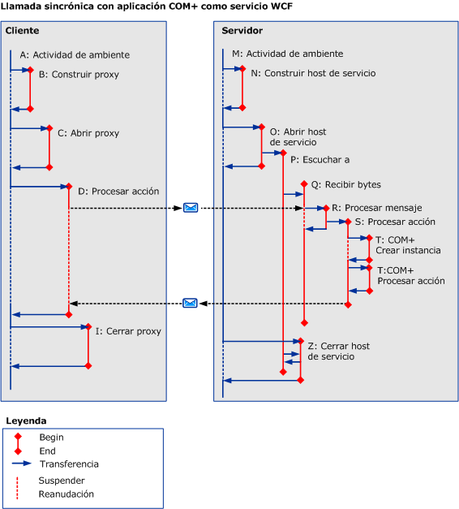

# COM+

La figura siguiente muestra cómo puede utilizar el seguimiento de la actividad en una aplicación COM+. En lugar de ejecutar código de usuario en el servidor, podemos definir una actividad COM+ para cada llamada al método al modelo del objeto COM+.  
  
 
