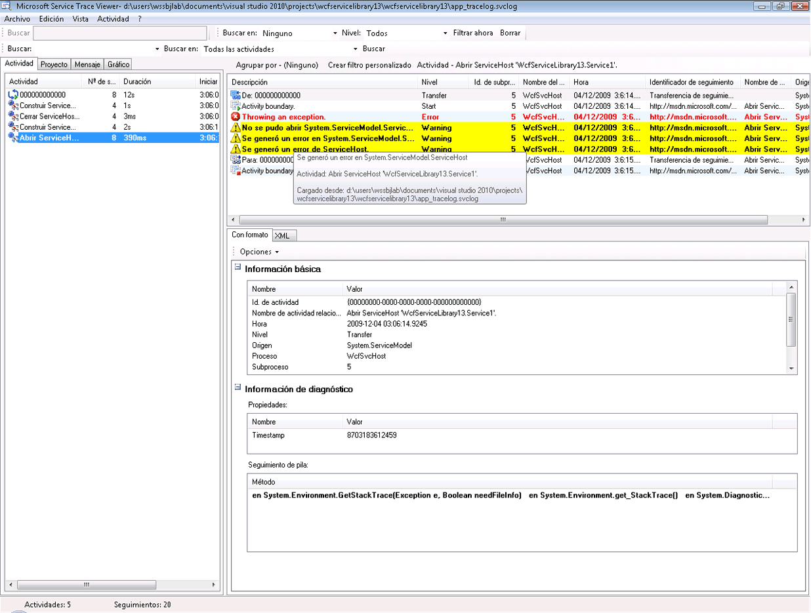
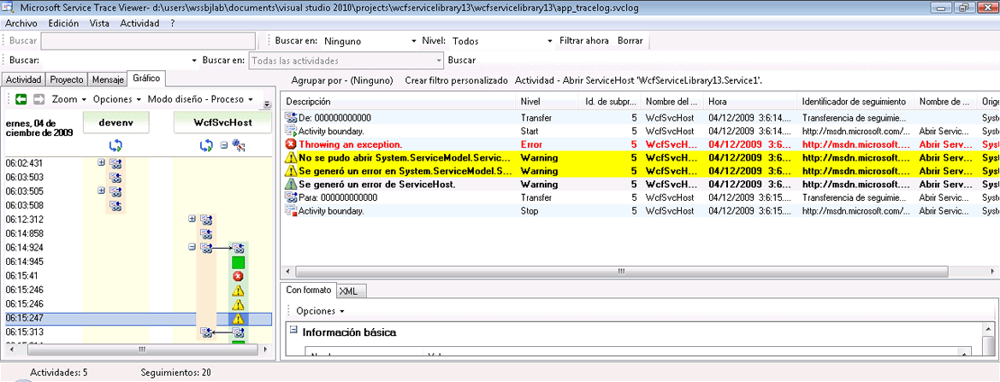

# Emisi&#243;n de trazas del c&#243;digo de usuario
Además de permitir el seguimiento de traza en la configuración para recopilar los datos de instrumentación generados por [!INCLUDE[indigo1](../../../../../includes/indigo1-md.md)], también se pueden emitir trazas mediante la programación del código de usuario.  De esta manera, puede crear proactivamente datos de instrumentación que examinará más tarde con el fin de realizar un diagnóstico.  En este tema se describe cómo hacerlo.  
  
 Además, el ejemplo [Extensión del seguimiento](../../../../../docs/framework/wcf/samples/extending-tracing.md) incluye todo el código mostrado en las secciones siguientes.  
  
## Creación de un origen de seguimiento de traza  
 Puede utilizar el siguiente código para crear un origen de seguimiento de traza de usuario.  
  
```  
TraceSource ts = new TraceSource("myUserTraceSource");  
```  
  
## Creación de actividades  
 Las actividades son unidades lógicas de procesamiento.  Puede crear una actividad para cada unidad de procesamiento principal en la que desee agrupar las trazas.  Por ejemplo, puede crear una actividad para cada solicitud del servicio.  Para ello, realice los pasos siguientes.  
  
1.  Guarde el id. de actividad dentro del ámbito.  
  
2.  Cree un nuevo id. de actividad.  
  
3.  Realice una transferencia desde la actividad del ámbito a la nueva actividad, establezca ésta última dentro del ámbito, y emita un seguimiento de traza de inicio para esa actividad.  
  
 El siguiente código muestra cómo hacerlo:  
  
```  
Guid oldID = Trace.CorrelationManager.ActivityId;  
Guid traceID = Guid.NewGuid();  
ts.TraceTransfer(0, "transfer", traceID);  
Trace.CorrelationManager.ActivityId = traceID; // Trace is static  
ts.TraceEvent(TraceEventType.Start, 0, "Add request");  
```  
  
## Emisión de seguimiento de trazas en una actividad de usuario  
 El siguiente código emite seguimientos de traza en una actividad de usuario.  
  
```  
double value1 = 100.00D;  
double value2 = 15.99D;  
ts.TraceInformation("Client sends message to Add " + value1 + ", " + value2);  
double result = client.Add(value1, value2);  
ts.TraceInformation("Client receives Add response '" + result + "'");  
```  
  
## Detención de actividades  
 Para detener las actividades, revierta la transferencia a la actividad anterior, detenga el id. de actividad actual, y restablezca el id. de la actividad anterior dentro del ámbito.  
  
 El siguiente código muestra cómo hacerlo:  
  
```  
ts.TraceTransfer(0, "transfer", oldID);  
ts.TraceEvent(TraceEventType.Stop, 0, "Add request");  
Trace.CorrelationManager.ActivityId = oldID;  
```  
  
## Propagación del id. de la actividad a un servicio  
 Si establece el atributo `propagateActivity` en `true` para el origen de seguimiento de traza `System.ServiceModel` en los archivos de configuración del servicio y del cliente, el servicio que procesa la solicitud Add se produce en la misma actividad que la definida en el cliente.  Si el servicio define sus propias actividades y transferencias, las trazas del servicio no aparecen en la actividad propagada por el cliente.  En su lugar, aparecen en una actividad que las trazas de la transferencia ponen en correlación con la actividad cuyo id. propaga el cliente.  
  
> [!NOTE]
>  Si el atributo `propagateActivity` está establecido en `true` en el cliente y el servicio, [!INCLUDE[indigo2](../../../../../includes/indigo2-md.md)]establece la actividad de ambiente en el ámbito de la operación del servicio.  
  
 Puede utilizar el siguiente código para comprobar si [!INCLUDE[indigo2](../../../../../includes/indigo2-md.md)] estableció una actividad dentro del ámbito.  
  
```  
// Check if an activity was set in scope by WCF, if it was   
// propagated from the client. If not, ( ambient activity is   
// equal to Guid.Empty), create a new one.  
if(Trace.CorrelationManager.ActivityId == Guid.Empty)  
{  
    Guid newGuid = Guid.NewGuid();  
    Trace.CorrelationManager.ActivityId = newGuid;  
}  
// Emit your Start trace.  
ts.TraceEvent(TraceEventType.Start, 0, "Add Activity");  
  
// Emit the processing traces for that request.  
serviceTs.TraceInformation("Service receives Add "   
                            + n1 + ", " + n2);  
// double result = n1 + n2;  
serviceTs.TraceInformation("Service sends Add result" + result);  
  
// Emit the Stop trace and exit the method scope.  
ts.TraceEvent(TraceEventType.Stop, 0, "Add Activity");  
// return result;  
```  
  
## Seguimiento de traza de las excepciones iniciadas en código  
 Cuando se inicia una excepción en el código, también puede hacerse un seguimiento de traza de la excepción en el nivel de advertencia, o en un nivel superior, utilizando el código siguiente.  
  
```  
ts.TraceEvent(TraceEventType.Warning, 0, “Throwing exception “ + “exceptionMessage”);  
```  
  
## Ver las trazas de usuario en la herramienta del visor de seguimiento de traza del servicio  
 Esta sección contiene las capturas de pantalla de trazas generadas mediante la ejecución del ejemplo [Extensión del seguimiento](../../../../../docs/framework/wcf/samples/extending-tracing.md), cuando se ve utilizando [Herramienta del visor de seguimiento de servicio \(SvcTraceViewer.exe\)](../../../../../docs/framework/wcf/service-trace-viewer-tool-svctraceviewer-exe.md).  
  
 En el diagrama siguiente, se ha seleccionado en el panel izquierdo la actividad "Add request" creada previamente.  Se enumera junto con otras tres actividades de operaciones matemáticas \(dividir, restar, multiplicar\) que constituyen el programa cliente de la aplicación.  El código de usuario ha definido una nueva actividad para que cada operación aísle las apariciones de errores potenciales en diferentes solicitudes.  
  
 Para mostrar la utilización de transferencias en el ejemplo [Extensión del seguimiento](../../../../../docs/framework/wcf/samples/extending-tracing.md), también se crea una actividad de cálculo que encapsula las cuatro solicitudes de operación.  Para cada solicitud, se produce una transferencia hacia atrás y hacia delante desde la actividad de cálculo a la actividad de solicitud \(la traza está seleccionada en el panel superior derecho de la imagen\).  
  
 Cuando se selecciona una actividad en el panel izquierdo, las trazas incluidas por esta actividad se muestran en el panel superior derecho.  Si `propagateActivity` es `true` en cada extremo de la ruta de acceso de la solicitud, las trazas de la actividad de solicitud proceden de todos los procesos que participan en la solicitud.  En este ejemplo, puede ver trazas del cliente y del servicio en la cuarta columna del panel.  
  
 Esta actividad muestra el siguiente orden de procesamiento:  
  
1.  El cliente envía el mensaje a Add.  
  
2.  El servicio recibe un mensaje de solicitud Add.  
  
3.  El servicio envía una respuesta Add.  
  
4.  El cliente recibe la respuesta Add.  
  
 Todas estas trazas se emiten en el nivel de información.  Al hacer clic en una traza del panel superior derecho, se muestran los detalles de esa traza en el panel inferior derecho.  
  
 En el diagrama siguiente, también se observan las trazas de transferencia desde y hacia la actividad de cálculo, así como dos pares de trazas de inicio y detención por actividad de solicitud, una para el cliente y otra para el servicio \(una por cada origen de seguimiento de traza\).  
  
   
Lista de actividades por hora de creación \(panel izquierdo\) y sus actividades anidadas \(panel superior derecho\)  
  
 Si el código del servicio inicia una excepción que da lugar a que el cliente también se inicie \(por ejemplo, cuando el cliente no obtuvo la respuesta a su solicitud\), los mensajes de error del servicio y del cliente se producen en la misma actividad para una correlación directa.  En el diagrama siguiente, el servicio inicia una excepción que indica que rechaza procesar esta solicitud en el código de usuario. El cliente también inicia una excepción que indica que el servidor no pudo procesar la solicitud debido a un error interno.  
  
   
Los errores en los extremos de una solicitud determinada aparecen en la misma actividad, si se propagó el identificador de actividad de solicitud  
  
 Al hacer doble clic en la actividad de multiplicación, en el panel izquierdo, se muestra el siguiente gráfico con las trazas de la actividad de multiplicación de cada proceso implicado.  Podemos ver que primero tuvo lugar una advertencia en el servicio \(excepción iniciada\), que estuvo seguida de advertencias y errores en el cliente al no poder procesarse la solicitud.  Por lo tanto, podemos deducir la relación del error causal entre los extremos, y derivar la causa raíz del error.  
  
   
Vista del gráfico de la correlación del error  
  
 Para obtener las trazas anteriores, se establece `ActivityTracing` para los orígenes del seguimiento de traza del usuario, y `propagateActivity=true` para el origen de seguimiento de traza `System.ServiceModel`.  No se estableció `ActivityTracing` para el origen del seguimiento de traza `System.ServiceModel` para permitir habilitar el código de usuario a la propagación de actividad del código de usuario.  \(Cuando el seguimiento de traza de la actividad ServiceModel está activo, el Id. de actividad definido en el cliente no se propaga completamente al código de usuario del servicio. No obstante, las transferencias ponen en correlación las actividades del código de usuario del cliente y del servicio con las actividades [!INCLUDE[indigo2](../../../../../includes/indigo2-md.md)] intermedias.\)  
  
 La definición de actividades y la propagación de la id. de actividad permite poner directamente en correlación los errores con los extremos.  De esta manera, podemos buscar más rápidamente la causa raíz de un error.  
  
## Vea también  
 [Extensión del seguimiento](../../../../../docs/framework/wcf/samples/extending-tracing.md)