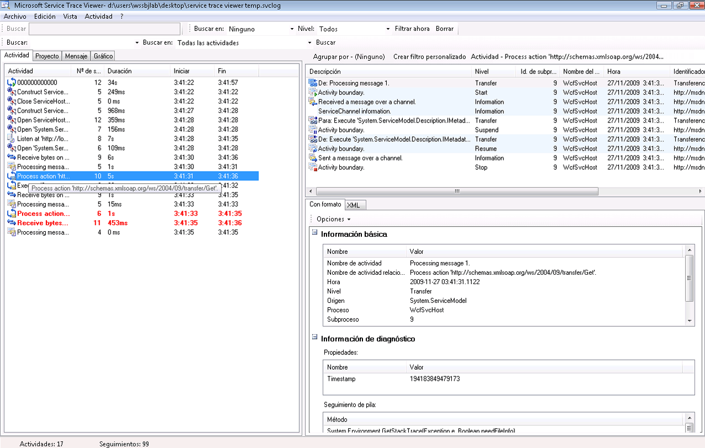
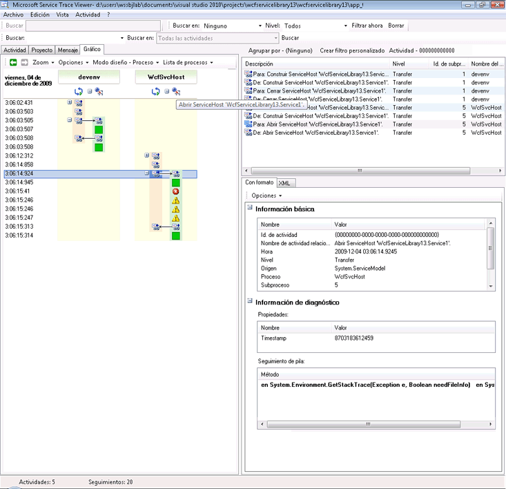
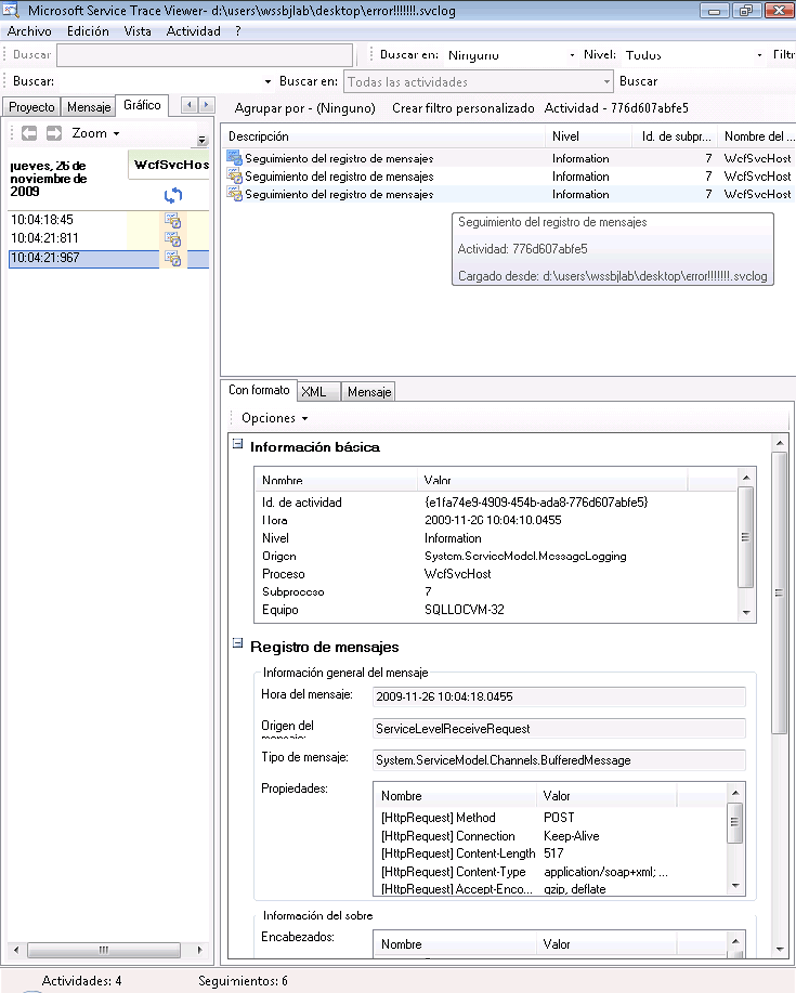
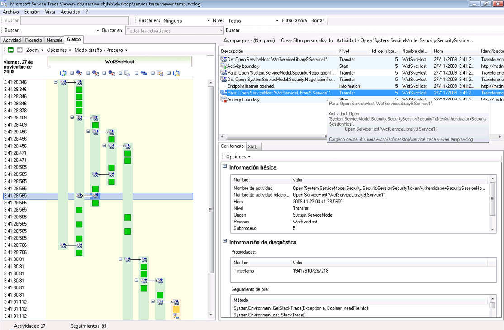
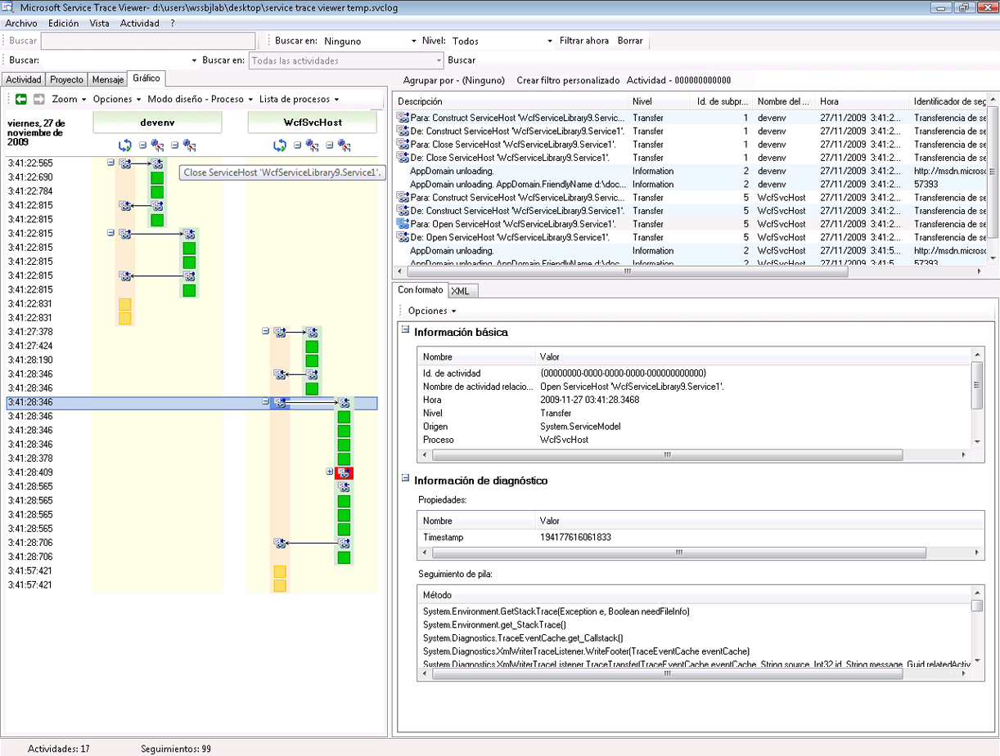
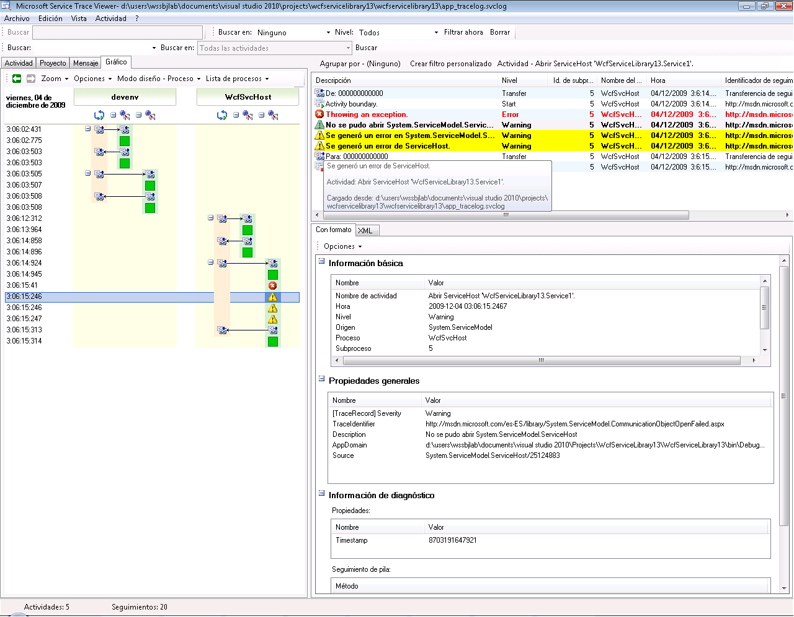
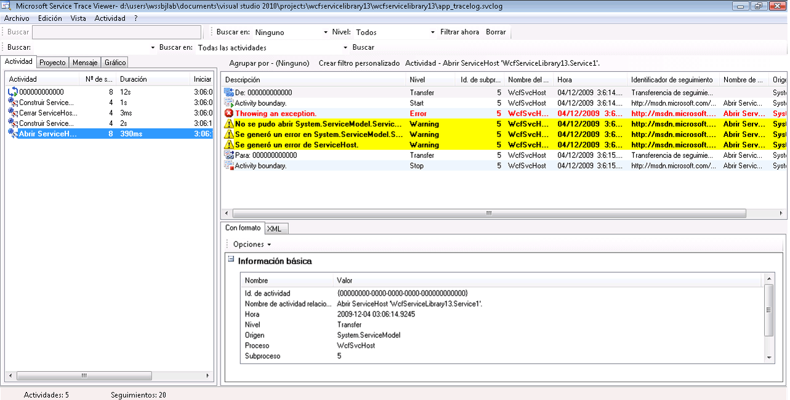
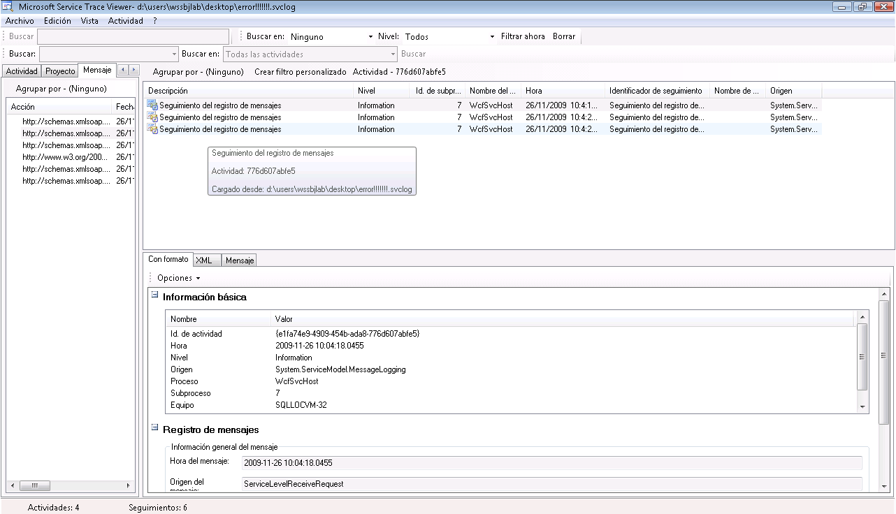

# <a name="using-service-trace-viewer-for-viewing-correlated-traces-and-troubleshooting"></a>Uso del visor de seguimiento de servicios para ver seguimientos asociados y para la solución de problemas
En este tema se describe el formato de datos de seguimiento, cómo verlo y enfoques sobre el uso de Service Trace Viewer para solucionar problemas de la aplicación.  
  
## <a name="using-the-service-trace-viewer-tool"></a>Utilizar la herramienta de visor de seguimiento de servicio  
 La herramienta Service Trace Viewer de [!INCLUDE[indigo1](../../../../../includes/indigo1-md.md)] le ayuda a poner en correlación seguimientos de diagnósticos generados por agentes de escucha de [!INCLUDE[indigo2](../../../../../includes/indigo2-md.md)] para buscar la causa principal de un error. La herramienta le proporciona una forma de ver, agrupar y filtrar seguimientos de manera sencilla para que pueda diagnosticar, reparar y comprobar los problemas de los servicios de [!INCLUDE[indigo2](../../../../../includes/indigo2-md.md)]. Para obtener más información sobre el uso de esta herramienta, consulte [herramienta Service Trace Viewer (SvcTraceViewer.exe)](../../../../../docs/framework/wcf/service-trace-viewer-tool-svctraceviewer-exe.md).  
  
 Este tema contiene capturas de pantalla de seguimientos generados mediante la ejecución de la [seguimiento y registro de mensajes](../../../../../docs/framework/wcf/samples/tracing-and-message-logging.md) de ejemplo, cuando se ven mediante la [herramienta Service Trace Viewer (SvcTraceViewer.exe)](../../../../../docs/framework/wcf/service-trace-viewer-tool-svctraceviewer-exe.md). En este tema se muestra cómo entender el contenido de los seguimientos, las actividades y su correlación y cómo analizar grandes cantidades de seguimientos al solucionar problemas.  
  
## <a name="viewing-trace-content"></a>Ver el contenido del seguimiento  
 Un evento de seguimiento contiene la siguiente información más significativa:  
  
-   Nombre de actividad cuando se establece.  
  
-   Hora de emisión.  
  
-   Nivel de seguimiento.  
  
-   Nombre del origen del seguimiento.  
  
-   Nombre de proceso.  
  
-   Identificador del subproceso.  
  
-   Un identificador de seguimiento único, que es una dirección URL que señale a un destino de Microsoft Docs, desde el que se puede obtener más información relacionada con el seguimiento.  
  
 Todos ellos se pueden ver en el panel superior derecho en Service Trace Viewer o en la **información básica** sección en la vista del panel inferior derecho al seleccionar un seguimiento con formato.  
  
> [!NOTE]
>  Si el cliente y el servicio están en el mismo equipo, los seguimientos estarán presentes para ambas aplicaciones. Estos se pueden filtrar usando la **nombre del proceso** columna.  
  
 Además, la vista con formato también proporciona una descripción del seguimiento e información detallada adicional cuando esté disponible. Lo último puede incluir el tipo y mensaje de excepción, pilas de llamadas, la acción del mensaje, campos desde/hasta y otras informaciones de la excepción.  
  
 En la vista XML, entre las etiquetas xml útiles se encuentran las siguientes:  
  
-   \<Subtipo > (nivel de seguimiento).  
  
-   \<TimeCreated >.  
  
-   \<Origen > (nombre del origen de seguimiento).  
  
-   \<Correlación > (identificador de actividad establecido al emitir el seguimiento).  
  
-   \<Ejecución > (Id. de proceso y subproceso).  
  
-   \<Equipo >.  
  
-   \<ExtendedData >, incluido \<acción >, \<MessageID > y la \<ActivityId > establecido en el encabezado de mensaje al enviar un mensaje.  
  
 Si examina el seguimiento "Se envió un mensaje a través de un canal", puede ver el contenido siguiente.  
  
```xml  
<E2ETraceEvent xmlns="http://schemas.microsoft.com/2004/06/E2ETraceEvent">  
   <System xmlns="http://schemas.microsoft.com/2004/06/windows/eventlog/system">  
      <EventID>262163</EventID>  
      <Type>3</Type>  
      <SubType Name="Information">0</SubType>  
      <Level>8</Level>  
      <TimeCreated SystemTime="2006-08-04T18:45:30.8491051Z" />  
      <Source Name="System.ServiceModel" />  
       <Correlation ActivityID="{27c6331d-8998-43aa-a382-03239013a6bd}"/>  
       <Execution ProcessName="client" ProcessID="1808" ThreadID="1" />  
       <Channel />  
       <Computer>TEST1</Computer>  
   </System>  
   <ApplicationData>  
       <TraceData>  
          <DataItem>  
             <TraceRecord xmlns="http://schemas.microsoft.com/2004/10/E2ETraceEvent/TraceRecord" Severity="Information">  
                 <TraceIdentifier>http://msdn.microsoft.com/library/System.ServiceModel.Channels.MessageSent.aspx</TraceIdentifier>  
                 <Description>Sent a message over a channel.</Description>  
                 <AppDomain>client.exe</AppDomain>  
                 <Source>System.ServiceModel.Channels.ClientFramingDuplexSessionChannel/35191196</Source>  
                <ExtendedData xmlns="http://schemas.microsoft.com/2006/08/ServiceModel/MessageTransmitTraceRecord">  
  
                  <MessageProperties>  
                     <AllowOutputBatching>False</AllowOutputBatching>  
                  </MessageProperties>  
                  <MessageHeaders>  
                     <Action d4p1:mustUnderstand="1" xmlns:d4p1="http://www.w3.org/2003/05/soap-envelope" xmlns="http://www.w3.org/2005/08/addressing">http://Microsoft.ServiceModel.Samples/ICalculator/Multiply</Action>  
                     <MessageID xmlns="http://www.w3.org/2005/08/addressing">urn:uuid:7c6670d8-4c9c-496e-b6a0-2ceb6db35338</MessageID>  
                     <ActivityId CorrelationId="b02e2189-0816-4387-980c-dd8e306440f5" xmlns="http://schemas.microsoft.com/2004/09/ServiceModel/Diagnostics">27c6331d-8998-43aa-a382-03239013a6bd</ActivityId>  
                     <ReplyTo xmlns="http://www.w3.org/2005/08/addressing">  
                        <Address>http://www.w3.org/2005/08/addressing/anonymous</Address>  
                    </ReplyTo>  
                    <To d4p1:mustUnderstand="1" xmlns:d4p1="http://www.w3.org/2003/05/soap-envelope" xmlns="http://www.w3.org/2005/08/addressing">net.tcp://localhost/servicemodelsamples/service</To>  
                  </MessageHeaders>  
                  <RemoteAddress>net.tcp://localhost/servicemodelsamples/service</RemoteAddress>  
                </ExtendedData>  
            </TraceRecord>  
          </DataItem>  
       </TraceData>  
   </ApplicationData>  
</E2ETraceEvent>  
```  
  
## <a name="servicemodel-e2e-tracing"></a>Seguimiento ServiceModel E2E  
 Cuando el origen del seguimiento `System.ServiceModel` se establece con un `switchValue` que no sea Off, e `ActivityTracing`, [!INCLUDE[indigo2](../../../../../includes/indigo2-md.md)] crea actividades y transferencias para el procesamiento de [!INCLUDE[indigo2](../../../../../includes/indigo2-md.md)].  
  
 Una actividad es una unidad lógica de procesamiento que agrupa todos los seguimientos relacionados con esa unidad de procesamiento. Por ejemplo, puede definir una actividad para cada solicitud. Las transferencias crean una relación causal entre las actividades dentro de extremos. La propagación del identificador de actividad le permite relacionar actividades en los puntos de conexión. Puede hacerlo estableciendo `propagateActivity` = `true` mediante configuración en cada punto de conexión. Las actividades, transferencias y la propagación le permiten realizar la correlación de errores. De esta manera, puede encontrar más rápidamente la causa raíz de un error.  
  
 En el cliente, se crea una actividad de [!INCLUDE[indigo2](../../../../../includes/indigo2-md.md)] para cada llamada del modelo de objetos (por ejemplo, Abrir ChannelFactory, Agregar, Dividir, etc.) Cada una de las llamadas de operación se procesa en una actividad "Procesar acción".  
  
 En la captura de pantalla siguiente, extraído de la [seguimiento y registro de mensajes](../../../../../docs/framework/wcf/samples/tracing-and-message-logging.md) muestra el panel izquierdo muestra una lista de las actividades creadas en el proceso de cliente, ordenado por hora de creación. A continuación, se muestra una lista cronológica de actividades.  
  
-   Construyó el generador de canales (ClientBase).  
  
-   Abrió el generador de canales.  
  
-   Procesó la acción Agregar.  
  
-   Configuró la sesión segura (esto OCURRIÓ en la primera solicitud) y procesó tres mensajes de respuesta de la infraestructura de seguridad: RST, RSTR, SCT (Mensaje de proceso 1, 2, 3).  
  
-   Procesó las solicitudes de sustracción, multiplicación y división.  
  
-   Cerró el generador de canales y, debido a ello, cerró la sesión segura y procesó la anulación de la respuesta del mensaje de seguridad.  
  
 Vemos los mensajes de la infraestructura de seguridad debido al wsHttpBinding.  
  
> [!NOTE]
>  En [!INCLUDE[indigo2](../../../../../includes/indigo2-md.md)], mostramos mensajes de respuesta que se procesan inicialmente en una actividad independiente (Mensaje de proceso) antes de ponerlos en correlación con la actividad Procesar acción correspondiente que incluye el mensaje de solicitud, a través de una transferencia. Esto sucede para los mensajes de infraestructura y para las solicitudes asincrónicas y se debe al hecho de que debemos inspeccionar el mensaje, leer el encabezado activityId e identificar la actividad Procesar acción existente con ese identificador para correlacionarlo con él. Para solicitudes sincrónicas, bloqueamos la respuesta y, por lo tanto, conocemos con qué actividad Procesar acción se relaciona la respuesta.  
  
   
Lista de actividades del cliente WCF por hora de creación (panel izquierdo) y sus actividades y seguimientos anidados (panel superior derecho)  
  
 Cuando seleccionamos una actividad en el panel izquierdo, podemos ver actividades y seguimientos anidados en el panel derecho superior. Por consiguiente, ésta es una vista jerárquica reducida de la lista de actividades a la izquierda, en función de la actividad primaria seleccionada. Debido a que la actividad Procesar acción Agregar es la primera solicitud realizada, esta actividad contiene la actividad Configurar sesión segura (transferir a, transferir desde) y seguimientos para el procesamiento real de la acción Agregar.  
  
 Si hacemos doble clic en la actividad Procesar acción Agregar en el panel izquierdo, podemos ver una representación gráfica de las actividades de cliente [!INCLUDE[indigo2](../../../../../includes/indigo2-md.md)] relacionadas con Agregar. La primera actividad de la izquierda es la actividad raíz (0000), que es la actividad predeterminada. [!INCLUDE[indigo2](../../../../../includes/indigo2-md.md)] transfiere fuera de la actividad ambiente. Si esto no está definido, [!INCLUDE[indigo2](../../../../../includes/indigo2-md.md)] transfiere fuera de 0000. Aquí, la segunda actividad, Procesar acción Agregar, transfiere fuera de 0. A continuación, vemos Configurar sesión segura.  
  
   
Vista gráfica de las actividades de cliente de WCF: actividad ambiente (aquí 0), Procesar acción y Configurar sesión segura.  
  
 En el panel superior derecho, podemos ver todos los seguimientos relacionados con la actividad Procesar acción Agregar. Específicamente, hemos enviado el mensaje de solicitud ("Envía un mensaje sobre un canal") y hemos recibido la respuesta ("Se envió un mensaje a través de un canal") en la misma actividad. Esto se muestra en el siguiente gráfico. Para ofrecer claridad, la actividad Configurar sesión segura se contrae en el gráfico.  
  
   
Lista de seguimientos para la actividad Procesar acción: enviamos la solicitud y recibimos la respuesta en la misma actividad.  
  
 Aquí, cargamos los seguimientos de cliente solo para mayor claridad, pero los seguimientos de servicio (mensaje de solicitud recibido y mensaje de respuesta enviado) aparecen en la misma actividad si también se cargan en la herramienta y `propagateActivity` se estableció en `true.` Esto se muestra en una ilustración de una versión posterior.  
  
 En el servicio, el modelo de actividades asigna de la siguiente manera a los conceptos de [!INCLUDE[indigo2](../../../../../includes/indigo2-md.md)]:  
  
1.  Construimos y abrimos un ServiceHost (esto puede crear varias actividades relacionadas con el hospedaje, por ejemplo, en el caso de la seguridad).  
  
2.  Creamos una actividad Escuchar a para cada agente de escucha en el ServiceHost (con transferencias dentro y fuera de Abrir ServiceHost).  
  
3.  Cuando el agente de escucha detecta una solicitud de comunicación iniciada por el cliente, transfiere a una actividad "Recibir Bytes", en el que se procesan todos los bytes enviados desde el cliente. En esta actividad, podemos ver los errores de conexión que han sucedido durante la interacción entre cliente y servicio.  
  
4.  Para cada conjunto de bytes que se recibe que corresponde a un mensaje, procesamos estos bytes en una actividad "Procesar mensaje", donde creamos la [!INCLUDE[indigo2](../../../../../includes/indigo2-md.md)] objeto de mensaje. En esta actividad, vemos errores relacionados con un sobre no válido o un mensaje con formato incorrecto.  
  
5.  Una vez que se ha formado el mensaje, transferimos a una actividad Procesar acción. Si `propagateActivity` está establecida en `true` en el cliente y el servicio, esta actividad tiene el mismo identificador que la definida en el cliente, descrita previamente. Desde este punto, empezamos a beneficiarnos de la correlación directa en los extremos, puesto que todos los seguimientos emitidos en [!INCLUDE[indigo2](../../../../../includes/indigo2-md.md)] relacionados con la solicitud están en esa misma actividad, incluido el procesamiento del mensaje de respuesta.  
  
6.  Para las acciones fuera de proceso, creamos una actividad "Ejecutar código de usuario" para aislar los seguimientos emitidos en el código de usuario de los emitidos en [!INCLUDE[indigo2](../../../../../includes/indigo2-md.md)]. En el ejemplo anterior, el seguimiento "Servicio envía respuesta agregar" se emite en la actividad "Ejecutar código de usuario" y no en la actividad propagada por el cliente, si es aplicable.  
  
 En la siguiente ilustración, la primera actividad en la izquierda es la actividad raíz (0000), que es la actividad predeterminada. Las tres actividades siguientes sirven para abrir el ServiceHost. La actividad en la columna 5 es el agente de escuchas y las actividades restantes (6 a 8) describen el procesamiento de WCF de un mensaje, desde el procesamiento de bytes hasta la activación del código de usuario.  
  
   
Lista de actividades de servicios WCF  
  
 La siguiente captura de pantalla muestra las actividades de cliente y servicio, y resalta la actividad Procesar acción Agregar en los procesos (naranja). Las flechas relacionan los mensajes de solicitud y respuesta enviados y recibidos por el cliente y el servicio. Los seguimientos de la actividad Procesar acción se separan en los procesos del gráfico, pero se muestran como parte de la misma actividad en el panel superior derecho. En este panel, podemos ver los seguimientos de cliente de los mensajes enviados seguidos por seguimientos de servicio de los mensajes recibidos y procesados.  
  
   
Vista gráfica de las actividades de cliente y servicio de WCF  
  
 En el siguiente escenario de error, se relacionan los seguimientos de errores y advertencias en el servicio y el cliente. Primero se inicia una excepción mediante código de usuario en el servicio (actividad verde situada más a la derecha que incluye un seguimiento de advertencia para la excepción "El servicio no puede procesar esta solicitud mediante código de usuario"). Cuando se envía la respuesta al cliente, un seguimiento de advertencia se vuelve a emitir para denotar el mensaje de error (actividad fucsia a la izquierda). El cliente cierra a continuación su cliente WCF (actividad amarilla en el lado inferior izquierdo), que anula la conexión al servicio. El servicio genera un error (la actividad fucsia más larga en el lado derecho).  
  
   
Correlación de errores en el servicio y cliente  
  
 El ejemplo utilizado para generar estos seguimientos es una serie de solicitudes sincrónicas utilizando el wsHttpBinding. Hay desviaciones de este gráfico para escenarios sin seguridad o con solicitudes asincrónicas, donde la actividad Procesar acción abarca las operaciones de comienzo y final que forman la llamada asincrónica, y muestra las transferencias a una actividad de devolución de llamada. Para obtener más información acerca de escenarios adicionales, consulte [escenarios de seguimiento de End-To-End](../../../../../docs/framework/wcf/diagnostics/tracing/end-to-end-tracing-scenarios.md).  
  
## <a name="troubleshooting-using-the-service-trace-viewer"></a>Solución de problemas mediante Service Trace Viewer  
 Al cargar archivos de seguimiento en la herramienta Service Trace Viewer, puede seleccionar cualquier actividad roja o amarilla en el panel izquierdo para llegar hasta la causa de un problema de la aplicación. La actividad 000 tiene, por lo general, excepciones no controladas que llegan hasta el usuario.  
  
   
Selección de actividad roja o amarilla para llegar hasta la raíz de un problema  
  
 En el panel superior derecho puede examinar los seguimientos de la actividad que seleccionó en la izquierda. Puede examinar, a continuación, los seguimientos rojos o amarillos en ese panel y ver cómo se correlacionan. En el gráfico anterior, vemos los seguimientos de advertencias de cliente y servicio en la misma actividad Procesar acción.  
  
 Si estos seguimientos no le ofrecen la causa raíz del error, puede utilizar el gráfico haciendo doble clic en la actividad seleccionada en el panel izquierdo (aquí Procesar acción). A continuación, se muestra el gráfico con actividades relacionadas. A continuación, puede expandir las actividades relacionadas (haciendo clic en el signo "+") para buscar el primer seguimiento emitido en rojo o amarillo en una actividad relacionada. Siga expandiendo las actividades que sucedieron justo antes del seguimiento rojo o amarillo en cuestión, siguiendo las transferencias a actividades relacionadas o flujos de mensajes en los extremos, hasta que llegue a la causa principal del problema.  
  
   
Expansión de actividades para llegar hasta la causa raíz de un problema  
  
 Si `ActivityTracing` de ServiceModel está desactivado, pero el seguimiento de ServiceModel está activado, puede ver seguimientos de ServiceModel emitidos en la actividad 0000. Sin embargo, en este caso es más difícil comprender la correlación de estos seguimientos.  
  
 Si el registro de mensajes está habilitado, puede utilizar la pestaña Mensaje para ver a qué mensaje ha afectado el error. Si hace doble clic en un mensaje en rojo o amarillo, puede ver la vista gráfica de las actividades relacionadas. Estas actividades son las que están más estrechamente relacionadas con la solicitud en la que se produjo un error.  
  
   
Para iniciar la solución de problemas, también puede escoger un seguimiento de mensaje rojo o amarillo y hacer doble clic en él para llegar hasta la causa raíz.  
  
## <a name="see-also"></a>Vea también  
 [Escenarios de seguimiento de extremo a extremo](../../../../../docs/framework/wcf/diagnostics/tracing/end-to-end-tracing-scenarios.md)  
 [Herramienta del visor de seguimiento de servicio (SvcTraceViewer.exe)](../../../../../docs/framework/wcf/service-trace-viewer-tool-svctraceviewer-exe.md)  
 [Seguimiento](../../../../../docs/framework/wcf/diagnostics/tracing/index.md)
